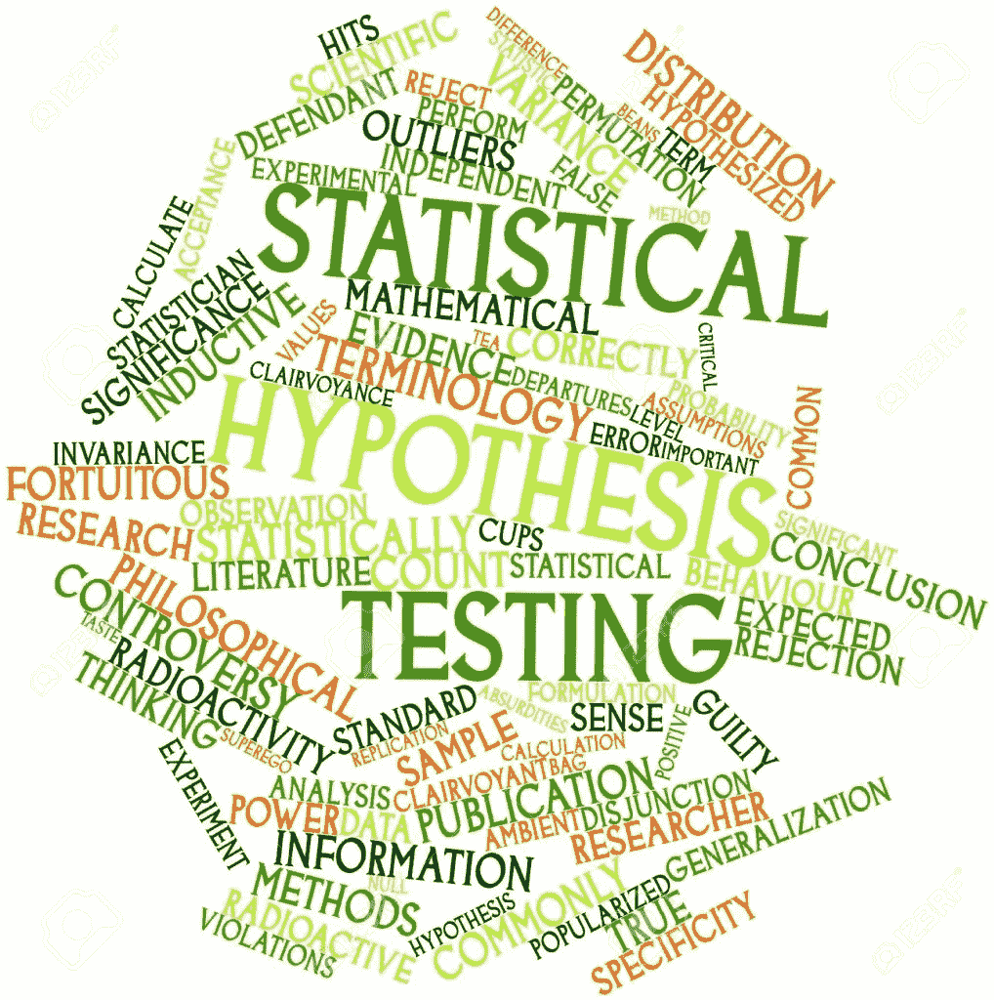
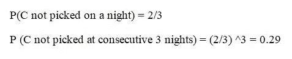
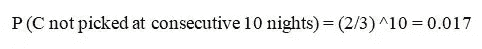

# 假设检验快速指南……

> 原文：<https://medium.datadriveninvestor.com/a-quick-guide-to-hypothesis-testing-8c95205f2a1c?source=collection_archive---------2----------------------->

在假设检验中，我们对数据做一个假设，然后在假设为真的情况下进行调查。现在我们从调查中得到的观察结果被用来验证我们的假设。

这听起来令人困惑，但请耐心等待，随着你的深入，一切都会变得清晰。

> 让我来定义一些术语:

*   **零假设(H** *0* **) :** 零假设是我们在进行任何计算之前做出的假设，并认为它最初是“真”的。
*   **替代假设(H** 1 **) :** 替代假设只是零假设的对立面，如果有强有力的证据反对零假设，那么我们就转向替代假设。
*   **P 值:** P 值是当零假设为真时，给定统计模型的概率。p 值用作拒绝点，以提供拒绝零假设的最低显著性水平。
*   **检验统计:**从样本或实验中计算出的值。检验统计可以是任何值，如分布的平均值、观察频率或它提供的支持或反对零假设的证据。

> **假设检验如何工作？？？？？？**

现在我们以均值差异假设检验为例，尝试理解假设检验的方法论。

**问题:**有两个养猪场 X 和 Y，每个都有 5000 头小猪。两个农场之间的唯一区别是，农场 X 用 A 公司的食物喂养小猪，而农场 Y 用 B 公司的食物。我们必须弄清楚吃 B 公司食物的小猪长大后是否比吃 A 公司食物的小猪重，这样我们才能得出 B 公司的食物比 A 公司的好的结论。

**解决方案:**现在，我们首先设计我们的实验(在设计实验时，始终牢记你的任务是什么，并相应地设计实验)。

**试验:**我们从每个农场随机抽取 100 头猪，称重并计算两个农场猪的平均体重。

测试统计:平均重量的差异。

零假设:B 公司的食物并不比 a 公司的好。

替代假设:B 公司的食物比 a 公司的好。

现在，我们进行实验并找出观察结果。

**观察:**假设 Y 农场的猪的平均体重比 x 农场的猪的平均体重多 10 公斤

现在，我们必须找出当我们的零假设为真时，找到这个观察值的概率。我们使用重采样和置换测试来找到所需的概率，步骤如下:

1.  合并两个农场所有 200 头猪的体重，形成一个集合，称为 c。
2.  将这组 C 随机分成 C1 和 C2 两组。
3.  计算集合 C1 和 C2 的均值差[均值(C1)-均值(C2)]。
4.  重复步骤 2 和 3n 次(假设 n = 500)。
5.  将所有计算出的平均值按升序排序，并找出平均值差异大于或等于观察到的重量平均值差异(=10kg)的案例比例。

现在，两种情况是可能的

**👉案例 1:** 假设所有案例中的 25%在平均重量上有至少 10 公斤的差异，那么我们认为 10 公斤的差异是平均重量差异，而公司 B 的食物并不比公司 A 的好，这个值是 0.25(通常概率> 0.05 被认为是显著的)，所以我们接受我们的零假设。

**👉案例 2 :** 假设所有案例中的 3%在平均重量上有至少 10 公斤的差异，那么我们认为，当 B 公司的食品不比 A 公司的好时，10 公斤的平均重量差异的概率为 0.03。这种概率非常小。因此，我们拒绝我们的零假设，接受替代假设。

> **样本量的影响…..**

现在，当我们知道什么是假设检验以及如何应用它。我们必须意识到样本大小是如何影响假设检验的。为此，我们举一个例子。

**👉例 1:**

我们需要找到一个硬币是否偏向头部？

零假设:硬币不偏向头部。[P(水头)= 0.5]

替代假设:硬币偏向头部。[P(水头)> 0.5]

我们设计了一个实验，扔硬币三次，记录结果。我们每次投掷硬币都观察到正面，现在计算得到三个正面的概率，同时我们的零假设为真:

**P(人头/H0) = 0.5*0.5*0.5 = 0.125**

正如我们所看到的，观察结果的概率是显著的，所以我们接受我们的零假设。

现在我们稍微改变一下我们的实验，不是三次投掷，而是六次投掷并记录结果。在这里，我们也观察了每次投掷硬币时的正面。因此，当零假设为真时，观察结果的概率为:

**P(人头/H0)= 0.5 * 0.5 * 0.5 * 0.5 * 0.5 * 0.5 = 0.016**

现在概率很小，所以我们拒绝零假设，接受另一个假设。

**👉例 2 :**

假设 A，B 和 C 是室友，他们之间的冲突是谁在晚上洗碗，C 想出了一个解决方案，他们把写有他们名字的纸条放在一个罐子里，C 每晚随机挑选一张纸条，然后那个人洗碗。现在我们要解决的问题是，C 是否诚实地执行了这项任务。

我们的零假设是 C 是诚实的，另一个假设是 C 不诚实。

前三天晚上 C 不洗碗，所以看到这个观察的几率有多大。

因此，我们得到了一个重要的值，我们不能说 C 没有诚实地完成任务。

现在又过了 10 个晚上，C 没有一个晚上洗碗，那么机会有多大呢

现在看到这些结果后，我们可以说 C 在他的任务中作弊了。因此，拒绝我们的无效假设。

在上面两个例子中，我们看到了当样本量改变时，结果是如何变化的。我们可以说，当我们的样本很小时，假设检验往往会失败。所以我们总是明智地选择样本量。