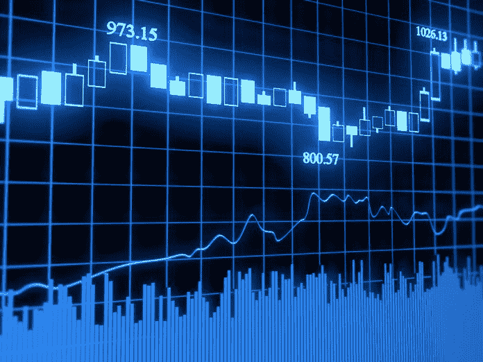
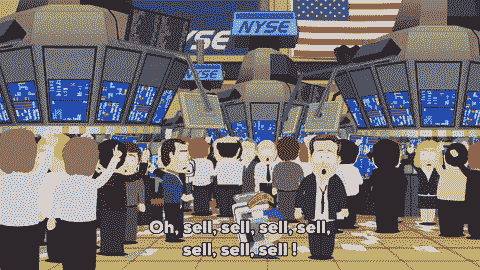
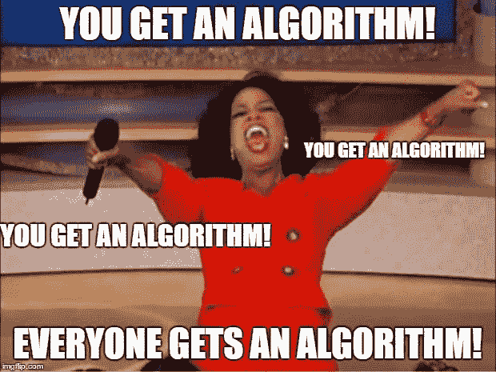
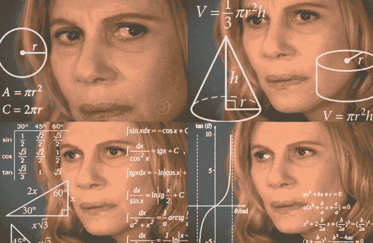

# 投资算法快速指南

> 原文：<https://medium.datadriveninvestor.com/a-quick-guide-to-investment-algorithms-628450b9dc55?source=collection_archive---------3----------------------->

让我们想象一下 30 年前的股市:

让我们现在想象一下:

像现在的许多其他领域一样，投资市场在技术的帮助下发生了巨大的变化。有一个新的霸主——投资算法，它现在完成了发达国家 90%的交易。

但是，这些所谓的“算法”到底是什么？他们能做什么？他们为什么超级聪明？

扣好安全带，我们马上就知道了！

# 阿尔戈斯的黎明

自 2008 年金融危机以来，股市不仅通过监管、新进入者和权力转移发生了变化，还通过帮助自动化和改善交易的算法的惊人进步发生了变化。

算法是执行某项任务的一组指令。他们自动化流程，T2 以人类交易员无法企及的速度执行交易。规则是由多种因素决定的:资产类型、市场、价格、数量、时机、趋势。根据他们预先定义的计算，执行算法作出决定和[执行交易，以最大化利润](http://www.datadriveninvestor.com/intro-to-r)。

投资算法的一个关键因素是，它们完全排除了人的情绪。没有恐惧，贪婪，或心理预测的废话。算法做他们需要做的事情来达到最好的结果。

# 投资算法的类型

再平衡是根据当前市场条件重新调整基金基础资产的过程。例如，养老基金应该是 50%股票和 50%债券的组合。几年后，股票价值增加，现在占投资组合的 60%。在再平衡过程中，一些股票被卖出，以使投资组合回到最初的 50-50 分配，交易者获利。这些再平衡交易现在通过算法实现了自动化。

# 套利

套利意味着利用微小的市场差异获取额外利润。例如，同样的资产可以在不同的市场以不同的价格交易。套利交易者能够在一个交易所以较低的价格买入相同的资产，在另一个交易所以较高的价格卖出。套利算法被训练来发现差异并即时执行交易。

# 平均值回复

这种数学方法有助于通过过去的指标、预测和标准差来计算某一时期股票的平均价格。平均价格是一个指标，当资产低于平均值时买入，当资产高于平均值时卖出。这种分析技术在股票市场上很常见。算法有助于自动化从分析到实际交易的流程。

# 市场时间选择

市场时机算法旨在预测资产在一段时间内的表现。它们构造起来很复杂:开发包括 3 个不同的阶段、几个数据集和大量的测试。目标是能够用复杂的分析方法预测资产价值随时间的变化。了解市场结果为优化结果和高额利润提供了可能性。

# 投资算法万岁

算法交易有几个好处:

*   **明确的决策**:排除人类情感，仅通过数据支持的现实评估。
*   **精准执行**:减少人为失误。
*   **资源高效**:比传统工艺需要更少的人力。
*   由于自动化，交易以更快的速度进行。

# 该死的阿尔戈斯

让我们看看投资算法的阴暗面:

*   **容易出现故障**–技术问题，因为连接问题和电力问题会严重影响交易，并造成重复或遗漏订单。
*   **程序员困境**:投资算法和程序员做的一样好，即使是编程很好的算法也可能在现实市场中失败。
*   **复杂且要求高:**为了建立功能算法，我们需要大量的数据、程序员的专业知识和计算能力。
*   **排除个人:**用传统投资技术接近市场的个人变得无用，因此交易权仍然掌握在少数允许使用算法的机构手中。

如果你想成为一名算法交易者，我强烈建议你开始学习 Python 和 R。

如果你想开始学习 Python，我强烈推荐[这门课程](http://www.datadriveninvestor.com/intro-to-python)。如果你比较高级，也可以试试这个[中级](http://www.datadriveninvestor.com/intermediate-python)。

或者，如果你想开始学习 R，我推荐[这门课](http://www.datadriveninvestor.com/intro-to-r)。如果你更高级，你可以试试这个[中级](http://www.datadriveninvestor.com/intermediate-r)。

**快乐学习！**

*原载于 2019 年 1 月 31 日*[*www.datadriveninvestor.com*](https://www.datadriveninvestor.com/2019/01/31/a-quick-guide-to-investment-algorithms/)*。*

## 来自 DDI 的相关故事:

 [## 股票市场投资的机器学习

### 当你的一个朋友在脸书上传你的新海滩照，平台建议给你的脸加上标签，这是…

medium.com](https://medium.com/datadriveninvestor/machine-learning-for-stock-market-investing-f90ad3478b64)  [## 为什么数据会改变投资管理

### 有人称之为“新石油”虽然它与黑金没有什么相似之处，但它的不断商品化…

medium.com](https://medium.com/datadriveninvestor/why-data-will-transform-investment-management-4a60966c1c81)