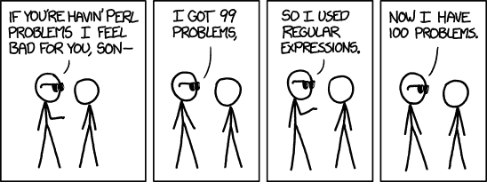
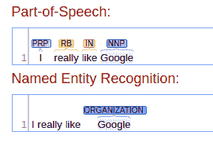
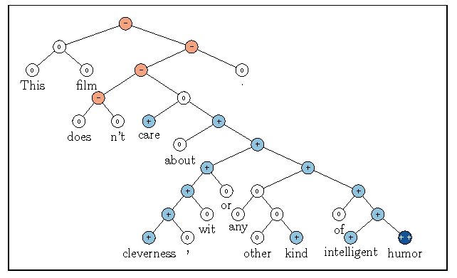

# NLP 快速介绍

> 原文：<https://medium.datadriveninvestor.com/a-quick-introduction-to-nlp-e093c2f70dee?source=collection_archive---------6----------------------->

自然语言处理(NLP)是数据科学、机器学习和语言学的一个领域，专注于处理人们所说的语言。NLP 曾经是发展最慢的领域之一。自从 AlexNet 出现以来，当计算机视觉一直在使用花哨的神经网络时，NLP 就落后了。近年来该领域开始越来越接近 CV 的发展速度。你可能听说过 Transformer、BERT、XLnet 和 Ernie。但是那些是什么？NLP 总体是什么，机器如何理解我们的语音，有吗？请继续阅读，了解更多信息。本文有一个补充的 [google colab 笔记本](https://www.google.com/url?q=https://colab.research.google.com/drive/12_QFKDishY1MtcYwxawx5iUPxIzX2Ls4&sa=D&ust=1568626263467000),在那里你可以实时地摆弄我在这里描述的一些库和方法。

[https://ichef.bbci.co.uk/news/660/cpsprodpb/1999/production/_92935560_robot976.jpg](https://www.google.com/url?q=https://ichef.bbci.co.uk/news/660/cpsprodpb/1999/production/_92935560_robot976.jpg&sa=D&ust=1568626263467000)

让我们从熟悉一些 NLP 基础知识开始。机器不能像我们人类那样理解文本或语音。PC/手机/云服务器上的所有文本都是以字节存储的，这些字节只是对字母应该显示的方式进行编码。计算机不理解它存储的内容的意义。就像计算机视觉中的图像一样。

 [## DDI 编辑推荐:5 本让你从新手变成专家的机器学习书籍|数据驱动…

### 机器学习行业的蓬勃发展重新引起了人们对人工智能的兴趣

www.datadriveninvestor.com](https://www.datadriveninvestor.com/2019/03/03/editors-pick-5-machine-learning-books/) 

但谷歌翻译似乎知道 40 多种语言，可以自由地将一种语言翻译成任何其他语言。[open ai 最近发布的 GPT-2](https://www.google.com/url?q=https://openai.com/blog/better-language-models/&sa=D&ust=1568626263468000) 网络产生了可怕的类似人类的文本。那么，这一切是怎么运作的呢？关于 NLP 有很多需要学习的地方，从基础开始并从整个过程的起点开始是一个好主意。几乎所有数据科学的第一步都是预处理。所以，让我们开始吧！

# 文本清理

我们产生的大部分数据，尤其是在社交媒体上，都是杂乱和错误的。正如您在 notebook 示例中所看到的，当处理真实数据时，您可能会遇到一些随机 HTML 标记由于某种原因出现在文本中的问题。或者是 Twitter 上的一些@提及，或者#标签。如果您希望将数据与某个主题或实体(如国家或个人)相关联，这可能会很有用，但是对于其他任务(如情感分析)，这可能会导致数据偏差。在这些情况下，正则表达式几乎总是一种方法。

Taken from [xkcd](https://www.google.com/url?q=https://xkcd.com/1171/&sa=D&ust=1568626263469000)

正则表达式是一个非常强大的工具，由于它的复杂性，它常常令人恐惧。您可以使用它来删除文本中多余的空格，提取电话号码、日期等。正则表达式可以是相对较小且易于理解的，如\d+匹配一行中的一个或多个数字，也可以是类似这样的(？p【a-z \ d _】。\-]+)@(?P <domain> [a-z\d_-]+)\。[a-z]{2，4}匹配一封电子邮件并将其分成两部分。不仅如此，它还可以用于 NLP 管道的下一步——标记化。</domain>

# 标记化

标记化是将文本拆分成标记的过程。标记是文本的最小组成部分，它根据任务、语言和方法的不同而不同。它可以是一个单词或一个标点符号，一个字符或一串字符。每个 NLP 的库都编写了某种形式的记号赋予器，并且每个都有自己的细微差别。你可以在我提到的补充笔记本里玩几个不同的。在这里，我们将看看一些基本的方法。

## 分隔符

分隔符或特殊分隔字符是最简单的方法之一。您现在可能希望将它用于文本解析，因为使用分隔符是非常有限的，这是双关语。在 Python 中，任何字符串都有一个 split()方法，该方法可以使用提供的字符将字符串拆分成一系列子字符串。即“这是一个句子。”可以在空格上拆分成(' This '，' is '，' a '，'句子)).最后一个单词后面有一个点。这将发生在每一个标点符号以及撇号。此外，如果出于某种原因，一行中有两个空格，这将返回两个空格之间的空字符串。

## 正则表达式

使用正则表达式进行标记化有两种主要方法:查找标记或查找分隔符。对于第二个任务，它甚至有一个内置的特殊字符— \b .它匹配空字符串，但只在单词的开头或结尾。RegEx 中的单词被定义为单词字符序列— \w .这些字符也可以用来查找单词(包含 a-z、A-Z、0–9 和 _)。有关更多信息，请参见相应的笔记本部分。

## 基于规则

名字说明了一切。每种语言都有自己的一套语法和词法规则。这些可以被翻译成一堆*if*(不完全是)并用来将文本分割成记号。基于规则的记号赋予器也非常智能地处理标点符号。因此，在句子的结尾，应该用一个点与其余的单词分开，但是,“Mr.”应该作为一个标记保留下来。这是最常见的文本标记化方式。

## 字节成对编码(BPE)

最初这种技术用于数据压缩，但后来它也适用于 NLP 领域。这里的主要原则是寻找文本中重复出现的模式，并将它们编码到另一个符号中。在维基百科中有一个很酷的例子。在 NLP 中，这主要用于特定的语言，如汉语或土耳其语。你可能想知道为什么是土耳其人？看看[这个](https://www.google.com/url?q=http://i.imgur.com/yaTxPoI.jpg&sa=D&ust=1568626263471000)或者[这个](https://www.google.com/url?q=https://aimdanismanlik.files.wordpress.com/2012/04/539526_389088291109087_100000237580246_1422499_1809576881_n.jpg&sa=D&ust=1568626263471000)。这种类型的语言被称为黏着语。BPE 会帮你把这么大的单词分成小块。这大大减少了词汇量，也有助于概括。因为它仍然能理解以前看不见的单词，这些单词是由它已经知道的部分组成的。

# 令牌预处理

很好。现在我们没有一个连续的字符序列，而是一个可以直接转换成特性的定义好的记号序列。但是我们能用这些做更多的事情吗？有几种方法可以在文本被标记后预处理单词。

## 停用字词删除(+稀有字词)

这是一个非常简单的方法，它基于这样一个想法:如果这个词在几乎所有的文本中都出现，那么它可能携带很少的信息。这种可视化有助于了解全局。非常罕见的单词则相反。您可能正在训练的模型可能会过度适应这些非常罕见的单词(标记)。因此，它会忽略文本中的所有其他标记。也就是说，在一个好的电影评论中，一个打错的单词“graet”可能会成为一个很好的评论的一个很强的指标。

英语中的基本常用单词列表可以在大多数 NLP 库中找到，但是每个都包含不同的列表，因为将某个单词放入这种“停用单词”列表的标准是不固定的。

从你的词汇中删除非常罕见的单词，并用 <unk>—未知令牌来替换它们，仍然是一个非常好的相关想法，而删除大多数当前深度学习 NLP 管道中的停用词会导致更差的性能。</unk>

## 词干化和词汇化

正如可以从名字中推导出的那样，第一种方法的主要目标是将单词削减到它的词干或词根。它主要是基于规则的截断。因此，它有时可以将一些非常不同的单词缩到同一个词干中。这些例子可以在笔记本上找到。

在第二种方法中，我们将单词转换成它的引理。所以，像‘am’，‘was’，‘were’这样的词会被转换成‘be’。这种方法比单纯的词干处理更复杂，产生的结果也更好。试着将词干分析的结果与这个进行比较。

## WordNet

WordNet 是一个非常全面的英语数据库。在那里你可以找到这个单词的词条、词干、同义词、反义词以及其他一些有趣的属性和邻居。更多信息甚至是基于网络的搜索都可以在官方网站[这里](https://www.google.com/url?q=https://wordnet.princeton.edu/&sa=D&ust=1568626263472000)找到。此工具可用于数据扩充，以最小的成本创建更多的训练数据。例如，您可以随机更改语料库中的一些单词作为其同义词。这不是最可靠的方法，但也许值得一试。

## 位置/ NE 标记

一些单词可能有不同的含义，这取决于它是什么词性(POS)或者它是否是某个公司名称的一部分——命名实体(NE)。关于如何获取和使用这些信息，有一系列不同的方法。编写自己的 POS 或 NER(命名实体识别)标记器可能不是最容易的任务。但是不用担心，已经有大量的方法被实现了，并且有许多不同的神经网络架构需要训练。

使用这些标签可以简单到将标签附加到单词本身。因此，你将有' live_VB '而不是' live ',其中 VB 的意思是*一个动词*。如果某个单词或一系列单词是一个命名的实体，比如一个人或一家公司，您可以将它们连接成一个向量。因为分离命名实体的各个部分可能会给模型的预测带来意想不到的偏差。

Visualization made using [CoreNLP demo](https://www.google.com/url?q=http://corenlp.run/&sa=D&ust=1568626263473000) by Stanford.

让我们想象有一家名为“好兄弟”的公司。有人写了一篇评论:“好人很糟糕”。这里情感模型可能会混淆，因为在同一个句子中有“好”和“糟糕”两个词。他们中的哪一个实际上是审查的一部分？现在还不知道。但是如果你使用 NER 标签，你会发现“好家伙”很可能是一个命名实体，比如一个公司名称。在分类任务中使用公司名称作为特征是一个坏主意，因为如果人们只为该公司写差评，模型只会记住该公司是坏的。最终，它可能会把对某家公司合理的好评归为差评。因此，最佳实践是删除该名称或将其更改为 NER 标签。现在评论是“公司很糟糕”，很明显要给它打多少分。

## 选区分析

这种处理方法可以给你关于句子中单词关系的信息。这些信息对情感任务非常重要。想象一个评论‘这部电影不是很好’。如果我们只是采取逐字逐句的方法，那么这篇评论很可能会被归类为正面的。因为‘not’这个词在正面和负面评论中都可以使用，但是 good 这个词更有可能出现在正面评论中。

An example of such a parsed tree. Taken from [Recursive Deep Models for Semantic Compositionality Over a Sentiment Treebank](https://www.google.com/url?q=https://www.semanticscholar.org/paper/Recursive-Deep-Models-for-Semantic-Compositionality-Socher-Perelygin/65ad0e876216ea034b7958f016456e32666bc5c6&sa=D&ust=1568626263474000).

但是，如果我们应用选区分析，我们会看到短语“非常好”被单词“不”修改，这颠倒了意思，从而使评论变得负面。所有这些在理论上看起来很容易，但是实施这样的方法是困难的。并且大多数最先进的情感模型不直接使用这些信息。

## 共指消解

我们，人，可以理解‘鸡因为太累了所以没有过马路’这句话里的‘它’字对应的是‘鸡’，而不是‘路’。但对于机器来说，这是一个相对难以独立解决的任务。如果您手动使用这些信息，那么使用这些信息可能会很棘手，但是基于 Transformer 架构的模型或者其他类型的注意力可能会学会以一种有帮助的方式来表示这些信息。人们并不完全了解它能捕捉到什么样的信息。但是在我们后来的出版物中会有更多的介绍。

# 特征创建

现在我们有了一个扩充的令牌序列，但我们需要它们的数字或序列来输入我们的机器学习算法。大多数方法使用词汇表——从标记到数字的简单映射。我们不直接将它们传递给算法，而是将它们用作索引。例如，你的句子中有单词*‘good’*。如果这个词在你的词汇表中排名第四，你会给第四个特征打 1 分。现在，是时候更详细地了解不同的特征创建方法了。

## 一袋单词

顾名思义，这意味着将文本表示为一串单词，并将单词存在/不存在/计数视为一个特征。因此，句子/文本中的每个标记都将被转换成一个非常长的词汇长度的稀疏向量，其中只有当前单词索引处的数字。回到单词“good”的例子，它可能是这样的:[0，0，0，0，1，0，…，0]

## Ngrams

一种将序列长度为 N 的一串相邻出现的记号转换为特征的方法。有单字——单个记号(相当于**单词袋**)、双字——两个记号的序列、三字——三个记号的序列等等……在实践中，比三字更进一步很少是个好主意，因为特征矩阵会变得非常大而稀疏，这并不好。

## TF-IDF(术语频率-逆文档频率)

这背后的直觉是让不常见的单词在给定的文档中具有更高的分数。这是通过计算一个单词(术语)在当前文档中出现的次数以及它在所有文档中出现的次数来实现的。这些公式可以在[维基百科](https://www.google.com/url?q=https://en.wikipedia.org/wiki/Tf%25E2%2580%2593idf&sa=D&ust=1568626263476000)或者 [sklearn 页面](https://www.google.com/url?q=https://scikit-learn.org/stable/modules/feature_extraction.html%23tfidf-term-weighting&sa=D&ust=1568626263477000)上找到。tf-idf 可以单独使用，也可以解释为嵌入等其他表示的权重。

## 嵌入

很多嵌入只是从令牌到向量的映射。向量既可以在语言建模或文本分类等任务中学习，也可以通过模型拟合来学习。或者可以使用专门用于此目的的方法(例如 Word2Vec)单独预计算它们。与之前的所有方法相比，这种方法的一个巨大优势是，它不使用单个数字来表示令牌，而是使用它们的组合，如[0.4322，-0.1123，…，0.9542]。这允许携带更多的信息，据说甚至可以对单词的意思进行编码。关于嵌入有很多要说的，它们值得有自己的文章。

# 结论

今天，我们已经了解了一些基础知识，如预处理、标记化和一些特征创建方法。这些是 NLP 管道的基础。现在我们准备转到更高级的主题，并仔细看看我们已经知道的一些方法。“NLP 简介”系列的下一篇文章的主题是“嵌入和语言模型”。敬请期待！

# 有用的链接

*   [fast.ai Code-First 自然语言处理入门](https://www.google.com/url?q=https://www.youtube.com/playlist?list%3DPLtmWHNX-gukKocXQOkQjuVxglSDYWsSh9&sa=D&ust=1568626263478000)
*   [斯坦福深度学习 NLP 课程](https://www.google.com/url?q=https://www.youtube.com/playlist?list%3DPL3FW7Lu3i5Jsnh1rnUwq_TcylNr7EkRe6&sa=D&ust=1568626263478000)
*   [挺老的，但是金 NLTK NLP 书](https://www.google.com/url?q=https://www.nltk.org/book/&sa=D&ust=1568626263478000)

*撰稿* [*伊利亚·斯特列尼科夫*](https://www.linkedin.com/in/ilya-strelnikov/) *校对* [*纳迪亚·皮沃瓦尔*](https://www.linkedin.com/in/nadiia-pyvovar/)*[*克莱姆·扬科维奇*](http://www.linkedin.com/in/kyamkovyi)*