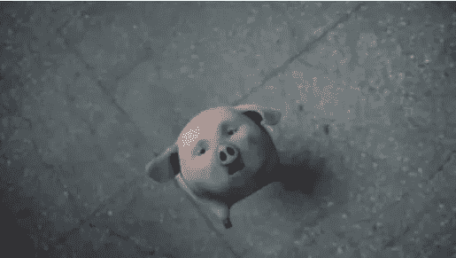

# 前瞻制导快速回顾

> 原文：<https://medium.datadriveninvestor.com/a-quick-review-of-forward-guidance-5442f435fb1b?source=collection_archive---------12----------------------->

明尼阿波利斯美联储银行行长 Neel Kashkari 在最近的《金融时报》文章中表示，美联储现在应该使用前瞻性指引。前瞻性指引是一种非常规的货币政策工具。在 2008 年的上一次危机中，当传统政策无法再为不断下滑的经济提供刺激时，它引起了人们的关注。

传统的货币政策工具是联邦基金利率，即银行间隔夜拆借利率。通过调整隔夜利率，美联储可以影响长期利率，长期利率是企业投资选择的核心，也是家庭耐用品购买和住房决策的核心。

 [## 为什么包容性财富指数比 GDP 更能衡量社会进步？|数据驱动…

### 你不需要成为一个经济奇才或金融大师就能知道 GDP 的定义。即使你从未拿过 ECON 奖…

www.datadriveninvestor.com](https://www.datadriveninvestor.com/2019/03/08/why-inclusive-wealth-index-is-a-better-measure-of-societal-progress-than-gdp/) 

但在 2008 年金融危机期间，美联储已将联邦基金利率降至接近零的水平；隔夜利率处于可能的最低水平。美联储随后推出了两项非常规政策工具——量化宽松和前瞻性指引。量化宽松允许美联储购买长期国债和抵押贷款支持证券，这提供了更多的刺激并保持低利率。美联储还宣布[它打算“在一段时间内”将隔夜利率保持在异常低的水平](https://www.federalreserve.gov/monetarypolicy/timeline-forward-guidance-about-the-federal-funds-rate.htm)这种关于未来政策路径的沟通被称为前瞻性指引。

一份前瞻性指引公告可能包含两部分新信息:一部分是关于未来的经济状况(德尔菲成分)，另一部分是关于未来的利率(奥德赛成分)。《经济与统计评论》( RES)最近接受的一篇[论文](https://www.mitpressjournals.org/doi/abs/10.1162/rest_a_00856)重新检验了当政策利率接近零(或‘零下限’)时前瞻性指引的有效性。在经验模型中，收缩性德尔菲效应通常会被扩张性奥德赛效应抵消，因为较低的政策利率预示着较低的自然实际利率。更具体地说，论文发现【2011 年 8 月的承诺(至少在 2013 年中期保持短期利率接近零)抑制了未来 2 年的利率。这反过来又导致了经济活动和价格的上升。最大的反应是产量增加了 0.5%，这发生在公告发布一年之后。

尼尔·卡什卡利(Neel Kashkari)暗指 2014 年加息过早，并主张前瞻性指引的重要性。宣布维持低利率直到通胀回到目标水平，可以为经济活动提供持续的支持，尤其是在全球经济再次放缓的情况下。