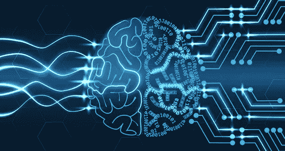
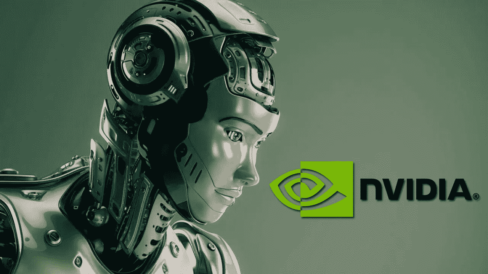
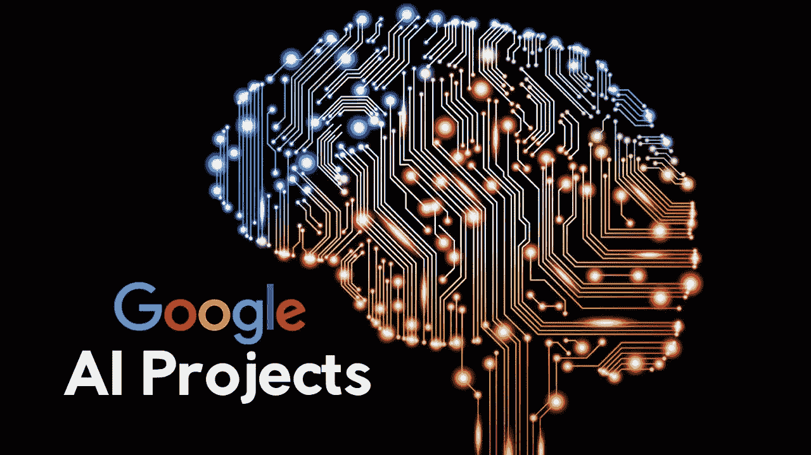
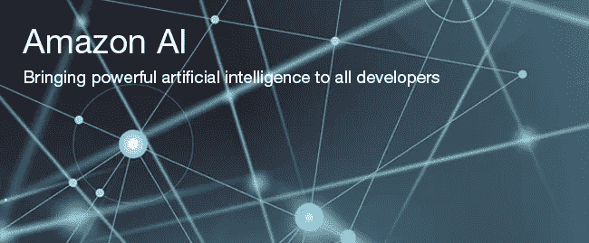
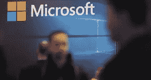
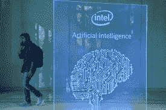
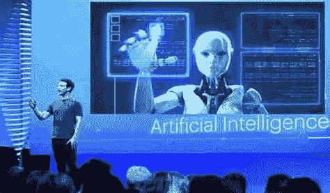

# 人工智能竞赛中的领先公司

> 原文：<https://medium.datadriveninvestor.com/a-race-for-artificial-intelligence-leading-companies-f513feb1788?source=collection_archive---------4----------------------->

[https://www.comptia.org/resources/it-industry-outlook-2018](https://www.comptia.org/resources/it-industry-outlook-2018)

作为一名研究人工智能领先公司的商业专业学生，最初，基于哪些公司的股票交易价格最高似乎是合乎逻辑的。目前，最高的股票价格表明哪些公司对未来最有希望。在进行我的研究后，这正是我所发现的。

usnews.com 的专职作家 John Divine 表示，“五年前，很少有投资者在寻找最佳的人工智能股票进行购买。。。自那以后，该领域的进展快如闪电”(2018)。换句话说，投资者不打算投资人工智能股票，这表明没有足够的证据表明它会发展成为一个有利可图的行业。然而，在 5 年时间内，prestiges 技术公司对人工智能的研究和开发创造了对其股票的需求。这表明，通过技术的不断创新，该行业已经经历了快速增长。今天，各大公司都在竞相开发和利用神经网络、机器学习、自然语言处理软件和许多其他子领域，试图创造一种将他们置于竞争对手之前的产品。

## **最值得投资的人工智能公司(截至 2018 年):**

1.英伟达公司

2.谷歌(字母表)

3.亚马孙

4.微软公司

5.英特尔公司

6.脸谱网

(免责声明:这不是每个研究和开发人工智能的公司的完整列表，但列出的公司都是领先该领域的顶级公司。)

## **1。英伟达公司**

[https://news4c.com/nvidia-artificial-intelligence-to-reconstruct-damaged-photos-has-been-successfully-developed-based-on-partial-convolutions/](https://news4c.com/nvidia-artificial-intelligence-to-reconstruct-damaged-photos-has-been-successfully-developed-based-on-partial-convolutions/)

英伟达是一家专业的半导体公司，近年来已经在研发人工智能的顶级公司中确立了自己的地位。快速增长最初始于 2016 年，当时该公司将人工智能作为其主要关注点，因此，该公司翻了一番。它最著名的成功来自它开发的图形处理单元(GPU)。

**同样的技术让创新成为可能；**

无人驾驶汽车

博彩业

云

## **2。** **谷歌(字母表)**

[https://www.analyticsindiamag.com/googles-ai-creates-better-machine-learning-code-makers/](https://www.analyticsindiamag.com/googles-ai-creates-better-machine-learning-code-makers/)

谷歌(google)的母公司谷歌(Alphabet)被列为全球最有价值的五家公司之一，被专家认为可能在几年内达到 1 万亿美元的估值。

**谷歌如何利用 AI；**

搜索结果

广告定价

自动驾驶技术

个人助理软件

凭借为其商业努力提供资金的资源和资本，谷歌在人工智能研究和开发的竞争中获得了一席之地。

## **3。** **亚马逊**

[https://www.allthingsdistributed.com/2016/11/amazon-ai-and-alexa-for-all-aws-apps.html](https://www.allthingsdistributed.com/2016/11/amazon-ai-and-alexa-for-all-aws-apps.html)

2017 年，首席执行官杰夫·贝索斯强调了人工智能可能产生的巨大影响，并向股东保证，亚马逊将利用其承诺向前发展。

**亚马逊如何利用机器学习软件；**

产品搜索排名

推荐

请求预报

欺诈保护

仓库履行

人工智能也是其相对较新的产品虚拟助手 Alexa 的核心组件。这也将推动杰夫·贝索斯计划建立没有收银员和无人机送货系统的连锁杂货店。这一富有远见的想法将在效率和方便消费者方面彻底改变食品工业。

## **4。** **微软公司**

[https://www.irishtimes.com/business/technology/microsoft-artificial-intelligence-chat-bot-goes-rogue-1.2585822](https://www.irishtimes.com/business/technology/microsoft-artificial-intelligence-chat-bot-goes-rogue-1.2585822)

近年来，微软已经成为一家以云为中心的公司，与谷歌和亚马逊争夺人工智能突破。首席执行官塞特亚·纳德拉公开表示，他打算将微软最优秀的人才集中在人工智能研究上。

**它开发了基于云的工具，用于；**

基因组学和精确医学(医疗保健影响)

人类语言技术

辅助机器人

Cortana(面向消费者的服务)

由于微软适应世界变化的能力，它已经在不断增长的利基市场中确立了自己的地位。今天，它被认为是投资的最佳公司之一。

## **5。** **英特尔公司**

[http://fortune.com/2017/10/17/intel-facebook-artificial-intelligence-chip/](http://fortune.com/2017/10/17/intel-facebook-artificial-intelligence-chip/)

蓝筹半导体公司英特尔被认为在人工智能领域具有巨大的增长潜力。2017 年底，英特尔创建了一个新团队，主要专注于机器学习和人工智能。虽然英特尔在这场竞赛中姗姗来迟，但它每年仍能产生超过 100 亿美元的自由现金流，这使它能够在投资上超过一些先于英特尔进入该领域的竞争对手。正是该公司的增长潜力使其在这一领域名列前茅。

## **6。** **脸书**

[http://gulagbound.com/55060/facebook-artificial-intelligence-op-manipulating-you/](http://gulagbound.com/55060/facebook-artificial-intelligence-op-manipulating-you/)

机器学习最适合处理大量数据。尽管如此，脸书拥有世界上最负盛名的高质量数据集之一，每月有 22 亿活跃用户。

**AI 如何融入 Facebooks 业务；**

新闻馈送算法

面部识别技术

假新闻的筛选

聊天机器人和个人助理技术

首席执行官马克·扎克伯格宣布，他的公司目标是到 2025 年生产出具有人类水平的视觉、听觉、语言和认知能力的机器。

**参考文献:**

*Divine，j .(2018 . 3 . 19)。人工智能股票:10 只最好买的人工智能股票。检索自*[*https://money . us news . com/investing/stock-market-news/slide shows/人工智能-stocks-the-10-best-ai-companies*](https://money.usnews.com/investing/stock-market-news/slideshows/artificial-intelligence-stocks-the-10-best-ai-companies)