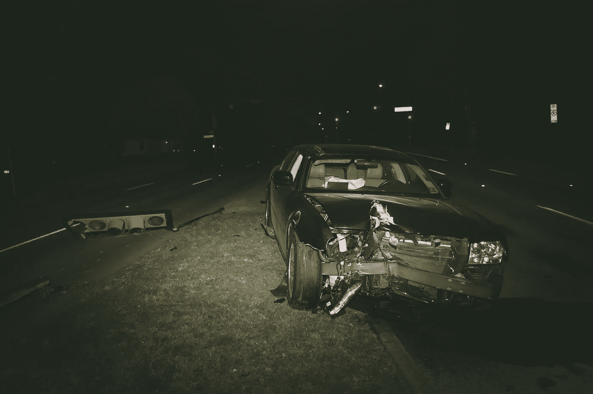

# 对“作为一名职业司机，我甚至拒绝坐在自动驾驶汽车里”的反应

> 原文：<https://medium.datadriveninvestor.com/a-reaction-to-as-a-pro-driver-i-refuse-to-even-sit-in-a-self-driving-car-69525da5216e?source=collection_archive---------22----------------------->

Photo by [Matthew T Rader](https://unsplash.com/photos/mHrc8ydLg3c?utm_source=unsplash&utm_medium=referral&utm_content=creditCopyText) on [Unsplash](https://unsplash.com/search/photos/car-accident?utm_source=unsplash&utm_medium=referral&utm_content=creditCopyText)

十天前， [*真正的 Janine*](https://medium.com/@TheRealJanine) 贴 [*作为一名职业车手，我甚至拒绝坐在自动驾驶汽车*](https://medium.com/s/story/i-will-never-own-or-even-sit-my-butt-in-a-self-driving-car-4f799ce8a0de) 里。在这篇文章中，真正的 Janine 认为我们不需要自动驾驶汽车，她永远不会开车，也不会坐在车里。尽管每个人都有权在这个问题上发表自己的意见，但这种意见应该得到基于事实的有力论据的支持。请记住，传播某些观点可能是危险的，尤其是当这些观点是关于自动驾驶汽车等救生技术的时候。坦率地说，真正的 Janine 提出的论点没有任何价值，这就是为什么我决定写一个反应。

先说真实 Janine 帖子里呈现的一个矛盾:

> 当然，当一辆车开到它面前时，它可以刹车，但自动驾驶汽车永远无法在瞬间做出拯救生命的决定。

汽车在自动驾驶汽车*前面驶出时刹车显然可以救命*。所以由真正的珍妮自己承认，引用的第二部分是胡说八道。她是指在更复杂的情况下瞬间做出决定吗？这很有可能，因为她接着讨论了一种交通状况，在这种情况下，自动驾驶汽车必须在撞到停放的汽车、一个孩子、一只狗和迎面而来的车辆之间做出选择，而自动驾驶汽车显然永远无法正确做到这一点。但是她没有给出任何证据来说明为什么一辆车永远做不到这一点。关于技术永远不能做某事的断言是一个非常强有力的断言，应该有强有力的证据支持。研究已经表明，仅在美国，半自动驾驶汽车就可以挽救成千上万人的生命。全自动驾驶汽车很可能也是如此，因此，如果禁止人们驾驶自动驾驶汽车，那么反对自动驾驶汽车可能是危险的。

> 你的电脑崩溃过吗？或者，因为它处理的数据太多，所以速度可能会慢一点？电脑会这么做。经常。你希望你的孩子跑在一辆有故障的自动驾驶汽车前面吗？

当然，电脑有时会死机，尽管我确实认为真正的 Janine 把个人电脑和你车里的电脑混淆了。但我同意，自动驾驶汽车的计算机崩溃确实是一个可能导致儿童死亡的问题。但无论如何，这都不是反对无人驾驶汽车取代人类司机的理由，因为人类也可能“撞车”。人类驾驶员可能中风或心脏病发作(仅举几个例子),也会带来同样可怕的后果。

> 自动驾驶汽车和保姆技术让人们相信在开车时可以进行多任务处理，认为这种技术可以让他们在假装开车的同时吃东西、发短信和将注意力转移到其他地方。

再次，研究表明这些“保姆”技术拯救生命。还需要我多说吗？

> 所以请相信我:我们不需要自动驾驶车辆。

不，真正的珍妮，我不会从你手里拿走的。坦率地说，你提供的论据是一派胡言。