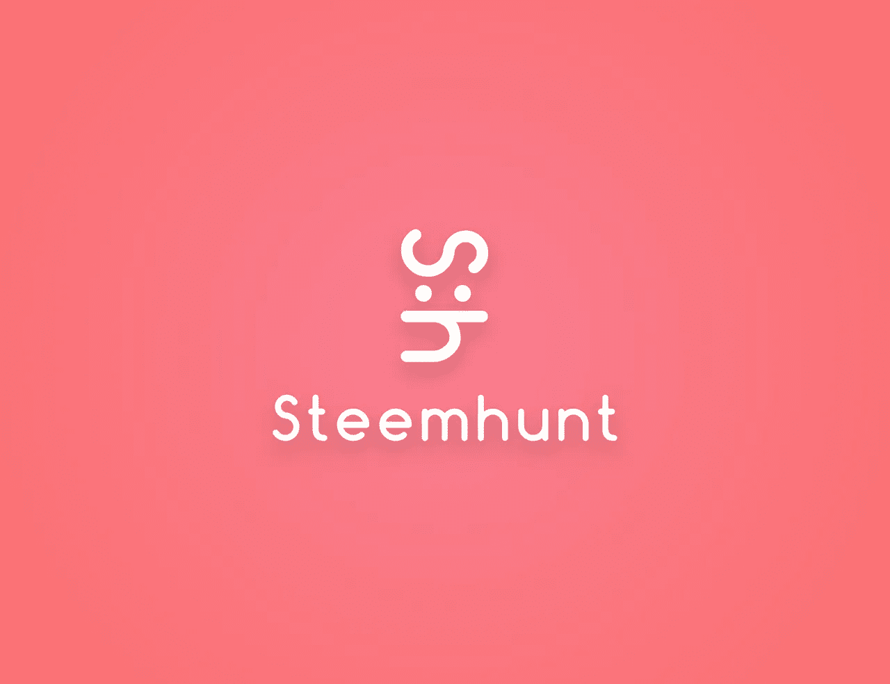
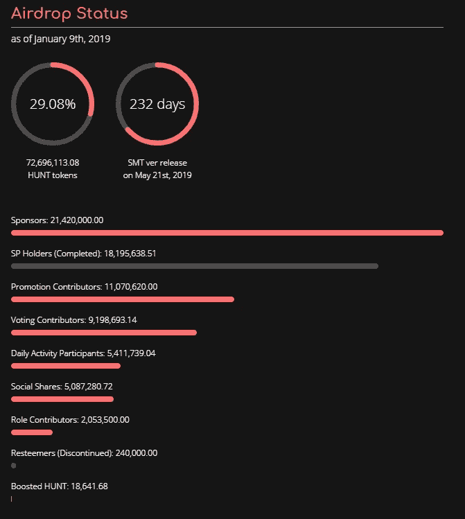
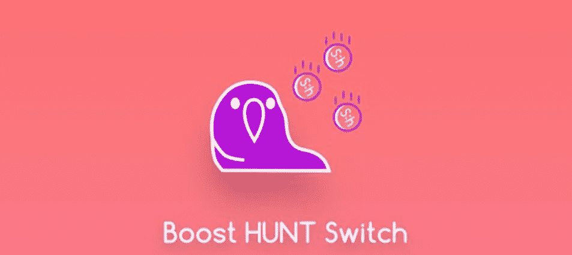
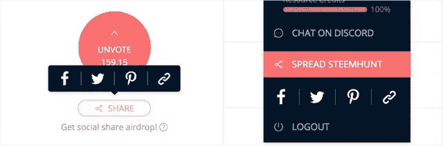
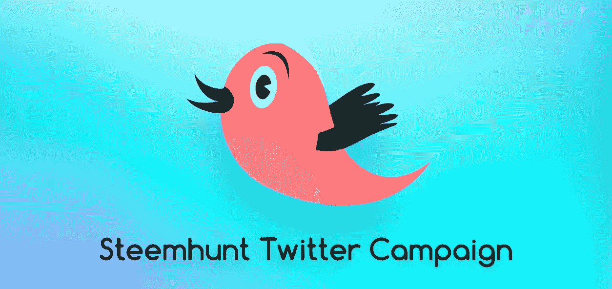
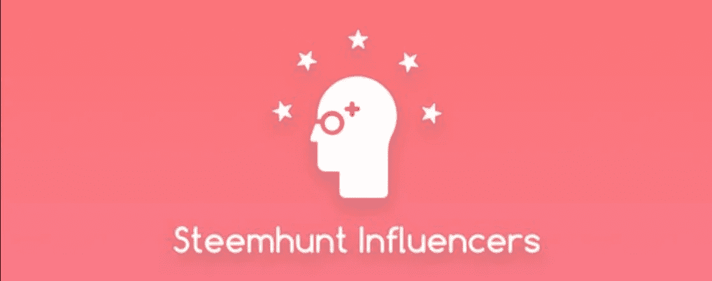
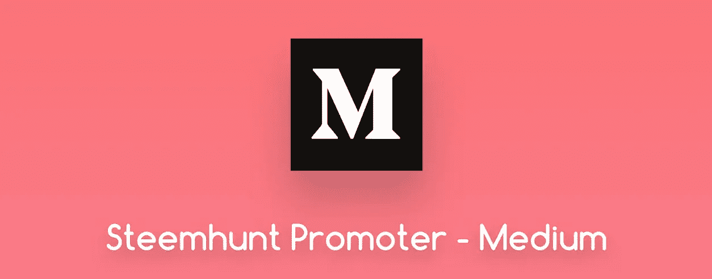

# 社区的真正象征性空投——steem hunt

> 原文：<https://medium.datadriveninvestor.com/a-real-token-airdrop-for-the-community-steemhunt-926969abcc2c?source=collection_archive---------23----------------------->

Photo by [Djim Loic](https://unsplash.com/@loic?utm_source=medium&utm_medium=referral) on [Unsplash](https://unsplash.com?utm_source=medium&utm_medium=referral)

> “你不能把时间留给将来使用。但你可以为未来的你投资。”
> 通过匿名

Steemhunt [宣布](https://steemit.com/steemhunt/@steemhunt/new-year-s-letter-from-steemhunt)团队目前正在为他们的狩猎代币准备一个 IEO(初始交易),并且也开始了一个[调查](https://steemit.com/steemhunt/@steemhunt/share-your-opinion-for-the-price-of-hunt-token-100-hunt-token-bounty)询问开始 IEO 时狩猎代币的正确价格。随着 IEO 越来越近，我想总结一下目前加入空投 Steemhunt 狩猎代币的选择。因为 Steemhunt 是基于 Steem 区块链，所以需要一些关于 Steem 区块链的一般知识。我发现下面的文章有助于对 Steem 有一个基本的了解。[ [条](https://medium.com/crypt-bytes-tech/steem-steem-blockchain-based-social-media-platform-889f7f3c3245)

# 0.什么是 [Steemhunt](https://steemhunt.com?ref=jayplayco) 和 HUNT tokens

> Steemhunt 是一个基于 Steem 区块链的激励性社区平台，面向对酷新产品有着非凡知识和热情的产品影响者。对于制造商来说，这是一个联系早期采用者的桥梁平台，有助于他们成功推出产品。[ [来源](https://token.steemhunt.com/)

狩猎代币是你参与 Steemhunt 社区时可以空投的奖励代币。狩猎代币的当前价值约为 0.051$ STU(在此了解 STU 是什么)

# 1.[用户评分](https://steemit.com/steemhunt/@steemhunt/introducing-new-steemhunt-user-score-now-your-hunt-token-balance-matters)

关于 Steemhunt 的空投，需要提到的一个重要部分是，很多空投都受到 Steemhunt 的用户评分的影响。这意味着在某些类别中，有必要在 Steemhunt 获得更高的用户分数，以获得更多的搜索令牌。当你在社区中积极参与时，可以获得更高的用户分数。

# 2.狩猎代币空投类别

你可以在 Steemhunt 的 PC 版[钱包上找到一个概述，看看 HUNT tokens airdrop 的类别。一些空投是非常具体的，或者确实需要具体的任务或条件，所以下面的顺序是基于我个人对它的容易程度的看法。](https://steemhunt.com/wallet?ref=jayplayco)

# a.Steem 电力授权(每天 90K 令牌)

[Source: rawpixel](https://busy.org/exit?url=https%3A%2F%2Funsplash.com%2Fphotos%2Fyw7mV9JeND4)

获得狩猎代币最简单的方法就是将 Steem 权力授予账户 [@steemhunt](https://busy.org/@steemhunt) 。赞助商将根据他们每天 90K 狩猎代币的授权获得一份份额。每周报告显示赞助商每周获得多少代币。根据来自 Steemhunt 100SP 的最新[赞助商报告](https://steemit.com/steemhunt/@steemhunt/ces-consumer-electronics-show-special-in-steemhunt-term-10-influencers-or-sponsor-report-38)显示，100SP 每周获得约 908 枚狩猎代币。基于委托的空投不受用户分数的影响。

# b.[狩猎站投票者(每天 40K 代币)](https://steemit.com/steemhunt/@steemhunt/hunt-token-airdrop-will-be-revised-or-sponsor-report-21)

[Source: rawpixel](https://busy.org/exit?url=https%3A%2F%2Fpixabay.com%2Fde%2Fafrikanische-american-asiatische-3476371%2F)

另一个获得狩猎代币的简单方法是去 [Steemhunt](https://steemhunt.com?ref=jayplayco) ，注册并登录，然后为你喜欢的狩猎投票。根据您的上行投票能力(基于您的 SP)和权重，将为您的上行投票分配狩猎令牌。请确保您在“今天”标签中投票支持产品，因为这些是投票后空投考虑的狩猎。基于 upvoting hunting 帖子的空投不受用户评分的影响。

# c.[评论投票—每天 10K](https://steemit.com/steemhunt/@steemhunt/introducing-hunt-score-based-comment-curations-and-new-airdrop-category-for-comment-upvotes)

[Source: TeroVesalainen](https://busy.org/exit?url=https%3A%2F%2Fpixabay.com%2Fde%2Fdaumen-hoch-ordnung-gut-gut-gemacht-2056022%2F)

类似的狩猎后选民空投，评论“今天”标签狩猎也被认为是一个单独的预算狩猎令牌空投。当你在一次你认为好的狩猎中投票支持其他猎人的评论时，这也将得到狩猎代币的奖励。基于 upvoting hunting 帖子评论的空投不受用户评分的影响。

# d.[助推狩猎](https://steemit.com/steemhunt/@steemhunt/boost-hunt-is-live-now-converting-stu-rewards-to-hunt-tokens)

增强狩猎是一项功能，可以将您发布的狩猎奖励转换为狩猎代币。通常情况下，你会收到你的奖励斯图(斯蒂姆，SBD 和斯蒂姆伯沃)，但背后的原则是，猎人设置受益人 100%的斯蒂姆杭特和斯蒂姆杭特是奖励斯图的基础上，每天变化的价格在狩猎代币。

# e. [Steemhunt Chrome 扩展版—每位用户每天最多 50 个狩猎代币](https://steemit.com/steemhunt/@steemhunt/hunt-token-airdrop-will-be-revised-or-sponsor-report-21)

你可以安装一个 Chrome 浏览器扩展，你可以在这里下载[。在右上角你会找到一个地方，你可以输入你的 Steem 帐户，之后每当你打开一个新的标签，你会得到根据你的用户分数固定数量的狩猎代币。](https://chrome.google.com/webstore/detail/steemhunt/hbffamghdehohidgmlnohhgkmgemplhc)

# f.[洗牌按钮抽奖](https://steemit.com/steemhunt/@steemhunt/shuffle-button-lottery-is-live)

Steemhunt 是一个排名板，狩猎是根据他们的投票排名显示的。为了给被低估的狩猎一个更好的机会，随机按钮被引入，空投的游戏化因素也被实施。

> *为了进一步推广随机洗牌按钮的使用，我们决定根据 KST(韩国标准时区)将每天的抽奖时间分为 4 个时段——0–6 | 6–12 | 12–18 | 18–24，现在您可以通过点击“今天”选项卡上的洗牌按钮，每 6 小时赢得 1 到 10 个狩猎代币。理论上，你每天最多可以获得 40 个狩猎代币。*

# g.[社交空投——每天 90K](https://steemit.com/steemhunt/@steemhunt/write-a-review-for-steemhunt-chrome-extension-and-get-100-tokens-or-sponsor-report-29)

除了代表团空投，社会空投是所有 Steemhunt 空投中最大的部分。这一战略举措的原因是让社交媒体影响者有机会从 Steem 社区之外产生流量，并获得大部分空投。

> 如何参与我们每天分发 90，000 个代币。你可以点击狩猎帖子或个人资料标签上的分享按钮，分享到任何其他社交平台，如 Twitter，脸书，Pinterest 等。将根据通过社交渠道从所有共享帖子产生的每日总流量的份额来分配搜索令牌。为了计算您的奖励份额，您的共享计数将变成有效计数。计算有效点数的两个主要因素是你分享狩猎帖子的日期和你的猎人等级。
> 
> 你分享帖子的第一个日期将会有最高的有效计数，并且会一天比一天减少。

重要的一部分是，社交空投也是和用户评分耦合在一起的。因此，猎人将根据他们的用户分数并通过对有效计数应用用户分数权重，从社交分享空投中获得更多令牌。

对于任何擅长在社交媒体上传播消息和获得粉丝的人来说，这是一个增加 Steemhunt 钱包财富的好机会。

# h.[推特赏金](https://steemit.com/steemhunt/@steemhunt/ces-consumer-electronics-show-special-in-steemhunt-term-10-influencers-or-sponsor-report-38)

几周前， [@MTimeTraveller](https://busy.org/@mtimetraveller) 成为社交媒体经理，并成功推动了 Steemhunt 的社交媒体活动。他的举措之一是增加 Twitter 上的活动。现在，关注 Steemhunts 的 Twitter 账户并转发推文将获得狩猎代币奖励。每个动作(关注和转发)都需要在单独的谷歌文档中确认。

您将获得以下两个动作的搜索令牌:

1.  关注 Steemhunt Twitter 帐户，获得 100 个狩猎代币。
2.  每天转发 Steemhunt 的推文，每天获得 10 个狩猎代币。

**如何获得赏金**

为了获得您的奖金，请在您采取行动后填写下表(请仔细阅读每张表格中的说明)。

# 一、[影响者 x3 HUNTToken 奖励](https://steemit.com/steemhunt/@steemhunt/steemhunt-influencers-now-open-for-all-hunters-or-sponsor-report-34)

Steemhunt 已经决定将顶级投票猎人变成有影响力的人(当满足最低要求的条件时)。策划狩猎是 Steemhunt 社区非常重要的一部分。影响者是在 Steemhunt 中拥有更大投票权力的顶级策展人，并且在他们的投票中获得 3 倍的 HUNT tokens 奖励。影响者由 [IES(影响者评估分数)](https://steempeak.com/steemhunt/@steemhunt/steemhunt-witness-initiatives-term-2-influencers-or-sponsor-report-24)选出。

# j.[中型作家——每周 5000 个狩猎代币。](https://steemit.com/steemhunt/@steemhunt/wanted-medium-writers-new-steemhunt-user-score-system-or-sponsor-report-31)

Steemhunt 一直在寻找重要渠道的良好曝光率。其中一个是中等的。Steemhunt 一直在寻找有影响力的优秀作家来推广 Steemhunt。奖励是每周 5000 个狩猎代币。

这项任务将是:

*   每周至少写一篇中篇文章
*   帖子应该直接或间接地突出 Steemhunt

如果你有兴趣，你可以在下面的谷歌表格上申请。详细信息可以在这里找到[。](https://steemit.com/steemhunt/@steemhunt/wanted-medium-writers-new-steemhunt-user-score-system-or-sponsor-report-31)

https://goo.gl/forms/TnIOYks2ZFsHktTr2

# k.社区角色

[[Source: rawpixel]](https://unsplash.com/photos/93h5V4t10S0)

Steemhunt 主要是作为一个社区和成员本身来推动的。其中一些成员有特定的角色，目前分工如下。

*   主持人:主持并验证基于张贴指南的每日狩猎。
*   [社交媒体经理](https://steemit.com/steemhunt/@steemhunt/steem-at-state-of-the-dapps-new-social-manager-term-8-influencers-or-sponsor-report-36):负责在不同的社交媒体渠道提高 Steem 经济之外的 Steemhunt 的知名度。
*   社区经理:处理不和谐的社区。

所有的角色都是根据给定的任务来奖励的，但是必须提到的是，这些角色只有在需要或者有人要下台或者需要替换的时候才会被选择。

# 3.结论

有几种方法可以获得 HUNT 代币奖励，这些代币是为增加 Steemhunt 社区的参与度而定制的。所以成为活跃会员是获得更多狩猎代币的关键点。如果你还没有加入 Steemhunt 社区，你还在等什么？加入我们，寻找和搜寻优秀的产品，并获得代币奖励，代币将很快在交易所提供 IEO。

你可以在这里[报名](https://steemhunt.com/sign-up?ref=jayplayco)。

*原载于 2019 年 1 月 10 日*[*busy.org*](https://busy.org/@jayplayco/steemhunt-overview-of-hunt-tokens-airdrop)*。*