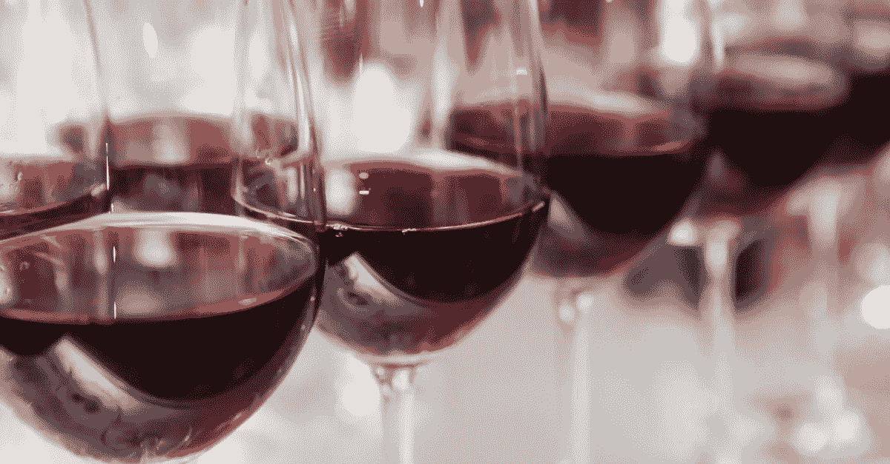

# 红酒饮用者的困境

> 原文：<https://medium.datadriveninvestor.com/a-red-wine-drinkers-dilemma-ab0f3d4a5741?source=collection_archive---------13----------------------->

长期以来，喝红酒的人一直引用这种饮料对健康的好处来为自己斟满酒辩护。这种合理化可能不再奏效。

一项对近 800 名饮食富含白藜芦醇的意大利人的长期研究得出结论，红酒、浆果和黑巧克力中发现的化合物实际上没有效果。

约翰·霍普斯金大学医学院的研究人员对生活在意大利基安蒂酒地区两个村庄的 783 名老年男女的健康状况进行了长达 15 年的监测。

在控制年龄和性别后，研究人员发现，尿液样本中白藜芦醇含量高的参与者与该化合物含量低的参与者一样可能死亡或患心血管疾病或癌症。

除了红酒，化学物质白藜芦醇还存在于紫葡萄汁、花生、红葡萄皮和桑葚中。据 WebMD 报道，它可能会扩张血管，降低帮助血液凝固的细胞的活性。

约翰·霍普斯金大学眼科教授 Richard Semba 说:“白藜芦醇的故事证明是另一个关于健康益处的大肆宣传经不起时间考验的例子。”。

但先别放下那杯黑皮诺葡萄酒。红酒中可能还有其他成分有助于减少炎症和保护心脏。