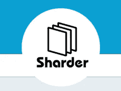
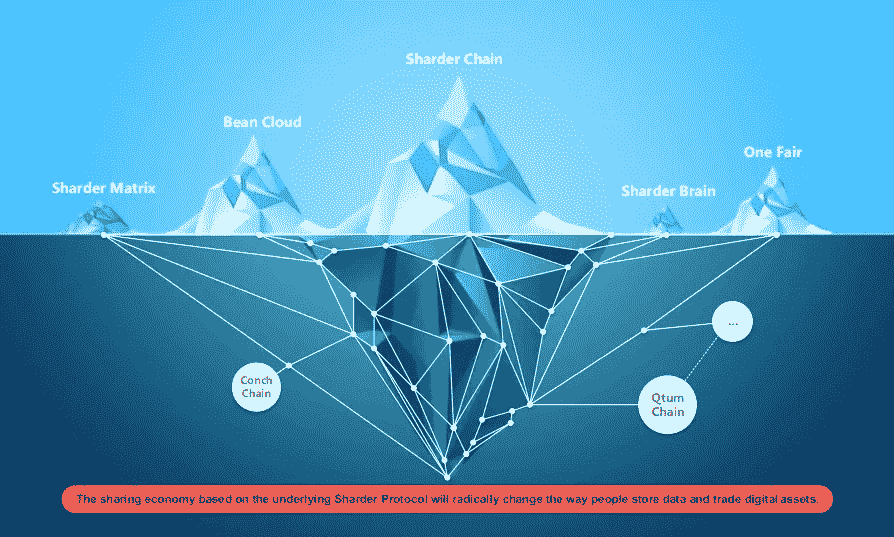
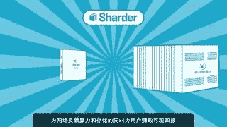
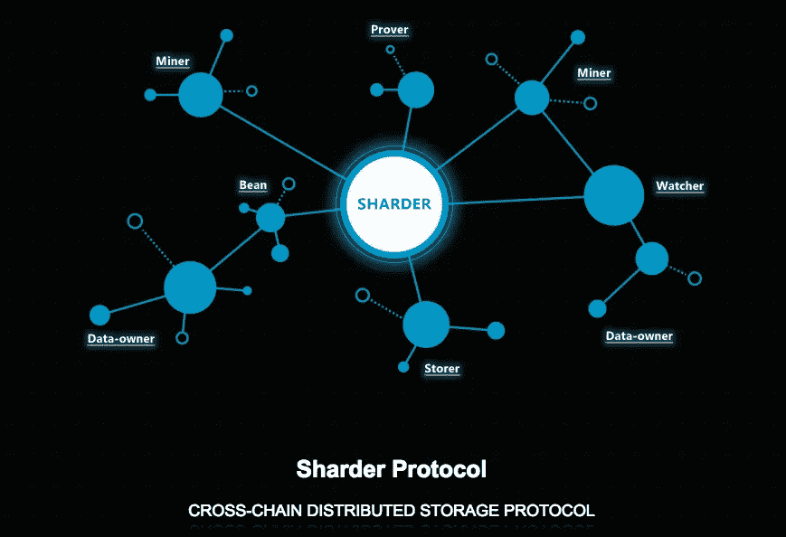

# 革命性的生态系统:鲨鱼链和豆云:鲨鱼生态系统的脊梁

> 原文：<https://medium.datadriveninvestor.com/a-revolutionary-ecosystem-sharder-chain-and-bean-cloud-the-back-bone-of-the-sharder-ecosystem-38ef652a231e?source=collection_archive---------22----------------------->

**Sharder: An Ecosystem That Has The Power To Revolutionize Data Storage**

**区块链:Sharderchain，数据存储的未来，一个不变的解决方案**

区块链是第四次工业革命的革命副产品；这是我们世界科技创造力的一个巨大变化，也是我们集体超越成为一级文明的焦点之一。区块链是不可变的，它不能被篡改，可以用来存储海量数据；从土地注册、教育记录、医疗记录、公司记录、政府文件、身份验证、托管、知识产权、电子商务、全球支付、汇款、点对点贷款、股票、私人市场忠诚度计划和数据所有权；区块链技术的使用案例几乎是无止境的。由于区块链比当今世界上存在的任何其他数据库都更安全，因此它有可能彻底改变全球各个行业。虽然区块链仍处于原始阶段，但像 Sharder 这样的公司正在完善这项伟大的新技术，以造福人类文明，特别是在 Sharder 协议方面，以确保每个人都能公平、安全地访问他们的数据！

**The Sharderchain is a Proof-Of-Stake Blockchain Which Is A Crucial Component Of The Sharder Ecosystem**

Sharderchain 是 PoS 和 PoC，这意味着利害关系证明和信用证明。Sharder 协议中的信用证明附加到生态系统中的特定账户。PoC 模型的名称来源于(Conchchain PoS)。对于分配给网络的不同角色，共享者链的 PoS 的公式是不同的:对于存储者，角色是总存储量、存储持续时间、在线持续时间和惩罚量，对于满节点，角色是最大事务处理、块生成速度、分叉收敛速度和在线持续时间，观察者在 PoC 系统中的角色是索引服务性能和在线持续时间，数据所有者的角色是数据存储量和交易量，最后，证明者的角色是证明量。作为一种激励手段，Sharder 节点不断获得奖励。“自我利益不过是我们动物的生存。人类只有在自我放弃的情况下才会开始。比特币是世界上第一种加密货币和区块链，是一种工作证明区块链，简单介绍一下什么是工作证明与利益证明，工作证明是一种数据范式，很难产生，但其他人很容易验证，并满足某些要求。工作量证明也可以描述为一个概念，即采矿者开采一个区块的概率(合并交易)取决于采矿者完成的实际工作量；由于需要更多的计算机来完成更多的工作，随着时间的推移，工作证明可能会变得集中化。网络矿工在工作证明系统中相互竞争，以获得整体奖励。Sharder 链不使用工作证明，相反，Sharder 链使用利益证明。

利益证明是一个概念，即个人可以根据矿工拥有的比特币或替代比特币的数量，在各自的区块链上挖掘和验证交易(这激励矿工积极参与加密货币市场，特别是他们正在挖掘交易的区块链内的比特币，这给了鲨鱼链内的鲨鱼令牌/硬币巨大的效用和价值)。随着矿工获得更多替代硬币，在这种情况下，Sharder Token，矿工在特定网络上验证交易的能力就越强。为了激励人们，就要激发他们的自我兴趣，Sharder 协议理解这种自我必要性的范例，并在他们的生态系统中利用了这种人类的原始本能。以太坊是整个空间中最知名的加密货币之一，它使用工作证明，然而，以太坊社区内越来越多的人希望转移利益证明。Sharder Chain 是第一个部署 Sharder 协议的公共区块链，也是整个 Sharder 网络的基石。Sharder 链将被用作开发阶段的试验场，以确保 Sharder 生态系统的所有组成部分都能顺利、有效和高效地运行。

Sharder 链目前正处于测试阶段！更多关于 TPS(每秒事务数)的细节即将出炉，TPS 是任何区块链的关键组成部分！在加密货币等新经济范式中保持用户友好至关重要，加密货币的许多投资者对区块链技术的复杂性知之甚少。Sharder 协议的主要焦点是确保 Sharder 链对所有使用它的人都是容易访问的。Sharder Chain 有多种使用案例，首先是用户友好的模型、区块链本身的数字资产、有保证的交易、定制的 API(API 是执行两个或更多系统发出的请求的验证协议；它向原始网站验证并识别特定的调用程序、其开发者或其特定用户)。Sharder Chain 也有一个操作支持系统。

**节点与网络:鲨鱼链的脊髓**

**The Sharder Ecosystem Has The Technological Ingenuity And Team To Revolutionize The Way We Store Data**

Sharder Chain 利用了一个被称为“Kad 协议”的概念来构建一个对等网络。“Kad 协议”是实现 Kademlia 对等覆盖协议的对等网络。Kademlia 是一个用于分散式对等网络的分布式哈希表，由发明者 Peter Maymounkov 和 David Mazieres 于 2002 年创建。“Kad 协议”的运作方式是 Sharder 生态系统和链的基础；“Kad 协议”规定了网络的结构和通过节点查找的信息交换；本质上，节点之间相互通信。在该过程中，虚拟网络由参与节点形成，并且每个节点由节点 ID 验证，这通过利用验证协议增加了整个网络的安全性，在这种情况下，在共享者链内。对于不熟悉什么是对等网络的人来说，它是去中心化的体现；它使两台或多台计算机能够直接相互连接，而不需要中央服务器。利用中央服务器是俄罗斯轮盘赌的危险游戏，因为中央服务器可以在任何时候关闭，特别是如果这些中央服务器是由国家运营的，屈服于专制的意识形态范式。对等网络将权力交还给个人，允许人类的集体意识相互交流，同时拥抱集权的理想和原则。

**The Sharder Chain Function Model Can Be Found On Page 19 Of The Sharder Technical Whitepaper**

为了在 Sharder 链中快速建立一个稳定、公平的网络，Sharder 将发布 Sharder Hub 和 Sharder Box，前者是一款低功耗微型采矿机，后者是一款一体化存储采矿机。Sharder Hub 和 Box 是 Sharder 链蓬勃发展的重要组成部分。Sharder Hub 不仅可以将空闲磁盘容量连接到 Sharder 网络，还可以确保 Sharder 链中更稳定的在线时间。有了 Sharder Hub 中的嵌入式客户端，一旦个人收到 Sharder Hub，他们就可以立即开始挖掘，并开始通过 Sharder Hub 及其股权证明系统接收奖励。为了增加代币的价值，需要下注特定数量的共享代币以获得奖励，并且根据赌注证明范例，下注的 SS 代币越多，整体上可以获得的奖励就越多。如果个人决定利用 Sharder Box 进行开采，他们可以因共享其计算机内的闲置存储空间并同时生成区块(区块链内的交易合并，在这种情况下为 Sharder 区块链)而获得多倍奖励。个人不仅可以通过共享盒获得奖励，他们还可以通过成为网络中的“观察者”获得奖励。Sharder 生态系统中的“观察者”观察 Sharder 网络的状态，根据安全策略检查安全状态，并修复现有或潜在的漏洞。观察者将持续在线，以确保网络有效、安全和高效地运行。观察器是数据索引的完美选择，它们对于整个 Sharder 网络的融合是必要的。观察者不仅确保整个网络的安全，还确保委托 Sharder 协议管理数据的数据所有者的安全；Watcher 会对商店随机执行节拍检测，以确保数据的安全性和可用性。作为附加安全协议的一部分，大部分工作都是离线完成的。Sharder 协议对 watchers 整体的目标是平衡和检查网络内的矿工和存储者，确保数据安全和避免网络内的恶意攻击！

**We All Have Layer’s Within Ourselves, The Sharder Chain Is No Different!**

碎片链由各种层组成，使其能够高效和有效地运行。该链的区块链层部分包括所有必要的区块链属性和模块，包括点对点网络、UTXO 模型(由比特币和以太坊使用)、分布式账本技术、全球图书和原始体 Sharder 令牌。分片器链中的数据层实现数据操作、数据分片、复制以及观察者和证明者的角色，如分片器协议中作为整体所陈述和定义的。Sharder 链的资产层构建用户友好的 Sharder 帐户模型，将令牌和数据对象与帐户连接起来以形成数字资产模型，并提供数字资产管理。Sharder 协议中的模块层对模块进行抽象和打包，并提供基于智能合约的各种交易模型。由于以太坊，加密货币领域的许多人都听说过智能合约，但解释它们实际上是什么很重要。智能合同是用代码编写的交易或谈判的协议条款；智能合同验证、促进和执行加密货币交易，并且它们防止恶意软件或黑客能力在交易或整个网络中发生。在一个由黑客、小偷和欺骗组成的空间中，利用我们社会所能提供的最先进的安全协议是很重要的，智能合同就是最先进的安全协议。Sharder 链还有一个接口层，它有助于使用区块链和分布式存储服务。

**Bean Cloud:适用于各种行业的独特商业应用**

**Bean Cloud Has The Potential To Be Utilized By Various Businesses Across Broad Sectors Of Industry**

Bean Cloud 是 Sharder 生态系统中构想的主要 dapps 之一。豆云是服务于点对点金融和贷款的数据存储、证明和安全平台。Bean Cloud 存储电子合同、支付凭证、投资记录等数据，并发布可追踪且不可更改的安全和法律证书。想象一下这个 dapp 对于各种工业部门的广泛应用，例如投资部门中的企业、金融机构(例如寻找金融记录的安全合同的银行)以及商业企业也可以利用这个 dapp 来安全存储信息，作为回报，由于区块链的不变性，这些信息将永远不会被篡改。Bean Cloud 的业务应用程序实际上是无止境的，可以由希望存储其有关小额金融、电子合同和电子商务的信息的各种公司、组织和企业使用，有了 Bean Cloud，任何相关机构都可以获得安全证书！

Sharder 协议的目标是在 Bean Cloud Beta 期间部署超过 100 家企业；没错，超过 100 家企业将成为参与 Bean Cloud 测试版的目标！在我们的世界中，由于能够篡改各种企业和组织中使用的预先存在的数据库，我们的隐私和信息遭到了太多的黑客攻击和破坏。请记住 Equifax，想象一下，如果 Equifax 利用这种 dapp 来获取客户的信用信息，利用区块链，每个人的信息都将得到保护，整体上无法被篡改，安全证书将作为 Equifax 客户和整个企业的另一层安全措施发布，实际上消除了任何人的信用卡信息被破坏的机会。Bean Cloud dapp 利用区块链，因为它永远不会被篡改，存储在区块链中的信息也不会被更改。利用 Bean Cloud 和 Sharder Chain，我们将极大地受益于公益、物联网、供应链和共享经济等领域。零售商店等供应链可以利用 Bean Cloud 来存储他们的交易，并且他们的交易是不可更改的！Bean Cloud 和 Sharder Network 作为一个整体的未来发展潜力实际上是无限的，该团队对该项目成功的坚韧和精神信念是前所未有的，随着我们进入新的千年，Sharder 协议的发展将继续展开，并因此彻底改变我们未来存储数据的方式；未来的变化源自当代革命，而 Sharder Chain 是数据存储领域正在发生的巨大变化的先兆！

**结论:Sharder 生态系统将通过区块链和 Dapps 彻底改变我们的世界！**

**The Way We Store Data Is About To Change Exponentially!**

Sharder 生态系统旨在以更高效、更经济、更安全的方式彻底改变我们存储数据的方式！当前的数据存储模式正在全球范围内失败，我们已经在 2017 年的 Equifax 大黑客事件中看到了这一点。Sharder 生态系统和 Bean Cloud 确保并承诺我们的世界永远不会再屈服于数据泄露或负担不起的数据存储。正如我们所看到的比特币、以太坊、Dash、Monero、莱特币等，从金融角度来看，区块链项目和生态系统在货币角度来看做得非常好，我们沉睡的巨人正在从古老的沉睡中醒来。数据存储解决方案的革命就在眼前，集中式存储解决方案无法阻止它的发生。Sharder Nation 将实现其目标，以更加公平、透明和经济实惠的方式彻底改变我们存储数据的方式，Bean Cloud 将使金融、零售和更多行业的企业能够利用这一独特的应用程序安全地存储他们的交易和整体财务！沙尔德帝国！

*有兴趣了解加密货币和区块链技术吗？报名参加我在 Udemy 上的课程吧！*[*https://www . udemy . com/cryptocurrency-investment-a-初学者-指南/学习/v4/*](https://www.udemy.com/cryptocurrency-investment-a-beginners-guide/learn/v4/)

*免责声明:加密货币投资需要大量的风险，不要投资超过你能承受的损失！我不是金融顾问，也不对你的任何交易负责。我是 Sharder Token 的投资者，本文中的信息代表我自己的想法和观点。在投资任何东西之前，你都要做好自己的研究，这是义不容辞的责任！*