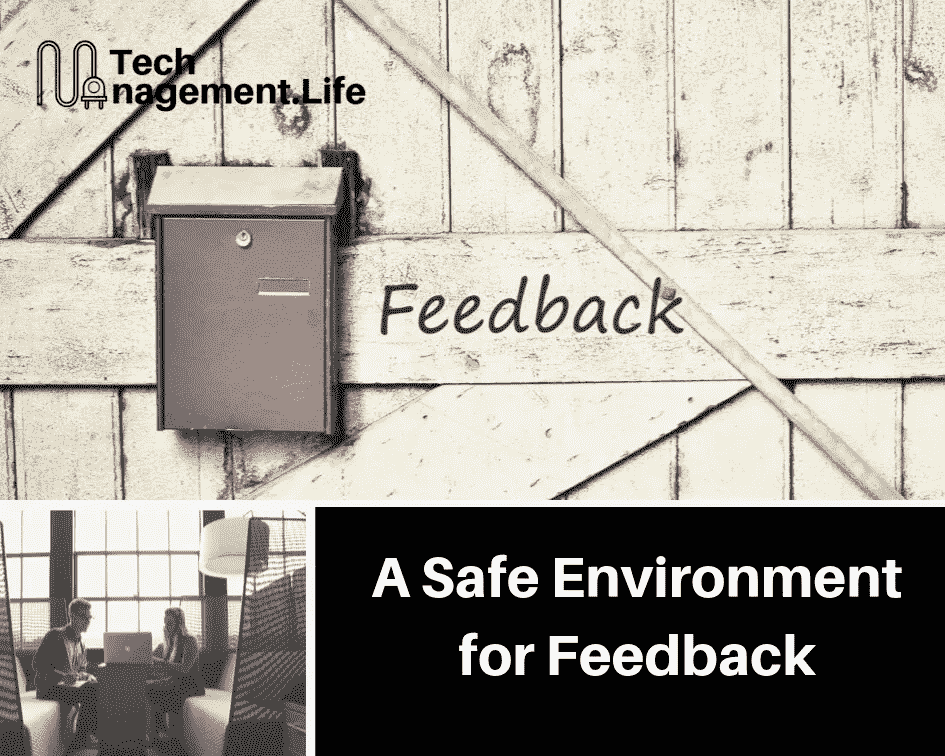

# 反馈的安全环境

> 原文：<https://medium.datadriveninvestor.com/a-safe-environment-for-feedback-dfe1d04a03e3?source=collection_archive---------7----------------------->

公司总经理把我叫进他的办公室，让我坐下，告诉我，我的一个队友告诉他，我对他们提前离开办公室太严格了。他建议我放轻松。现在，这真的不是我的意图去限制人们，实际上我认为我已经很好地传达了我的信息。当然，这并不重要。最后，这就是我给我的团队的感觉。

这是我的第一个领导角色，当时我刚入行两年。不幸的是，我没有很好地接受这种情况。

剩下的时间里，我和这个特殊的队友一起工作，这种关系从来没有过。我不能像以前那样和他交谈，主要是因为我自己对发生的事情有偏见。我就是不明白(实际上也没有试图去理解)他为什么要告发我。

事后看来，我意识到事情其实很简单——他觉得和我谈这个问题不够安全，觉得和总经理谈更安全。

 [## 想知道领导是谁？请他决定。数据驱动的投资者

### 一个有效的领导者能为组织提供的最有价值的东西之一是决策能力…

www.datadriveninvestor.com](https://www.datadriveninvestor.com/2019/01/25/want-to-know-who-the-leader-is-ask-him-to-decide/) 

最终，如果你的团队或同事不愿意直接给你反馈，很可能是你而不是他们。

# 我怎么知道它正在发生？

如果你不确定这是否会成为你的一个问题，这里有几个问题可以问你自己:

*   你不知道你的同事对和你一起工作的真实感受吗？
*   你是否经常听到其他人，包括你的老板，说团队中的其他人对你有意见？
*   你是否认为为了获得有意义的反馈，你需要保持调查和反馈渠道的匿名性？

上述所有情况都表明，你的团队甚至你的同事对与你交谈感到不安全。

# 为什么会这样？

Safety is a complicated thing.

安全是一件复杂的事情。人们对于他们能承受多少冲突或压力有不同的阈值，在他们决定这不值得之前。你在日常对话中的行为方式往往在对话如何得出结论的过程中扮演着重要的角色。当心这些不好的先例。

你喜欢争论，即使是关于一些小事。我没有这方面的统计数据，所以请随意纠正我，但我坚信绝大多数人并不真的喜欢争论。如果你有好争辩的名声，大多数人可能会认为他们在这个问题上保持沉默(或者完全围着你转)比不得不为自己的想法辩护要好。

你轻视或经常拒绝别人的意见和感受。同样，许多人不喜欢为自己的观点辩护。一种观点通常是一种不顾事实的感觉，试图为它辩护真的没有意义。告诉人们他们的感受是错误的，这是让他们退出对话的快速方法。

**你显然不想要它。**你可以鼓励你的团队给你尽可能多的反馈，但是如果你的心不在一个真正想要改变的地方，它就会出现。

**整个组织不是为它而建的。**这可能超出了你的影响范围，但有时，你所在的组织可能并不完全有利于安全反馈。它也是双向的。组织有时害怕给员工反馈，害怕冒犯并最终失去他们。

# 我如何修理它？

If there’s a safety issue in your team, here are ways you can fix it.

你可以做几件事来解决这种情况，尽管没有一种方法可以解决所有问题。思考这些建议，看看它们是否适用于你的环境。

**确保*你*觉得提供反馈是安全的。**如果你不这样做，很可能你的团队也不会。一个快速的解决方法是创造一个“安全气泡”,让你的团队相信他们的反馈不会给他们带来麻烦。如果需要，保证他们匿名。但是你越早解决安全问题的根源，对每个人都越好。泡沫往往会在某个时候破裂。

**认识到反馈是关于他人对你的体验，而不是关于你。你如何看待自己与这件事无关，你不必解释或为自己辩护。如果必须的话，解释一下情况，如果这有助于增加视角的话。**

**经常、持续地与你的团队交流。向他们展示，不管你现在的名声如何，你真的很想知道他们的感受。安全不会自动发生。创造安全是一种积极的努力。**

只有当你真正需要反馈时，才要求反馈。在 [Synacy](https://synacy.com) ，我们设计了完全透明的同级反馈流程，仅由接受反馈的人发起。将反馈过程强加于人只会让它变得机械且毫无意义。同样，作为一名领导者，只有当你真的打算改进某件事时，才要求反馈。“热量检查”只有在你准备救火时才有用。

**当*你*提供反馈时，创造安全。**你向他人提供反馈的方式往往会反映出你如何接受反馈。如果你的反馈友好而有建设性，会让人们意识到你可能也乐于接受反馈。与此同时，你为组织中的人们相互提供反馈建立了一个良好的模式和框架。

# 行动更响亮..

无论你和你的团队如何确定提供反馈是安全的，你需要反馈，你的行动(或者更具体地说，你的反应)总是更能说明问题。

每当你对反馈做出负面反应时——无论是为自己辩护还是更糟的报复——都会让人们越来越认为最好保持沉默。当你意识到你的感知与现实不符时，你会大吃一惊，这是人之常情。但是作为一个领导者(或者甚至是一个同事)，你会发现你经常需要积极地花时间来处理事情，然后再做出反应。

至于我和我同事所处的情况，我现在很清楚我应该怎么做。我应该和他谈谈，更多地了解他的感受，并确保承认他的想法很重要。我想我太年轻了，没有意识到这一点。你肯定能做得更好。

*原载于 2019 年 10 月 9 日*[*https://tech management . life*](https://techmanagement.life/2019/10/09/a-safe-environment-for-feedback/)*。*