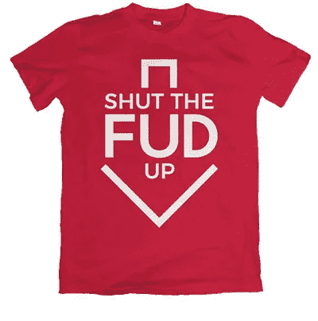
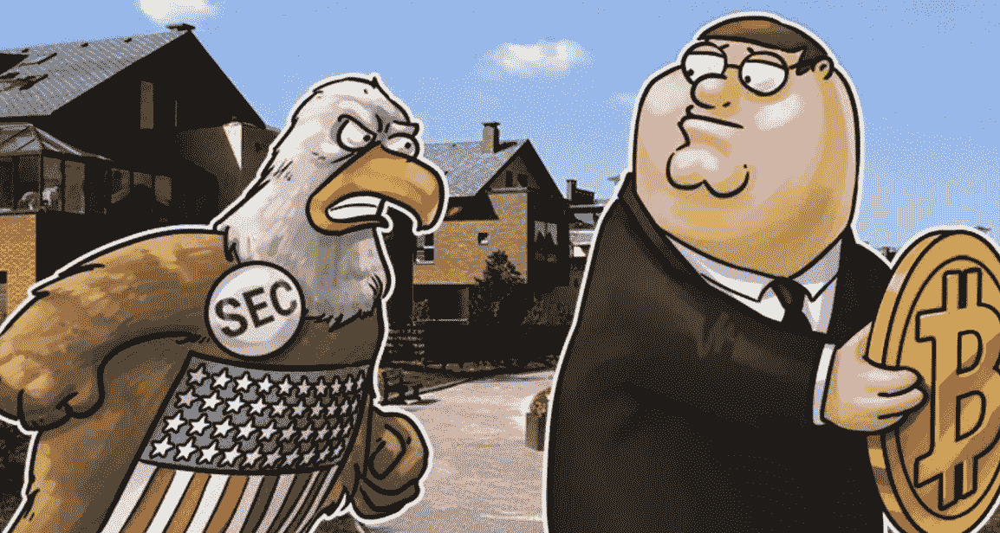
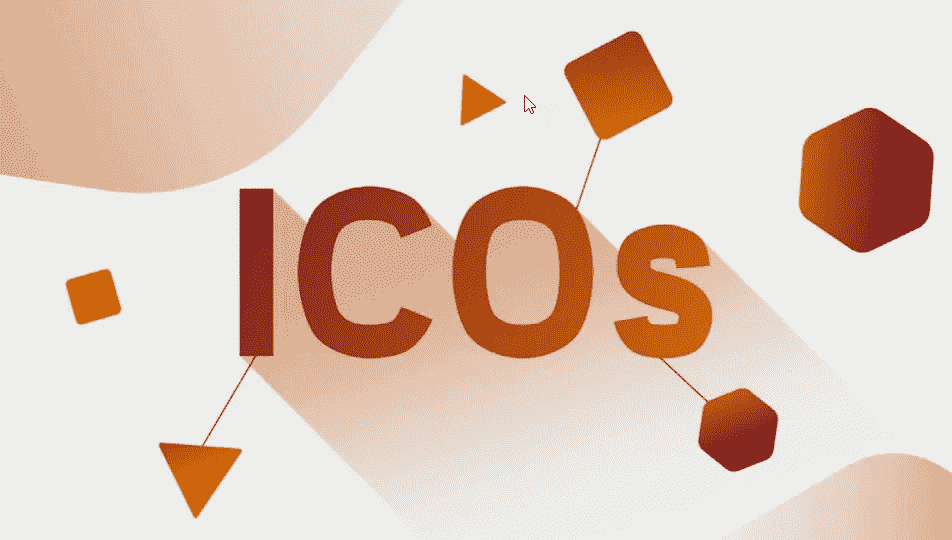

# ICO 投资的避风港？

> 原文：<https://medium.datadriveninvestor.com/a-safe-haven-for-ico-investments-1c930662d571?source=collection_archive---------2----------------------->

自年初以来，加密货币市场出现了前所未有的不稳定。

FUD 的数量(不确定的恐惧和怀疑)是普遍的，并继续蔓延。毫无疑问，加密货币和区块链技术将继续存在，但与反对者的持续斗争就像钟摆来回摆动。

让我们不要忘记，这项技术仍处于起步阶段，在它以某种形式的稳定性牢固地确立自己之前，还没有站稳脚跟；所以，如果你很早就进入了，甚至是最近，你就是幸运者之一。

最近，许多因素产生了负面影响，包括(但不限于)价格操纵、鲸鱼垃圾场、Mt Gox、美国 ICO 限制、现有骗局和假新闻，加上银行和其他金融机构支持的宣传。

不仅已发行的硬币受到了影响，ico(首次发行硬币)也遭受了这些负面市场条件的影响。

ico 在市场上提供了最大的潜在回报，但在这些不确定的时期，由于许多投资者厌恶风险，他们发现很难蓬勃发展。

ico 是加密空间的生命线。我们需要新的项目和初创企业来构建区块链技术，并从长远来看改善我们的生活方式。

为了应对这种低迷并吸引新的投资者，许多 ico 提供大量奖金计划、空投、奖金和折扣。虽然这些促销带来了更多的投资，但当货币触及交易所时，它们往往会产生不利影响。许多投资者不是长期持有硬币/代币，而是立即出售，这降低了代币的价格。例如，如果您在投资时获得了 50%的奖金，您可能会忍不住立即卖掉它们以获取利润，而对项目未来的成功没有任何兴趣。

就 ico 而言，需要做出一些改变，让它们蓬勃发展，重新受到主流投资者的欢迎，而不需要用慷慨的奖金和折扣来吸引它们，这最终会降低硬币的价值。ico 需要一种方法来提供保证和信心。

带着这些想法，我最近偶然发现了一个旨在实现这一目标的项目…

DESICO 将提供一个独特的、改变游戏规则的平台，改变我们投资和交易 ICO 的方式。作为一种透明且完全合法的发行和交易安全令牌的方式，这可能是所有与加密初创投资相关的事情的“首选”地点。

DESICO 总部设在立陶宛，受立陶宛法律和立陶宛银行条例管辖，后者由欧洲中央银行监管。DESICO 将提供完全依法发行、购买和出售安全令牌的能力。

任何希望通过 DESICO 平台发行安全令牌的初创企业/ICO 都需要亲自与他们会面，并验证他们的商业模式。

DESICO 社区将能够审查和评论所有列出的项目，并因此获得 DESI(DESIO token)奖励，DESICO 交易所将提供交易所有列出的 ICO 的机会。投资者使用以太坊或 DESI 代币购买 ICO 安全代币。

DESI 令牌提供了比使用以太坊更多的好处，如投资者权利和折扣。

对于 ico 和投资者来说，这无疑是个好消息。也许现在我们对投资区块链和加密初创企业有了新的信心。

请访问 DESICO [网站](https://www.desico.io)或 [Telegram](https://t.me/desicochat) 集团了解更多信息。

我还建议你看看这个简短的 YouTube [视频](https://youtu.be/oCjB2K2JLM8)，以便更好地理解。

