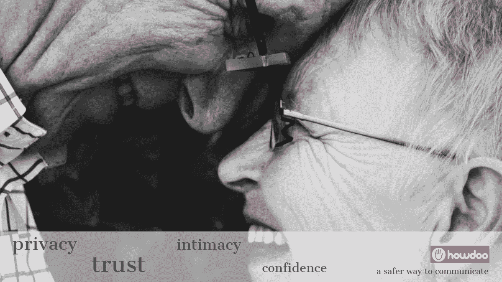

# 互联网上更安全的地方

> 原文：<https://medium.datadriveninvestor.com/a-safer-place-on-the-internet-4054e7a2a4f4?source=collection_archive---------9----------------------->

一场革命即将来临…

想象一个你的秘密安全的地方…

在这里，你不再担心“倒卖”或泄露你的个人数据，这些数据被注入一个数据库，目的是刺探、破坏和干扰你的生活…

您的喜好和兴趣、您现在的位置、您去过的地方以及您做过的事情都将完全在您的控制之下，并且您可以决定谁可以看到这些信息并与之互动…

不再有编码算法和机器人等着通过有针对性的营销策略和假新闻来突袭和利用你的信任...

在这里，您可以决定分享什么，与谁分享什么…

您可以选择向您提供什么样的营销，同时从您愿意看到的内容中获利，同时可以选择屏蔽所有广告…

在这里，您可以创建频道并分享您自己的内容，如音乐、图片和任何感兴趣的内容…

机会在向你招手，让你有机会通过分享内容来赚钱…

过多的“当面”广告将会消失。在这个地方，只有与您的兴趣相关的内容才会提供给您，专注于您希望看到和沉浸其中的内容，使用一个简单、易于使用且建立在信任和诚信基础上的相关生态系统…

等待即将结束…

很快这个地方就会存在…

它被称为 [Howdoo](https://howdoo.io) ，是一个全新的社交媒体平台，建立在区块链之上，去中心化以确保数据 100%的完整性。

通过从 EOS 区块链分支，Howdoo 将提供终极性能，同时拥有对其平台的完全控制和治理。允许他们的合作伙伴的分散应用程序(dApps)参与他们的区块链，并为我们用户提供额外的有价值的服务。

这真的会颠覆社交媒体领域。

要参与进来并近距离观察，请访问 Howdoo ICO [网站](https://howdoo.io)或他们的[电报组](https://t.me/howdooHQ)。