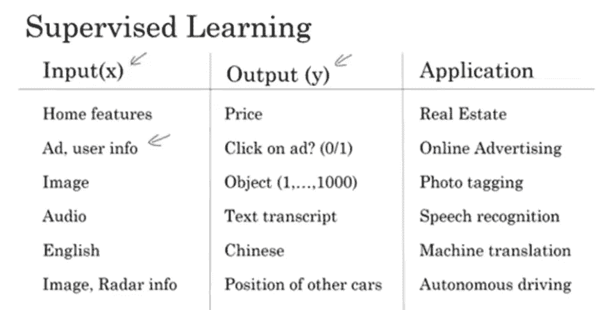
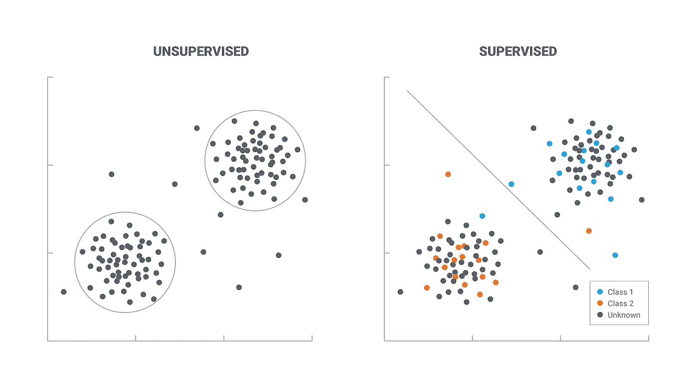
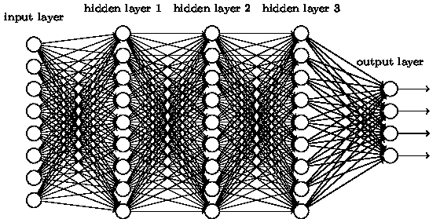
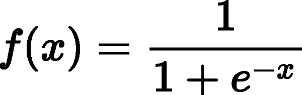
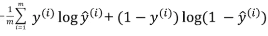
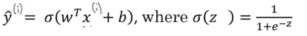
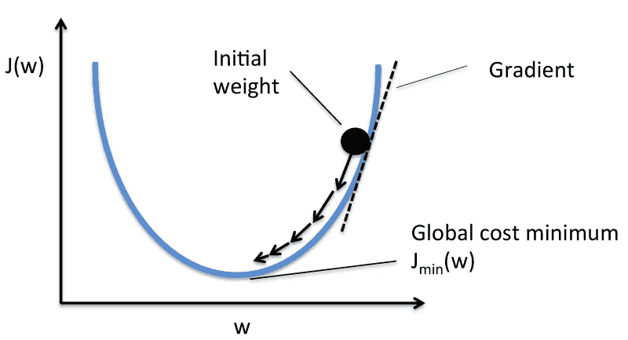

# 深度学习初学者的便捷指南

> 原文：<https://medium.datadriveninvestor.com/a-short-handy-guide-for-deep-learning-beginners-febde48b8539?source=collection_archive---------9----------------------->

AI Generated Fake Images using ProGANs

深度学习是 2018 年的热门话题。但这不仅仅是一次性的，而且有可能在 2019 年让我们大吃一惊。这篇文章的目的不是让你成为深度学习大师，而是让你快速了解深度学习中最基本的概念、公式和方法。我们开始吧！

# 什么是深度学习？

**深度学习**也被称为结构化分层学习，是更广泛的机器学习领域的一个子集。简而言之，深度学习基于一套算法，该算法用于找出输入数据中的模式/重复。在一个简单的例子中，它将有一个输入层、一个隐藏层和一个输出层。这被称为浅层网络，因为它只有一个隐藏层。隐藏层是所有计算发生的地方。通过引入更多数量的隐藏层，进一步增加了复杂性。这是一个深度神经网络(DNN)。

# 有监督的 v/s 无监督学习

## 监督学习

> 在[监督学习](https://en.wikipedia.org/wiki/Supervised_learning)中，模型根据有标签的数据进行训练。

如果模型预测了某个值，而标签显示了不同的内容，那么模型会自我调整以复制输出。监督学习是一个迭代过程，直到模型不再出错。

## 示例:

1.  最常见的应用之一是预测/预报。在其中一个[卡格尔挑战赛](https://www.kaggle.com/c/favorita-grocery-sales-forecasting)中，我们必须使用各种因素来预测对食品杂货的需求:今天天气如何？今天是假日吗？最近的竞争对手有多近？这是一个基本的监督学习问题。其他问题包括但不限于天气预报、房价预测、分类问题、各种自然语言处理(NLP)问题等。

Applications of Supervised Learning by Andrew Ng

# 无监督学习

> [无监督学习](https://en.wikipedia.org/wiki/Unsupervised_learning)是指没有标记数据，也没有确定的结构。

当您使用无监督学习训练模型时，您可以让模型自己进行逻辑分类或查找模式，而无需任何标记数据。无监督学习严重依赖于数据聚类，而不是根据给定的标签进行调整。

## 示例:

1.  **聚类:**聚类问题是指您希望发现数据中的内在分组，例如根据购买行为、市场细分等对客户进行分组。
2.  **关联:-** 关联规则学习问题是你想要发现描述大部分数据的规则，比如购买 X 的人也倾向于购买 y。

This sums about the general difference between Supervised and Unsupervised Learning | [source](https://chatbotsmagazine.com/lets-know-supervised-and-unsupervised-in-an-easy-way-9168363e06ab)

# 深度学习模型是如何工作的？

我们将看到一个“深度”模型的功能，它可以预测某一天杂货店的需求。这是一个典型的深度学习预测问题。

As an example, we will be predicting grocery sales

神经元属于三层之一:

1.  **输入层**
2.  **隐藏层**
3.  **输出层**

**输入层**由所有输入模型的数据组成。这些可以包括(对于这种情况):一周中的哪一天，到最近的竞争对手的距离，是否是法定假日，是否下雨，未来几天是否有任何重大事件发生，是否是周末等。所有上述因素都会影响我们杂货店的客流量。

**隐藏层**是模型的心脏和灵魂，所有的计算都发生在这里。一个模型可以有许多隐藏层。我们将在下一个主题中详细讨论。

**输出层**给出隐藏层的输出。它可以是 1 或 0(用于分类问题)、单词预测或数字。对于杂货示例，输出将是特定一天(或一周)的单位销售额。

# 隐藏层

A model with 3 hidden layers | [source](http://neuralnetworksanddeeplearning.com/chap6.html)

那么深度学习模型是如何预测杂货销售的呢？

隐藏层是一切发生的地方。

网络中的所有神经元都有与之相关的权重。权重决定了每个输入值的重要性。在我们的示例中，输入“是否有活动促销”在决定“停车设施”或“商店规模”的商店销售中起着**更重要的作用**，因此前者具有更高的权重。初始权重随机设置。大多在 0 到 1 之间。

## 激活功能

网络中的每个神经元都有一个激活函数。激活函数决定一个神经元是否必须被激活。激活函数将**非线性**引入输出(下一个)神经元。

> [关于激活函数、非线性为何重要及其数学证明的进一步阅读。](https://www.geeksforgeeks.org/activation-functions-neural-networks/)

## 激活功能的类型

在这篇文章中，我们只关注两个激活函数，即 Sigmoid 和 ReLU。还有其他激活函数，如双曲正切(Tanh)，Softmax 等。

**乙状结肠**

Plotting of a sigmoid function

上面是一个 sigmoid 函数的图。它的值范围从-1 到 1。现在让我们看看这是一个数学公式。

[credits](http://www.simages.org/logistic-function-formula/)

在上面的例子中，我们的函数' **e** 指的是[欧拉数](https://en.wikipedia.org/wiki/E_(mathematical_constant))。该功能的输入函数为“ **x** ”。这是通过将我们的输入(标记的数据)乘以它们各自的权重获得的。有时候还会加一个 [**偏置**](https://medium.com/deeper-learning/glossary-of-deep-learning-bias-cf49d9c895e2) 。所以 x 的方程式是 **WX+b** 。实际上，W 的转置是为了对齐的目的，但这已经足够了。

## 热卢

ReLU v/s Sigmoid

ReLU 函数最近越来越受欢迎，并且有了更多的用途。在上面的 ReLU 公式中，' **z** '与我们给 sigmoid (WX +b)的输入相同

在 ReLU 函数中，所有的负数都被丢弃，只有正数被保留。ReLU 找到了更多的支持者，因为它的计算成本更低，而且更具生物启发性。欲了解更多信息[请查看此处。](https://stats.stackexchange.com/questions/126238/what-are-the-advantages-of-relu-over-sigmoid-function-in-deep-neural-networks)

# 价值函数

正如我们所知，杂货店的例子是一个监督学习问题的例子，所以我们可以比较我们的输出与实际输出。我们如何检查我们的输出有多差？(从技术上讲，我们的预测与地面真相标签有多远)。这里我们使用一种叫做**成本函数的东西。**

成本函数是我们想要最小化的东西。越少越好。如果我们模型的所有输出都是正确的，那么损失/成本将为 0。

有几个成本函数，如[均方差](https://en.wikipedia.org/wiki/Mean_squared_error)，kull back-lei bler 散度等。深入了解[成本函数。](https://stats.stackexchange.com/questions/154879/a-list-of-cost-functions-used-in-neural-networks-alongside-applications)

一个比较常用的损失函数是二元交叉熵或伯努利负对数似然。

## 二元交叉熵

Binary Cross Entropy | source: deeplearning.ai

正如我们所讨论的，我们的目标是最小化损失函数。在上面的函数中，' **m** '指的是我们数据中训练样本的总数(所有数据都除以' m '以取平均值，这样模型可以更好地概括，' **i** '指的是特定的训练样本， **yhat** (顶部有一个小胡萝卜的 y)是我们之前计算的预测值(见下文)。

Calculation for yhat | source: [deeplearning.ai](https://www.coursera.org/learn/neural-networks-deep-learning/lecture/yWaRd/logistic-regression-cost-function)

我们谈到了我们的目标是如何降低成本函数，但我们如何做呢？

# 梯度下降

记得我们说过我们随机分配权重。嗯，开始的时候很好，但是除非我们调整权重，否则我们的模型不会变得更好。

因此，在随机分配我们的权重后，我们借助一种叫做[梯度下降](https://en.wikipedia.org/wiki/Gradient_descent)的技术来调整权重。

目标梯度下降是找到斜率/梯度的最小值。在这种情况下，它是我们的成本函数的梯度。

Image credit: [Sebastian Raschka](https://sebastianraschka.com/faq/docs/closed-form-vs-gd.html)

梯度下降的工作原理是在每次数据集迭代后**以小增量**改变权重**。通过计算特定权重下成本函数的导数(或梯度),我们能够看到最小值在哪个方向。想象一下，在哪个方向我们可以找到最小值(我们必须找到最小值，因为记住我们的目标是最小化我们的损失函数)。**

一旦它找到了最小值，权重就会通过一个稍微高级的过程更新，这个过程叫做[反向传播](https://en.wikipedia.org/wiki/Backpropagation)(数学警告！！).

在更新我们的权重时，有一个超参数决定我们的模型收敛(找到最小值)的快慢，称为**学习速率**。更新权重是**不可或缺的**部分，学会正确设置权重非常重要。这里有一篇[关于设定学习率的深度文章](https://towardsdatascience.com/understanding-learning-rates-and-how-it-improves-performance-in-deep-learning-d0d4059c1c10)。

# 更多资源:

唷！最后，我们有了所需的权重和偏差集，可以使用我们的模型来查找杂货销售。在这篇文章中，我们学到了很多，但这只是表面。还有其他几种高级方法可以使我们的模型更好更快，包括[各种超参数](https://towardsdatascience.com/what-are-hyperparameters-and-how-to-tune-the-hyperparameters-in-a-deep-neural-network-d0604917584a)、 [SGD](https://en.wikipedia.org/wiki/Stochastic_gradient_descent) 、[数据扩充](https://medium.com/nanonets/how-to-use-deep-learning-when-you-have-limited-data-part-2-data-augmentation-c26971dc8ced)。

[deep learning . ai Specialization](https://www.coursera.org/specializations/deep-learning)(Coursera):吴恩达的一门很棒的课程，稍微偏向理论方面，但绝对值得你花时间。

[程序员实用深度学习](https://course.fast.ai/) (Fast.ai):杰瑞米·霍华德教授的一门很棒的课程，理论很少，实际意义很大。还有一个后续课程，教授更高级的东西。

想要实现为杂货预测创建一个模型，请查看 Kaggle 上的[这个](https://www.kaggle.com/c/favorita-grocery-sales-forecasting)竞赛以及相关的[内核](https://www.kaggle.com/c/favorita-grocery-sales-forecasting/kernels)。

# 我们学到了什么？

1.  什么是深度学习？
2.  有监督的 v/s 无监督学习。
3.  DNN 的不同层次。
4.  隐藏层
5.  什么是激活函数以及不同类型的激活函数？
6.  成本函数，特别是二元交叉熵。
7.  梯度下降+更多学习资源

> 这篇文章将进一步升级，以包含更广泛的主题。请跟我来，因为会有后续帖子深入讨论梯度下降、成本和激活函数以及反向传播等问题: