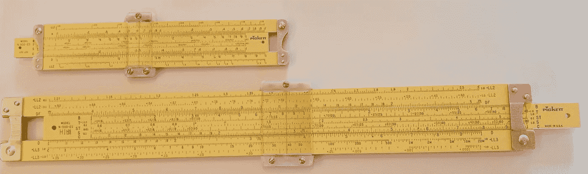
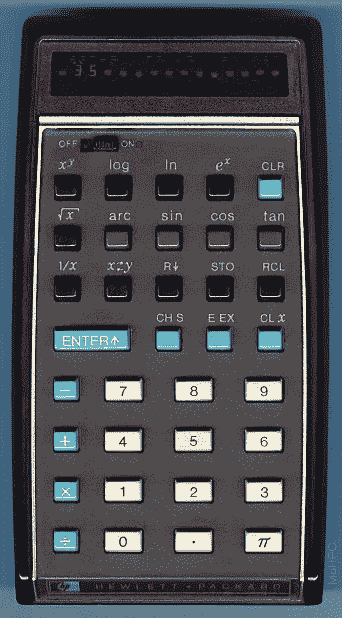

# 一项你可能不记得的重大技术创新

> 原文：<https://medium.datadriveninvestor.com/a-significant-technical-innovation-that-you-may-not-remember-f59f330bd610?source=collection_archive---------10----------------------->

我是第一代使用科学计算器而不是计算尺的工科学生。有一个学期我上了计算尺 101(也可能是计算尺入门)。后来在 1972 年，惠普公司推出了 HP 35 科学计算器，当我在大学书店看到一台时，我忍不住买了下来，尽管它要 350 美元，这在当时对我来说是一大笔钱。就在下一个学期，工程学院取消了所有的计算尺课程，包括我还没上的高级课程。计算尺到此结束。

The author’s slide rules in mint condition after nearly 50 years

计算尺主要用于乘法和除法，以及指数、根、对数和三角学，但不用于加法或减法，加法或减法通常是心算或写在纸上，而不是在计算尺上。计算尺的使用者必须自己决定小数点在结果中的位置。准确快速地使用计算尺需要高超的技巧。使用 HP 35 只需要按下正确按钮的技巧，它就能像变魔术一样准确地确定小数点的位置。

 [## 幸福的算法？—数据驱动的投资者

### 从一开始，我们就认为技术正在使我们的生活变得更好、更快、更容易和更实用。社交媒体…

www.datadriveninvestor.com](https://www.datadriveninvestor.com/2019/03/08/an-algorithm-for-happiness/) 

除了学习反向波兰符号(RPN)*，HP 35 是一个梦想成真，掌握 RPN 并不困难，相比使用计算尺。一旦我精通了 RPN，我就再也不想回到计算尺上，也不想使用其他最终没有使用 RPN 的科学计算器。惠普科学计算器上的逆向波兰符号实际上很容易学习，它允许解决一个复杂的公式，而不需要像计算尺那样存储或写下一个中间数字。

Bill Hewlett(惠普的 H)向惠普工程师挑战，让他们把惠普台式计算器缩小到可以放进他的衬衫口袋里。结果是惠普 35。在 HP 35 成功后不久，市场上出现了许多竞争者，特别是德州仪器和几家日本制造商。由于摩尔定律的经济学原理，价格在接下来的几年里迅速下降。今天，不到 10 美元就可以买到科学计算器。

HP 35 — From the [*The Museum of HP Calculators*](https://www.hpmuseum.org/hp35.htm)

我学会了计算尺的基础，但没有学会高级功能，现在我不记得任何关于如何使用计算尺的事情，这对我来说很好。我仍然保留着我在 1970 年左右买的计算尺，它们看起来像新的——像新的恐龙。

由于技术创新，计算尺是我们过去留在垃圾堆里的遗物，就像汽车流行时的马鞭一样，只是计算尺在 HP 35 推出后立即过时了。制作计算尺的公司受到了不利影响，因为他们的专长是制作带有精确标记的塑料尺子，用于模拟计算，而这种计算已不再需要。他们对数字电子技术一无所知，也不可能发明电子计算器。

科学计算器不仅让我作为一名工科学生的生活变得更加轻松，也让在职工程师和科学家的生活变得更加轻松，让他们能够将更多的时间花在他们正在处理的重要技术问题上，而不是花在使用繁琐的计算尺进行计算的细节上。当我发现我的 HP 35 被偷的时候，那是一个悲伤的日子。我马上把它换成了我现在还留着的 HP 21。

科学计算器的创新在多大程度上让其他技术发展更快、更便宜？我们可能永远不会知道，但我认为这很重要。

**脚注**

*下面描述了来自[惠普计算器博物馆](https://www.hpmuseum.org/rpn.htm)的反向波兰符号的基础知识。

> 在 20 世纪 20 年代，Jan Lukasiewicz 开发了一个形式逻辑系统，它允许通过在操作数之前(前缀表示法)或之后(后缀表示法)放置运算符来指定没有括号的数学表达式。例如,(中缀符号)表达式
> 
> (4 + 5) × 6
> 
> 可以用前缀符号表示为
> 
> × 6 + 4 5 或× + 4 5 6
> 
> 并且可以用后缀符号表示为
> 
> 4 5 + 6 ×或 6 4 5 + ×
> 
> 前缀符号也被称为波兰符号，以纪念 Lukasiewicz。惠普调整了计算器键盘的后缀符号，添加了一个堆栈来保存操作数，并添加了一些函数来对堆栈进行重新排序。惠普称这个结果为反向波兰符号(RPN ),也是为了纪念 Lukasiewicz。

在上面的例子中，想象一下如果整数是更复杂的数字，小数点右边有几个数字，或者是其他函数的对数平方根。你可以想象写下或记住中间的结果会更复杂。对于 RPN，这是不必要的。