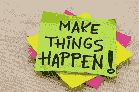

# 从激励到坚持不懈的行动的简单三步过程。

> 原文：<https://medium.datadriveninvestor.com/a-simple-3-step-process-from-motivation-to-relentless-action-be3e9e3e3d7e?source=collection_archive---------13----------------------->

Image by [Matthew Brodeur](https://unsplash.com/@mrbrodeur?utm_source=medium&utm_medium=referral) on [Unsplash](https://unsplash.com?utm_source=medium&utm_medium=referral)

> “那些最大限度地利用事情的人会得到最好的结果”
> 
> ~约翰·伍登

大多数人都知道食用姜黄的好处——它能减轻疼痛、炎症，治愈许多其他疾病。

但是你知道吗，仅仅食用姜黄对健康的益处是有限的，比如说只有 5-10%。然而，如果你在其中加入一点点**黑胡椒**，那么它会显著增强健康效果，并使其 100%受益。

同样**只阅读励志故事就像吃姜黄**，你会在一段时间内充满活力。但是**无论你读到什么，它的实际实现就像给它加了一点黑胡椒**，这就是你开始看到奇迹发生的地方。

成功的咒语是:

> “动力是你开始的动力，习惯是你前进的动力”
> 
> ~吉米·罗恩

# **这里有一个从激励转变为坚持不懈的行动的 3 步流程……**

# ***第一步:探索并阅读励志材料***

你已经做得够多了。但那只是一个有意的开始，也只是朝着梦想的方向迈出的第一步。这一步在所有三个步骤中的权重不能超过 20%。但遗憾的是，大多数人都没有超越这一步——所以他们甚至没有走出自己的内心世界去把物质世界里的东西放出来。

# ***第二步:利用灵感入门。***

这是最重要的一步，如你所知，一枚**火箭在发射时消耗最多的能量和燃料，一旦它升空，它可以在太空中飞行数英里，而消耗的燃料只是发射时的一小部分**。只是在开始的时候，你被重力拉着，但是一旦你脱离了重力，你就会继续运动。

物理学中的惯性定律说，一旦一个物体处于运动状态，它就会保持运动状态，除非被其他物体阻止。

我给这一步 50%的权重，因为在你开始之前什么都不会动。大多数人仍然停留在阅读和无所事事的联盟中，因为采取行动需要走出你的舒适区。很少有人想走出舒适区。

> ***“千里之行，始于足下。”***
> 
> ***—老子***

# 第三步:将你的行动转化为习惯，以达到一致的表现。

很多人开始，但只有少数人完成。如果你已经迈出了第二步，那就太好了，所以你开始了。但是有一个问题是，带着一个良好的愿望(被情感所驱使)热情地开始，却缺乏一个长期的计划去执行和完成。

动机最初引发你的情绪，带着充满激情的情绪，你迈出了第一步。但是动机的问题是它不会永远持续下去——它很快就会消失。您可能已经听说过以下内容:

> ***“人们常说，动力不会持久。洗澡也不会——这就是为什么我们建议每天都洗。”***
> 
> ***—金克拉***

没有这第三步，你会不停地开始和停止，一次又一次地回去。这就是为什么这一步对你的持久成功至关重要。

# **那么这一步怎么做呢？**

你应该做两件事使你的行动成为一种习惯:

## **1。最初用意志力继续朝着你的目标采取行动。**

一旦某件事成为习惯，那么你只需要很少或者不需要意志力就能坚持下去。所以一开始你必须用意志力来养成习惯。

## **2。改变你的环境。**

你需要改变你的环境**以符合你目标的要求。**

> 如果你想减肥，你的冰箱容器需要清空垃圾食品，代之以新鲜的蔬菜和水果。
> 
> 如果你想学习一项新技能来建立你的职业生涯，你看电视的时间将会大大减少。很难看到网飞。例如，拔掉电视机的电线，把遥控器放在衣柜最上面的柜子里。但是要让你的主题更容易阅读——你的书应该放在最方便的地方，这样你就可以很容易地开始阅读。
> 
> 也许你需要改变你的朋友，与和你有相似目标的人交往。因为:

> “你是和你相处时间最长的五个人中的平均水平。”
> 
> ***~吉米·罗恩***

不幸的是，大多数人只是止步于第一步——他们问下一步该做什么。这个问题“接下来我该怎么办？”它本身意味着你需要做一些事情，这就是第二步和第三步的意义所在。

总结一下这个三步过程，我一直用它来改变我的生活。

1.  第一步:获得动力。
2.  **第二步:开始**
3.  **第三步:** [***采取一致行动***](http://geni.us/pKZt)

所以，1.2.3 让我们…

# 希望你喜欢这篇文章！

你能给我一两下掌声吗？另外，请与您的网络共享。他们也会喜欢这个的。

# 想要大幅提升性能吗？

# [下载免费报告——揭示 5 种心理训练工具，让你在未来 30 天内表现出最佳状态](http://sombathla.lpages.co/mentalshifts/)