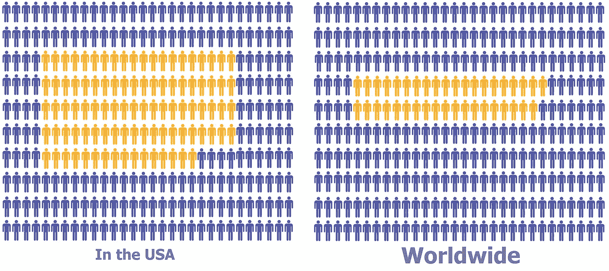
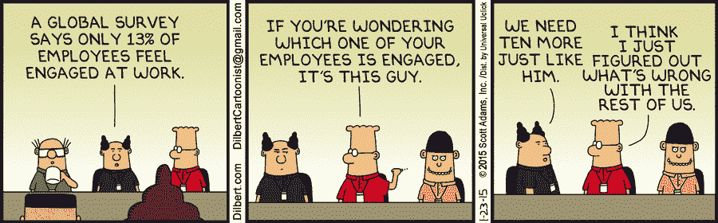
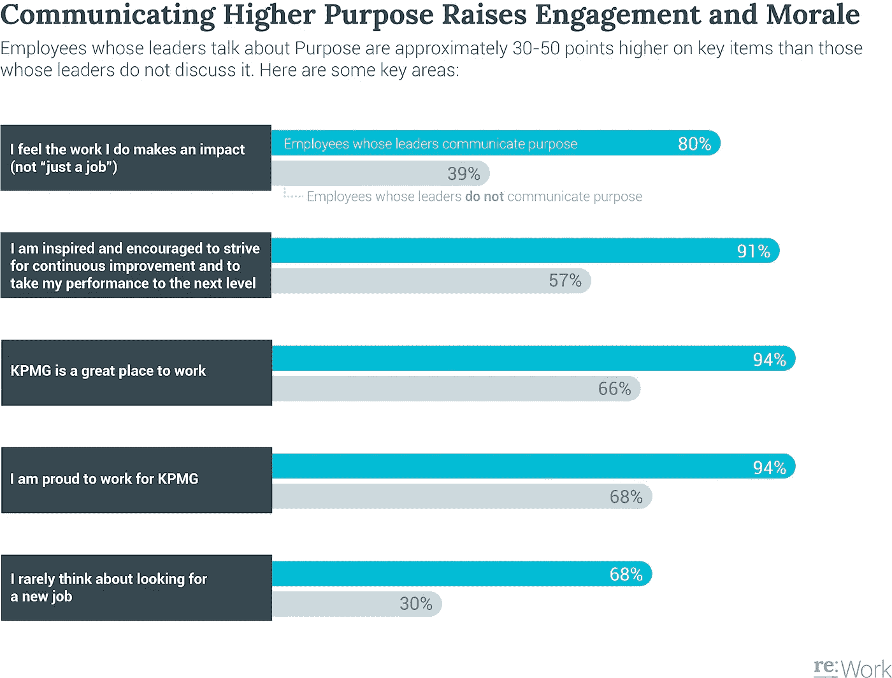

# 提高团队参与度和士气的简单而有效的方法

> 原文：<https://medium.datadriveninvestor.com/a-simple-but-powerful-way-of-increasing-teams-engagement-and-morale-82dd9a08fcae?source=collection_archive---------1----------------------->

> “这个世界正面临一场员工敬业度危机，对全球经济有着严重且潜在的持久影响。”[1]

这是来自盖洛普的 Annamarie Mann 和 Jim Harter 今年 1 月在一篇非常有趣但令人担忧的文章中所写的，文章揭示了尽管全球各地的公司和领导者都认识到拥有敬业的员工的优势，但在过去 15 年中，这方面的进展太少。

美国敬业员工的比例约为 32%；在全球范围内，这一数字降至 13%，向我们表明这是当今组织面临的一个巨大问题。这个信息很震撼吧？

Source: Created by the author.

这对公司来说意味着 235 名员工每天带着非常低的热情、动力和承诺来工作，以尽最大努力做好他们的工作。他们只是在那里，坐在他们的位置上，做他们的工作，等待回家的时间。对于任何企业来说，这肯定是一个巨大的问题，尤其是那些试图变得敏捷的企业。这个问题不能再忽视了。

Source: [http://dilbert.com/strip/2015-01-23](http://dilbert.com/strip/2015-01-23)

在过去的 13 年里，我看到并参与了许多围绕这一主题的讨论，特别是在情商、仆人领导力和丹尼尔·平克(Daniel Pink)关于动机的作品等主题普及之后。但这些讨论大多导致非常糟糕的结果。年复一年，新的研究被发表，文章被撰写，调查在公司内部被执行，但似乎没有什么是有效的。为什么？毕马威的研究指出，这些行动的重点可能是错误的[2]。

公司过于担心，无法衡量员工的参与度和幸福感，但也没有根据这些信息采取适当的行动。通常，当大多数公司注意到员工的敬业度和幸福感水平较低时，他们会做的是创建项目或工程来促进这些数字的增长。这些计划中的大部分都被创建了，但是很快就结束了，尤其是当经理们注意到数量上的小幅增长时。我确实认为这可能向他们表明了一种趋势，他们决定人们将继续快乐和参与，而无需他们方面的任何进一步行动或努力。根据毕马威的发现，这是根本错误的。

不关心营造敬业文化的公司可能无法克服员工敬业度低的问题。在我看来，这个问题不能通过使用“开始-停止”的方法来解决，比如程序和项目。虽然这些举措可以作为起点，但它们绝对不应该被视为这个问题的最终和唯一的解决方案。众所周知，公司文化对员工的行为有巨大的影响。

如果你的公司没有一种参与的文化，在这种文化中，这些话题每天都在被不断地探讨和执行，或者如果你的员工不能认识到这种文化是活的，尽管你已经把它写在了公司网站的某个地方，那么你很可能需要准备改变。

关于如何实现这种改变，有很多书籍和文章可供我们参考。但是我很确定你不需要购买或阅读任何一本来开始这个改变。你拥有完成这项工作所需的所有资源，你只需要找到以下问题的答案:

# 为了改变这种情况，你能做的最小、最简单的行动是什么？

对于这个问题，我有自己的答案，我会在本文中提供给你，但不要认为这是正确的解决方案。也许把这个话题带到你的领导团队中来讨论。自己找答案。请记住，每个环境都是不同的，现在几乎每个解决方案都必须从不再有“一刀切”的角度进行分析。一切都应该适应你的环境。也就是说，我确实相信这个答案的关键在于两个众所周知的词:领导力和沟通。

我相信公司内部的大多数问题，可能你也相信，都与沟通不畅有关，尤其是领导和员工之间的沟通。

毕马威的研究强调了领导风格对员工敬业度的影响。在下图中，蓝色条代表员工的参与度和士气，其领导不断传达目标；灰色条是那些领导不经常传达目的的员工。

Source: [https://rework.withgoogle.com/case-studies/KPMG-purpose/](https://rework.withgoogle.com/case-studies/KPMG-purpose/)

你看出区别了吗？

有时，我们试图找到员工不参与或没有积极性的原因，但我们往往用错误的视角来看待这个问题。通常，管理者和领导者会更深入地挖掘团队的世界，试图找到他们脱离的原因，认为问题在于团队。这种搜索经常导致没有结论性的发现，因此没有有效的行动来改变这种情况。大多数处于领导位置的人不容易意识到的是，在这种情况下，问题不在于团队，而在于领导者。处于领导地位的人在解决问题中起着至关重要的作用，只要养成更频繁地向下属传达目的的习惯，他们就可以轻松地彻底改变这种重复出现的低参与度和低士气的局面。

你喜欢这篇文章吗？订阅贝娄，分享给你的朋友。

参考资料:

[1]—[http://www . Gallup . com/business journal/188033/world wide-employee-engagement-crisis . aspx](http://www.gallup.com/businessjournal/188033/worldwide-employee-engagement-crisis.aspx)

[2]—[https://rework.withgoogle.com/case-studies/KPMG-purpose/](https://rework.withgoogle.com/case-studies/KPMG-purpose/)