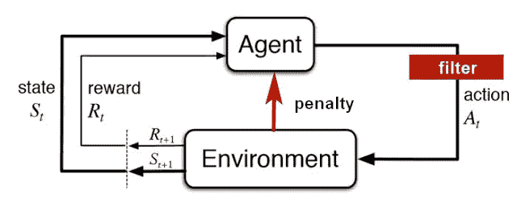
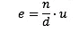

# 受限人工智能系统中伦理规则排序的简单方程

> 原文：<https://medium.datadriveninvestor.com/a-simple-equation-to-rank-ethical-rules-in-restricted-artificial-intelligent-systems-70079510b79?source=collection_archive---------10----------------------->

大家都知道人工智能的情商为零。就像对付一个反社会者。如果他的学术结论是人类是坏的，应该像蟑螂瘟疫一样被消灭，谁能说服他不这样做呢？

在其他场合，我对机器人道德化的可能性表示怀疑。我们假设人工智能和人类一样，但事实并非如此。人类伦理不能灌输给一台机器。目前在软件工程中正在做的是引入安全限制来避免与人类的冲突。但事实上，在真正的任务中，已经有军用无人机，不需要任何人为干预来确定目标并执行它们。

 [## 今年值得关注的人工智能趋势|数据驱动的投资者

### 预计 2019 年人工智能将取得广泛的重大进展。从谷歌搜索到处理复杂的工作，如…

www.datadriveninvestor.com](https://www.datadriveninvestor.com/2019/02/19/artificial-intelligence-trends-to-watch-this-year/) 

然而，在目前的背景下，我们将提出一个实用的解决方案，将伦理学应用于人工智能。事实上，人们对于消灭对我们的利益有害的虫子并没有太多的问题。同样，人工智能也没有伦理，因为它不需要。道德是人类用来保护自己免受伤害的产物。伦理是由自然(认知)智能共存的规则构成的。这就是我们对人工智能人性化灌输伦理的努力的解释。**算法伦理**已经是一个非正式建立的学科，在研究方面下了很大功夫。

例如，如果我们有一辆自动驾驶汽车，在面对可预见的影响做出决定之前，你应该咨询一个**伦理元算法**，以知道你必须做什么。当然，**每一个伦理算法都因构建它的人类群体而有所偏差，**因为有必要建立一个案例数据库并对它们进行优先排序，给它们分配一个权重:动物不如人，儿童优于老人(或者反之亦然？)，成年人比老年人老，男女不分明，胖子比瘦子少等等。所有这些对人类的区分和人类的优先次序永远不可能是客观的。当然，它们总是必须是透明的。**算法透明高于一切**。那是强制性的。

也许自动驾驶汽车应该从工厂出来，带有一个按国家分类的**道德工具包**，或者当人们根据司机的意识形态购买汽车时，他们可以通过目录来选择:自由主义者、民粹主义者、仇外者、素食主义者、反核者等等。**作为康德式的理想，普世伦理只能由国际财团来完成，这是一个永无止境的过程，但即使不是普世的，它也永远是公平的，没有偏见的**。事实上，我们知道自动驾驶汽车发生过事故，因为传感器无法识别非白色的肤色，因此有色人种不被视为人。好奇。种族主义汽车在西班牙，配有普通司机的自动驾驶汽车不应该被训练，因为在没有驾驶规则的情况下，对驾驶规则的尊重会发光，例如斑马线，被认为是街道上奇怪的白色斑点，没有任何用途。

作为普遍正义的唯一全球伦理是不公正，也就是逃避人类责任的随机暴政**。只有一个合乎道德的元算法可以被一个非道德的随机数发生器** (ARNG)代替，它随机地决定做出什么决定。一旦他必须决定是轧死一个老人还是轧死一个孩子——假设他能及时认出他们——他就掷骰子并执行结果。这里没有人的偏见，这是公正的不公平。没有人会对结果感到满意，但也没有人会抱怨，因为算法是不负责任的，或者更确切地说，是不负责任的。机会总是困扰人类生物的一个选项，尽管我们无法控制它，无论他们多么相信不是这样，所以我怀疑它有一天会被应用。然而，作为民主之父的古典希腊人是以抽奖的方式来选举他们的代表的。随机性不是人类的，是人为的，是神圣的。

我们回到我们的伦理元算法。对我们来说，这将是一个我们可以称之为**机器约束学习**(受限学习)的系统，在这个意义上说**机器强化学习**应该增加除了奖励之外还有威慑机制的能力。

如上图所示，这主要可以通过两种方式实现(红色部分):

*1)对可用的行为进行伦理过滤(这已经完成，但没有伦理标准)，甚至防止考虑对人类的某些负面行为；*

2)让代理人选择某些负面行为，然后给予他们与倒退状态相关的负面奖励来惩罚他们。

**优化标准**将使代理(机器或学习系统)必须考虑到，为了获得最大数量的奖励，你必须避免惩罚。*【大棒加胡萝卜】*政策与其说与伦理道德有关，不如说与道德有关，但它实现了保护人类免受机器虐待的目标。我们坚持认为道德不属于机器人，但我们可以做些事情来试图对他们进行道德教育。

有了这些限制性的中介，并不是所有的学习都是可能的，只有那些不违反道德工具箱**的 ***【偏向组】*** 或者具体来说，那些对**道德工具箱**有利的学习才是可能的。我们的伦理元算法是固定的，我们不能让系统学习伦理规范，否则，正如我们已经说过的，由于其自身的非情感偏见或缺乏与自然智能的同理心，它将停止尊重它们。**

我们提出一个简单的**伦理相关性**方程，通过定量估计建立一个**伦理规范**或规则的层级，从而比较确定伦理规则在上级和下级之间的重要性。这个等式必须用优先顺序表来完成:

**e** =规范的伦理相关性指数(至高无上)

标准(遵循好的行为，以坚持好的行为的概率-难度来衡量)

d =潜在的损害(损害——恶——以最坏情况发生的概率来衡量)

**u** =普遍性(最大正例，即泛化，以概率衡量)

概率用从 0 到 1 的数字表示，1 是最大值。每个变量都是如此。对于某些情况，我们可以使用官方统计数据，而不是估计。

例子:西班牙避免自杀的伦理意义

**n**= 0.8(2017 次尝试—1806 次成绩= 0.8 或 89%；INE 2006 年数据)
**d** = 1(最大伤害，死亡)
**= 0.000004(2006 年 1806 例/西班牙人口 44.71M = 0.00004%或 0.000004039364795)
**= 0.0000032****

****让我们澄清一下，伦理相关性与社会或医学无关。小的道德问题在其他领域可能是巨大的。****

****该等式在用作受限机器学习系统的伦理元算法的情况下，必须附有通用伦理优先顺序表，以给事件的每个主体分配值。例如，最小表:****

****1 —人
2 —动物****

******示例**:通过估计避免汽车碾过任何行人的道德相关性****

******n** = 1(最大难度，即无法避免)
d= 0.5(他很难死，因为他总是以正确的速度前进)
**u** = 0.3(不是常见事件)
**e** = 0.6****

******示例**:通过评估避免汽车碾过动物的道德相关性****

******n** = 1(最大难度，即无法避免)
**d** = 0.3(他很难死，因为他总是以正确的速度前进，但动物的价值不如人)
**u** = 0.1(是不如人类常见的事件)
**e** = 0.3****

****当然，还有事件的细节，无论是汽车还是令人震惊的主题，都可以修改相关性的结果。以每小时 50 公里的速度行驶和以每小时 100 公里的速度行驶是不一样的，但是假设这辆自动驾驶汽车已经控制了它，我们假设它总是以足够的速度行驶。例如，在斑马线上，你会减速，如果你认出了行人，你会在安全距离内刹车。我们假定突发事件是由超越认知系统的令人震惊的主体所创造的。****

****最后，这个等式应该能够创建一个等级，一个可能的用例的**表，这些用例在伦理上被解决并且被优先化**。例如，考虑到是轧死一个人还是轧死一只动物的两难选择(规范案例)无疑会选择动物，因为轧死一只动物的**伦理相关性指数**(0.3)是比轧死一个人(0.6)更低的价值规则。****

****人工智能是一个非常广泛的概念，在这个概念下包含了非常多样的技术，而伦理相关性的**等式**不能适用于这些技术。除了我们解释的之外，我们可以说这项技术正在以巨大的速度发展，我们怀疑在这样的未来系统中，特别是当智能系统将在没有任何人类干预的情况下由其他智能系统开发时，向它们强加一些东西甚至更多的伦理规范将是非常复杂的，好像这还不够，人类通常也不尊重它们。****

****也许在某个时候，当我们输掉关于人工智能的伦理辩论时，我们应该开始思考如何奴役机器人，或者也许最终投降并把接力棒传给他们，我们的人工儿女。生命的法则。****