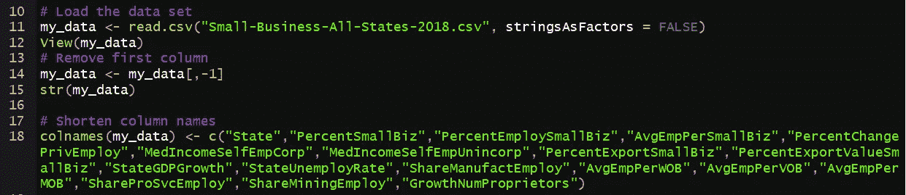
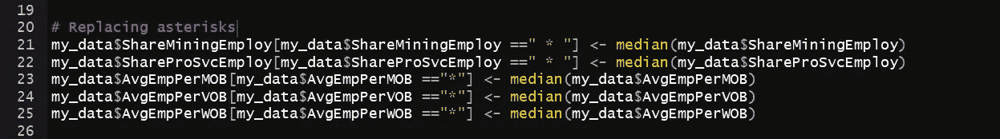
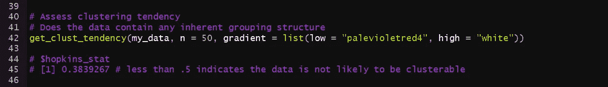
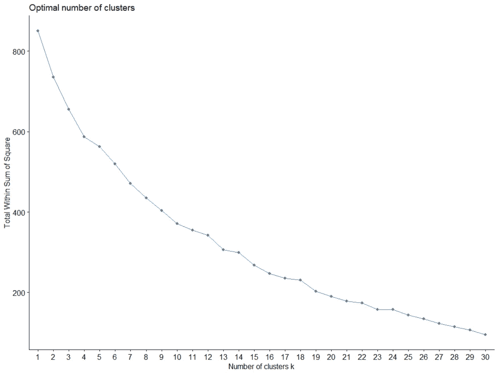
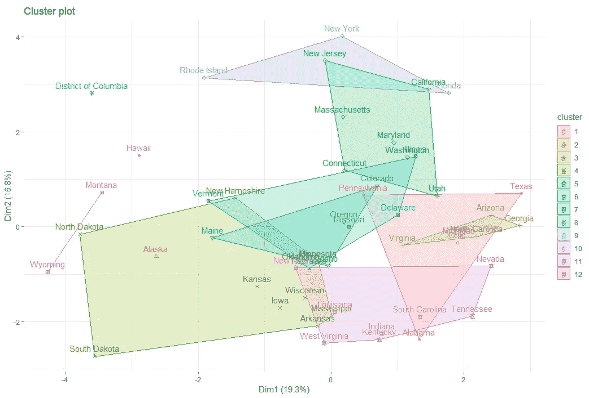
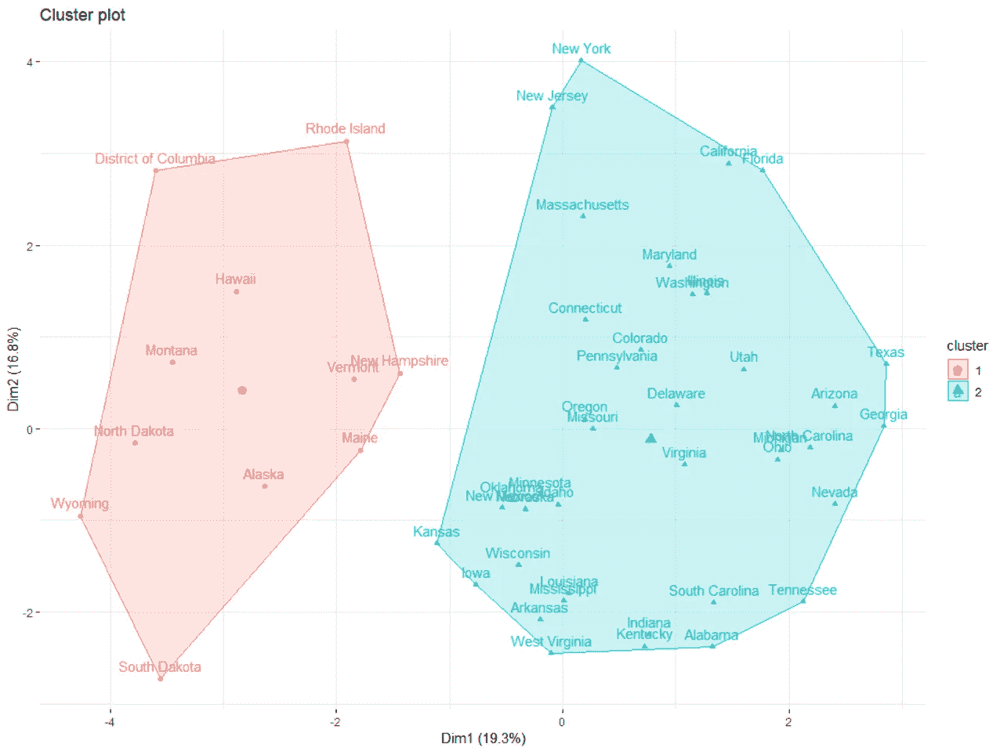
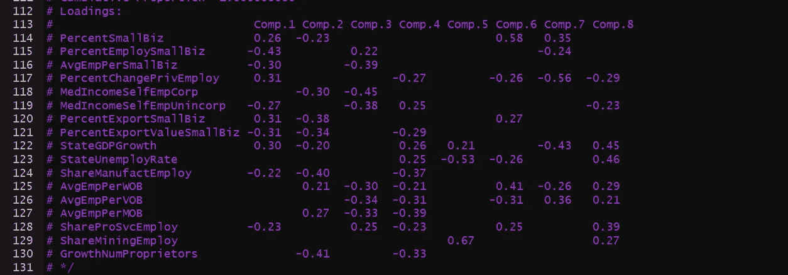

# 使用 factoextra R 软件包进行聚类分析的简单练习

> 原文：<https://medium.datadriveninvestor.com/a-simple-exercise-with-cluster-analysis-using-the-factoextra-r-package-7fde8433072f?source=collection_archive---------3----------------------->

Photo by [Allie Smith](https://unsplash.com/@creativegangsters?utm_source=medium&utm_medium=referral) on [Unsplash](https://unsplash.com?utm_source=medium&utm_medium=referral)

如果这个季节你没有在当地商店购物，这是你感到内疚的暗示。从最近的“一站式商店”购买你的一系列需求可能会稍微方便一些，但你所在地区的经济活力取决于小企业。我们甚至创造了“周六小生意”,来对抗“黑色星期五”的大宣传，把我们引向当地的夫妻店。

“小”公司占美国所有企业的 99%,占所有雇员的 48%。如果你从事新的零工经济，你也有可能成为其中一员。小企业是一件大事。

美国小企业管理局(SBA)每年都会发布一份各州小企业活动的年度快照。读一读这些简介，你会对当地社区的小企业有所了解。PDF 版本提供了比我在这里使用的数据集更多的细节，它们实际上是一个很好的读物。

我总是在寻找一些有趣的分析时间，所以我下载了州概况，这样我就可以制作一些与每个州的小企业状况相关的视觉效果。你可以[从小型企业管理局网站下载数据](https://www.sba.gov/sites/default/files/advocacy/Small-Business-Rankings-All-States-2018.xlsx)。我用这些数据在 r 中摆弄了一下 **factoextra** 包

我最近一直很兴奋；factoextra 包提供了许多计算和可视化集群的功能。我选择这个数据集是因为它的特性模仿了 r 中的 USArrests 数据集的特性。DataNovia.com 网站提供了几个使用 USArrests 的[集群教程](https://www.datanovia.com/en/blog/types-of-clustering-methods-overview-and-quick-start-r-code/)。

我的操场是 RStudio，但我在 Excel 中清理了这些数据，以便开始使用。我并不反对 GUI，对于这种规模的数据集，我只需在应用程序中点击几下，就可以快速进入分析阶段。数据集仅由数值组成，但包括我删除的每个州的等级列。我确实缩短了 r 中的列名。

R script loading data and changing names

几个功能包含星号，并解释说，他们不想暴露一个特定的商业结果。我决定用每一列的中间值替换星号值。我赚了几根白发，因为一些星号实际上是用空格填充的星号。

R script replacing asterisks

我通过指定行名来准备数据。此外，有几个特性是以字符数据类型出现的，所以我把它们转换成了数字。最后，我使用带有默认参数的 scale 函数对数据进行了标准化。AnalyticsVidya [建议在运行聚类分析之前移除异常值](https://www.analyticsvidhya.com/blog/2013/11/getting-clustering-right/)。我选择不这样做，因为我希望所有 50 个州都出现在可视化中。

R script converting data types

最初，我对数据运行了聚类趋势算法。聚类趋势是指数据集中存在任何真实聚类的可能性。聚类趋势很重要，因为无论如何，聚类算法都会找到聚类，即使是从完全随机的数据中。

聚类趋势让我们知道我们应该给最终的聚类多少权重。它实际上告诉我们是否应该费心去做分析。作为参考，我解释的统计数据是“可聚集性”的几个潜在度量[之一。](http://www.mayaackerman.info/pub/clusterability2017.pdf)

R script for clustering tendency

**get _ cluster _ trend**函数提供了一个 Hopkins 统计量，可用于评估聚类趋势。我的成绩是 0.38。0.50 或更高的分数表明数据是均匀分布的(没有真正的聚类)。接近零的分数意味着数据是高度“可聚集的”我的结果位于光谱的不太“可聚集”的一端，但是我继续进行，以便我可以使用包的参数工作。

我回顾了用于确定理想集群数量的三个选项。“ **wss** ”选项，也称为“肘”，从视觉效果本身来看并不清晰。理想的群集应该位于 y 轴值逐渐减少的点。在我的图表中似乎没有出现这种情况。我将默认的 **k.max** 参数改为 30，看看是否能得到更好看的手肘，但我没有。

基于我从不弯曲的肘部，我决定查看一些 9 到 15 之间的集群，尽管分组可能有些虚假(但它们非常漂亮)。

R script visualizing clusters of different sizes

九个讲述了一个更有趣的故事，而 15 个则创造了各州群体之间更多的预期联系。我的目光立刻投向了佛罗里达，因为我住在那里。在九个组中，我们发现佛罗里达和太平洋西部的几个州在同一组。随着 15，更多的州如预期的那样被隔离。

State profiles in 12 clusters

佛罗里达和犹他仍然有 12 个，这让我好奇他们有什么共同的经济条件。同样引人注目的是特拉华州与密苏里州和内布拉斯加州的组合。我含蓄地假设邻近的国家会有相似的经济条件，因此这些观察结果很突出。

其他两个聚类估计建议两个和一个(无聊)的聚类。考虑到更高的聚类趋势统计，我认为这是有意义的。我已经包含了两个集群的视觉效果。

乍一看，左下象限的州似乎有相似的气候。然而左上象限的成员并不适合。

我查看了两组图表中位置相反的州的原始数据，哥伦比亚特区和田纳西州。每个小企业的平均雇员人数(DC 为 3.3 人，田纳西州为 1.8 人)和小企业的出口价值百分比(DC 为 0.80 人，田纳西州为 0.16 人)存在显著差异。田纳西州也有更多的矿业退伍军人拥有的企业和矿业就业。

不幸的是，最有影响力的维度仅占数据变化的 36.1%。打印主成分分析的摘要显示，在主成分一中，为小企业工作的雇员的百分比最重要。

R script summarizing principle component analysis

几个并列第二的特征包括两个出口相关变量，这两个变量可能相关。我怀疑小企业雇佣员工的百分比和每个小企业的平均员工人数也是相关的(我知道；只是做一个相关性分析…这次不行。)

R script with principal component loadings

我喜欢用这个软件包制作视觉效果，但只设想了这个数据集在现实生活中的几个实际应用。假设这种分析可以确定小企业经历类似经济状况的州，则可以添加与联邦立法相关的特征，以确定特定政策和小企业结果之间是否存在任何关系。投资似乎是另一种应用。如果一个人从一个州的政府债券中获得了令人满意的回报，那么他就可以预期经济环境相似的州也会有类似的结果。