# 用 Python 创建预测模型的简单指南，第 1 部分

> 原文：<https://medium.datadriveninvestor.com/a-simple-guide-to-creating-predictive-models-in-python-part-1-8e3ddc3d7008?source=collection_archive---------0----------------------->


## “如果你折磨数据的时间够长，它会招供的”——罗纳德·科斯，经济学家

本指南是两部分系列的第一部分，一部分是数据的预处理和探索，另一部分是实际建模。这里使用的数据集来自 superdatascience.com。非常感谢他们在其网站上提供了令人惊叹的课程和内容，这激励了像我这样的人去追求数据科学的职业生涯。

在本文的整个过程中，不要过于关注代码，而是要大致了解预处理阶段发生了什么

另外，这是一篇很长的文章，所以不要忘了和你一起去喝点咖啡。

# 第 1 部分:预处理和探索:

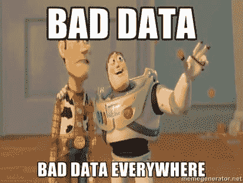

预处理是任何数据科学项目开始时都要做的一个关键部分(除非有人已经替你做了)。它包括处理空值、检测异常值、通过分析删除不相关的列，以及从总体上清理数据。

让我们看看如何在 python 中实现这一点；

首先，让我们进行必要的导入。以后需要时，我们会再做一些。

“%matplotlib inline”是 IPython 中的一个神奇功能，它将使您的绘图输出出现并存储在笔记本中。

```
import pandas as pd
import numpy as np
import matplotlib.pyplot as plt
%matplotlib inline
```

现在，让我们将数据作为 pandas DataFrame 加载到 python 中，并打印它的信息和几行数据，以便对数据有所了解

```
df = pd.read_csv("Churn_Modelling.csv")
df.info()
df.head()
```

输出:

```
<class 'pandas.core.frame.DataFrame'>
RangeIndex: 10000 entries, 0 to 9999
Data columns (total 14 columns):
RowNumber          10000 non-null int64
CustomerId         10000 non-null int64
Surname            10000 non-null object
CreditScore        10000 non-null int64
Geography          10000 non-null object
Gender             10000 non-null object
Age                10000 non-null int64
Tenure             10000 non-null int64
Balance            10000 non-null float64
NumOfProducts      10000 non-null int64
HasCrCard          10000 non-null int64
IsActiveMember     10000 non-null int64
EstimatedSalary    10000 non-null float64
Exited             10000 non-null int64
dtypes: float64(2), int64(9), object(3)
memory usage: 1.1+ MB
```


# 注意，这是一个相对干净的数据集。许多现实生活中的数据集包含大量缺失值、异常值和完全不相关的列。如果你想专门了解如何清理数据集，那么看看我的另一篇笔记本文章。

从上面的总结中我们可以看到，该数据有 10000 行和 14 列，其中最后一列“Exited”是我们必须运行预测的标签。

没有列有空值，但它肯定会有像-99999 这样的异常值。我们将研究一些技术来检查异常值。

但首先，让我们删除不相关的列，如“RowNumber”、“CustomerId”和“Surname ”,因为它们在建模或分析中没有使用过

```
*# removing the irrelevant columns*
cols_to_drop = ["RowNumber","CustomerId","Surname"]
df = df.drop(columns=cols_to_drop,axis=1)*# first five rows of dataframe after removing columns*
df.head()
```

输出:

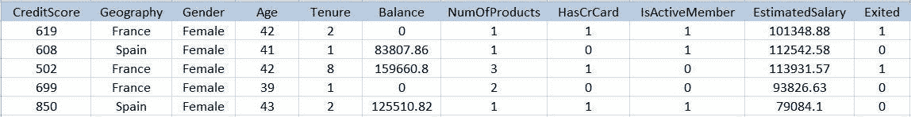

# 现在我们只有我们真正关心的数据(列)

让我们复制一份我们将在深度学习模型中使用的数据帧。其原因将在第 2 部分“建模”中的“人工神经网络”部分解释。

```
deep_df = df.copy(deep = True)
```

现在，制作一个不一定是连续的数字列的列表(' NumOfProducts '，' HasCrCard '，' IsActiveMember '是分类列)，以找到任何异常值。

```
numerical_columns = [col for col in df.columns if (df[col].dtype=='int64' or df[col].dtype=='float64') and col != 'Exited']
```

输出:

```
['CreditScore',
 'Age',
 'Tenure',
 'Balance',
 'NumOfProducts',
 'HasCrCard',
 'IsActiveMember',
 'EstimatedSalary']
```

检测异常值可以通过多种方式完成，其中一种方式包括绘制箱线图。但是我们将看看另一种方法，它包括检查一些关于像“min”、“max”、“mean”和“median”这样的列的一般统计数据。注意“最小”和“最大”值中的任何荒谬之处(如“最小”= -99999)，并检查“平均值”和“中值”是否足够接近(在大多数情况下，它们不应该太偏离)。

一些领域知识也会有所帮助，例如，年龄应该至少为 18 岁，因为我们正在与一家银行打交道，任何连续列中的值都不应为负。

```
df[numerical_columns].describe().loc[['min','max', 'mean','50%'],:]
```

输出:

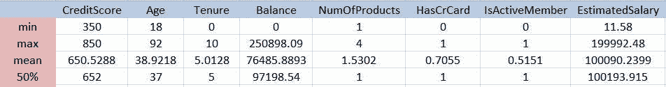

# 我们可以观察到“最小”估计销售额仅为 11.58，这非常可疑。可能只是一个没有任何工作的破大学生吧。

```
df[df['EstimatedSalary'] == df['EstimatedSalary'].min()]
```

输出:

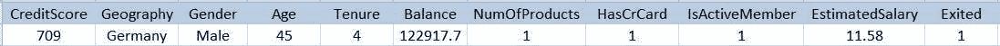

上面的小分析表明，这个人实际上是一个 45 岁的男性，已经有了一张信用分数很高的信用卡，余额差不多有 123 K。但是他的估计工资只有 11.58，这很奇怪。也许这只是数据收集中的一个错误，或者也许他只是丢了工作或者退休了。我们可以将其视为异常值，并从数据框中删除该行，但这是作为数据科学家/分析师必须做出的判断。

# 现在准备好面对一些繁重的分析和可视化工作吧

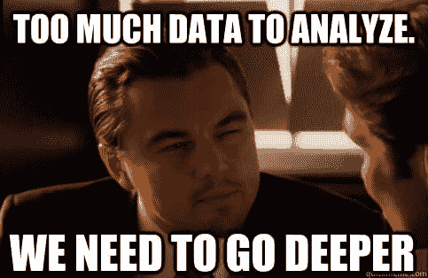

决定哪些列是相关的是特征工程的一个重要部分。它需要一些领域知识，通过这样做，它增加了任何机器学习算法的预测能力。特征工程本身就是一门艺术。

# 让我们决定“性别”一栏是否相关。

也就是说，性别(M|F)中的任何一个对标签(“Exited”)有更大的影响。例如，如果 70%的男性选择离开银行(“退出”= 1)，而女性只有 30%，那么我们可以得出结论，男性更有可能离开银行，“性别”一栏在决定流失率方面发挥着重要作用。然而，如果男性为 30%,女性为 33%,那么“性别”一栏就没有多大作用，因为流失率不会因性别而有所不同。

```
percentages = []for gen in list(df["Gender"].unique()):

    p = round((df["Exited"][df["Gender"]==gen].value_counts()[1]/df["Exited"][df["Gender"]==gen].value_counts().sum())*100 , 2)

    percentages.append(p)
    print(gen,"(% to exit) : ", p)
```

输出:

```
Female (% to exit) :  25.07
Male (% to exit) :  16.46
```

让我们想象一下

```
plt.bar(0, percentages[0])
plt.bar(1, percentages[1])plt.xticks((0,1), ('Female','Male'))
plt.xlabel("Gender")
plt.ylabel("Percentage")
plt.title("Percentage of gender to Exit")
plt.show()
```

输出:

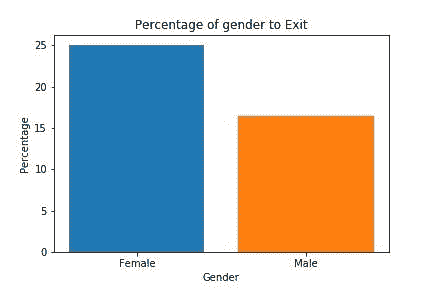

大约 25 %的女性和 16 %的男性选择退出。差别不是很大，但是让我们将该列包含在数据框中。同样，这是作为数据科学家/分析师必须做出的判断

# 现在，让我们通过进行与上面类似的分析来决定“地理位置”列是否相关

```
percentages = []for country in list(df["Geography"].unique()):

    p = round((df["Exited"][df["Geography"]==country].value*_counts()[1]/df["Exited"][df["Geography"]==country].value_*counts().sum())*100 , 2)

    percentages.append(p)
    print(country,"(% to exit) : ", p)
```

输出:

```
France (% to exit) :  16.15
Spain (% to exit) :  16.67
Germany (% to exit) :  32.44
```

可视化结果

```
for i in range(len(percentages)):
    plt.bar(i, percentages[i])plt.xticks((0,1,2), ('France', 'Spain', 'Germany'))
plt.xlabel("Country")
plt.ylabel("Percentage")
plt.title("Percentage of Country to Exit")
plt.show()
```

输出:

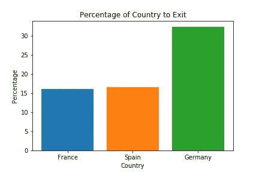

*可以清楚地看到，德国顾客的离职率是其他国家顾客的两倍。因此，我们应该在数据框中明确考虑这一列。*

# 现在让我们决定年龄栏是否相关。这一开始可能有点让人不知所措，但是如果你理解的话就很简单了。

让我们从绘制“年龄”列的直方图开始

```
plt.hist(df["Age"],bins=20)
plt.xlabel("Age")
plt.ylabel("Frequency")
```

输出:

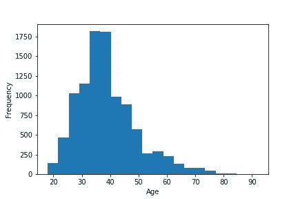

*可以看出，大部分顾客来自‘30 至 40 岁’年龄段*

# 下面的散点图显示了没有退出的客户的年龄(y 轴)(“退出”= 0)

```
plt.scatter(x=range(len(list(df["Age"][df["Exited"]==0]))),y=df["Age"][df["Exited"]==0],s=1)
plt.ylabel("Age")
plt.xlabel("People (rows)")
plt.title("People who did not Exit (Exited = 0)")
```

输出:

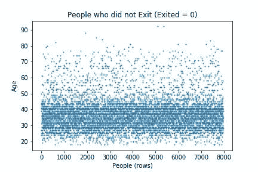

*我们可以看到，大多数没有退出银行的客户都在“20 至 45 岁”的年龄段*

# 下面的散点图显示了退出银行的客户的年龄(y 轴)(“退出”= 1)

```
plt.scatter(x=range(len(list(df["Age"][df["Exited"]==1]))),y=df["Age"][df["Exited"]==1],s=1)
plt.ylabel("Age")
plt.xlabel("People (rows)")
plt.title("People who Exited (Exited = 1)")
```

输出:

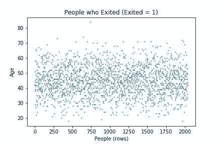

*我们可以看到，大多数离开的顾客都在‘30 到 60 岁’的年龄段*

# ！！！不要让上面的情节愚弄你！！！

因为我们无法确定“30 至 40 岁”年龄段的客户数量更多，因此对图(结果)有更大的影响。如果每个年龄组都有相同数量的人，那么我们可以相信上面的图表

# 下面的代码给出了每个年龄组中退出的人的“百分比”(“退出”= 1)

对年龄列分桶，并使用“分组依据”为每个年龄组创建组

```
age_bucket = df.groupby(pd.cut(df["Age"],bins=[10,20,30,40,50,60,70,80,90,100]))
```

计算退出人数的百分比，并将结果四舍五入到小数点后两位

```
age_bucket = round((age_bucket.sum()["Exited"] / age_bucket.size())*100 , 2)
```

输出:

```
age_bucket(10, 20]      5.62
(20, 30]      7.61
(30, 40]     12.09
(40, 50]     33.97
(50, 60]     56.21
(60, 70]     31.42
(70, 80]      8.26
(80, 90]     10.00
(90, 100]     0.00
```

让我们把上面的数据画出来，以便更好地理解

```
x = [str(i)+"-"+str(i+10) for i in range(10,91,10)]
plt.plot(x,age_bucket.values)
plt.xlabel("Age Group")
plt.ylabel("Percentage exited")
plt.title("Percentage of people in different Age Groups that exited")
```

输出:

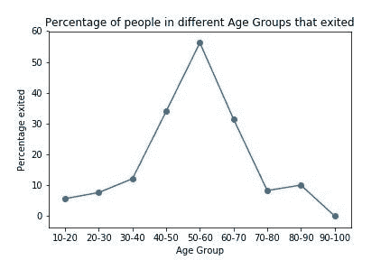

*从上面的图中可以清楚地看到,‘50 岁到 60 岁’这个年龄段的人退出银行的比例最高。我们以前可能会被误导，认为“30 到 60 岁”的人最兴奋(从情节来看)，大部分人在“40 到 50 岁”。*

通过上面的分析，可以清楚地看到年龄列肯定是相关的，但是以桶的形式。因此，让我们将连续年龄列转换为桶(分类)。分桶基本上意味着将值聚合/放入相应的范围。

例如，33 属于范围 30–40，67 属于范围 60–70，依此类推。范围由我们决定，例如，我们可以有 10–20、20–40、40–60 等范围..或者像 10-35 岁，35-60 岁，60-85 岁，…..

# 现在，让我们用分时段列替换“年龄”列

```
df["Age"] = pd.cut(df["Age"],bins=[10,20,30,40,50,60,70,80,90,100])df.head()
```

输出:

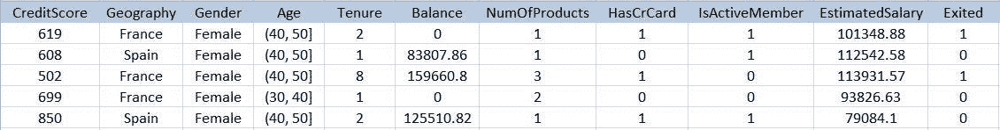

预处理的一个主要部分是对非数字和分类列进行编码，比如我们的例子中的“地理”、“性别”和“年龄”。你可能会问为什么是‘年龄’？“年龄”是一个数字列，但我们将其分类，并将其更改为分类列。这个过程被称为“虚拟编码”，其中一列中的每个唯一值单独获得一列。通过查看下表，你会明白这一点

```
df = pd.get_dummies(df)df.head()
```

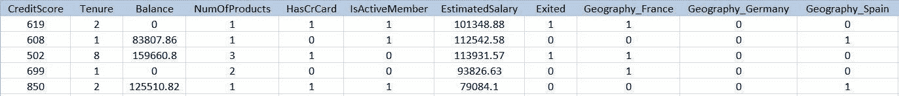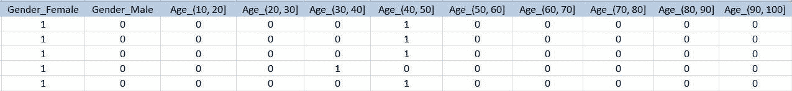

请注意，分类列“地理位置”、“性别”和“年龄”不再存在于表中。这些列中的唯一值有自己的列，如“地理 _ 法国”、“性别 _ 男性”、…..它们替换了相应的父列。这些列也称为虚拟变量。

在这些新列“0”和“1”中只有两个可能的值。让我们看看第一排的地理部分。我们可以看到'地理 _ 法国' = 1，'地理 _ 德国' = 0，'地理 _ 西班牙' = 0。这意味着前一个表中的第一行(在虚拟编码之前)在“地理位置”列的第一行中有“法国”。您可以通过向上滚动查看旧表来验证这一点。对于所有编码的列也是如此。

# 从创建的虚拟变量中各删除一列，以避免“虚拟变量陷阱”

# "但是什么是虚拟变量陷阱呢？"

在这篇文章中解释它的实际含义有点困难，但是为了简单起见，让我们从上表中取一个‘性别 _ 男性’和‘性别 _ 女性’的例子。我们知道，在一行中，两列中只有一列的值为“1”。也就是说，一个人不能既是男性又是女性。因此，任何给定行中两列的可能值是(1，0)或(0，1)。可以清楚地看到，一列是另一列的补充。也就是说，如果给我们“性别 _ 男性”的值，那么我们可以在任何给定的行中猜测“性别 _ 女性”的值，反之亦然。所以，第二列是多余的。因此，删除列是好的，我们必须这样做！！

‘地理 _ 法国’、‘地理 _ 德国’、‘地理 _ 西班牙’也是如此。任何给定行中三列的可能值为(1，0，0)或(0，1，0)或(0，0，1)。这里，如果我们删除任何一列，比如“Geography_Spain”，我们仍然不会丢失任何信息，因为我们可以根据前两列猜测第三列的值。比如说；如果“地理位置 _ 法国”和“地理位置 _ 德国”为(1，0)，则“地理位置 _ 西班牙”为“0”，因为在任何给定的行中，三者中只有一个具有值“1”。同样，如果'地理位置 _ 法国'，'地理位置 _ 德国'是(0，0)，那么'地理位置 _ 西班牙'应该是' 1 '。

因此，我们必须删除任何“一”编码列，以避免落入伪变量陷阱

# 现在，让我们从父列中删除(任何)一个编码列。在我们的例子中，我们从“Geography”中选择“Geography_France ”,从“Gender”中选择“Gender_Female ”,但是如果您愿意，您可以选择不同的列。

```
df = df.drop(columns=["Geography_France","Gender_Female"],axis=1)
```

# 不要忘记通过选择除最后一列之外的所有列来删除分桶的虚拟年龄列“Age_(90，100)”

```
df = df.iloc[:,:-1]
```

让我们看看修改后的数据框的前五行

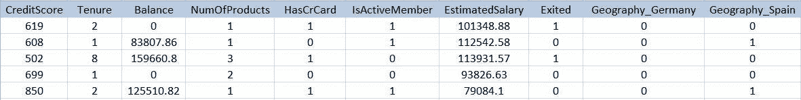

将数据框保存为. csv 文件，以便稍后用于建模

```
df.to_csv('Clean_data.csv')
```

# 我们已经成功地处理了数据，并为我们将在第 2 部分看到的建模做好了准备。