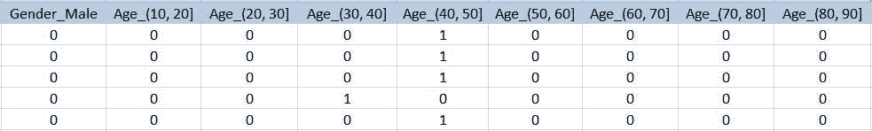
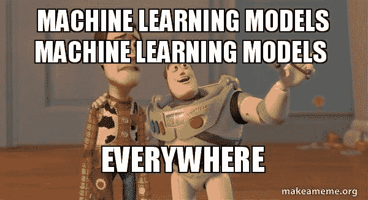

# 用 Python 创建预测模型的简单指南，第 2a 部分

> 原文：<https://medium.datadriveninvestor.com/a-simple-guide-to-creating-predictive-models-in-python-part-2a-aa86ece98f86?source=collection_archive---------1----------------------->


## “人们担心计算机会变得太聪明并接管世界，但真正的问题是它们太笨了，它们已经接管了世界。”―佩德罗·多明戈斯

本指南是两部分系列的第二部分的第一部分，一部分是数据的预处理和探索，另一部分是实际建模。第二部分的这一部分(第 2a 部分)处理“机器学习”模型，而另一部分(第 2b 部分)处理“深度学习”模型。这里使用的数据集来自[superdatascience.com](https://www.superdatascience.com/)。非常感谢他们在其网站上提供了令人惊叹的课程和内容，这激励了像我这样的人去追求数据科学的职业生涯。

在本文的整个过程中，不要过于关注代码，而是要大致了解建模阶段发生了什么

# 第 2a 部分:数据建模:(机器学习)


如果与数据清理之类的任务相比，从数据中创建预测模型相对容易，并且可能在数据之旅中花费最少的时间(和代码)。但它仍然是执行的重要任务之一，因为一个糟糕的学习算法会洗去你所有的辛勤工作。

在本文中，我们将以“易于理解”和“循序渐进”的方式来看看一些流行的机器学习算法，并比较它们的准确性。

首先，让我们进行必要的导入。以后需要时，我们会再做一些。

```
import pandas as pd
import numpy as np
import matplotlib.pyplot as plt
%matplotlib inline
```

在上一部分中，我们将清理后的数据帧保存为“Clean_data.csv ”,现在是加载坏小子的时候了。

让我们也打印信息和几行来记住我们的数据看起来像什么。

```
df = pd.read_csv('Clean_data.csv')
df.info()
df.head()
```

输出:

```
df = pd.read_csv("Clean_data.csv")
df.info()
df.head()
<class 'pandas.core.frame.DataFrame'>
RangeIndex: 10000 entries, 0 to 9999
Data columns (total 18 columns):
CreditScore          10000 non-null int64
Tenure               10000 non-null int64
Balance              10000 non-null float64
NumOfProducts        10000 non-null int64
HasCrCard            10000 non-null int64
IsActiveMember       10000 non-null int64
EstimatedSalary      10000 non-null float64
Exited               10000 non-null int64
Geography_Germany    10000 non-null uint8
Geography_Spain      10000 non-null uint8
Gender_Male          10000 non-null uint8
Age_(10, 20]         10000 non-null uint8
Age_(20, 30]         10000 non-null uint8
Age_(30, 40]         10000 non-null uint8
Age_(40, 50]         10000 non-null uint8
Age_(50, 60]         10000 non-null uint8
Age_(60, 70]         10000 non-null uint8
Age_(70, 80]         10000 non-null uint8
dtypes: float64(2), int64(6), uint8(10)
memory usage: 722.7 KB
```



将特征与标签分开

```
feat = df.drop(columns=['Exited'],axis=1)
label = df["Exited"]
```

创建任何机器学习模型的第一步是将数据分成“训练”、“测试”和“验证”集。验证集是可选的，但是如果您计划部署模型，它是非常重要的。

但是为什么验证很重要呢？让我们看看

“训练”集用于训练，“测试”集用于运行预测，利用这些预测来调整超参数并重新训练模型以获得更好的准确性。因此，您可以看到，有时如果您过度调整这些参数，模型可能会偏向于只在测试集而不是任何通用集上给出良好的预测。为了避免这种情况，使用了另一组被称为“验证”组。它模拟模型部署后用户发送的数据。如果模型的表现比测试时差，那么我们可以说这个模型被过度调整了，有偏差了。

标准方法是分别对训练集、测试集和验证集进行(60，20，20) %分割。

为此，我们将从 sklearn 导入“train_test_split”

```
from sklearn.model_selection import train_test_split
```

下面的代码会自动将数据分成四组。我们不会在本文中使用验证集，因为我希望您自己尝试一下。

```
X_train, X_test, y_train, y_test = train_test_split(feat, label, test_size=0.3)
```

参数“test_size”表示测试集的比率(在我们的例子中，30%用于测试，其余 70%用于训练)。

有时，数据可能有一些大的数字，如列“EstimatedSalary ”,对这样的大数字执行算术运算在计算上是很困难的。所以，我们必须缩小它们的尺寸。

这一步对于深度学习模型来说是非常必要的，但是对于 XGBoost 这样的模型来说是非常多余的。

为了缩放数据，我们将从 sklearn 导入“StandardScaler”

```
from sklearn.preprocessing import StandardScaler
```

我们首先必须创建一个“StandardScaler”类的对象，并对数据执行“fit_transform”操作。

```
sc_x = StandardScaler()
X_train = sc_x.fit_transform(X_train)
X_test = sc_x.fit_transform(X_test)
```

# 现在，我们终于到了机器学习的部分。

在这一部分，我将演示“支持向量机”、“随机森林”和“XGBoost”。

请注意，本文只解释了如何用 python 实现这些算法，因为它们背后的实际数学非常复杂。



# 首先，让我们看看“支持向量机”

进行必要的进口

```
from sklearn.svm import SVC
```

# 创建分类器对象、拟合训练数据和预测测试数据

```
support_vector_classifier = SVC(kernel='rbf')
support_vector_classifier.fit(X_train,y_train)
y_pred_svc = support_vector_classifier.predict(X_test)
```

在上面的代码中，第一行创建分类器类的对象，第二行拟合(定型)该模型的数据，第三行对测试数据进行预测。

非常有趣的是，机器学习模型的整个训练和测试实际上只有 3 行代码。但是我们还没有完成，因为我们仍然需要根据它的准确性来评估这个模型。但是我们将不得不首先使用“混淆矩阵”来获得精确度。

```
from sklearn.metrics import confusion_matrixcm_support_vector_classifier = confusion_matrix(y_test,y_pred_svc)print(cm_support_vector_classifier,end='\n\n')
```

“混淆矩阵”将真实标签和预测标签作为输入，并返回一个矩阵。

输出:

```
[[2344   64]
 [ 351  241]]
```

上面的输出是获得的混淆矩阵，其中第一行和第一列中的数字表示我们的模型正确预测的阳性标签的数量(也称为“真阳性”)，第二行和第二列表示我们的模型也正确预测的阴性标签的数量(也称为“真阴性”)。这两个数字的总和表示模型做出的正确预测的数量

现在，第一行和第二列中的数字被称为“假阴性”，因为标签(实际值)是正的，但我们的模型预测它是负的，第二行和第二列中的数字被称为“假阳性”，因为标签是负的，但我们的模型预测它是正的。这两个数字的总和表示模型做出的不正确预测的数量，


为了计算准确度，我们必须用预测总数除以正确预测数，然后乘以 100。

```
numerator = cm*_support_*vector*_classifier[0][0] + cm_*support*_vector_*classifier[1][1]denominator = sum(cm*_support_*vector*_classifier[0]) + sum(cm_*support*_vector_*classifier[1])acc_svc = (numerator/denominator) * 100print("Accuracy : ",round(acc_svc,2),"%")
```

输出:

```
Accuracy :  86.17 %
```

# 我们应该相信这种准确性吗？我会说不。

# 为什么？让我简单解释一下

train_test_split 函数以随机方式拆分数据，这意味着根据训练数据训练的模型可能会非常准确地预测测试数据，也可能预测得很差。

也就是说，我们得到的精度具有很高的方差，这基本上意味着，如果你再次运行从分裂到预测的整个过程，那么你将得到的精度可能与之前的完全不同(可能好，可能坏)。

为了解决这个问题，我们使用了一种称为“交叉验证”的技术，基本上，我们将数据分成几部分，除了一部分用于训练，其余部分用于测试。该过程重复几次(等于我们将数据分割成的部分的数量)，每次分配不同的部分用于测试。列出每次重复后的精度。完成此操作后，通过计算所列精度的平均值获得最终精度。

幸运的是，我们不需要做任何艰苦的工作，因为 sklearn 库在几行代码中就完成了所有这些工作。让我们看看怎么做。

首先从 sklearn 库中导入“cross_val_score”。

```
from sklearn.model_selection import cross_val_scorecross_val_svc = cross_val_score(estimator = SVC(kernel = 'rbf'), X = X_train, y = y_train, cv = 10, n_jobs = -1)print("Cross Validation Accuracy : ",round(cross_val_svc.mean() * 100 , 2),"%")
```

“cv”参数是要进行的分段数(重复的次数)，而“n_jobs”设置为-1，以使用 CPU 中的所有内核来加快计算速度。

输出:

```
Cross Validation Accuracy :  85.01 %
```

# 现在让我们进入“随机森林”

整个过程与上面的一样，只有不言自明的微小变化

```
from sklearn.ensemble import RandomForestClassifier
```

# 创建分类器对象、拟合训练数据和预测测试数据

```
random_forest_classifier = RandomForestClassifier()
random_forest_classifier.fit(X_train,y_train)
y_pred_rfc = random_forest_classifier.predict(X_test)
```

# 混淆矩阵

```
cm_random_forest_classifier = confusion_matrix(y_test,y_pred_rfc)
print(cm_random_forest_classifier,end="\n\n")
```

输出:

```
[[2319   89]
 [ 346  246]]
```

# 从混淆矩阵计算准确度

```
numerator = cm*_random_*forest*_classifier[0][0] + cm_*random*_forest_*classifier[1][1]denominator = sum(cm*_random_*forest*_classifier[0]) + sum(cm_*random*_forest_*classifier[1])acc_rfc = (numerator/denominator) * 100print("Accuracy : ",round(acc_rfc,2),"%")
```

输出:

```
Accuracy :  85.5 %
```

# 使用交叉验证函数获得更好的准确度估计

```
cross_val_rfc = cross_val_score(estimator=RandomForestClassifier(), X=X_train, y=y_train, cv=10, n_jobs=-1)print("Cross Validation Accuracy : ",round(cross_val_rfc.mean() * 100 , 2),"%")
```

输出:

```
Cross Validation Accuracy :  84.34 %
```

# 现在是卫冕冠军，卫冕冠军，无可争议的世界冠军 Brrooock Lesn…..

# 好的，这是“XGBoost”模型。

(写这篇文章的时候不该看那么多 WWE)

这是一个“最先进”的模型，绝对是所有其他模型中精确度最高的

```
from xgboost import XGBClassifier
```

# 创建分类器对象、拟合训练数据和预测测试数据

```
xgb_classifier = XGBClassifier()
xgb_classifier.fit(X_train,y_train)
y_pred_xgb = xgb_classifier.predict(X_test)
```

# 混淆矩阵

```
cm_xgb_classifier = confusion_matrix(y_test,y_pred_xgb)
print(cm_xgb_classifier,end='\n\n')
```

输出:

```
[[2341   67]
 [ 325  267]]
```

# 从混淆矩阵计算准确度

```
numerator = cm*_xgb_*classifier[0][0] + cm*_xgb_*classifier[1][1]denominator = sum(cm*_xgb_*classifier[0]) + sum(cm*_xgb_*classifier[1])acc_xgb = (numerator/denominator) * 100print("Accuracy : ",round(acc_xgb,2),"%")
```

输出:

```
Accuracy :  86.93 %
```

# 使用交叉验证函数获得更好的准确度估计

```
cross_val_xgb = cross_val_score(estimator=XGBClassifier(), X=X_train, y=y_train, cv=10, n_jobs=-1)print("Cross Validation Accuracy : ",round(cross_val_xgb.mean() * 100 , 2),"%")
```

输出:

```
Cross Validation Accuracy :  85.69 %
```

# 我们终于完成了这一部分，但注意到即使是“最先进的”模型也只给出了大约 86 %的准确率。

# 很奇怪，对吧？！

# 请参阅第 2b 部分，找出原因。