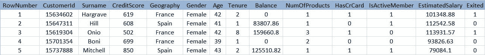
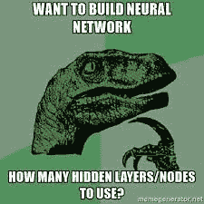

# 用 Python 创建预测模型的简单指南，第 2b 部分

> 原文：<https://medium.datadriveninvestor.com/a-simple-guide-to-creating-predictive-models-in-python-part-2b-7be3afb5c557?source=collection_archive---------1----------------------->

[](http://www.track.datadriveninvestor.com/1126B)

## “人工智能是新的电力”――Andrew NG

本指南是两部分系列的第二部分，也是第二部分第一部分的继续(现在让它深入一点)，一部分是数据的预处理和探索，另一部分是实际的建模。第二部分的这一部分(第 2b 部分)处理“深度学习”模型，而另一部分(第 2a 部分)处理“机器学习”模型。这里使用的数据集来自[superdatascience.com](https://www.superdatascience.com/)。非常感谢他们在其网站上提供了令人惊叹的课程和内容，这激励了像我这样的人去追求数据科学的职业生涯。

在本文的整个过程中，不要过于关注代码，而是要大致了解建模阶段发生了什么。

# 第 2b 部分:数据建模:(深度学习)

创建一个真正好的深度学习模型有时会非常具有挑战性，因为与机器学习不同，我们还没有非常高级的框架或库来完成这项任务。

在本文中，我们将了解如何使用“TensorFlow”进行建模，这是一个由谷歌开发的深度/机器学习框架。我选择 TensorFlow 的原因是，它是“为部署而生”的，支持多种平台，并且在过去一年中有了一些重大改进，您也应该选择 tensor flow。从事 TensorFlow 的开发人员正在不断添加新的高级 API，以便任何人都可以轻松创建深度学习模型。


不要再拖延了，让我们开始吧

```
import tensorflow as tf
```

还记得我们将未处理的数据帧复制为“deep_df”吗？原因如下。

使用未处理的数据帧的原因是 tensorflow.estimator API 将负责大部分预处理工作。我们甚至不必决定使用哪些特性(在第 1 部分中，我们做了大量工作来决定“年龄”、“性别”和“地理位置”的相关性)。

```
print(deep_df.info())
deep_df.head()
```

输出:

```
<class 'pandas.core.frame.DataFrame'>
RangeIndex: 10000 entries, 0 to 9999
Data columns (total 11 columns):
CreditScore        10000 non-null int64
Geography          10000 non-null object
Gender             10000 non-null object
Age                10000 non-null int64
Tenure             10000 non-null int64
Balance            10000 non-null float64
NumOfProducts      10000 non-null int64
HasCrCard          10000 non-null int64
IsActiveMember     10000 non-null int64
EstimatedSalary    10000 non-null float64
Exited             10000 non-null int64
dtypes: float64(2), int64(7), object(2)
memory usage: 859.5+ KB
```



```
*# separating the features and labels*deep_feat = deep_df.drop(columns=["Exited"],axis=1)
deep_label = deep_df["Exited"]
```

## 列出并分隔连续(数字)和分类列与数据框架列。

这可以通过手动复制和粘贴列名来完成，但是如果数据有 60 列呢？因此，下面的方法更容易和可扩展

```
*# first just take a look at all the columns*list(deep_feat.columns)
```

输出:

```
['CreditScore',
 'Geography',
 'Gender',
 'Age',
 'Tenure',
 'Balance',
 'NumOfProducts',
 'HasCrCard',
 'IsActiveMember',
 'EstimatedSalary']
```

## 制作一个列列表(不包括“Exited”)，其中唯一元素的数量为 2(即 0 或 1)，或者如果数据类型为用“O”表示的“object”，则将它们存储为 categorical _ columns

```
categorical_columns = [col for col in deep_feat.columns if len(deep_feat[col].unique())==2 or deep_feat[col].dtype=='O']
```

## 列出唯一元素的数量大于 2 且数据类型为“int64”或“float64”的列(不包括“Exited”)，并将它们存储为 continuous_columns

```
continuous_columns = [col for col in deep_feat.columns if len(deep_feat[col].unique())>2 and (deep_feat[col].dtype=='int64' or deep_feat[col].dtype=='float64')]
```

看看列表是什么样的

```
print("categorical columns : ", categorical_columns)
print("continuous columns : ", continuous_columns)
```

输出:

```
categorical columns :  ['Geography', 'Gender', 'HasCrCard', 'IsActiveMember']
continuous columns :  ['CreditScore', 'Age', 'Tenure', 'Balance', 'NumOfProducts', 'EstimatedSalary']
```

我们现在在 continuous_columns 中包含了“Age”列，但稍后将对它进行分桶(使用 tensorflow API)并将其更改为分类列。

还记得我们之前所做的努力吗？嗯，我们不必再做了，因为 tensorflow 会处理好一切

```
*# making a train test split*
X_T, X_t, y_T, y_t = train_test_split(deep_feat, deep_label, test_size=0.3)
```

# 现在让我们缩放数据

首先，创建一个要缩放的列列表，其中包含 continuous_columns 中除“Age”之外的所有列，因为我们希望将“Age”列转换为分桶列

```
cols_to_scale = continuous_columns[:]
cols_to_scale.remove("Age")
```

应用缩放

```
*# scaling the listed columns*
scaler = StandardScaler()
X_T.loc[:,cols_to_scale] = scaler.fit_transform(X_T.loc[:,cols_to_scale])
X_t.loc[:,cols_to_scale] = scaler.fit_transform(X_t.loc[:,cols_to_scale])
```

下面的代码一开始有点混乱，但是让我们把它分解一下


我们基本上是在 tensorflow 中创建对应于数据帧中每一列的特征列

## “TF . feature _ column . categorial _ column _ with _ hash _ bucket()”接受类似“Gender”的分类列，并应用一个热编码

## “Hash_bucket_size”是列中类别的最大数量(在“性别”的情况下，只有 2(男性，女性)，这肯定小于 1000)

## 然后将其传递给“TF . feature _ column . embedding _ column()”

“dimension”参数取列中类别的确切数目(在“Gender”中为 2)嵌入列仅用于密集神经网络(简单线性模型不需要这一步)

```
categorical_object_feat_cols = [tf.feature_column.embedding_column( tf.feature_column.categorical_column_with_hash_bucket(key=col,hash_bucket_size=1000), dimension = len(deep_df[col].unique()))

for col in categorical_columns if deep_df[col].dtype=='O']
```

## “TF . feature _ column . categorial _ column _ with _ identity()”用于整型(或浮点型)数据类型的分类列

```
categorical_integer_feat_cols = [tf.feature_column.embedding_column( tf.feature_column.categorical_column_with_identity(key=col,num_buckets=2),dimension = len(deep_df[col].unique()))

for col in categorical_columns if deep_df[col].dtype=='int64']
```

如果您尝试这样做，请在每行之后使用转义字符。或者，只需在一行中输入所有内容

## “TF . feature _ column . numeric _ column()”接受类似“Balance”的连续(数字)列

请注意，我们排除了“年龄”列，因为我们仍然需要将它存储起来

```
continuous_feat_cols = [tf.feature_column.numeric_column(key=col) for col in continuous_columns if col != "Age"]
```

## 我们现在获取年龄列，首先创建一个 tensorflow 数字列，然后将它传递到“TF . feature _ column . bucketized _ column()”中，用给定的边界对它进行分组

```
age_bucket = tf.feature_column.bucketized_column(tf.feature_column.numeric_column(key="Age"), boundaries=[20,30,40,50,60,70,80,90])
```

## 组合所有列表以创建特征列的新列表

```
feat_cols = categorical_object_feat_cols + \
            categorical_integer_feat_cols + \
            continuous_feat_cols + \
            [age_bucket]
*# '\' is just an escape character to support operations in multiple lines.*
```

## 创建函数|将数据集输入 tensorflow 的管道(一个用于训练，一个用于测试)

```
input_fun = tf.estimator.inputs.pandas_input_fn(X_T,y_T,batch_size=50,num_epochs=1000,shuffle=True)pred_input_fun = tf.estimator.inputs.pandas_input_fn(X_t,batch_size=50,shuffle=False)
```

现在让我们制作深度神经网络模型，其中“隐藏单元”是网络的大小|形状|架构(在我们的例子中是 3 层，每层包含 10 个神经元)



没有固定的规则来决定层数和节点数。不应该有太多的食物过量，也不应该有太少的食物不足。这完全取决于你的经验。

“n_classes”是对数据进行分类的不同标签的数量

```
DNN_model = tf.estimator.DNNClassifier(hidden_units=[10,10,10], feature_columns=feat_cols, n_classes=2)
```

## 培训 dNN 模型(需要一些时间)

```
DNN_model.train(input_fn=input_fun, steps=5000)
```

从训练的模型中提取测试集的预测

## “预测”是一个张量流对象

```
predictions = DNN_model.predict(pred_input_fun)
```

我们得到了张量流物体的预测。现在让我们将它转换成一个字典列表，并查看第一个预测来评估输出的格式

```
res_pred = list(predictions)
res_pred[0]
```

输出:

```
{'logits': array([-2.9706442], dtype=float32),
 'logistic': array([0.04876983], dtype=float32),
 'probabilities': array([0.95123017, 0.04876983], dtype=float32),
 'class_ids': array([0], dtype=int64),
 'classes': array([b'0'], dtype=object)}
```

## 仅从字典列表中提取“class _ ids ”,因为这是决定它属于哪个类的最终结论

```
y_pred = []
for i in range(len(res_pred)):
    y_pred.append(res_pred[i]["class_ids"][0])
```

使用 sklearn 的“分类报告”作为评估指标

```
from sklearn.metrics import classification_reportrep = classification_report(y_t,y_pred)
```

## “平均值/总数”给出了“精确度”、“召回率”、“f1-得分”和“支持度”的最终读数

```
print(rep)
```

输出:

```
precision    recall  f1-score   support 0       0.87      0.96      0.91      2383
          1       0.74      0.46      0.57       617avg / total       0.84      0.85      0.84      3000
```

起初令人困惑的是，即使是 XBGoost 和深度神经网络这样的“最先进”模型也只能提供大约 85-86%的准确度(精确度)。

从上述结果中可以清楚地看出其原因

这是因为与对“Exited = 0”的支持相比，对“Exited = 1”的支持非常小

## 支持是指标签中某个值(类别)对应的行数

这意味着我们的模型(任何模型)可以非常准确地预测“Exited = 0 ”,因为支持度很大，但是当预测“Exited = 1”时，我们的模型表现不太好，因为支持度很低

即,“Exited = 1”的行数很少，这导致较差/不充分的训练

# 最终结论:

模型的准确性不能比我们现在拥有的有显著的提高，因为数据本身是不充分的，并且在特征和标签之间似乎没有太多的相关性

# 如果你想保存模型并在将来的某个时候部署它，那么看看我的另一个笔记本|帖子，这是专门针对这个任务的