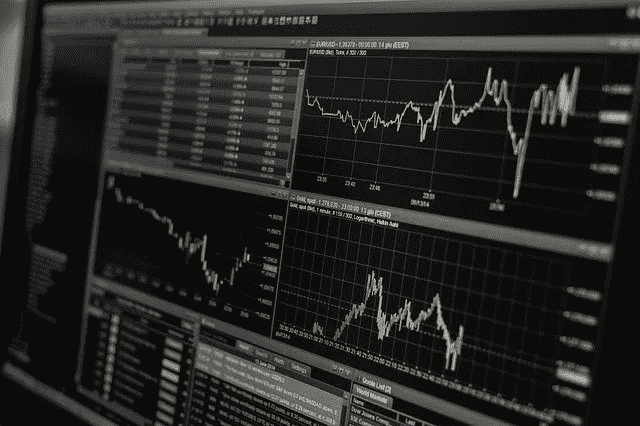

# 一个简单的股票均值回归系统

> 原文：<https://medium.datadriveninvestor.com/a-simple-mean-reversion-system-for-stocks-bb85c212838?source=collection_archive---------25----------------------->

我最近对“使用简单 Python 代码的简单交易系统”很感兴趣。

我已经用近 20 年的每日数据对相对简单的系统进行了回溯测试和交易。多年来，我依赖于两个优秀但最终限制了商业应用的软件包:Trading Blox 和 Mechanica。

后来，我开始使用 Python，因为我厌倦了支付许可费和受他人架构的限制。我没有编码方面的背景，但我已经在金融市场工作了 40 年——这是我的整个职业生涯。大部分交易是我自己的书。

多年来，我用各种趋势跟踪方法交易期货，但不管什么原因，这不再像以前那样产生巨大的利润。

因此，我转向寻找任何我感兴趣的东西，并在 Jupyter 笔记本上使用简单的 Python 代码，我开始在历史数据上测试各种想法。

我最近在[量子乌托邦](https://www.quantopian.com/lectures/the-dangers-of-overfitting)上遇到了一个非常简单的均值回归系统，它的设计只是为了说明过度拟合的危险。

代码的简单性深深吸引了我，我决定尝试一下。结果你会在[上找到我的要旨](https://gist.github.com/AnthonyFJGarner)。

目前没有固定的分数头寸规模，投资是使用相关股票中的单个股票和(可选)累加头寸进行的。

目前没有为滑点或佣金做准备。

这两个“缺点”很容易纠正，我可能会在某个阶段发布更新。

*原载于 2018 年 12 月 10 日*[*http://zenothestoic.com*](https://zenothestoic.com/2018/12/10/a-simple-mean-reversion-system-for-stocks/)*。*