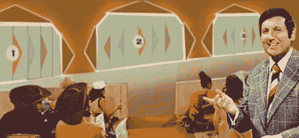
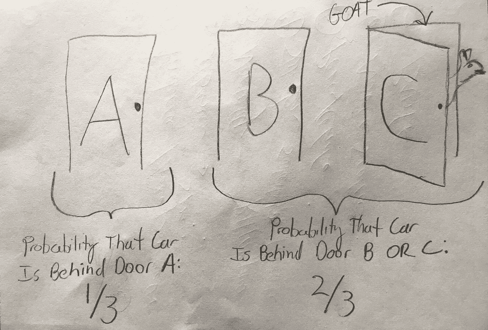

# 蒙蒂-霍尔问题的一个简单、非数学的“证明”:利用先验知识改进数据驱动的决策

> 原文：<https://medium.datadriveninvestor.com/a-simple-non-mathematical-proof-for-the-monty-hall-problem-using-prior-knowledge-to-improve-26ed33cc164?source=collection_archive---------2----------------------->

我猜你听说过“蒙蒂霍尔问题”如果没有，要点是:你已经进入了游戏节目的最后一个阶段，我们的主持人蒙蒂·霍尔要求你在 1、2 和 3 这三扇门之间做出选择。其中一扇门后是一辆汽车，另外两扇门后是山羊。

做出选择了吗？..很好，记在心里。

现在你已经选好了门，蒙蒂打开了另外两扇门中的一扇门，给你看了门后的一只山羊，并给你一个选择:保持原来的门，或者换到另一扇关着的门。你是坚持你的第一个选择，安然度过把你带到这一刻的幸运浪潮，还是抛弃一切，换个门？

你决定换还是留揭示了你如何看待概率问题，并对你赢得一辆全新汽车的几率产生巨大影响。这个问题有一个正确的答案，这个答案背后有一个容易理解的原因，两者都即将出现。这个问题的核心是两种不同的处理和解释统计的观点。

更年轻和更普遍的观点被称为频率主义统计。常客会建议你在第一次挑选时有 1/3 的机会选择正确的门。一旦蒙蒂在另一扇门后展示了一只山羊，那么你的门有 1/2 的几率是获胜的门，另一扇门有 1/2 的几率是获胜的门。换句话说，从频率主义者的角度来看，你的选择和随机猜测一样好。

那些没听说过天魔堂问题的，以我的经验来看，几乎都是选择守门，通常要么是因为他们认为天魔在玩心理战让他们从一个胜门切换，要么是因为他们相信自己的直觉。他们认为，如果有什么不同的话，转换只会损害他们成功的机会…但他们错了。

这将我们引向另一个统计观点，贝叶斯统计，它不仅考虑了给定事件发生的*可能性*(例如，选择一个获胜的门)，还考虑了我们拥有的任何*先验知识*(例如，排除一个门)可以告诉我们该事件发生的概率。无论你是否意识到，蒙蒂打开了一扇失败的门，这为我们提供了很多信息，当我们推断选择正确的门的概率，并做出选择或留下的决定时，我们可以使用这些信息。让我们从贝叶斯的角度再看一遍这个场景，这一点会很清楚…

蒙蒂大厅为你提供了三个门的选择。根据贝叶斯解释，你仍有 1/3 的机会在第一次选择时选择正确的门，为了这个解释的目的，让我们选择门 A。如果有 1/3 的机会门 A 后面有汽车，那么有 2/3 的机会汽车在**门 B **或**门 C 后面。换句话说，汽车在门 B 后面的概率和汽车在门 C 后面的概率必须加起来是 2/3。**

这就是有趣的地方。一旦蒙蒂向我们展示了 C 门后面的一只山羊，我们就知道 C 门后面有一辆汽车的可能性是 0/3。给定我们的新知识，以及门 B 或门 C 是正确的门的概率必须等于 2/3 的事实，门 B 现在有 2/3 的机会成为赢家，而我们最初的选择，门 A，仍然有 1/3 的机会。

Please pardon the napkin drawing.

你现在做什么？你不换车就是疯了，因为换车会让你赢得一辆车的几率翻倍！事实上[流言终结者们甚至测试了这个问题](https://mythresults.com/wheel-of-mythfortune)，并通过实验证实了这一点(他们的实验实际上显示，当换门时有 78%的几率获胜，当保持原来的门时有 22%的几率获胜)。

考虑这一概念很重要，因为当企业或个人将数据用于决策时，他们通常反对让以前的知识(他们的或其他人的)影响他们的决策，或者主动选择完全基于数据做出决策。这个例子说明了在做决定之前识别和考虑所有信息来源的重要性。

事实是，虽然统计可以帮助我们提高对无数各种问题的理解，但当我们让以前的知识来指导我们的推断时，它会变得更加强大。如果你的工作或爱好涉及统计，但你更习惯于频繁主义者的推断(即，你经常使用 p 值和 z 值)，我会鼓励你潜入令人兴奋且公认令人费解的贝叶斯统计世界…除非你真的想拥有自己的宠物山羊。