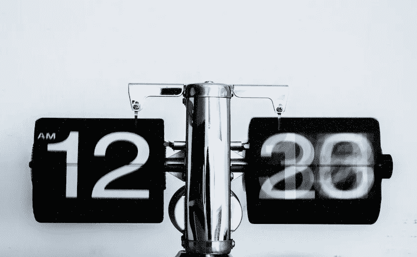

# 克服拖延症和培养自信的简单方法

> 原文：<https://medium.datadriveninvestor.com/a-simple-practice-to-overcome-procrastination-and-develop-self-trust-6ca057fbed56?source=collection_archive---------24----------------------->

我的新书《彻底的辉煌》描述了“辉煌周期”的四个阶段，它们结合在一起成为辉煌人生的可靠基础。它引用了数百个实践，我们可以使用这些实践在整个周期中自由移动。

将我们从意图转移到成就的实践主要是为了克服拖延症、注意力持续时间短以及无法相信自己会守信用。使用不同的组件，这一领域的实践集中在如何制定一个现实的计划，将其分解为小的可行部分，利用同行支持，并最终以一种使项目完成的方式完成事情。它们允许你产生强烈的创作冲动，一个已经在嗡嗡作响的想法，并将其根植于一些看得见、摸得着、可以与其他人分享的东西中。

这里的运动开始于一个意图，结束于完成。

你可以做书中描述的许多练习来让你自己的创造力流动起来。你不需要其他人和你一起坐在冥想垫上，或者对你自己意识中发生的事情敏感。另一方面，从意图到成就的实践受益于其他人的参与。协作、指导和反馈都有帮助。这是教练可以发挥最大作用的领域。

同样，在实践循环的这一阶段存在着太弱或太强的危险。弱实践在这里意味着设定的目标和目的很容易实现，以至于它们感觉毫无意义。例如，如果你今天承诺在一封信上贴上邮票，然后把信放进邮箱，你可能很容易就成功了，但这不会让人觉得是一个很大的胜利。另一方面，如果我们做出太大的承诺和计划，我们最终无法在设定的时间框架内完成，然后我们会有一种失败感。这可能会成为一种惯例:今天没有按计划完成事情，明天就更有可能无法完成。

> 理想的平衡是每天都有一个计划，你可以在一天结束时现实地执行，同时感觉你已经完成了一些有意义的事情。

对许多人来说，这意味着当你一天有八小时的时间时，设立一些需要两三个小时才能完成的可实现的目标。(你一天的大部分时间也会花在处理意想不到的事情上)。

当我们探索这组实践时，我们经常提到它们是否“与您的使命和目的直接一致”当然，并不是每个人都清楚自己的使命和目标。对于一个好教练来说，弄清楚这一点很重要。

## 练习从意图到成就:列出 5 件事

这可能是周期的这个阶段中最简单和最有效的实践。早上，当你完成了你的创造性实践后，写下今天要完成的五件事。需要有一个平衡。其中一些可能是你为了避免灾难而不得不做的事情:比如按时缴纳所得税，给汽车加油，或者当你有蛀牙的时候去看牙医。很多生活都是关于维护的。我希望这些事情中至少有一件属于照顾好自己的范畴，比如接收信息，和朋友散步，或者研究你感兴趣的事情。

这五项中至少有两项应该与你的人生目标相关:它们应该直接推动你给予这个世界的礼物。对我来说，这意味着我的两个项目可能包括为一本书写或编辑一个章节，做一个采访，为一个在线课程主持一个研讨会，或者指导一个客户。一个美好的生活应该包括至少两件这样的东西，甚至更多。

在一天结束时，在你完成工作后，睡觉前，回头看看清单，检查你完成了多少。如果你在循环的这个阶段只开始一个练习，这应该是一个。

***

你刚刚读了我的新书《激进的才华》中的一段摘录。如果你喜欢你刚刚阅读的内容，并且想更深入地探索这些主题*，*你可以在我的[网站](https://radicalbrilliance.com)上阅读该书的更多摘录，或者在这里为自己抓取一份[。](https://www.amazon.com/gp/product/1890909440/ref=as_li_tl?ie=UTF8&camp=1789&creative=9325&creativeASIN=1890909440&linkCode=as2&tag=awakworlsemi-20&linkId=87b3066fee8e7679ff6a8a7b47d0130f)

一旦你买了这本书，你还将获得一份 26 种克服拖延症、培养自信和从心流到生产力的其他实践的详细清单。