# 用 postman 记录 API 的简单方法

> 原文：<https://medium.datadriveninvestor.com/a-simple-way-to-document-your-api-with-postman-508734466091?source=collection_archive---------0----------------------->

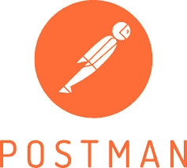

通常，当作为后端开发人员在一个开发团队中工作时，需要提供你刚刚开发的 API 的简洁文档，正如我发现有许多文档选项一样，使用 [postman](https://www.getpostman.com/) 文档非常容易、没有压力并且快速。

[](https://www.datadriveninvestor.com/2019/02/25/6-alternatives-to-the-yahoo-finance-api/) [## 雅虎财经 API |数据驱动投资者的 6 种替代方案

### 长期以来，雅虎金融 API 一直是许多数据驱动型投资者的可靠工具。许多人依赖于他们的…

www.datadriveninvestor.com](https://www.datadriveninvestor.com/2019/02/25/6-alternatives-to-the-yahoo-finance-api/) 

在开始使用 Postman 测试 API 端点之前，我建议您为 API 端点创建一个集合。你可以点击邮差应用程序上的收藏标签，在对话框中填写所需的详细信息，然后像这样创建收藏

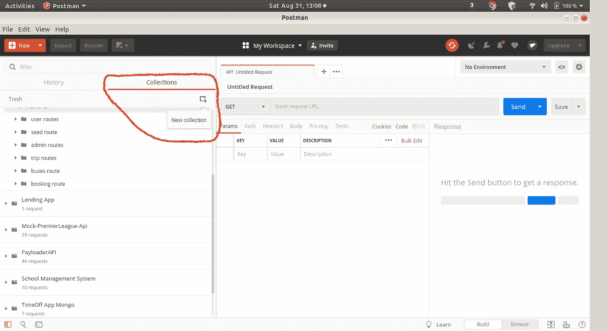

Collection Tab

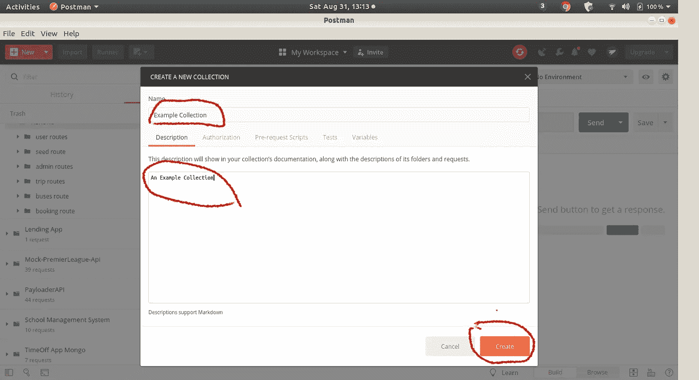

Create Collection

创建后，您可以开始将您的请求添加到您的收藏中，如下所示

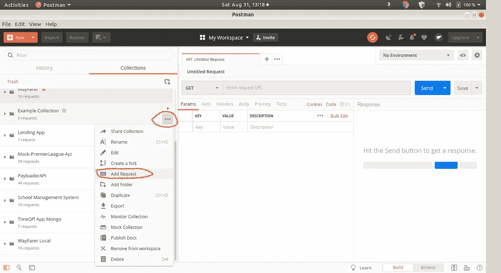

Add Request to Collection

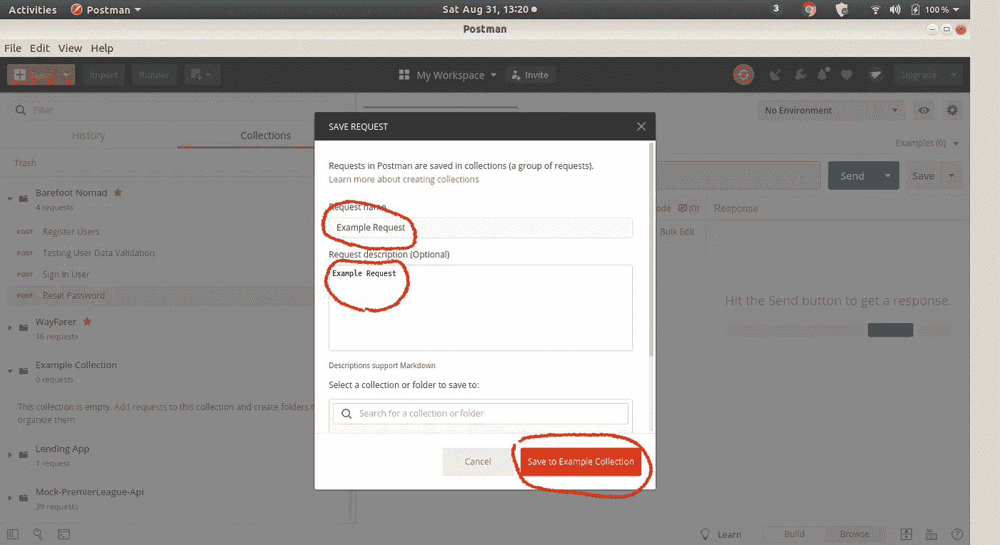

Save Request to Collection

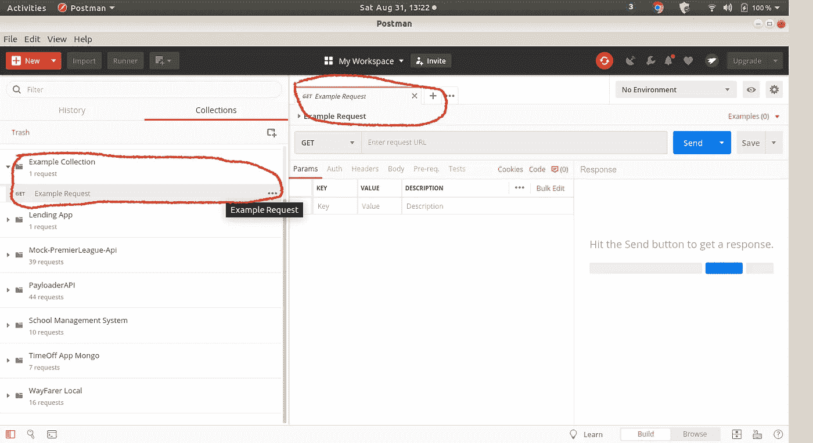

Request Added to Collection

然后，您可以开始测试您的 API 端点。

我将在这里使用一个例子，我有一个已经运行的服务器和一个登录用户的端点

```
http://localhost:3000/api/v1/users/signin/
```

获得所需的响应后，点击**发送按钮和下载按钮**旁边的保存按钮，以保存您的端点、请求正文和响应，如下所示

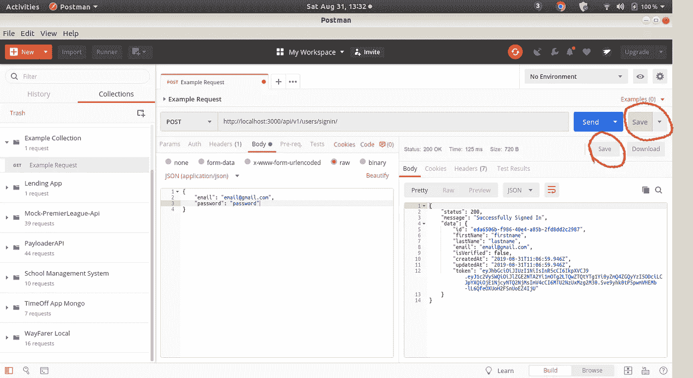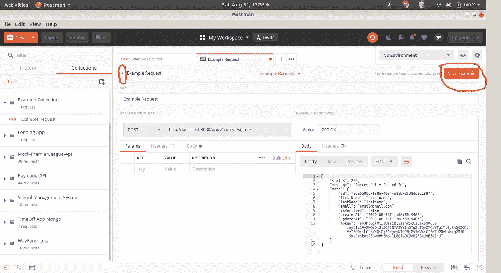

Save Endpoint, Request body and Response

然后，您可以通过单击集合旁边的 **<** 按钮返回到您的集合并生成您的文档，然后单击对话框上的**在 web 中查看**按钮，如下所示:


Generate Documentation

您将注意到一个新的浏览器窗口打开，如下所示

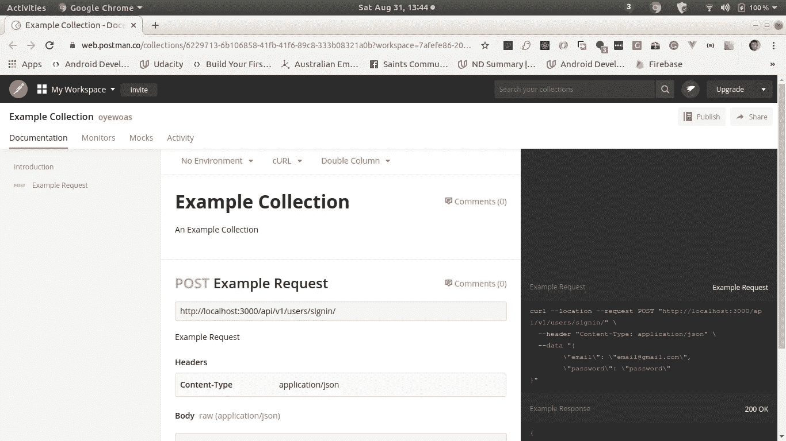

Generated Documentation

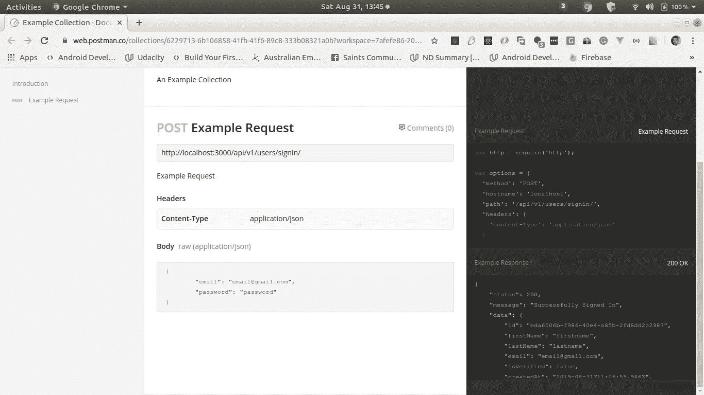

Generated Documentation

**这显示了您的端点、请求体和响应示例。**您可以通过点击页面右上角的**发布按钮**生成唯一的公共链接来共享本文档，如下所示

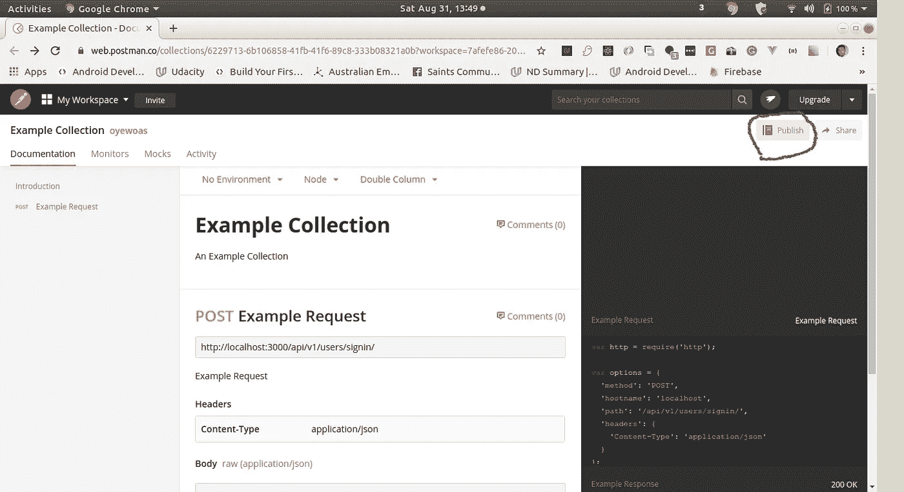

Publish

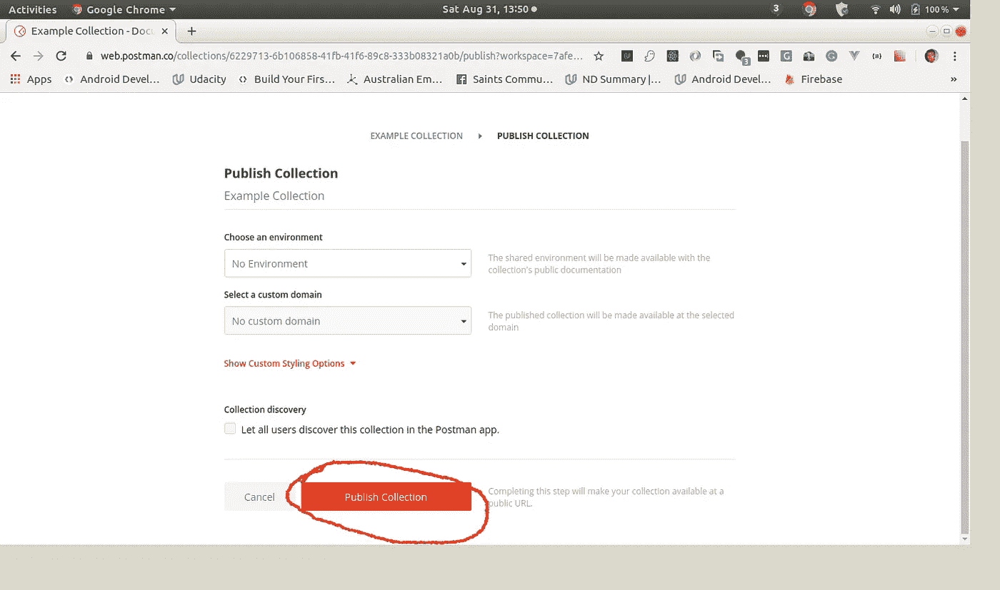

Publish Collection

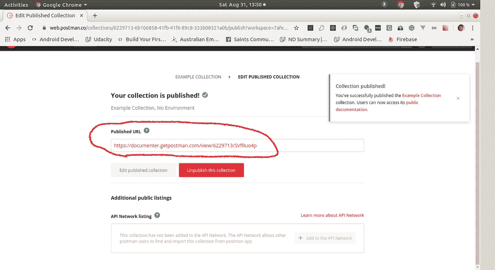

Published Url

然后你可以**复制**并且**与任何需要 API 文档的人共享**发布的 URL 。

下面是我刚刚生成的[示例集合](https://documenter.getpostman.com/view/6229713/SVfRuo4p)。

如果你理解并喜欢这篇文章，或者你有什么意见，请告诉我。

感谢阅读。