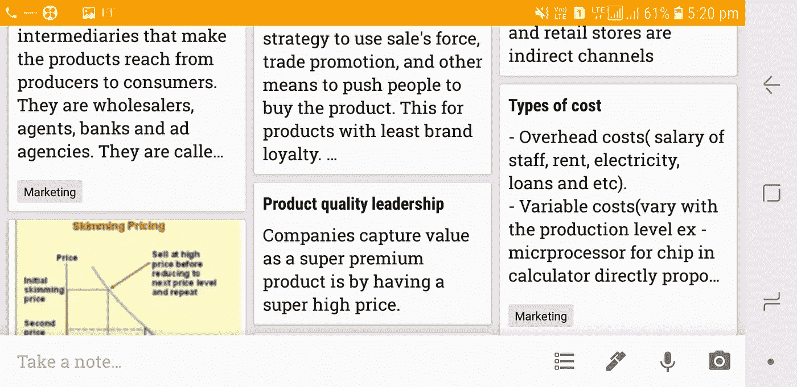

# 3000 多个 Google Keep 记录如何帮助我跟踪我的学习！

> 原文：<https://medium.datadriveninvestor.com/a-simple-way-to-keep-track-of-your-learning-curve-8399068d60c4?source=collection_archive---------22----------------------->

我第一次尝试创业的时候是 18 岁，那时候叫氙服。我们与一家工厂合作，直接向大学采购定制 t 恤，这是一个很好的开始！不幸的是，我们不到一年就关门了——激烈的竞争。

定制 t 恤是一种商品！

尽管我们失败了，但我仍然对商业世界感到无比兴奋。我想学得更多，了解企业的方方面面。

那是我第一次选择经济时报。

我什么都不明白！

一个字也没有！

我开始一次拿一篇文章，仔细阅读每一个字。然后，我会回去，花时间学习文章中对我来说新的单词/概念。

学完之后，我做了一件神奇的事情！我在 Google Keep 上做了笔记。对，笔记 app。

Screenshot: Preview of my Google Keep

这成了一种习惯。在过去的 5 年里，我每天都记下我学到的每一个新概念！

结果？

我的 Google Keep 现在有超过 3000 个带时间戳的笔记。关于商业、经济、股票市场、创业、营销以及我所学的每一个新事物的笔记！

这是一次难以置信的经历！浏览一张便条，那张你 2 年前写的关于你学到的新功课的便条。但是现在，有了更广阔的视野！

有时只是刷新记忆，有时是重新学习这些概念，大多数时候，更好地理解它们。

我觉得每个人都应该记下他们的学习，他们的想法，他们的观察和想到的一切。太神奇了。

-维沙克·艾扬格

我写关于商业的文章

[在 LinkedIn 上关注我](https://www.linkedin.com/in/vyshakiyengar/)