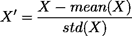
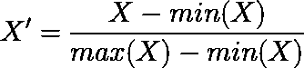
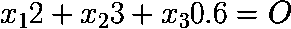
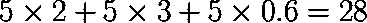
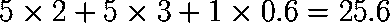
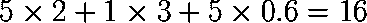
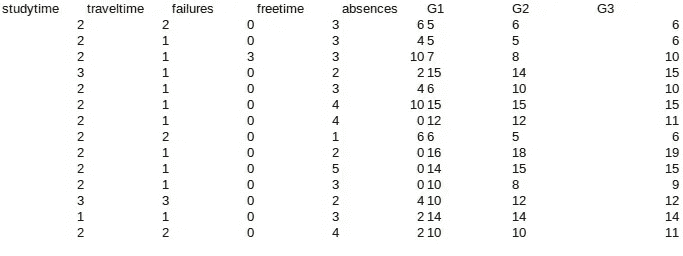
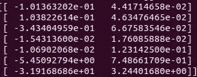

# 知道你的输入在神经网络中有多重要的简单方法

> 原文：<https://medium.datadriveninvestor.com/a-simple-way-to-know-how-important-your-input-is-in-neural-network-86cbae0d3689?source=collection_archive---------0----------------------->


Source: [https://images.ctfassets.net/vrkkgjbn4fsk/wY5xA8WfZewmg8oa8YKC2/6bfb0d6ec124c98eee9e91a2563a4a26/4-xkcd-correlation.png](https://images.ctfassets.net/vrkkgjbn4fsk/wY5xA8WfZewmg8oa8YKC2/6bfb0d6ec124c98eee9e91a2563a4a26/4-xkcd-correlation.png)

读者们，你们中的一些人会马上回答

> 用主成分分析，因为冗余输入没用。

没错，但不是这里的语境。这里我们想知道的是**一个输入对于神经网络做出的预测计算**有多重要。例如，使用学习时间、年龄、身高和缺课人数等几个预测因素来预测谁将通过考试。直觉上，决定学生是否通过考试的最有影响力的因素是学习时间。这就是我们将在这里讨论的类比。

在一个简单的线性回归中，**我们可以通过查看其线性方程中的权重**来测量它。当然，假设预测值(X)已经被归一化(X′)，因此数据标度是相同的。



mean(X) is the meaning of X and std(X) is the standard deviation of X



min(x) is the smallest value of X and max(x) is the largest value of X

您可以在这两个函数中选择一个来归一化您的预测值。为了理解为什么只有权重才能衡量某个预测因子相对于其他预测因子的重要性，下面是一个示例。假设我们有如下的线性方程。



Note: again, all x have a same scale

让我们用 5 代替所有的 x



这是关于其贡献的份额，直观地说，如果份额大，**当输入出错时，输出会很出错**。例如，当我将 x3 从 5 改为 1 时，我们得到



相比之下，如果我们把 x2 的值替换为 1，我们得到的是



这里我们看到，由于权重值的差异，x2 值的变化比 x3 值的影响更大。这是显而易见的，但我想在这里强调的是，除了权重值之外，我们还可以从**输出值偏离参考值**的程度看出我们的输入有多重要。我们发现了一种新的方法来了解我们输入的重要程度。

在神经网络中，**输入的权重不直接连接**到输出层，而是连接到一个隐藏层。此外，与线性回归不同，**神经网络是非线性的**。为了了解输入的显著水平，我们寻找之前发现的第二个参数，即如果我们随机改变输入值，它与神经网络输出值的偏离程度。**我们这里使用的** **参考值是原始误差值**。为什么我称之为“原创”。在理解了我们将在这里探讨的技术之后，你就会知道了。

让我们着手处理真实的数据和真实的神经网络。我们将预测学生在考试中的表现(你可以在这里下载原始[数据，我在这里使用的修改数据可以在这里](https://archive.ics.uci.edu/ml/datasets/student+performance)下载[)。这里是我们在表中使用的一些数据。](https://github.com/genomexyz/machine_learning/blob/master/studentperform.csv)



Detailed information about data can be found in download link above or [here](https://archive.ics.uci.edu/ml/datasets/student+performance). Our target prediction is G3

下面是一步一步找到我们在神经网络中输入的显著水平:

1.  **使用下面的代码，构建、训练并保存神经网络**。这里，在训练神经网络之后，我们不直接使用它来预测，而是将已经训练好的模型保存到文件中。我们为什么要这样做？因为我们需要一个稳定的模型(记住，每次为**训练模型时，每次获得的权重和偏差都会不同**)来计算我们每个输入的显著水平。

```
#!/usr/bin/pythonimport numpy as np
from keras.models import Sequential
from keras.layers import Activation, Dropout, Flatten, Dense, LSTM, RepeatVector, TimeDistributed
from sklearn.metrics import mean_squared_error, r2_score
from sklearn.svm import SVR
import csv#setting
datafile = 'studentperform.csv'
studentmodel = 'studentmodel.h5'
batch_size = 10
hidden_neuron = 10
trainsize = 900
iterasi = 200def generatemodel(totvar):
 # create and fit the LSTM network
 model = Sequential()
 model.add(Dense(3, batch_input_shape=(batch_size, totvar), activation='sigmoid'))
 model.add(Dense(hidden_neuron, activation='sigmoid'))
 model.add(Dense(1))
 model.compile(loss='mean_squared_error', optimizer='adam')
 return model#read data
alldata = np.genfromtxt(datafile,delimiter=',')[1:]#separate between training and test
trainparam = alldata[:900, :-1]
trainlabel = alldata[:900, -1]testparam = alldata[900:, :-1]
testlabel = alldata[900:, -1]trainparam = trainparam[len(trainparam)%10:]
trainlabel = trainlabel[len(trainlabel)%10:]testparam = testparam[len(testparam)%10:]
testlabel = testlabel[len(testlabel)%10:]###############
#normalization#
###############trainparamnorm = np.zeros(np.shape(trainparam))
trainlabelnorm = np.zeros(np.shape(trainlabel))testparamnorm = np.zeros(np.shape(testparam))
testlabelnorm = np.zeros(np.shape(testlabel))print 'shape label adalah', np.shape(testlabelnorm)#for param
for i in xrange(len(trainparam[0])-2):
 trainparamnorm[:,i] = (trainparam[:,i] - np.min(trainparam[:,i])) / (np.max(trainparam[:,i]) - np.min(trainparam[:,i]))
 testparamnorm[:,i] = (testparam[:,i] - np.min(trainparam[:,i])) / (np.max(trainparam[:,i]) - np.min(trainparam[:,i]))for i in xrange(2):
 trainparamnorm[:,-2+i] = (trainparam[:,-2+i] - 0.0) / (20.0 - 0.0)
 testparamnorm[:,-2+i] = (testparam[:,-2+i] - 0.0) / (20.0 - 0.0)#for label
trainlabelnorm = (trainlabel - np.min(trainlabel)) / (np.max(trainlabel) - np.min(trainlabel))
testlabelnorm = (testlabel - np.min(trainlabel)) / (np.max(trainlabel) - np.min(trainlabel))######################
#build and save model#
######################mod = generatemodel(len(trainparamnorm[0]))
mod.fit(trainparamnorm, trainlabelnorm, epochs=iterasi, batch_size=batch_size, verbose=2, shuffle=True)#save trained model
mod.save(studentmodel)
```

2.**加载模型并计算其误差**，代码如下。

```
#!/usr/bin/pythonimport numpy as np
from keras.models import Sequential
from keras.layers import Activation, Dropout, Flatten, Dense, LSTM, RepeatVector, TimeDistributed
from sklearn.metrics import mean_squared_error, r2_score
from sklearn.svm import SVR
import csv
import random#setting
datafile = 'studentperform.csv'
studentmodel = 'studentmodel.h5'
batch_size = 10
hidden_neuron = 10
trainsize = 900
iterasi = 200#read data
alldata = np.genfromtxt(datafile,delimiter=',')[1:]#separate between training and test
trainparam = alldata[:900, :-1]
trainlabel = alldata[:900, -1]testparam = alldata[900:, :-1]
testlabel = alldata[900:, -1]trainparam = trainparam[len(trainparam)%10:]
trainlabel = trainlabel[len(trainlabel)%10:]testparam = testparam[len(testparam)%10:]
testlabel = testlabel[len(testlabel)%10:]###############
#normalization#
###############trainparamnorm = np.zeros(np.shape(trainparam)).astype('float32')
trainlabelnorm = np.zeros(np.shape(trainlabel)).astype('float32')testparamnorm = np.zeros(np.shape(testparam)).astype('float32')
testlabelnorm = np.zeros(np.shape(testlabel)).astype('float32')#for param
for i in xrange(len(trainparam[0])-2):
 trainparamnorm[:,i] = (trainparam[:,i] - np.min(trainparam[:,i])) / (np.max(trainparam[:,i]) - np.min(trainparam[:,i]))
 testparamnorm[:,i] = (testparam[:,i] - np.min(trainparam[:,i])) / (np.max(trainparam[:,i]) - np.min(trainparam[:,i]))for i in xrange(2):
 trainparamnorm[:,-2+i] = (trainparam[:,-2+i] - 0.0) / (20.0 - 0.0)
 testparamnorm[:,-2+i] = (testparam[:,-2+i] - 0.0) / (20.0 - 0.0)#for label
trainlabelnorm = (trainlabel - np.min(trainlabel)) / (np.max(trainlabel) - np.min(trainlabel))
testlabelnorm = (testlabel - np.min(trainlabel)) / (np.max(trainlabel) - np.min(trainlabel))#load trained model
mod = load_model(studentmodel)G3pred = mod.predict(testparamnorm, batch_size=batch_size)
G3real = G3pred*20.0err = mean_squared_error(testlabel, G3real)
print 'our error value is', err
```

在我的电脑上，错误是 3.44525143751。这是我们的**原错误**。

3.**(有趣的部分)随机改变我们的输入值，**为每个输入。我们将随机生成介于 0 和 1 之间的数字以**替换数据测试中的标准化输入参数**，并立即将我们修改过的输入数据输入到我们刚刚加载的神经网络中。为什么值是在 0 和 1 之间随机生成的？因为**我们使用上面段落中的第二个归一化函数**(它使用最大值和最小值)来归一化我们的输入。重复迭代每个归一化输入以随机改变其值，以获得大量样本，从而可以获得误差的平均值和标准偏差。这必须通过**来消除运气因素**(记住，我们随机生成值)。这里是代码(代码是第二步中代码的延续)

```
#!/usr/bin/python

import numpy as np
from keras.models import Sequential
from keras.layers import Activation, Dropout, Flatten, Dense, LSTM, RepeatVector, TimeDistributed
from keras.models import load_model
from sklearn.metrics import mean_squared_error, r2_score
from sklearn.svm import SVR
import random
import os
import csv

#setting
datafile = 'studentperform.csv'
studentmodel = 'studentmodel.h5'
batch_size = 10
hidden_neuron = 10
trainsize = 900
iterasi = 200
randsample = 100

#read data
alldata = np.genfromtxt(datafile,delimiter=',')[1:]

#separate between training and test
trainparam = alldata[:900, :-1]
trainlabel = alldata[:900, -1]

testparam = alldata[900:, :-1]
testlabel = alldata[900:, -1]

trainparam = trainparam[len(trainparam)%10:]
trainlabel = trainlabel[len(trainlabel)%10:]

testparam = testparam[len(testparam)%10:]
testlabel = testlabel[len(testlabel)%10:]

###############
#normalization#
###############

trainparamnorm = np.zeros(np.shape(trainparam)).astype('float32')
trainlabelnorm = np.zeros(np.shape(trainlabel)).astype('float32')

testparamnorm = np.zeros(np.shape(testparam)).astype('float32')
testlabelnorm = np.zeros(np.shape(testlabel)).astype('float32')

#for param
for i in xrange(len(trainparam[0])-2):
	trainparamnorm[:,i] = (trainparam[:,i] - np.min(trainparam[:,i])) / (np.max(trainparam[:,i]) - np.min(trainparam[:,i]))
	testparamnorm[:,i] = (testparam[:,i] - np.min(trainparam[:,i])) / (np.max(trainparam[:,i]) - np.min(trainparam[:,i]))

for i in xrange(2):
	trainparamnorm[:,-2+i] = (trainparam[:,-2+i] - 0.0) / (20.0 - 0.0)
	testparamnorm[:,-2+i] = (testparam[:,-2+i] - 0.0) / (20.0 - 0.0)

#for label
trainlabelnorm = (trainlabel - np.min(trainlabel)) / (np.max(trainlabel) - np.min(trainlabel))
testlabelnorm = (testlabel - np.min(trainlabel)) / (np.max(trainlabel) - np.min(trainlabel))

#load trained model
mod = load_model(studentmodel)

G3pred = mod.predict(testparamnorm, batch_size=batch_size)
G3real = G3pred*20.0

errreal = mean_squared_error(testlabel, G3real)
print 'our error value is', errreal

################################
#permutation importance session#
################################

permutsample = np.zeros((randsample, len(testparamnorm[0])))
for trying in xrange(randsample):
	randval = np.zeros((len(testlabelnorm)))
	for i in xrange(len(testlabelnorm)):
		randval[i] = random.uniform(0,1)

	for i in xrange(len(testparamnorm[0])):
		permutinput = np.zeros(np.shape(testparamnorm))
		permutinput[:] = testparamnorm
		permutinput[:,i] = randval
		G3pred = mod.predict(permutinput, batch_size=batch_size)
		G3real = G3pred*20.0
		err = mean_squared_error(testlabel, G3real)
		permutsample[trying, i] = err

print permutsample
#print testparamnorm

#print mean and standard deviation of error
errperformance = np.zeros((len(testparamnorm[0]), 2))
for i in xrange(len(testparamnorm[0])):
	errperformance[i,0] = np.mean(permutsample[:,i])
	errperformance[i,1] = np.std(permutsample[:,i])
errperformance[:,0] = errreal - errperformance[:,0]

print errperformance
```

此代码的输出示例如下



From left, column 1 is first error (error reference) minus mean error and second column is standard deviation of error (how big the error varies). Each row is a statistic (average error minus reference error and standard deviation) for each input that is randomized in value. From top, the order is study time, travel time, failures,free time, absences, G1, and G2.

4.**解读结果**。我们得到了有趣的结果。首先是第二行(行驶时间)，从随机化输入值结果中获得的误差变化较小。这表明参数“旅行时间”根本不影响学生进行期末考试的成绩。我们在最后一行(G2)得到一个非常高的误差增量。这表明第二阶段考试的成绩与期末考试成绩高度相关。从这个结果中，我们得到输入的重要级别的顺序是 G2、G1、失败、空闲时间、缺席、学习时间和旅行时间。我们从顺序中得到的另一个有趣的结果是，学习时间不会显著影响期末考试的价值。这个结果非常违反直觉。在现实生活的研究中，它必须进一步调查。

这就是对测量神经网络输入的显著性水平的一种简单方法的解释。除了神经网络之外，该技术还可以应用于其他机器学习算法，例如 SVM 和随机森林。

**我的另一个神经网络系列:**

1.  [神经网络如何处理你的输入(经过训练的神经网络)](https://medium.com/datadriveninvestor/how-neural-network-process-your-input-trained-neural-network-fd48f1bf310)
2.  [神经网络如何“学习”](https://medium.com/@genomexyz/how-neural-network-learn-3b56c175b5ca)
3.  **知道你的输入在神经网络中有多重要的简单方法**