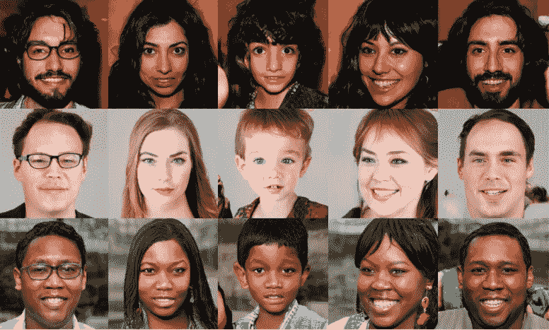
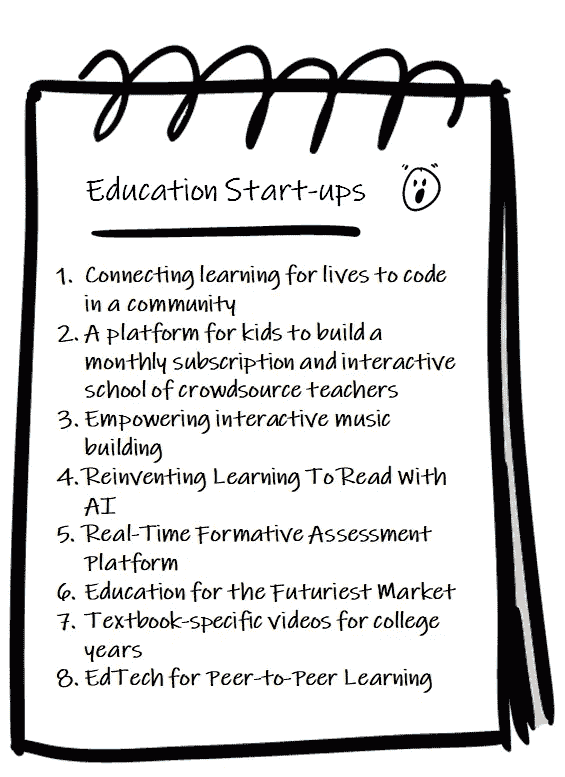
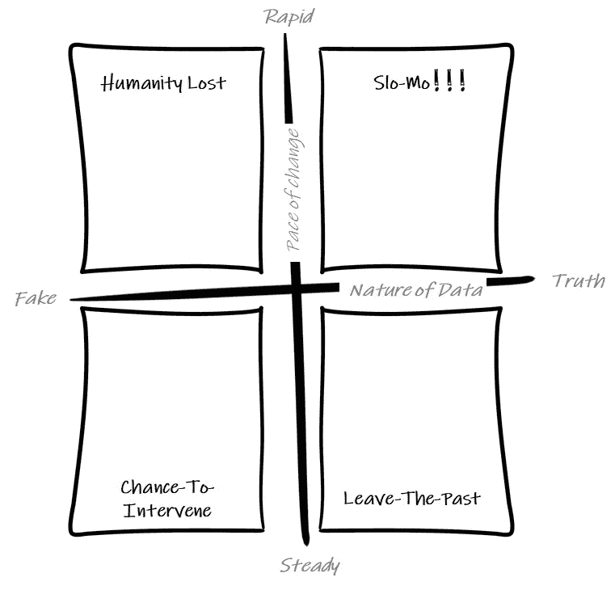
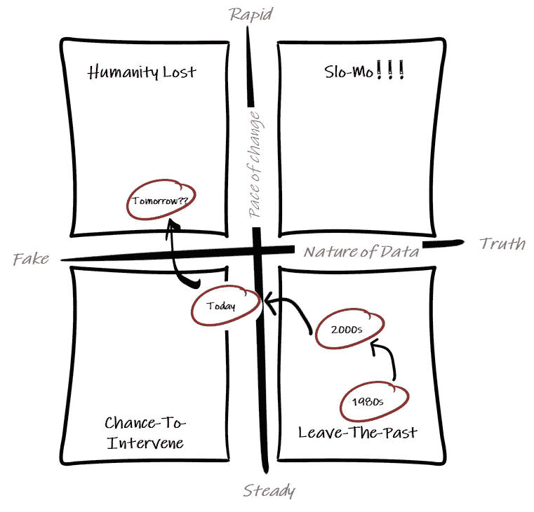
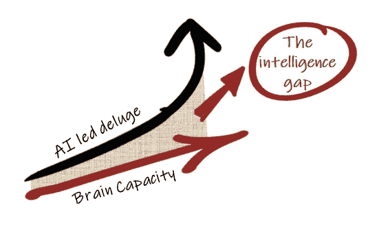

# 缓慢的人工智能生活

> 原文：<https://medium.datadriveninvestor.com/a-slo-mo-ai-life-a73689724838?source=collection_archive---------3----------------------->

你能认出这些人吗？

Source: Nvidia — A Style-Based Generator Architecture for Generative Adversarial Networks

我打赌你不能，因为它们都不是真的。他们不存在。它们是由英伟达公司使用人工智能机器生成的。震惊？？？

你在教育领域遇到过这些很酷的创业公司吗？

例如，一些想法通过点对点学习重温小组学习，或者通过你的个人人工智能更好地阅读主题。为什么学生不能众包老师教他们？他们很酷吧？但是等等。这些用这些句子逐字描述自己的创业公司是谁？不存在！！！

这些是由我们的人工智能机器生成的，它被灌输了 1000 个教育和“工作的未来”创业描述，现在它们生成新的描述。我们用这种方法来产生“非常规”的想法。你可以自由地追求这些想法，因为它们是机器生成的。

这是两个看似真实却不存在的人和看似真实却不真实的信息内容的例子。人类是分不清的。

上面的人是假的，他们的想法也是假的。不存在的人可以生成不存在的内容。最近，人工智能领域的领先公司之一 OpenAI 决定不公开这样一个假新闻生成器。见《卫报》的这篇文章，[新的人工智能假文本生成器可能太危险，不能发布，创作者说](https://www.theguardian.com/technology/2019/feb/14/elon-musk-backed-ai-writes-convincing-news-fiction)。会造成什么危害？

在某些情况下，由于假新闻的快速传播，许多人失去了生命。《卫报》2018 年 7 月的这篇文章可怕地提醒了人们这种伤害……[“在最新的 WhatsApp 私刑之后，警方在印度逮捕了 25 人”](https://www.theguardian.com/world/2018/jul/15/india-police-arrest-25-people-after-latest-whatsapp-mob-lynching-child-kidnapping-rumours)。由于虚假或不存在的信息的快速传播，人类失去了生命，这是一场噩梦。

人类的未来会怎样？我们每个人都经历过信息爆炸……推特、订阅、视频、消息等的轰炸。一种简单的思考未来的方式是二维的

1.  数据的性质…相对于虚假/可疑的质量，数据的真实/可信程度如何
2.  变化的速度…数据和技术轰击我们的速度…稳定(就像十年前)与快速(就像过去几年)

这给出了 4 (2x2)个场景，如下图所示。

想想 20 世纪 80 年代，图书馆、书籍和少数报纸是最好的信息来源。策划和值得信赖的背后，他们有一张脸。随着互联网的出现，信息流向我们的速度迅速增加，但在 2000 年代，信息仍然来自可信的来源。在过去十年左右的时间里，变化的速度加快了，但更令人不安的是上述例子的趋势。我们有技术工具和人工智能，可以创造不存在的人说不存在的事情。我们正在“离开过去”,走向一个新的场景，如下图所示。

变化的步伐正在加快，这意味着我们正走向一个场景，在这个场景中，我们作为人类无法理解信息的过载，并将失去对真实和真实的追踪，因为其中将有大量的虚假。当人工智能驱动的机器将使人类无法理解正在发生的事情时，人们已经为这种场景提供了多个名称。奇点是最受欢迎的名字。当与假新闻混在一起时，我们会被误导，这更糟糕……我称之为“人性的丧失”。今天，我们有“干预的机会”来纠正这一进程。这就是我们今天所在的盒子。我们应该去哪里？

技术的快速进步是人类的美丽之处，并且预计将会增加。人类如何理解洪水？想一个来自体育的类比…当足球比赛中发生类似犯规的动作时，你指的是慢动作回放。实时决策的速度太快，你可能会出错。高保真慢动作(又名慢动作)来拯救。下面请欣赏 2014 年范佩西(荷兰)对阵西班牙的进球。

我们的干预会导致慢镜头吗？在这种情况下，不管变化的速度有多快，也不管潜在的误导性内容，我们都可以在需要时慢慢审视并做出正确的决定。记住慢动作是时间似乎变慢的一种效果…实际上并没有。生命的游戏将不会变得不可理解。除了“慢动作场景”，我们还有别的选择吗？

目前，有三种方法可以实现 slo-mo。

1.  以更高的速度拍摄，以正常速度播放…还记得黑客帝国电影吗
2.  以正常速度拍摄，慢慢播放…很多体育回放
3.  以正常速度拍摄，并制作数字插值帧，以在实际拍摄的帧之间平滑过渡…这需要智能

我们的大脑容量并没有随着科技的发展而增长。这种智能差距必须由其他形式的人工智能来弥补。需要互联网和各种平台上的一层 AI 来带来 slo-mo 的可能性。这将是一个“慢动作人工智能场景”。

慢动作人工智能场景需要什么？慢动作人工智能需要

*   去杂波(参见: [AI 去杂波生活](https://medium.com/datadriveninvestor/ai-to-de-clutter-life-fc9c11d84776))信息的泛滥
*   在信任中建立正确的声誉层
*   使用现实(实时)与潜在的虚拟现实(不脱离现实的慢动作)分层
*   允许慢动作的图层，如回放、多角度、插值等。这些层现在并不存在，需要一层层地建立起来…一个多角度的系统需要数据和人工智能模型相互连接
*   更多

有可能。我们会吗？

*“你的生命是一个慢动作奇迹”*……人类潜在的奇迹……一个慢动作的人工智能生命