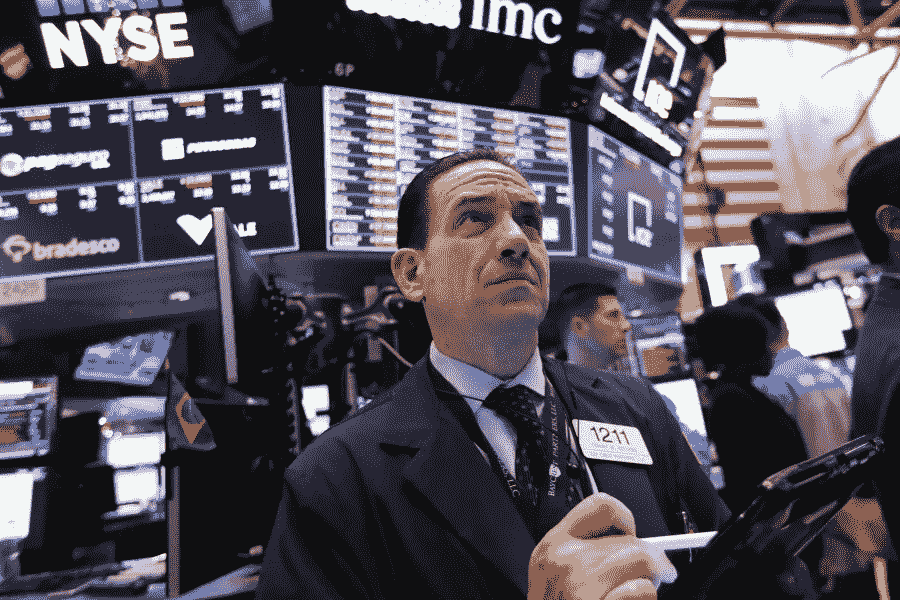

# 美国股市的缓慢下跌

> 原文：<https://medium.datadriveninvestor.com/a-slow-fall-of-us-stocks-c59766e01303?source=collection_archive---------28----------------------->

道琼斯工业平均指数下跌 0.3%，收于 24947.67 点。另一方面，纳斯达克综合指数上涨 0.4%，收于 7188.26 点。

亚马逊、微软、谷歌、网飞和脸书都大幅上涨。亚马逊上涨 1.85%，至 109.19 美元，微软上涨 0.62%，两家公司仍在争夺全球最有价值公司的宝座。谷歌上涨 1.7%，至 1068.73 点，网飞上涨 2.74%，至 282.22 点。脸书股市上涨 1.23%，至 139.63 点。

华为首席财务官孟晚舟应美国的要求在加拿大被捕，再次引发了对美中贸易休战的担忧和怀疑。

像苹果和波音这样在中国市场有大量投资的大公司股价暴跌。苹果公司下跌 1.11%，至 174.72 点，波音公司下跌 3.09%，至 331.9 点。中国电子商务公司阿里巴巴下跌 4%。

美国总统唐纳德·特朗普(Donald Trump)周二在一条推文中表示，他是一名“关税男人”，这让投资者感到担忧。特朗普还提出，关税将“让美国再次富裕”，但具有讽刺意味的是，那些征税是由美国公司和消费者支付的。

## 股票

纳斯达克指数上涨 0.42%，至 7188.26 点

道琼斯指数下跌 0.32%，至 24947.67 点

标准普尔 500 股市下跌 0.15%，至 2695.95 点

## 货币

欧元上涨 0.04%，至 1 欧元兑 1.137 美元

日元上涨 0.06%，至 1 美元兑 112.75 日元

英镑下跌 0.06%，至每磅 1.277 美元