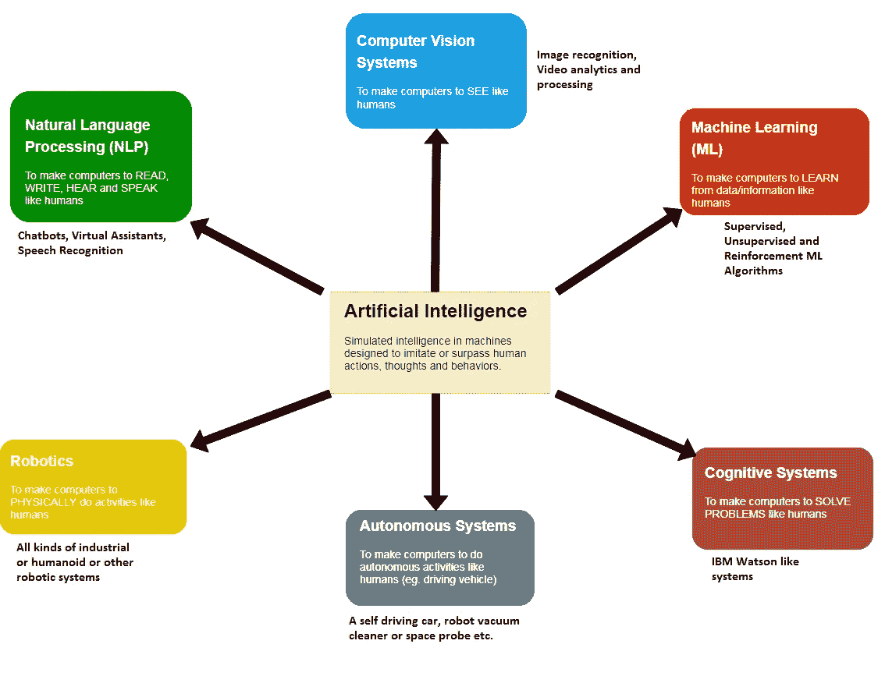

# 人工智能漫谈

> 原文：<https://medium.datadriveninvestor.com/a-small-talk-on-artificial-intelligence-4cb8c19c2bd4?source=collection_archive---------6----------------------->

人造生物，像人类一样的行为在小说、电视剧和电影中很常见。小时候，我是日本电视连续剧《巨型机器人》和卡雷尔·恰佩克的 R.U.R(罗森公司的通用机器人)的忠实粉丝。所有的技术发明和科学发现都让人类疯狂的幻想变成了现实。今天，人工智能是桌面上的热门话题之一。网站和杂志不断被关于人工智能的新闻和文章轰炸，这对我来说太好了，简直不像真的。

**一点历史**

人工智能研究领域诞生于 1956 年[达特茅斯学院](https://en.wikipedia.org/wiki/Dartmouth_College)的 [a 车间](https://en.wikipedia.org/wiki/Dartmouth_workshop)。人工智能的创始人对未来很乐观:[希尔伯特·西蒙](https://en.wikipedia.org/wiki/Herbert_A._Simon)预言，“二十年内，机器将能够做任何人能做的工作”。然而，在后来的几年里，人工智能领域的进展放缓了。人工智能项目的资助几乎停止。这个时期被称为“艾冬天”。20 世纪 80 年代初，人工智能研究因[专家系统](https://en.wikipedia.org/wiki/Expert_system)的商业成功而复兴，这是一种模拟人类专家的知识和分析技能的人工智能程序形式。

**人工智能预言和预测**

今天，人工智能被认为是革命性和有前途的技术。所谓的人工智能“预测”仍然接踵而至。比如，埃隆·马斯克(Elon Musk)在 2014 年预测，杀手机器人将在 2020 年横行无忌。但首先，值得知道的是，实际负责开发人工智能领域的人对他们的预测要比今天的未来学家谨慎得多。诺伯特·维纳(1894-1964)，神童，麻省理工学院的数学教授，哲学家，同时也是他那个时代最著名的科学家之一。他因在 20 世纪 40 年代末创立了控制论领域而被广泛认可。1948 年，维纳声称人类的智能行为可以在计算机中模拟。明智的是，他没有指出需要多长时间。

时间快进到 1965 年的夏天，达特茅斯学院年轻的数学助理教授约翰·麦卡锡组织了一次夏季研讨会，就“思考机器”的未来进行头脑风暴。他专门为自己的工作室创造了“人工智能”这个术语，并召集了一些最聪明的头脑参与其中。他预测他们将一起攻克[许多最棘手的人工智能问题](https://www.wired.co.uk/article/predicting-artificial-intelligence)，并在 20 世纪 70 年代开发出全智能机器。当然，这些都没有发生。

到了 20 世纪 80 年代，麦卡锡变得更加谨慎。当被问及他认为公众何时会在家中拥有自主家用机器人时，他回答说，“大约在 5 到 500 年之间”。

**惊人的安国定律**

罗伊·查尔斯·阿马拉，一位[美国](https://en.wikipedia.org/wiki/United_States)研究员、科学家、[未来学家](https://en.wikipedia.org/wiki/Futures_studies)和[未来研究所](https://en.wikipedia.org/wiki/Institute_for_the_Future)的主席，因创立了关于[技术](https://en.wikipedia.org/wiki/Technology)效应的阿马拉定律而闻名。阿马拉定律说

"*我们往往会高估一项技术的短期效果，而低估其长期效果"*

让我们抛开那些预测，想想这些技术的长远效果。从长远来看，它将有巨大的潜力。像所有其他技术一样，人工智能有它自己的好处和危险。有些人认为人工智能会对人类构成威胁，有些人认为人工智能会造成大规模失业。不管是什么，人工智能正在快速发展。

**AI 到底是个什么鬼？**

人工智能术语含糊不清，往往会引起误解。人工智能是一个更广泛的术语。它只不过是一套试图模仿所有人类行为的技术。从广义上讲，人工智能就是机器像人类一样做事。然而，人类拥有许多其他技能和智能特征，如繁殖、养育后代，这对于机器来说几乎是不可能的，至少在不久的将来是如此。人工智能实际上并不是要取代人类，而是要帮助人类。

AI Technology Spectrum

你需要明白所有这些技术在某种程度上都是相互联系的。例如，机器人可以使用机器学习来完成一些任务，虚拟助理/聊天机器人使用 ML 来回答一些人类的查询等。

[谷歌大脑创始人、前百度首席科学家吴恩达](https://en.wikipedia.org/wiki/Andrew_Ng)说:

**“因为‘神经网络’这个术语，人们认为我们在创造人工大脑。事实是，我们真的不知道人脑是如何工作的——更不用说我们可以建造一台像人脑一样工作的计算机了**

淡定，拥抱 AI！