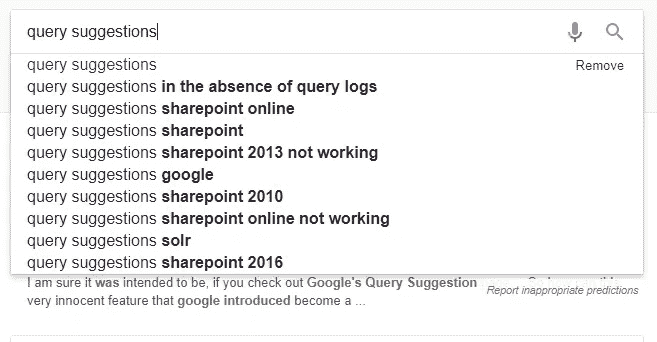
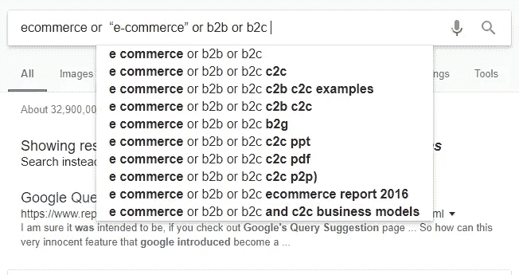
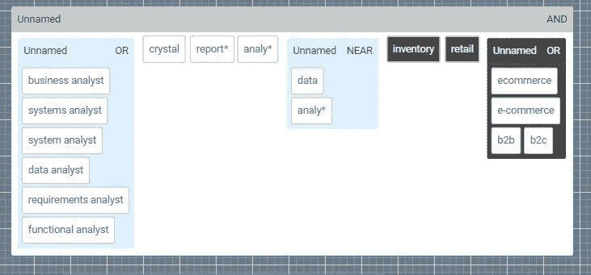
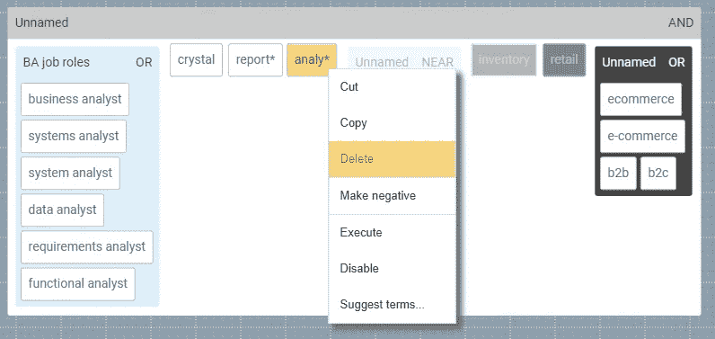
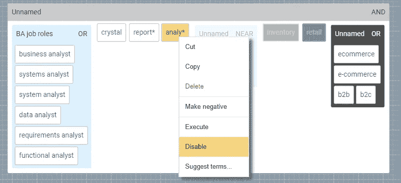
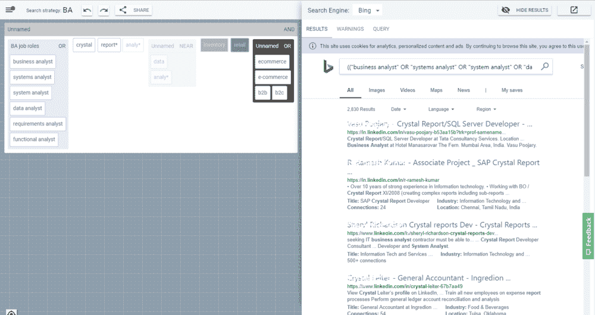
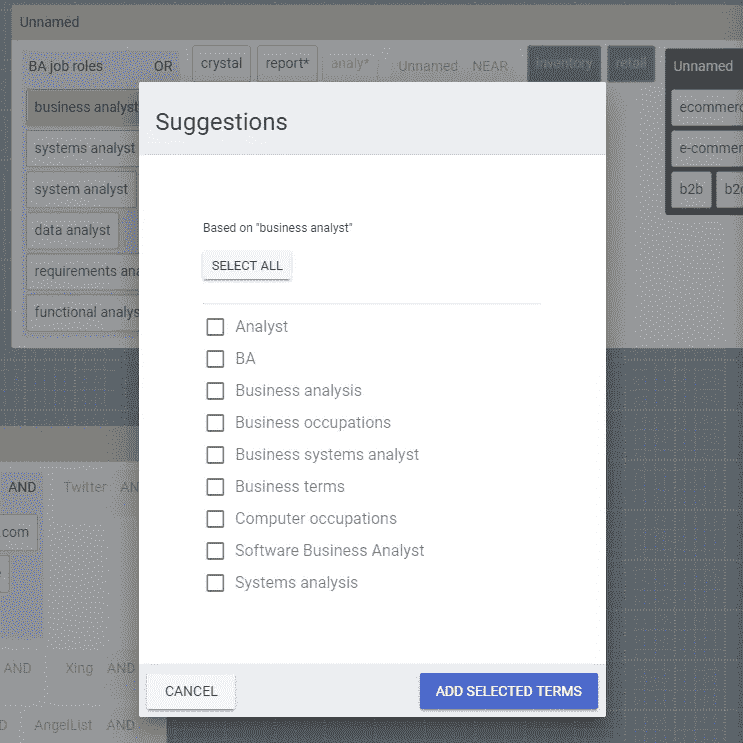
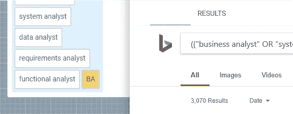
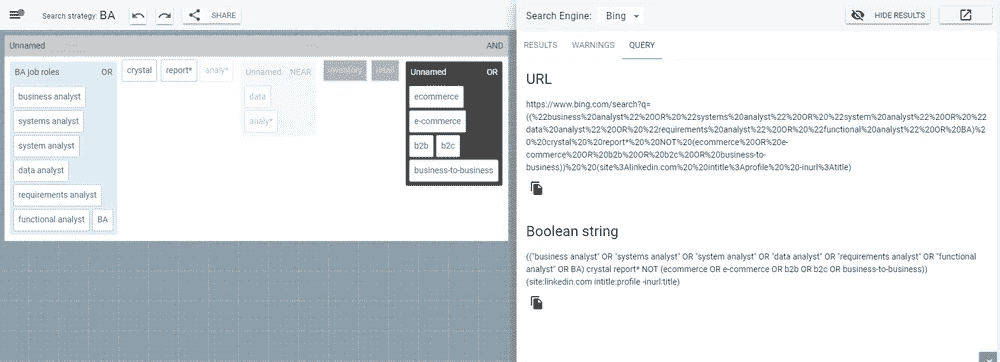

# 使用查询建议的更智能的搜索方式

> 原文：<https://medium.datadriveninvestor.com/a-smarter-way-to-search-using-query-suggestions-ea8c32129076?source=collection_archive---------40----------------------->

我们都熟悉[查询建议](https://isquared.wordpress.com/2012/02/22/designing-search-part-2-as-you-type-suggestions/)的概念:我们在搜索框中输入术语，然后就像变魔术一样，我们的搜索字符串会出现一组看似合理的完整内容。这节省了时间，有助于最大限度地减少容易出错的击键，并经常给我们灵感来形成比我们最初预期的更好的查询。自从十多年前引入以来，查询建议已经成为网络搜索体验的重要组成部分:

然而，对于其他类型的搜索应用程序，它们的好处就不那么明显了。网络搜索是基于这样一个概念，即大多数用户的查询由相对[短的关键字序列](https://www.statista.com/statistics/269740/number-of-search-terms-in-internet-research-in-the-us/)组成，可能具有一些基本的语言结构。在这种情况下，将相关的(甚至是偶然发现的)术语附加到非结构化查询的尾部可以提供直接的效用。但是对于许多[专业搜索](https://isquared.wordpress.com/2015/03/31/user-requirements-for-complex-search-strategies/)应用来说，尤其是那些使用*结构化*搜索方法的应用，这个假设就不成立了。例如，招聘人员通常使用[布尔字符串](https://www.2dsearch.com/news/2018/7/3/this-is-why-boolean-strings-dont-work)来寻找候选人，精心制作如下表达式:

> *(“业务分析师”或“系统分析师”或“系统分析师”或“数据分析师”或“需求分析师”或“功能分析师”)和 crystal and report*和 analy*以及 analy*附近的数据，而不是库存和零售(电子商务或“电子商务”或 b2b 或 b2c)*

在这种情况下，仅仅考虑提供哪些条款已经不够了。相反，我们还必须考虑如何应用*和*，因为简单地将它们附加到搜索字符串的末尾不再是有效的策略:**

****

**当解决像这样的复杂搜索挑战时，用户不仅需要控制搜索建议的*选择*，还需要控制它们被应用的*位置*和*方式*。这需要不同的方法。**

**那么还有什么选择呢？让我们将这个字符串输入到 [2dSearch](https://www.2dsearch.com/) 中，看看会发生什么:**

****

**这就是上面的例子是如何使用我们所谓的[嵌套布局](https://www.2dsearch.com/news/2018/7/11/this-is-whats-possible-when-you-rethink-advanced-search)呈现的，其中逻辑表达式显示为一组嵌套容器。在这种形式下，很明显:**

*   **整个表达式由三个子表达式和一些关键字组成**
*   **它们都通过逻辑 AND 连接在一起**
*   **其中三个元素已被否定(如黑色背景所示)**

**将逻辑结构转换成可视化布局提供了底层语义和物理外观之间更直接的[映射](https://www.2dsearch.com/news/2018/7/11/this-is-whats-possible-when-you-rethink-advanced-search)。此外，我们现在可以用以前不可能的方式操作这个表达式:例如，如果我们发现术语“analy*”不匹配任何有用的东西，我们可以简单地删除它:**

****

**或者，我们可能认为它现在没有用，但以后可能会有用，在这种情况下，我们可以暂时禁用它:**

****

**在每种情况下，这些操作的效果都实时显示在相邻的搜索结果窗口中，作为一组匹配的社交简档:**

****

**但更重要的是，这是我们以更精确和可控的方式应用自动化查询建议的机会。考虑左上角显示的一组术语。这似乎是一个相当全面的'*业务分析师*'角色的同义词列表。但是我们错过了什么吗？我们可以集思广益一段时间，甚至使用谷歌的建议。更聪明的方法可能是选择其中一个术语(例如'*业务分析师*')并调用“建议术语”选项:**

****

**现在，我们可以立即看到“BA”似乎是一个更有用的同义词(以及其他)。事实上，当我们选择该词并将其添加到我们的组中时，匹配搜索结果的数量从 2，820 增加到 3，070:**

****

**但是搜索结果列表仍然太长，无法详尽地查看，简单地浏览一下，我们还会注意到一些误报。对此能做些什么吗？一种解决方案是增加右上方显示的否定(“非”)组中的术语数量。因此，按照同样的方法，我们可以探索“b2b”的建议术语:**

****

**选择“企业对企业”似乎是一个很好的附加术语，事实上，将它添加到我们的搜索中会将结果列表减少到 1，940 个。我们可以继续以这种方式，并进一步优化我们的结果，以获得少量高精度的轮廓，但希望这种方法的价值现在是显而易见的。**

**当然，我们也可以通过修改布尔字符串本身来达到同样的目的。毕竟，这不是一个过于复杂的布尔表达式。但是面对左边的交互显示或者右边的文本块，你更愿意从哪里开始呢？**

****

# **摘要**

**在这篇文章中，我们回顾了自动查询建议的传统方法的一些缺点，并探索了从[复杂的搜索挑战](https://isquared.wordpress.com/2018/06/05/first-international-workshop-on-professional-search/)中出现的额外要求。特别是，我们已经展示了结构化搜索方法是如何要求不仅要考虑建议术语的*选择*，还要考虑它们应用的*位置*和*方式*。我们还探索了一种替代的可视化方法，该方法将逻辑结构转换为交互式图形表示，并展示了这种方法如何有助于更精确和有效地应用查询建议。**

**最后，我们应该承认，我们不是第一个提供查询建议的人，也可能不会是最后一个。但是我们相信，我们是第一个以这种方式提供查询建议的。我们是少数几个与科学界一起发表和分享我们的工作的人之一，在这种程度上，我们欢迎对这种方法的反馈和监督。**

**请继续关注我们的下一篇文章，届时我们将解释一下这一切是如何实现的。同时，前往 [2dSearch](https://www.2dsearch.com/) 亲自尝试一下。**

***原载于*[*www.2dsearch.com*](https://www.2dsearch.com/news/2018/7/26/a-smarter-way-to-search-using-query-suggestions)*。***