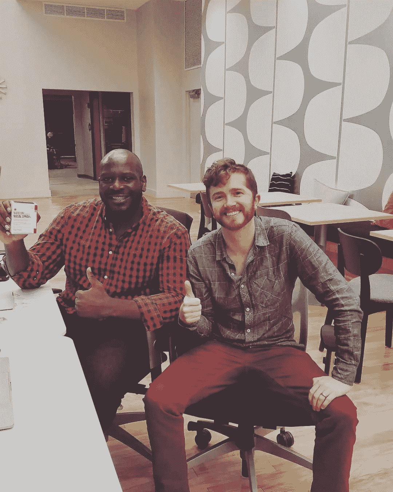
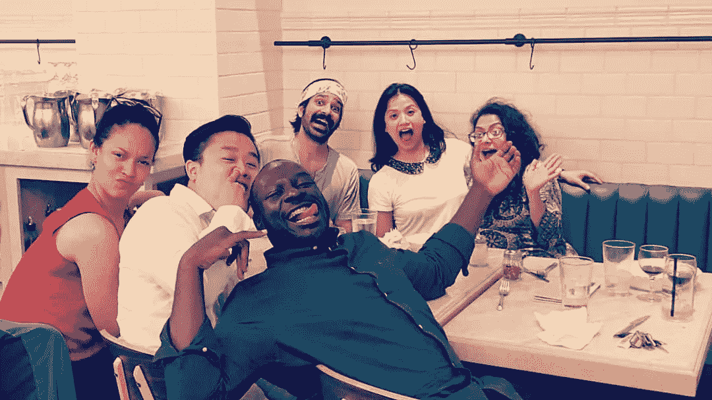
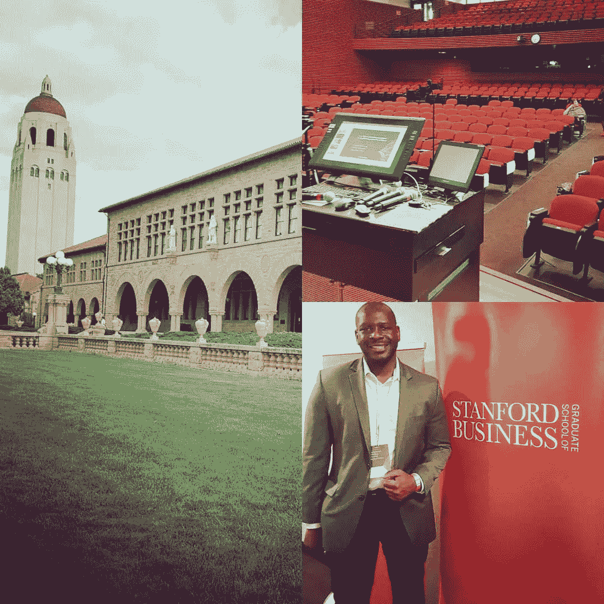
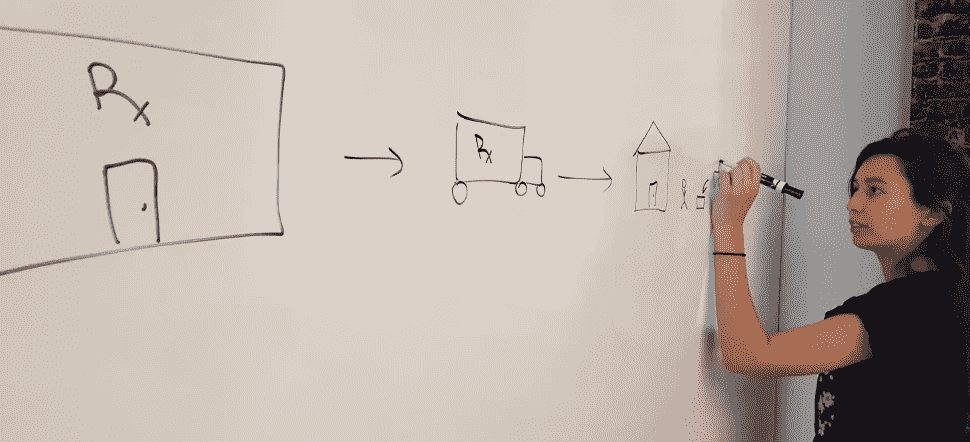
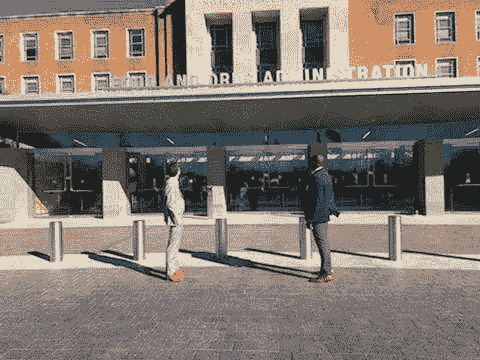

# 阿片类药物危机时代的社会佳话(2018 年由 Fiduscript 重述)

> 原文：<https://medium.datadriveninvestor.com/a-social-good-story-in-the-age-of-the-opioid-crisis-2018-recap-by-fiduscript-1432555e5a34?source=collection_archive---------10----------------------->

Fiduscript, a Public Benefit Corporation Co-Founders James Lott (left) and Straker Carryer (right) preparing for a presentation to the Food and Drug Administration (Dec 2018)

2018 年——多么美好的一年。在 2017 年，我们的工作几乎不是一个想法。我们现在距离启动还有几个月的时间，已经建立了一个由出色的同事、导师、顾问、商业伙伴、投资者以及最重要的支持我们团队工作的倡导者组成的支持网络。我们正在通过我们的旗舰服务[纳洛酮交易所](https://www.naloxoneexchange.com)应对阿片类药物危机，这是一个在线市场，任何人都可以在这里购买救命的阿片类药物解毒剂[纳洛酮](https://www.drugabuse.gov/related-topics/opioid-overdose-reversal-naloxone-narcan-evzio)，接受如何使用它的有效培训，并让它送货上门。简而言之，这种药物是一种神奇的药物，可以给人第二次生命。事实上，由 Adapt Pharma 生产的品牌 [Narcan](http://www.narcan.com) 是使成千上万人起死回生的同一种药物，包括著名音乐家[黛米·洛瓦托](https://people.com/health/demi-lovato-overdose-narcan/)。当 72，000 人死于可预防的疾病时，需要采取明智和深思熟虑的行动。我们的公司 [Fiduscript](http://www.fiduscript.com) 旨在让美国的任何人(从执法人员到忧心忡忡的父母，以及介于两者之间的所有人)都能轻松订购纳洛酮，并无缝送货上门。

我想花点时间强调一下过去一年中发生在我们身上的一些不可思议的事情。这一切都始于 2018 年 1 月，当时我紧张地向排名第一的芝加哥大学布斯商学院(University of Chicago Booth School of Business)的商学院学生观众推销我的想法。在那里，我遇到了一位鼓舞人心、聪明的年轻医生，他天生适合合作和执行我们的任务。不久之后，我们联系了芝加哥大学内更广泛的医疗保健爱好者网络。我们从 [GPHAP](http://www.ssa.uchicago.edu/gphap/) 招募了另外两名研究生加入我的团队。我们向全国公认的社交新创企业挑战赛(SNVC)提交了申请，Fiduscript 被[宣布进入半决赛](https://www.chicagobooth.edu/research/rustandy/blog/2018/phase-ii-snvc-teams-announced)。

The Social New Venture Challenge semi-finalists. Fiduscript team (May 2018)

在为期 10 周的挑战中，我们在来自芝加哥展位社区的优秀教师和导师的指导下，学到了很多关于我们的业务和相互学习的知识。最后，我们没有进入决赛，但是，我们知道我们有一个可行的业务。

在 SNVC 会议期间，我们不得不做出一些艰难的前瞻性决策。我们的团队发现了一些机会，申请在斯坦福大学的商业会议和麻省理工学院的健康创业会议上发表演讲，分享我们的工作。在早春，我们不得不开始考虑 Fiduscript 在夏天的计划。作为研究生，我们还要继续追求这家公司，拯救生命吗？还是我们申请实习作为后备计划？有些决定来得很容易，有些却让人痛苦不堪。简单的？当你被邀请去斯坦福大学商学院和麻省理工学院推销你的公司时，你就去。我们做到了。

Co-Founder + CEO James Lott presenting Naloxone Exchange at Stanford Business School (April 2018)

艰难的决定？当你进入一个全国排名的加速器项目，但反过来，你也被选中参加你梦想中的实习(在 [IDEAS Lab](https://www.hhs.gov/cto/index.html) 就阿片类药物流行问题与卫生与公众服务部首席数据官 Mona Siddiqui 博士合作)并最终必须做出决定。好吧，剧透一下，我选择把我的时间投入到我们的公司，拯救生命。并非 SNVC 团队的每个人都能进入下一阶段，但他们的影响和贡献帮助我们前进。其他人，比如我们的联合创始人斯强克·卡里尔，表现出了不折不扣的英雄气概。

今年夏天，在竞争最激烈的一年里，我们的团队被选入[波尔斯基加速器](https://polsky.uchicago.edu/2018/06/13/polsky-center-announces-2018-summer-accelerator-cohort/)的 14 个有才华的创业团队和教练(向 EJ·里迪、克里希·里特和我的教练们大喊)。我们整个夏天都在不知疲倦地为公司打基础。我们必须设置好一切，从我们的使命，我们的银行账户，一个团队，合作伙伴，甚至简单的事情，如登陆页面。花了整整一个夏天的时间，才真正把它从一个想法变成一个看起来像真公司的东西。我们雇佣实习生，设定不切实际的发布日期，刷爆信用卡，就像其他创业公司一样。2018 年 8 月，Fiduscript，一家公益公司正式注册成立，我们在 Polsky 加速器演示日结束了这个夏天。

Fiduscript Metcalf Intern Victoria Constant mapping out Naloxone Exchange (Aug 2018)

在夏季波尔斯基加速器结束后，我们觉得我们只是触及了表面，尽管我们在正式启动前已经完成了这么多。到秋季开始时，我们已经有五个州签字同意我们的监管机构批准在他们的州使用我们的在线平台纳洛酮交易所销售纳洛酮。我们的团队已经发展到了 10 人——既有在职的专业人士，也有研究生(甚至我们的本科生实习生也一直贡献到了秋天)。我们开始在整个校园和整个芝加哥市得到越来越多的认可。当一位美国前总统了解到我们为解决阿片类药物危机所做的努力时，这种认识变得更加强烈。通过克林顿全球倡议，[我们获得了“行动承诺”](https://www.clintonfoundation.org/press-releases/more-700-new-student-commitments-action-announced-11th-annual-clinton-global)，并与克林顿基金会建立了联系，分享我们的努力，并向他们的组织和合作伙伴网络学习，以帮助解决危机。

Clinton Foundation Vice-Chair Chelsea Clinton acknowledges the Fiduscript (Naloxone Exchange) leadership team at the Clinton Global Initiative University Conference, Oct 2018.

12 月，我们得到了一年中最令人满意的消息。美国食品药品监督管理局允许我们[向他们的顾问委员会](https://www.fda.gov/AdvisoryCommittees/Calendar/ucm624254.htm)展示我们的工作，因为他们正在寻找创新的方法使 Lazarus 处方药更容易获得。这是一个完美的机会，因为我们最近写了关于在 [Chicago Crain 的业务](https://www.chicagobusiness.com/opinion/medication-can-save-life-pennsylvania-not-california-or-florida)中扩大纳络酮的使用范围，并通过谷歌和 FDA 支持的[药房验证计划](https://safe.pharmacy/buying-safely/)获得批准，全年都在努力使我们的平台“合法”，该计划有助于根据全美药房协会制定的标准确定在线药房服务是安全可靠的(Fiduscript 是美国 20 家药房服务之一 被列为安全可靠的在线药房服务的州包括药房服务和直接面向消费者的健康公司，如 [Blink Health](http://blinkhealth.com) 、 [GoodRx](http://goodrx.com) 和 [nurx](http://nurx.com) 。 我们还对自我识别的药物使用者或亲人进行了一项全国性调查，我们确切地了解了如何更好地向他们分配纳洛酮(这些调查结果将于 2019 年公布)。

从我们的角度来看，在美国，除了 Fiduscript 之外，没有一家公司比我们更了解如何让消费者直接获得救命药物。会后，许多利益相关者注意到了我们的团队。我们对 FDA 的陈述将我们置于国家舞台，并把我们与深切关注美国阿片类药物危机的组织“社区”联系起来。

Fiduscript Co-Founder’s Straker Carryer and James Lott at the Food and Drug Administration (Silver Springs, MD)

> 在经历了如此多事的一年后，提及胜利是很容易的，但是我们也有大量的损失。我们花了数百个小时在补助金上，然后空手而归，去找风投，被嘲笑(感谢上帝，天使投资人相信了我们 4 万美元)，甚至更糟。在这一行，脸皮厚是必须的，你要学会对早餐说“不”，尤其是在生命危在旦夕的时候。有人曾经告诉我，做社会事业是一件更难的事情。我见过聪明绝顶、才华横溢的企业家不得不埋葬他们的公司。这就是为什么我们花了这么多时间来打破我们原来的商业模式，来建立它，并使它更强大和可持续——因为最终我们知道它不仅值得，而且这是必不可少的。生活确实依赖于我们的公司。

2018 年，我们将纳洛酮交换从想法到行动，取得了巨大的进展:

*   18 个州的监管许可
*   测试平台
*   12 人团队，3 名世界级行业顾问
*   我们的第一笔天使投资

像许多有好想法的创业公司和有才华的团队一样，将想法付诸行动的时候到了，可扩展性完全取决于资本的获取。对我们来说，现在是时候了，我们已经确定推出更多拯救生命的产品(我们将在 2019 年宣布)，进一步扩大我们的影响。这就是为什么我们新年的首要任务之一是筹集资金。

我很感激这不平凡的一年，也很感激能接触到一个强大的团队，以及支持我们公司的教练、企业家、投资者和顾问团队。创业需要一个村庄的支持。我们的工作远未完成，2019 年，随着我们开始拯救生命，真正的工作才开始。我们期待着 Q1 的发射。我们希望我们的工作激励了你，就像阿片类药物危机的故事激励了我们一样。你可以通过告诉人们我们正在做的好工作来支持我们。

*如果你是天使投资人、医疗保健业内人士或(社会影响)风险投资集团，请联系我们，我们很乐意与你交谈。我们祝你新年最红火，最健康，最快乐，记住:纳洛酮救命。*

[***詹姆斯·洛特***](https://www.linkedin.com/in/jameslottchicago/)**是一名药剂师，Fiduscript 的联合创始人兼首席执行官，芝加哥大学哈里斯公共政策学院的研究生。联系人:james@fiduscript.com。推特:@fiduscript @jamesolott**