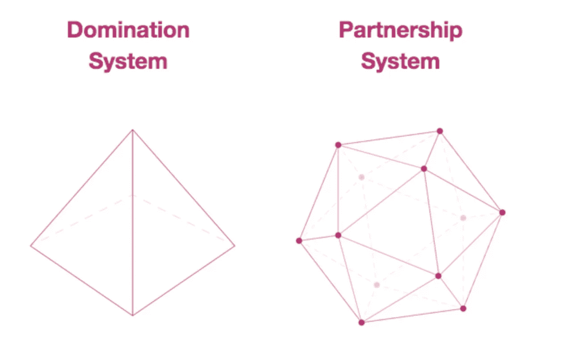

# 一个建立在伙伴关系而不是统治基础上的社会

> 原文：<https://medium.datadriveninvestor.com/a-society-based-in-partnership-instead-of-domination-ae9acce4d191?source=collection_archive---------4----------------------->

## 统治等级的对立面会是什么样子？

Center for Partnership Studies

对于大多数人来说，不难理解厌女症、种族主义、同性恋恐惧症、阶级歧视和仇外心理是如何在一个像美国这样有着强大阶层体系的社会中发生的。历史上，女性被认为不如男性，黑人不如白人，穷人和未受教育的人不如那些拥有不同机会的人。这种多层次的内在系统才是[父权制作为一种社会制度的真正含义。尽管近年来有所缓解，但无休止地与他人比较相对权力和声望的欲望仍然存在。](https://medium.com/inside-of-elle-beau/patriarchy-demands-constant-ranking-and-stratification-of-all-kinds-9881c9dba597)

在像父权制这样的金字塔形等级制度中，只有少数精英能够占据顶端，其他人都在争夺等级制度中他们能够达到的最高位置。才干和能力可能在排名中起着很小的作用，但总的来说，这些等级制度是建立在传统权力的基础上的。就在 50 年前，等级制度的各个阶层还是相当固定的，白人男性在顶端，白人女性在他们之下，其他种族的男性，包括黑人在内，有色人种女性在底端，同性恋者和其他边缘群体也在接近底端的地方。

 [## 保护主义、政治和经济动荡|数据驱动的投资者

### 美国股市昨日出现 400 多点的大幅反转，为未来的事情发出了警告信号。市场…

www.datadriveninvestor.com](https://www.datadriveninvestor.com/2018/06/28/protectionism-politics-economic-turmoil/) 

这不再是一成不变的了，因为我们现在有更多的女性、非白人和同性恋拥有财富、教育和权力。然而，这本身就造成了紧张，因为有些人不愿意放弃旧的排名。我个人认识几个人，当巴拉克·奥巴马当选时，他们被彻底激怒了，因为让一个黑人当美国总统不符合他们应有的等级观念。

但是，即使我们可以很容易地看到基于支配地位的等级制度的问题，还有什么选择呢？以统治为基础的等级制度倾向于依靠胁迫、暴力和暴力威胁，但它们也维持秩序。过去在意大利人们常说，在墨索里尼的统治下，至少火车是准时运行的。威权结构意味着每个人都知道该向谁寻求领导和安全，即使这也意味着他们会被踩在脚下，受到欺负。

> 我们寻找伟大的老板并不是因为渴望被关注和指导，而是因为我们相信清晰的权力关系是危机的解药，最终是混乱的答案。
> 
> 布洛克，彼得。管理:选择服务胜过个人利益(第 18-19 页)。伯瑞特-克勒出版社。Kindle 版。

大多数人可能都经历过极少数不涉及某种统治等级的结构化情境——从操场上的恶霸到专横的父亲再到自恋的老板。你必须按照上级的指示去做，否则后果自负。但是统治等级并不是唯一的等级或者唯一的领导类型。它们也不是与他人相处的唯一方式。为了社会的正常运转，建立某种等级制度是不必要的。

在面向伙伴关系的结构中，实施的等级制度被用来创造凝聚力和秩序，这种方式不是基于恐吓，也不是为了维持自上而下的等级。平等和公平的成人关系是正常的。育儿不是专制而是权威。信仰和故事将移情、互利、非暴力的关系视为正常、道德和可取的。“这与“*的统治故事形成对比，这些故事将统治和暴力合理化和理想化，被认为是不可避免的、道德的和可取的。国家、家庭和工作场所以及社会的所有其他方面都是如此。[合作研究中心](https://centerforpartnership.org/the-partnership-system/)*

实现的层次结构让领导者授权那些最接近手头工作产品或任务的人做出大多数相关决策，而不是告诉他们做什么，然后坐下来从上面评估他们。这使得人们能够以一种他们无法做到的方式进行情感投资，当他们仅仅被当作一个齿轮或一个被更有权威的人指挥的官员时。

在我儿子的小学里，老师不会调解学生之间的分歧。他们教学生如何自己做这件事。如果有打架或其他类似的情况，他们将举行班会，其他学生帮助当事方谈论发生了什么，并解决问题。它没有教会孩子们听从权威来解决他们的问题，而是教会他们如何为自己承担更大的责任。

面向伙伴关系的组织有基于信任和互惠的合作；基于成就(而不是基于冲突)的竞争；将冲突作为达成解决方案的工具，而不是不惜一切代价的零和博弈心态。"[领导力](https://centerforpartnership.org/wp-content/uploads/2019/04/MythsofPartnership.pdf)基于 ***权力*** (培养和支持生产力和创造力的女性或男性)和/或 ***权力*** (鼓励和参与团队合作)。"(强调我的)

业务是我们当今文化中面向合作伙伴关系转变的主要前沿之一，因为它带来了更大的灵活性和响应能力，这反过来又有助于提高底线。

> 在速度较慢、不太复杂的商业环境中，主要依靠少数高层领导的旧的层级模式已经不再适用。在当今更加不稳定、不确定和模糊的商业战场上，通过各级人员网络分散控制和领导是取得成功的必要条件。
> 
> [*福布斯*](https://www.forbes.com/sites/brentgleeson/2017/03/27/the-future-of-leadership-and-management-in-the-21st-century-organization/#277c7887218f)

尽管目前商业世界的倡议是为了更好地以伙伴关系为导向，但完全摆脱基于统治的社会等级制度并不容易。许多人紧紧抓住他们认为的地位和随之而来的任何好处，因为他们害怕其他选择。他们相信，在一个竞争激烈的世界里，如果他们放松警惕，他们会发现自己被吃掉或者被冷落。他们担心，如果其他人获益，那将不得不以牺牲他们的利益为代价。

尽管如此，像布伦·布朗博士这样的远见卓识者仍然在文化面前围绕这个主题进行着重要的讨论。布朗关于羞耻和脆弱的 TED 演讲已经被观看了超过 5000 万次，她最近的网飞特别节目《勇气的呼唤》也受到了广泛的关注和好评。

她大受欢迎的原因之一是布伦·布朗为我们带来了生活在一个更友好、更合作、更好运作的世界的具体想法和策略，她以一种迷人、有趣、没有废话的风格做到了这一点。布朗博士与美国军方、硅谷商界领袖和执法机构广泛合作，教授基于伙伴关系系统而不是基于支配地位的领导工具。

她没有特别使用这些术语，但是布朗关于敢于全心全意领导的想法与他们是一致的。家长式分层和以支配地位为基础的关系最具破坏性的因素之一是它们造成了社会孤立。当你觉得自己一直在和别人竞争，总是在确定谁在社会或权力等级中的地位更高时，你怎么能和别人有真正的亲密或友情呢？当包括领导者在内的每个人都害怕承认自己不够完美，因为这是统治阶层对他们的要求时，你怎么能有一个真正的优秀和自我负责的文化呢？

基于伙伴关系的结构(在家庭、工作场所或公民舞台上)不一定意味着每个人都有平等的发言权，或者根本没有等级或领导。目标不是无政府状态。但是，我们的目标不是创造一个内群体和外群体，或者让一些人拥有比他们周围的人更大的权力，而是建立真正的合作关系，为每个人带来最好的结果。

对服从和服从的要求被相互尊重和合作所取代。基于性别、种族或阶级等任意因素的分层是不必要的，也没有任何意义。完全基于功绩的成就是完全可能的。生活质量、人类发展和环境可持续性变得比少数精英的利益更重要。

我们有可能在不远的将来完全实现这种社会吗？可能不会，但一些有意义的举措已经在朝着这个方向进行，没有理由不继续下去，尽管目前有许多金字塔顶端的人反对。我们越是认识和讨论基于统治的等级制度之间的差异，以及更注重伙伴关系的文化的可能性，我们就越有可能接受它们。

**包含伙伴关系概念的书籍**

*   《责任革命:下一代企业将如何胜出》作者杰弗里·霍伦德和比尔·布林，彼得·圣吉作序(约西·巴斯，2010 年)
*   《创造思维:每个孩子都需要的七项基本生活技能》，艾伦·加林斯基著(哈珀，2010 年)
*   《远见卓识的商业:企业家成功指南》，马克·艾伦著(新世界图书馆，2009 年)
*   《超越:转型中的商业和社会》，马里奥·里奇和西蒙·多兰著(帕尔格雷夫·麦克米伦出版社，2008 年)
*   埃德蒙·奥沙利文的《变革学习》(泽德图书公司，1999 年)
*   《性别角色》，琳达·l·林赛著(普伦蒂斯霍尔出版社，1997 年)
*   菲利普·斯莱特推迟的梦想(灯塔出版社，1991 年)
*   威利斯·哈曼和约翰·霍曼的创造性工作(知识系统，1990 年)盖亚:人类旅程:从混沌到宇宙(袖珍图书，1989 年)
*   布伦·布朗的《敢于领导》(兰登书屋，2018 年)
*   彼得·布洛克的管理(伯瑞特-克勒出版社，2013 年)
*   理安·艾斯勒的《圣杯与剑》(哈珀·科林斯，1987)

 [## 理解我们以支配为基础的社会让我们走向以伙伴关系为基础的社会

### 我们不能去一个新的地方，直到我们明白我们在哪里

medium.com](https://medium.com/@Ellesworld/understanding-our-domination-based-society-allows-us-to-move-toward-a-partnership-based-one-1eeacc150520)