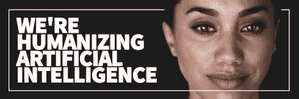
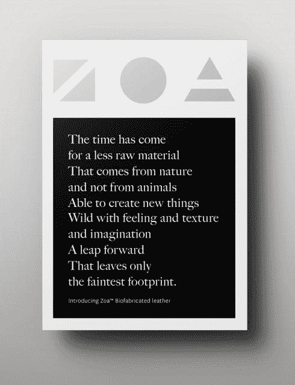
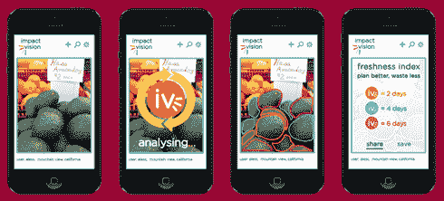
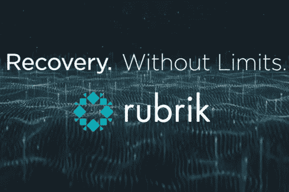
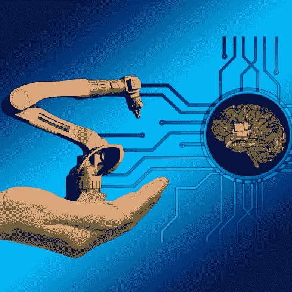
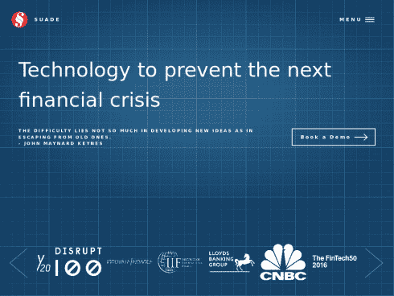
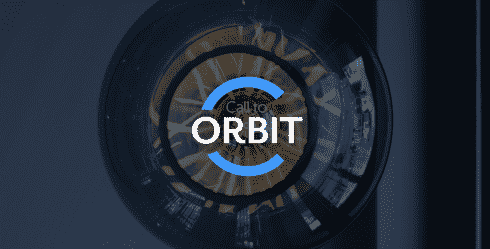

# 8 家试图改变世界的新兴科技创业公司

> 原文：<https://medium.datadriveninvestor.com/a-startup-is-a-company-that-is-confused-about-1-eb1e670b1bcc?source=collection_archive---------13----------------------->

**“一个‘创业公司’是一个对— 1 感到困惑的公司。它的产品是什么。2.谁是它的顾客。3.怎么赚钱。”—戴夫·麦克卢尔，500Startups 联合创始人**

全球各大城市的创业中心和加速器的增长，希望成为下一个硅谷的一部分，这一点无需赘言。尽管大多数创业公司仍然失败，种子资金逐年下降，但创业公司的数量仍在上升。对于已经存在了一段时间的问题或在运行过程中产生的问题，创业世界会继续发展，并提供潜在的解决方案。以下是 8 家新兴科技初创企业，排名不分先后。

**1。** [**灵魂机器**](https://www.soulmachines.com/)

行业:机器人，人工智能

地点:新西兰奥克兰

Soul Machines 通过将技术应用于情感反应灵敏的数字人类，使人与机器之间的界面人性化。他们的使命是使人工智能人性化。这家初创公司创造高度精细的人造人，具有个性和性格，并通过他们的具体化认知平台赋予他们生命。它推出了一款名为“数字 DNA”的产品，其中包括智力和身体特征，可以帮助组织在几分钟内创建一个全新的数字人类，而以前需要几个月。这难道不让人既兴奋又害怕吗？

**2。** [**现代草甸**](http://www.modernmeadow.com/)

行业:生物技术、时尚、环境

地点:美国纽约

Modern Meadow 使用最新的生物技术工具来构建一个新的材料世界，如 Zoa，这是一种基于牛胶原蛋白的生物制造、符合道德和环境友好的皮革替代品。被世界经济论坛公认为技术先锋的 Modern Meadow 是一家成立 7 年的初创公司，其目标是将动物从时尚等式中完全删除。科技赋能的道德时尚潮流？

**3。** [**冲击视觉**](https://www.impactvi.com/)

行业:食品科技，机器学习

地点:美国旧金山

ImpactVision 的愿景是提供一致的食品质量，生产优质产品并防止供应链浪费。这家初创公司使用安装在传送带上方的相机拍摄的食品高光谱图像，并结合机器学习技术，以生产级速度识别与非侵入式食品质量信息相关的化学成分的独特模式，如新鲜度、保质期或污染。ImpactVision 以马士基为首筹集了 130 万美元。高质量检查？

**4。** [**佩塔金**](https://www.petagene.com/)

行业:生物技术，数据压缩，基因工程

地点:英国卡姆布里奇

一家由剑桥博士毕业生创办的基因组数据压缩初创公司，他们预见到数据将被压缩至原来的十分之一，并以更快的速度传输用于研究和分析，在此过程中实现精准医疗的民主化。这家初创公司已经筹集了 210 万美元的资金，由美国风险投资公司 Romulus Capital 牵头，其他未透露姓名的投资者硅谷和伦敦也参与其中，PetaGene 筹集的资金总额接近 320 万美元。数据无处不在，数据就是一切，甚至在你的身体内部？

**5。**

**行业:云数据管理、网络安全**

**地点:美国帕洛阿尔托**

****

**Rubrik 是一家基于云的数据管理公司，成立于 2014 年，通过向公司提供备份解决方案，提供即时恢复、无需人工干预的管理、自动化工作流、轻松的云采用和实实在在的资金节省。该公司估值超过 10 亿美元，以其快速增长和透明的公司文化而闻名。在 D 轮融资结束后，再把 Rubrik 称为初创企业是不是不公平？**

****6。** [**应用脑研究**](https://appliedbrainresearch.com/)**

**部门:人工智能，神经形态计算**

**地点:加拿大多伦多**

****

**一家从事神经形态计算领域的人工智能公司，该公司使用人工神经元以类似于人脑的方式进行计算，但比传统的机器学习算法使用更少的功率。应用大脑研究公司(Applied Brain Research)设计和开发的产品 Nengo 构建的神经形态应用程序，在计算高级、高重现性、前沿的人工智能网络时，比 CPU 或 GPU 消耗的能量少得多。源于自然还是受自然影响的神经网络？**

****7。****

****地点:英国伦敦****

****行业:金融科技、大数据****

********

****Suade 为金融机构提供了一个数据驱动的软件平台，帮助它们适应金融法规的变化。这家初创公司旨在通过在软件平台中提供*监管即服务(RaaS)* 来帮助机构尤其是银行跟上快速变化的监管，从而防止下一次金融危机。该软件允许金融机构处理大量的粒度数据，并通过必要的控制和治理输出所需的监管数据、计算、风险和报告。是时候停止担心另一场金融危机了吗？****

******8。** [**OpenCosmos**](https://open-cosmos.com/)****

****行业:太空技术公司****

****地点:英国哈威尔****

********

****卫星应用市场正在激增，OpenCosmos 正试图在卫星行业建立一个供应链，以实现卫星使用的民主化。该公司的愿景是让卫星更便宜、更容易获得。它计划每年制造 30 颗卫星，并提供完整的端到端服务。在首轮融资中筹集了 700 万美元。民主化进入太空？****

*****图片参考资料:* [*中型*](https://medium.com/@soulmachines/that-may-sound-like-a-line-from-a-sci-fi-movie-and-feel-very-much-like-tomorrows-world-but-it-is-fa29c188abf1) *，*[*Zoa*](http://www.work-order.co/zoa/)*，* [*未来港布拉格*](https://www.futureportprague.com/artificial-intelligence-can-determine-the-quality-of-food-and-its-freshness/) *，*[*PetaGene*](https://www.petagene.com/)*，*[*flex manage*](https://www.flexmanage.com/2017/07/24/rubrik-review-one-stop-shop-for-data-management/)*，*****