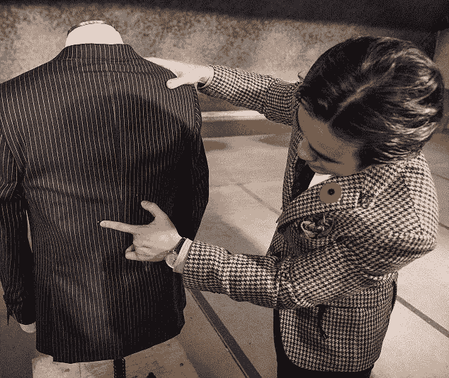

# 一套时髦的盔甲

> 原文：<https://medium.datadriveninvestor.com/a-stylish-suit-of-armor-2e292d4fdb24?source=collection_archive---------19----------------------->

虽然在某些国家穿着防弹背心参加商务会议可能是明智的，但这并不能增进双方之间的信任。

为了解决这个尴尬的问题，加拿大裁缝 [Garrison Bespoke](https://garrisonbespoke.com/custom-suits/bulletproof-suit/) 制作了一套可以兼做防弹衣的衣服。

Garrison Bespoke 与为美国驻伊拉克特种部队提供防护装甲的制造商合作，开发了一种由防弹碳纳米管制成的薄而柔韧的织物。

 [## 我们为军事人工智能做好准备了吗？-数据驱动型投资者

### 今天，算法可能会以迷人的形状出现，例如索菲亚，一个态度可爱、开明的机器人…

www.datadriveninvestor.com](https://www.datadriveninvestor.com/2019/02/21/are-we-ready-for-military-ai/) 

这种材料被嵌入西装的衬里中，在不牺牲风格的情况下给穿着者提供充分的保护。

更重要的是，成品比防弹装备中常用的材料凯夫拉尔轻 50%。

一套定制的三件套西装标价 20，000 美元——比一套普通的线要贵得多，但如果它能救你一命，那就不值一提了。

*本文最早发表于 2014 年的《金融家》。*

【jenserikgould.com】