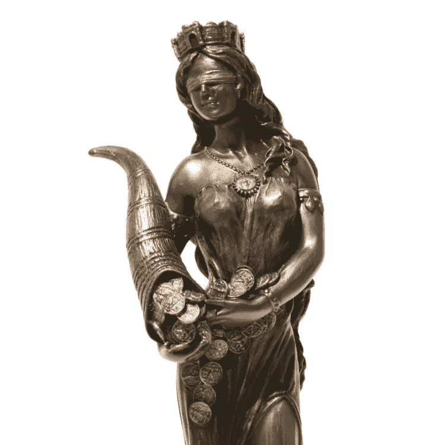

# 一个成功失败的故事。第一部分

> 原文：<https://medium.datadriveninvestor.com/a-successful-fuck-up-story-part-i-d85c35a91d40?source=collection_archive---------17----------------------->

我有个主意。我打算把这个叫做威士忌故事。大约一周一次，在深夜，当我的家人都睡着了，我会给自己倒一杯苏格兰威士忌(我喜欢像 Laphroaig，Talisker，Bowmore 等烟熏的)，然后写作，直到我喝完这杯。

这是威士忌的第一个故事。

回想两年前，可笑的是当时的我是多么的天真。刚毕业的 MBA 毕业生(我是个大器晚成的人，别对我评头论足:)，我的一个朋友向我提出了一个看起来很棒的想法。似乎幸运女神自己也与此有关——我即将步马克·扎克伯格的后尘，进入社交网络之神的殿堂！
我甚至写了一个关于它的[故事](https://medium.com/@shulmanv/a-journey-to-a-startup-bdf556b92cab)

Greek goddess of luck Tyche (direct competitor: Roman Fortuna)

但是，那个 bitc……嗯，很好的女士，对我有其他的计划。
那么，事不宜迟，事情是这样发展的…

当两个工程师有了一个想法时，他们会怎么做？
他们开始工作，他们是工程师！我们第一次谈论这个想法后，没过一天，我们的键盘就因为不停的点击而着火了。我的朋友被一致提名为首席执行官和前端开发人员，我担任 BDSM 和后端开发人员。不要试图谷歌我的角色，或者至少在没人看着的时候私下做。为了省去你的“痛苦”，它代表业务发展、销售和市场营销。老实说，没有销售，但我真的试图找到方法来推动通过，我们都张贴在脸书没有支付哪怕一美元的帖子推广。但是我们的朋友真的很喜欢那些帖子。
提醒自己——朋友会喜欢你所有的帖子，这没什么！

This is me the day after we discussed the idea

那段时期的正面收获很少——AWS 太棒了。几天之内，我就有了一个连接到 RESTful API 的数据库，可以为从零到无数的用户提供服务，这些日子包括从头开始学习 AWS。

杯子空了，所以晚安！

顺便问一下，你知道吗，苏格兰人把它拼成威士忌，而爱尔兰人把它拼成威士忌，多了一个 e。这种拼写上的差异来自于这个词从苏格兰形式和爱尔兰形式的翻译。当提到美国威士忌时，也使用带有额外“e”的威士忌。
[***链接到来源***](http://www.whiskyforeveryone.com/whisky_basics/whisky_or_whiskey.html)

[点击此链接阅读我的下一个故事……](https://medium.com/p/9ea12c359d2e?source=your_stories_page---------------------------)