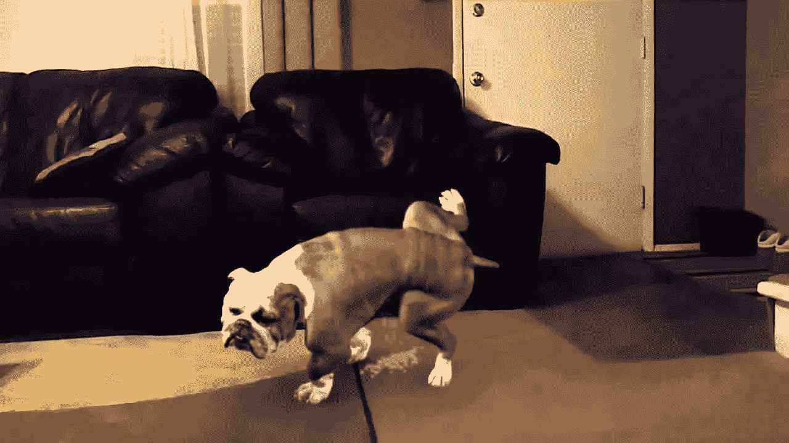

# 一个成功失败的故事。第二部分

> 原文：<https://medium.datadriveninvestor.com/a-successful-fuck-up-story-part-ii-9ea12c359d2e?source=collection_archive---------20----------------------->

威士忌时间！如果你不知道原因，请阅读第一部分。

我的第一个故事有了回应！他说我的故事似乎没有意义。
答:好消息——有人读了，此外，建设性的批评总是受欢迎的。我就是这么学的…

No such thing as bad publicity…

第二，一旦我喝完威士忌，我的数字笔就从我的手指间滑落，我就打瞌睡了。不是因为威士忌。因为整个过程大约从午夜开始……但是说得好——从现在开始我会努力强调我的信息。

不管怎样，我给你讲一个关于香烟，威士忌，和狂野的野女人的故事吧。除了我不抽烟，也没看到周围有什么野女人——我的另一半(也就是妻子)睡着了……但我们不要为此太沮丧——你已经在这里了，所以继续读下去吧。
顺便说一下,《香烟、威士忌和狂野的女人》是一首老歌——不是一首很有名的歌，甚至也不是一首好歌……但我喜欢这首歌是因为我与它相关的回忆……顺便说一下，这首歌与这三首歌都没有关系。

我想这一集我想告诉你的主要事情是想法验证阶段。假设你提出了一个将永远改变人类的想法。你立即掏出信用卡，奔向专利律师，同时用另一只手在笔记本电脑上写代码。至少对我来说是这样…或多或少…好吧，更多。
你有什么资格来评判我？？？:)

If you build it, they will come… Yeah, right…

**不要急！我知道这是错的，但我还是做了。我的意思是，很明显你需要验证一个坏主意，但是你为什么需要验证有史以来最好的主意呢？又是怎么做到的？**

几种开始的方法。

首先和你的朋友和家人谈谈，然后可能和同事、同学等等。当你和他们说话时，不要试图把你的想法强加给他们。相反，问他们一些问题，以了解他们是否意识到你试图解决的问题。如果是，更具体地询问他们对问题的看法，以及他们将如何解决问题。
**这里需要理解的重要一点是**——如果你告诉他们你的解决方案，人们总会同意，并告诉你这是一个很棒的想法。他们不一定是这个意思。大多数人就是不敢当着你的面说硬道理。

另一个——使用平台，如[标枪](https://www.javelin.com/beta)。我只是偶然发现这个，还没有尝试过，但它看起来很有前途。

在你的朋友和你朋友的朋友之间做一个调查(Google forms)……你知道的——通过互联网。有用！你的网友会回复的。

给你一个建议:记住，当你开始向每个人讲述你的伟大想法时，有人可能会试图窃取它。所以，一旦你从你身边信任的人那里得到消息，或许可以申请专利。

在我们谈论法律问题之前，我有一个披露:我不是律师，绝对没有任何相关的教育……我正在和你分享一个专利律师在我咨询一个专利律师时告诉我的。

I am NOT (legally) trained

如果它是某种应用程序或软件，那么最有可能的是，它无论如何都不是关于专利的(但这是你的决定)，所以你将不得不克服有人窃取你的想法的恐惧…这样想，如果你不会告诉任何人，那个想法将与你一起死去。如果这真是一个伟大的想法，那么很有可能在某个地方，有人已经想到了类似的东西。如今这被称为竞争……不管怎样，咨询专利律师总是个好主意，而且不会花很多钱。

这就是专利的问题。当你提交专利的时候，你基本上是把你的想法告诉了全世界。所以现在，一大群等着窃取你的想法的混蛋，把它以 pdf 格式放在网上。我写“亿万”而不是“零”，是为了让你对自己的想法感觉良好。但是你问我们该怎么办？嗯，提交一个临时保留你的提交日期与所有专利权，一年内没有实际公布专利。你可以申请 PCT(一种奇特的国际临时专利),这也给了你一年左右的时间……然后你必须要么申请专利(在每个国家分别申请),要么错过提交日期。因此，如果有人在此期间申请了类似的专利，他们就获得了专利，前提是你决定在期限结束时不申请。
但请记住，就专利而言，作为一家年轻的初创公司，你可能不会有足够的资金对你的专利侵权提起诉讼。所以不要把专利当成防弹衣……还是那句话，找专利律师咨询，如果真的需要专利，要非常慎重的考虑。

该死，我的杯子空了。该睡觉了。晚安！

[点击此链接阅读我的下一个故事……](https://medium.com/p/28a01808eb4d?source=your_stories_page---------------------------)