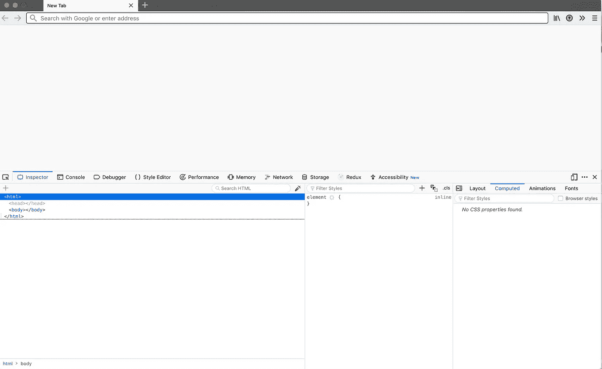
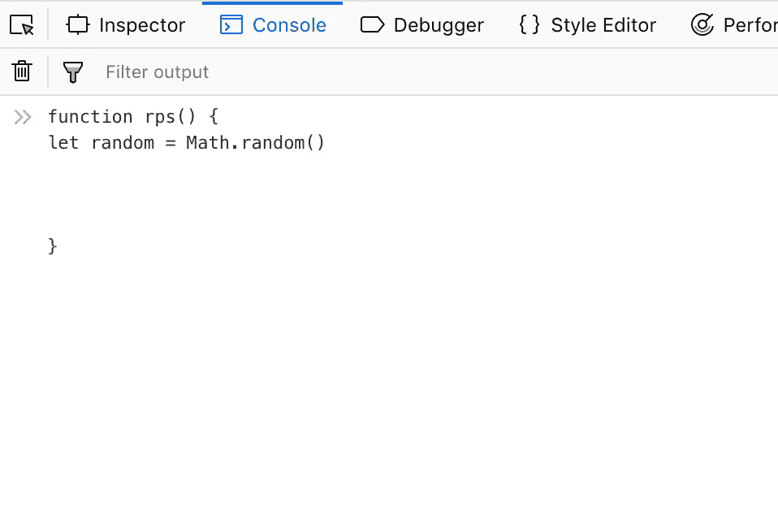
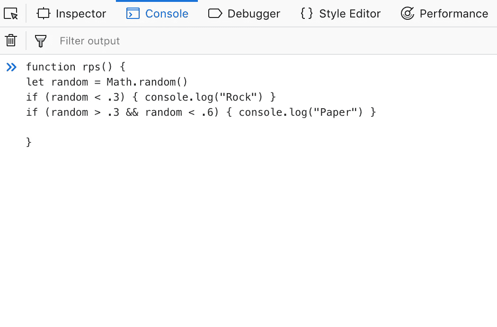
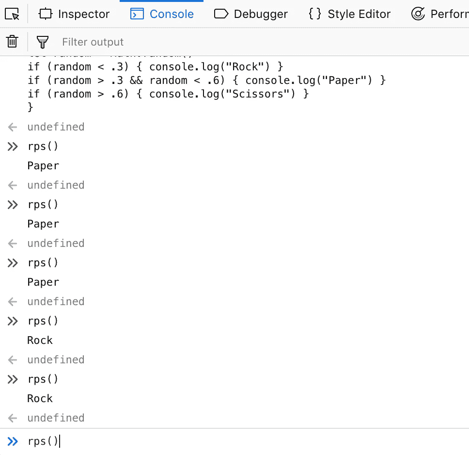

# 一个超级简单的 JavaScript 项目:石头、纸、剪刀

> 原文：<https://medium.datadriveninvestor.com/a-super-simple-javascript-project-rock-paper-scissors-77c3a1c53bf2?source=collection_archive---------3----------------------->


Photo by [rawpixel](https://unsplash.com/@rawpixel?utm_source=medium&utm_medium=referral) on [Unsplash](https://unsplash.com?utm_source=medium&utm_medium=referral)

> *本文是介绍新开发人员在没有框架或任何其他“魔法”的情况下用 JavaScript 构建 web 应用程序的系列文章的一部分。您可以在这里看到***系列的所有文章。**

*注意:如果您了解 JavaScript 的基础知识，您可以直接跳到本系列中任何有趣的文章。否则，如果你想要一个简单的语言基础介绍，请继续阅读！*

*让我们开始我们的第一个练习。不，我们不打算建立一个“你好世界”的应用程序。我不会那样对你的。相反，我们将建造更酷的东西:一个电子游戏。*

*免责声明:从技术上讲，它不会是一款电子游戏。但已经够近了。
我们将构建一个超级棒的基于文本的“石头，纸，剪刀”游戏，最好的部分是你需要的是你正在阅读的浏览器(除非你在手机上阅读这篇文章，在这种情况下，你必须等到你回到真正的浏览器。抱歉。).*

*首先，为了同时写游戏和阅读本文，你需要打开一个新的标签或窗口。完成后，您需要做的就是右键单击页面并从菜单中选择“检查元素”。一旦发生这种情况，您应该会看到类似以下内容:*

**

*打开该面板后，单击“控制台”选项卡。您应该会看到某种类型的箭头和闪烁的光标。干得好！您处于浏览器中通常所说的“开发人员工具”中。基本上，作为一个网络开发人员，这是一个工具，你可以用来测试你的网站或应用程序。我们目前所在的“控制台”选项卡被称为“REPL”。REPL 代表阅读评估打印循环，这基本上只是意味着无论你在 REPL 键入什么都会被吐出来。您现在可以通过键入`'Hello'`(确保在“你好”周围加上引号)来尝试一下。按“回车键”，你会看到浏览器在你背后说“你好”。太棒了，你现在是网络开发者了。你现在将永远处于句子的接收端，“我有一个网站的好主意”。你以后可以为此感谢我，但是现在，让我们用浏览器的 REPL 来构建我们的游戏。*

*既然我们正在构建一个“石头，纸，剪刀”游戏，我们的第一步将是想出一个方法来创建*三个随机输出*。让我们从输入`Math.random()`到 REPL 开始。按“Enter”键后，您会看到 REPL 输出了一个长的十进制数。发生了很多事，让我们把它分解一下。*

# *数学对象*

*大多数解释和执行 JavaScript 的环境(这里是浏览器)都有一组内置的标准功能。该功能的一部分是数学对象。是一个复杂的主题，有很多东西需要解开(可能在本系列的后续文章中)。现在，说对象就像容器就足够了。您可以在其中存储数据，或者像 Math 对象那样，您可以存储 random `function`之类的功能。JavaScript 中的函数可以被认为是一段返回其他类型值的代码。函数可以通过它们后面的括号来识别，例如`()`。在`Math.random()`的情况下，返回的是一个在`0`和`1.0`之间的随机十进制数。我们可以用这个随机数返回“石头”、“布”或“剪刀”。我们来探索一下。*

*为了返回一个值，我们必须使用一个函数。为了定义一个函数，我们使用`function`关键字，后面是我们想要调用的函数，后面是一些括号，最后是一组花括号(`{}`)，在这里我们可以定义实际的功能。*

*在 REPL 中键入以下内容:`function rps() {}`暂时不要按“回车”(如果您按了，也没关系，只需按“向上”箭头键，然后您的功能会弹出来。注意:为了在 REPL 中创建新行，你必须按“Shift + Enter”。只需按“回车”就可以将您的函数定义输入到 REPL 中。*

*在花括号`{}`中，按几次“Shift + Enter”键，给我们的函数定义留出一些空间。在我们的`rps()`函数的第一行，我们将首先定义一个随机数用于我们的选择。在第一行，输入`let random = Math.random()`。这一行基本上是给名为`random`的`variable`分配一个随机值。在 JavaScript 中，变量是一个简单的结构，它可以引用一个值。*

*此时，您应该看到如下所示的内容:*

**

*现在我们有了一个与我们的`random`变量相关联的随机数，我们可以构建我们的应用程序的有趣部分:将“石头”、“纸”或“剪刀”打印到控制台。为此，我们必须使用另一个 JavaScript 概念:T15*

*在 JavaScript 中，我们可以使用`if statement`来执行一段代码，前提是 if 语句中的这段代码(“条件语句”)的值为 true。例如，考虑以下情况:*

```
*if (1 === 1) { return Math.random() }*
```

*这段代码将`return`为一个随机数，因为 1 实际上等于 1(注意:因为我们在 JavaScript 中使用`=`来表示`assignment`，所以我们必须使用两个或三个‘等于’符号来进行相等检查，即`===`)。我们可以使用这个条件流将一个值记录到控制台。*

*在`let random = Math.random()`下面，输入下面的 if 语句:`if (random < .3) { console.log("Rock") }`。我们引入了一个新的功能，`console.log()`，但是它是不言自明的。`console.log()`将圆括号之间的任何值记录到控制台。我们将用它来输出游戏的值。在`if`语句后的括号中，我们有一个条件求值:`(random < .3)`。在我们函数的第一行，我们将`random`设置为`0`和`1.0`之间的一个随机值。现在我们将那个随机值与`.3`进行比较，如果那个值小于`.3`，我们的函数将打印“Rock”。让我们为“纸”和“剪刀”做一些类似的事情。*

*在下一行，输入`if (random > .3 && random < .6) { console.log("Paper") }`。`&&`运算符看起来很奇怪，但基本上它说的是`random`必须既大于`.3` ( `random > .3`)又小于`.6` ( `random < .6`)。如果是这样，我们的函数将打印出“纸张”*

*现在，您的 REPL 中应该有以下内容:*

**

*确保不要忘记任何花括号或圆括号。如果您这样做了，在您按下“Enter”后，REPL 会用红色错误消息通知您，并且您可以通过按下“向上箭头”键来恢复您的功能。*

*让我们给我们的`rps()`函数添加最后一行:
`if (random > .6) { console.log("Scissors") }`。
就是这样！现在你可以按 enter 键，如果你没有得到任何红色的错误信息，那么你的函数就定义好了。你可以通过在 REPL 中输入`rps()`并按回车键来执行它。您应该会在控制台上看到三个选项中的一个:*

**

*恭喜你！这肯定不是编写 JavaScript 程序的最符合人体工程学的方式，所以在以后的文章中，我们将探讨可以使用什么工具来更有效地开发。我们还将探讨一些其他执行 JavaScript 代码的方法，以及在运行 JavaScript 程序时实际会发生什么。现在，玩得开心！*

*感谢阅读。*

**原载于 2018 年 12 月 7 日*[*tndl . io*](https://tndl.io/blog/rock-paper-scissors/)*。**