# 数据、社区和机遇的故事:

> 原文：<https://medium.datadriveninvestor.com/a-tale-of-data-communities-and-opportunities-e63a6047d64d?source=collection_archive---------5----------------------->

## 第 1 部分—MEST 非洲如何支持加纳数据科学人工智能社区的发展

早在去年九月，我就在这里[写了](https://medium.com/@MESTAfrica/can-african-economies-compete-in-the-global-data-and-ai-race-a163e7a299a8)关于非洲国家发展必要的政策、基础设施、生态系统和技能的重要性，以使我们能够更好地接受指数级技术并自己解决我们的本地问题。我很高兴地意识到，过去六个月发生了很多事情，非洲正在准备充分利用第四次工业革命的潜力。

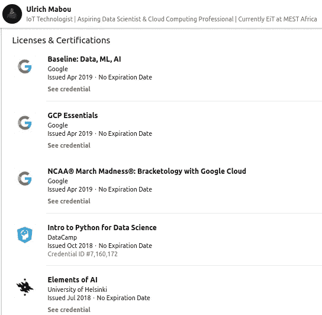

就我个人而言，我试图投入更多的时间来收集数据科学、机器学习和相关领域的技能。感谢[罗伯特·约翰](https://twitter.com/robert_thas)和 MEST 非洲的管理层，我们 MEST 的一些人最近在谷歌云平台(GCP)上做了一些非常有趣的事情。这里是我到目前为止完成的一些任务(一系列特定主题的教程或“实验”)。

这个旅程并不容易，但随着免费学习资源的增加，MEST 社区的支持和对未来巨大机会的希望，我正在缓慢但稳步地装备自己

 [## 对于社区建设，游戏基于数据驱动的投资者

### 从任何意义上来说，珀尔·莫伯斯都是一个游戏玩家。一名活动家、艺术家、角色扮演者和社交媒体项目经理…

www.datadriveninvestor.com](https://www.datadriveninvestor.com/2018/11/16/for-community-building-game-on/) 

在这篇文章中，我将分享我最近在数据科学之旅中和 MEST 社区中参与(主动或被动)的三件重要事情。可以概括为**数据**、**社群**和**机会**。

# 数据:数据上传挑战&黑客马拉松

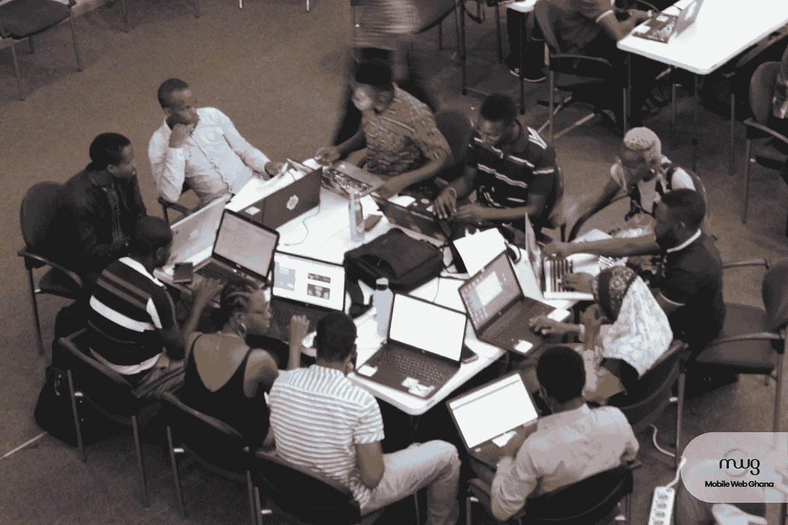

EITs hard at work at the data upload hackathon. Photo from [Mobile Web Ghana](https://twitter.com/MobileWebGhana).

两周前，我和我的一些 EIT 伙伴(MEST 非洲培训企业家)参加了第一届数据上传挑战黑客马拉松。该活动由 [Mobile Web Ghana](https://www.linkedin.com/company/1599383/) 组织，由 MEST 校友 [Florence Toffa](https://www.linkedin.com/in/florencetoffa/) 领导，并得到了[IFC——国际金融公司](https://www.linkedin.com/company/4783/)的支持，该活动向市政技术人员、统计学家、记者、软件开发人员和数据科学家发出挑战，要求他们使用各部和政府机构提供的数据集开发数据可视化和创新应用程序。

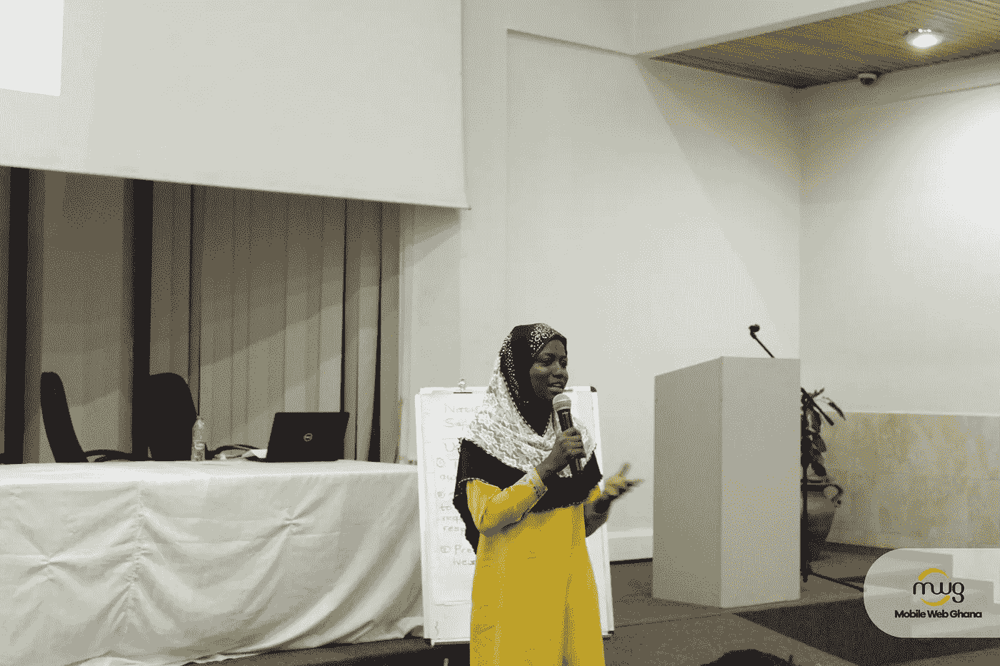

Jamila speaking at the data upload hackathon

政府部委、部门和机构将他们的一些数据集上传到[加纳开放数据门户](https://data.gov.gh/)。我们参与支持[加纳开放数据倡议](https://data.gov.gh/)，因为我们坚信此类倡议有可能对非洲的问题解决和机会创造产生积极影响。在我们自己的**全球开放数据倡导者** [**贾米拉·法鲁克·贾乌拉**](https://medium.com/u/f7afa97cb22a) 的参与下，我们总共有 11 个 EIT，我们分成了两个小组。

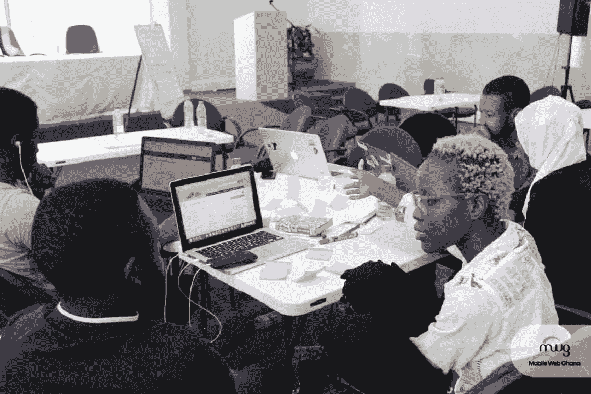

Team Simplify

我们的团队(Simplify)使用来自[注册总署](http://rgd.gov.gh/)和[加纳投资促进中心](http://www.gipcghana.com/)的数据集，开发了一个具有可视化功能的门户网站，帮助企业主了解哪些行业正在蓬勃发展，哪里有外国直接投资(FDI)以及目前在这些行业注册的企业。我们的希望是，从我们的分析中收集的见解可以帮助政府和机构优先考虑他们的预算和执行政策。

我们还希望通过减少他们花在接听公众电话和回答公众问题上的时间来提高他们的工作效率。由于最后有多达 17 支球队投球，竞争非常激烈。虽然我们的团队没有获胜，但我们学到了很多，主要是鼓励和支持**开放数据计划**的重要性。

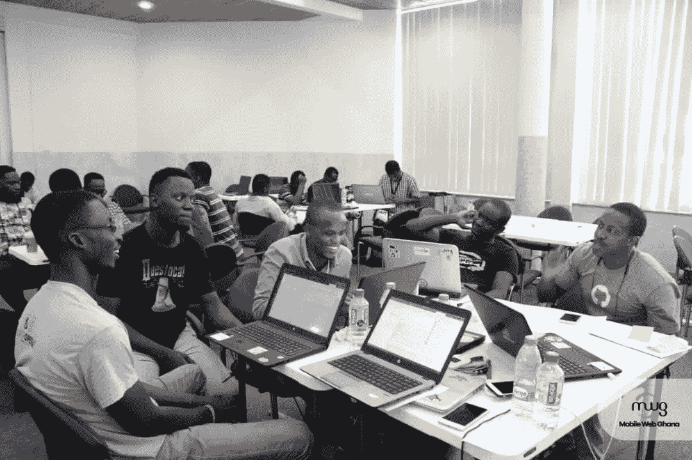

Team AgroIQ (second runner-up at the data upload hackathon)

我们的第二个团队(AgroIQ)获得了第三名，他们用机器学习模型预测了各种农产品的未来价格和产量。他们使用来自[粮食和农业部](http://mofa.gov.gh/site/)(降雨量、历史价格和产量)和[加纳统计局](http://www.statsghana.gov.gh/)(人口统计)的数据集，加上来自世界银行的一些数据集，来预测不同类型作物的未来价格和产量，包括玉米、小米、高粱、木薯、椰子、大蕉、花生和豆类。他们设法在两天内建立了一个非常好的模型和一个直观的 web 应用程序；他们价值主张的核心是洞察力、趋势分析和预测能力。

# 社区:阿克拉实用数据社区

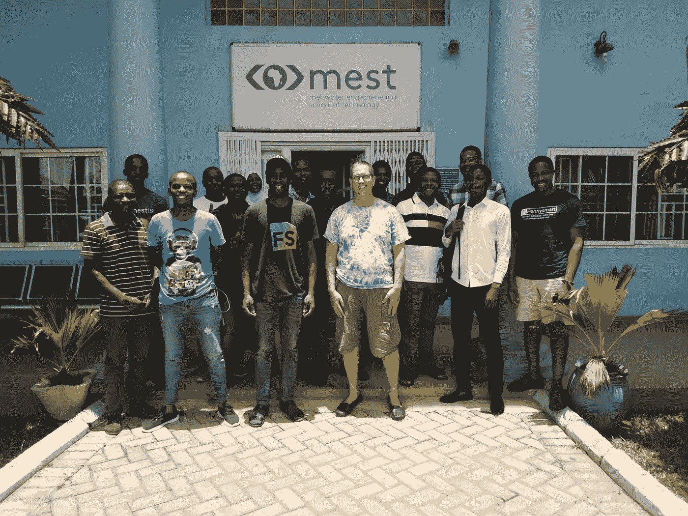

Attendees at the first meetup of the Accra Practical Data Community

在高级教师 [Michael Leventhal](https://medium.com/u/a021b30f6db7) 的领导下，我们早在 2018 年 8 月就开始了 Accra 人工智能社区。这是一个围绕人工智能和机器学习的基于社区的学习小组，专注于以非洲为目标的企业和应用。我们的目标之一是一起学习人工智能，因此每周都会提出一个主题，一个或多个参与者将自愿就该主题提供一个教程并引导一场讨论。

在一个伟大的开始之后，人们开始失去兴趣，这使我们意识到我们花了太多时间讨论理论和应用，而不是学习成为一名数据科学家或机器学习专业人士所需的硬技能。

因此，我们启动了[阿克拉实用数据社区](https://www.meetup.com/Accra-Practical-Data-Community/) (PDC)，目的是在数据科学、人工智能、机器学习和相关领域建立一个可持续的实用数据社区。我们的第一次聚会在 2019 年 4 月的第一个星期六举行。

欢迎点击加入我们的 [meetup 群组，并注册参加即将到来的会议；你也可以点击这里](https://www.meetup.com/Accra-Practical-Data-Community/)加入我们的 [Slack workspace。](http://bit.ly/PDCslack)

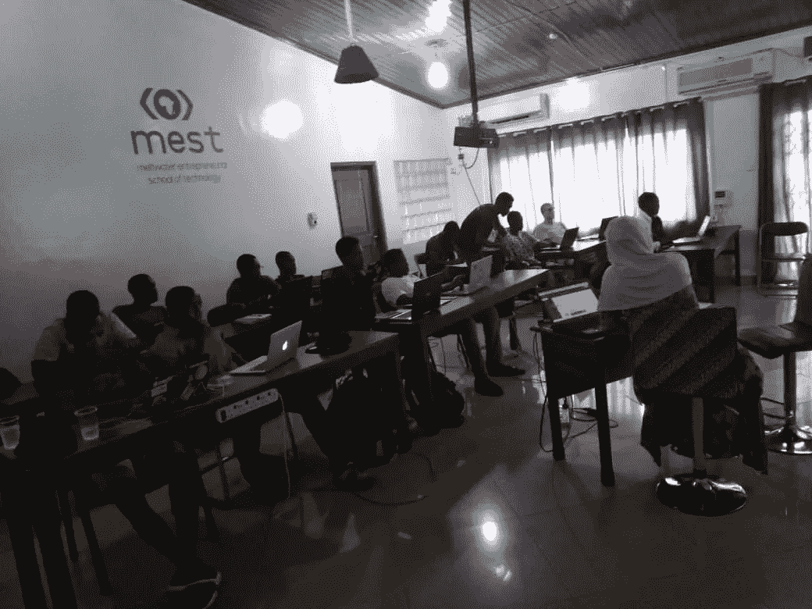

Jamila leading a session on Python programming during a PDC meetup

第一次聚会包括一次与 Funsho Olaniyi 的练习会议，他使用他的团队在数据上传黑客马拉松期间探索的相同数据集向我们介绍了 Python 和 Pandas。你可以看看我们在这次[回购](https://github.com/funsholaniyi/PCD-week-1)中共同涉及的内容。我们以 [Abdulmalik Ibrahim](https://medium.com/u/6796cf7a600d) 关于**数据伦理**的演讲结束，随后是简短的讨论。我们了解到数据伦理的六个原则是:所有权、交易透明、同意、隐私、流通和开放。

# 机会:DataHack4FI 培训计划和竞赛，以及更多…

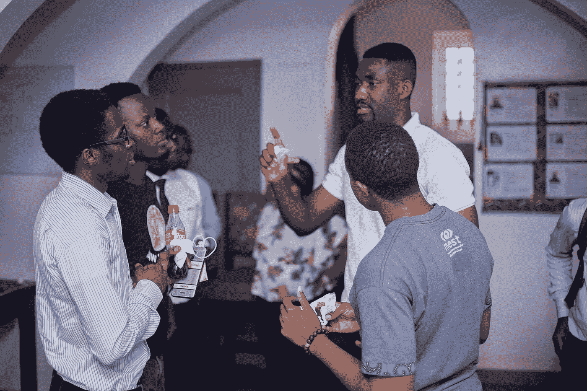

Some of our founding members discussing with the CTO of [Complete Farmer](https://twitter.com/CompleteFarmer) at a recent DataHack4FI event

在过去的四个月里，作为微软数据科学专业项目**的一部分，一些 it 人员一直在认真处理一些数据。他们报名参加了 **DataHack4FI 挑战赛**，这是一项由 [Insight2Impact](https://twitter.com/i2ifacility) 发起的活动，旨在将非洲的数据爱好者和新兴科技公司配对。在完成一些课程模块后，其中六人进入了下一步:顶点工程。**

**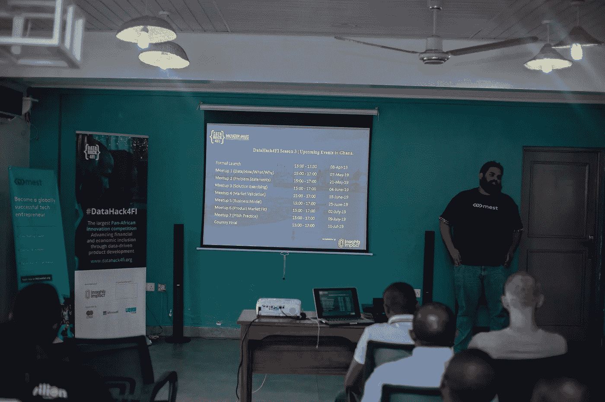**

**[Ashwin Ravichandran](https://www.linkedin.com/in/ashwinravi107/), Director of Portfolio Support at [MEST Africa](https://medium.com/u/40e1b00c8de6?source=post_page-----e63a6047d64d--------------------------------), introducing the DataHack4FI Capstone Project**

**他们每个人都将与一家参与的科技公司配对，开发解决方案，解决当地金融和经济包容性相关的挑战。DataHack4FI 也是每个参与团队向潜在投资者、合作伙伴和客户展示他们开发的解决方案的平台。现在是第三季，DataHack4Fi 今年接受了来自加纳六家公司的申请，包括 MEST 投资组合公司 [Complete Farmer](https://twitter.com/CompleteFarmer) 、Growth Factor Technologies 及其产品 [Nvoicia](https://twitter.com/Nvoicia) 和 [Damansah](https://twitter.com/damansahft) 。**

**在比赛期间，他们都将获得数据科学和商业专家的指导。每个国家的团队都在争夺 5000 美元的种子资金。此外，国内的冠军和亚军将获得赞助，参加决赛，七个国家的团队将争夺 25，000 美元的种子资金。配对的数据爱好者将在各自团队完成顶点项目后获得微软的数据科学认证。**

# **非洲的未来一片光明！**

**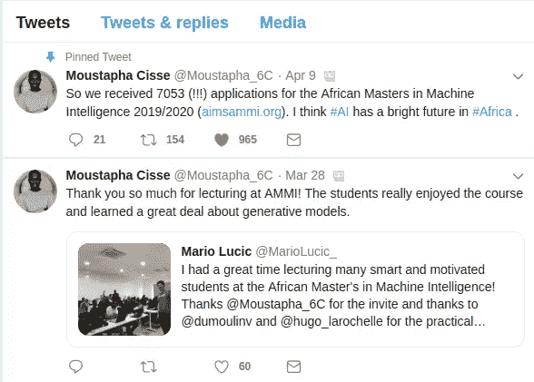**

**Young Africans want to learn data science, AI and machine learning**

**回顾我去年的文章，我报告说只有 T2 和 T4 已经采取措施制定国家人工智能计划。有趣的是，许多非洲国家在过去的几个月里做出了巨大努力来改变这种状况。就在上周，南非总统西里尔·拉马福萨任命了新成立的第四次工业革命总统委员会(4IR)的成员，以努力对国家进行战略定位。该委员会将由总统担任主席，其任务是确定“**相关政策、战略和行动计划，使南非成为具有竞争力的全球参与者**”。**

> **“该委员会将协助政府利用数字工业革命带来的机遇”——南非共和国总统在 2019 年 4 月 9 日星期二的一份声明中说。**

**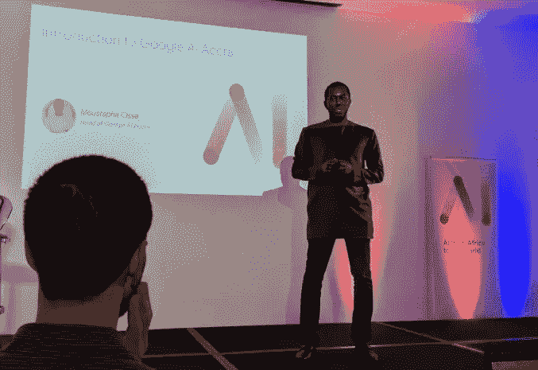**

**Moustapha Cisse at the opening ceremony of Google AI Accra (April 10 2019)**

**还要特别感谢卢旺达政府和加纳政府，感谢他们不断制定政策，促进新技术的学习和应用，并支持他们国家强大的研究和创业生态系统的发展。**

**这也是十多年前 MEST 培训项目最初在阿克拉设立的原因之一。最近的消息是，谷歌上周在阿克拉正式开设了人工智能研究中心**。该中心的初始研究团队由一群来自不同背景和国家的不同个人组成，旨在与加纳和非洲各地的当地大学、研究机构和决策者合作，部署人工智能来解决医疗保健行业、农业、教育和其他行业的挑战。****

****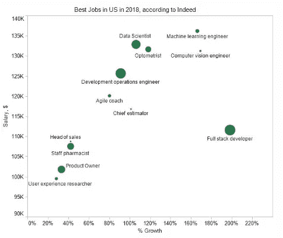****

****正如预期的那样，全球和本地对数据科学和人工智能人才的需求也在飙升。在非洲，MEST 投资组合初创公司 CodeLn 定期收到数据科学家和机器学习工程师的咨询，该公司致力于促进科技人才的测试和招聘。根据 LinkedIn [2018 年新兴工作报告](https://economicgraph.linkedin.com/research/linkedin-2018-emerging-jobs-report)，“**人工智能(AI)将会继续存在。”******

*****Ulrich 目前是 MEST 非洲* *的一名正在培养的企业家。他是一名数据科学爱好者，非常热衷于将物联网和机器学习结合起来解决问题和释放非洲潜力的可能性。他写关于技术、商业、企业家精神和生产力的文章。欢迎在*[*LinkedIn*](https://www.linkedin.com/in/ulrichmabou/)*上与他联系，或者在*[*Twitter*](https://twitter.com/joel_mabou)*上关注他。*****