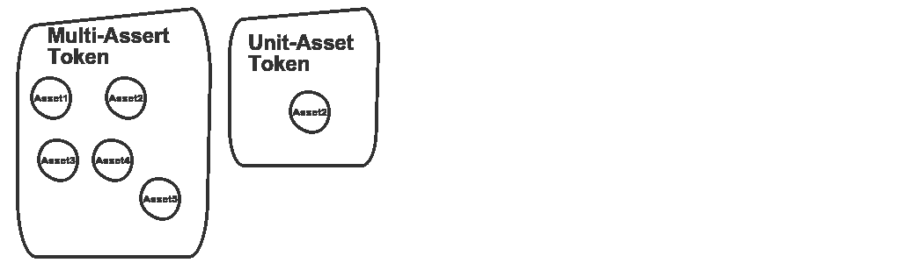

# 用于理解令牌化的非流动资产和安全令牌的分类法

> 原文：<https://medium.datadriveninvestor.com/a-taxonomy-for-understanding-tokenized-illiquid-assets-and-security-tokens-271f0576f9ec?source=collection_archive---------1----------------------->

我最近在安全令牌领域做了一些工作和思考，我发现它非常有趣。安全代币的日益流行部分是由另一个趋势驱动的:非流动性资产的代币化。密码纯粹主义者会认为，从房屋到公共股票，世界上的每一项资产最终都会被令牌化。从这个角度来看，代表非流动性资产的绝大多数代币可能会被不同的监管机构归类为证券，这引发了一场建立平台的热潮，这些平台可以更好地支持证券代币的发行和交易。如果你想了解更多关于非流动资产和安全令牌的令牌化，我推荐俄勒冈大学教授[斯蒂芬·麦肯](https://hackernoon.com/@sbmckeon)的这篇[非凡文章](https://hackernoon.com/traditional-asset-tokenization-b8a59585a7e0)

周末与一位亲爱的朋友和密码领域的思想领袖交谈时，我们得出了一个结论，即围绕资产令牌化领域存在许多困惑，市场的理论和规则仍有待编写。在这种意义上，我决定开始撰写一系列文章，详细介绍我对安全令牌和令牌化资产的一些想法，希望这些想法能够对这场辩论有所帮助。

开始理解标记化资产的一个好方法是分析它的不同形式和变化。在我看来，市场混乱的部分原因是，大多数人以非常笼统的术语谈论令牌化的非流动性资产，而背后却没有真正的金融或数学严谨性。当你开始涉足这个领域时，你会很快意识到，从投资的角度来看，并非所有的令牌化资产都是平等的。

有几种方法可以对令牌化的非流动性资产进行分类，我发现一种有效的分类方法是将基础资产的增值以及向令牌持有者支付定期股息的能力都考虑在内。从这个角度来看，一些令牌化产品能够更好地产生定期股息，而其他产品随着时间的推移会升值。下图有助于说明这一概念。

遵循上图所示的概念，我们可以将令牌化资产和安全令牌划分为几个关键类别。

## 产生股息的证券代币

在这一类别中，我们可以放置证券代币，定期向代币持有者支付股息。这种类型的代币通常利用协议，其中代币持有者需要定期赎回部分代币以便接收定期红利。在出售基础资产或发生其他大型流动性事件的情况下，会向代币持有人支付更大金额的款项。

## 增值证券代币

在这一组中，我们可以放置通常不会产生定期股息，但其价值需要随着时间的推移而升值的资产。遵循这种模式的安全令牌需要依赖于将基础资产的价值与令牌持有价值仔细关联起来的协议。代表私人公司股份的代币、钻石艺术品就是这类产品的例子。

## 混合红利价值证券代币

有一些证券代币模型可以代表产生股息的资产和增值资产的组合。投资这种证券代币的代币持有人可以获得定期股息，同时仍然可以分享基础资产产生的权益。

## 单类与多类安全令牌

市场上的大多数证券都与特定的资产类别相关，如房地产艺术品。可以想象，在未来，我们将会看到代表多种资产类别的证券代币在特定的市场条件下相互对冲。

## 单资产与多资产安全令牌

安全令牌领域的许多初始工作都集中在令牌化单个资产，如一幅画或一个房地产。在这种模式下，资产所有者将获得相当于基础资产估值的代币。不讨论这种模式的好处或挑战，重要的是要知道市场上还有其他选择。安全令牌可以代表作为单个加密单元进行交易的资产池。该模型遵循公开市场中被动投资工具的一些原则。

