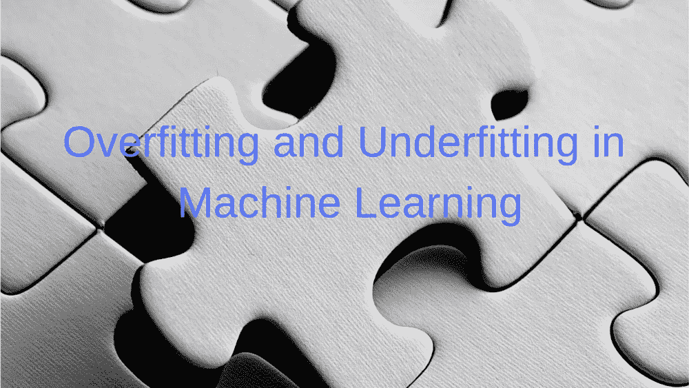

# 机器学习中的过拟合和欠拟合理论

> 原文：<https://medium.datadriveninvestor.com/a-theory-of-overfitting-and-underfitting-in-machine-learning-1a5ff85a8756?source=collection_archive---------12----------------------->

在我之前的文章《机器学习项目 中的 [**挑战》中，我只是触及了*过拟合*和*欠拟合的点。*在这篇文章中，我将对这两者进行更深入的探讨。如果你对机器学习感兴趣，那么你肯定会喜欢这篇关于过拟合和欠拟合的文章。**](https://debuggercafe.com/challenges-in-a-machine-learning-project/)

过拟合和欠拟合是与训练数据相关的两个问题。虽然这两个主要是统计学的概念，但我将尝试从机器学习的角度来处理这种情况。

 [## 金融中的机器学习——数据驱动的投资者

### 在我们讲述一些机器学习金融应用之前，我们先来了解一下什么是机器学习。机器…

www.datadriveninvestor.com](https://www.datadriveninvestor.com/2019/02/08/machine-learning-in-finance/) 

# 过度拟合

从一个简单的例子开始。假设你去超市买了一些食物。你看到一个特别的苹果品种，就买了下来。当你在柜台结账时，你要知道它们太贵了，质量太好了。在回家的路上，你开始想苹果已经变得多贵了。

上述情况的问题在于，你仅用单一品种的苹果概括了整个“苹果成本”场景，而事实并非如此。这叫做过度概括。当同样的事情发生在*机器学习*中时，这被称为过度拟合。

过度拟合是指学习模型在训练数据上表现非常好，几乎捕获了所有特征的情况。但是当涉及到概括一些未来的数据时，它做得很差。

下图可以被认为是一个简单而精确的过度拟合的例子。

# 为什么会出现过度拟合？

过度拟合的主要原因可以归因于这样一个事实，即一个非常复杂的模型被用于一个可以用更简单的模型学习的数据集。在这种情况下，模型会尝试捕获噪声和异常值，并开始寻找它们之间的关系。

# 过度拟合的解决方案

过度拟合的两个最常见的解决方案是:

*   *可以尝试减少数据中的噪音和离群值。这可以在预处理阶段完成，这是任何机器学习项目中的常见阶段。*
*   你也可以尝试收集更多的数据。这样，模型将很难找到噪音之间的关系，并试图概括实际相关的数据。

但以上两步只是开始。您也可以尝试设置超参数和提取新要素。在某些情况下，他们往往工作得很好。

# 欠拟合

适配不足与适配过度正好相反。该模型发现甚至很难找到相关底层结构之间的关系。

机器学习中的线性模型最容易欠拟合，尽管情况并非总是如此。但是当这种情况发生时，即使在训练集上，模型也是不准确的。下面的图片会让它更加清晰。

# 解决办法

最常见的欠拟合解决方案是选择比所用线性模型更复杂的模型。它可以帮助更好地捕捉特征并找到模式。你也可以玩玩特征，试着从数据中提取更多的相关特征。

# 结论

这是一个简短的概念概述，但我希望你喜欢它。分享一下，竖起大拇指。关注我 [**Twitter**](https://twitter.com/SovitRath5) 定期更新我的文章。

标签:[数据分析](https://debuggercafe.com/tag/data-analytics/)、[数据科学](https://debuggercafe.com/tag/data-science/)、[机器学习](https://debuggercafe.com/tag/machine-learning/)

*原载于 2019 年 3 月 18 日*[*debuggercafe.com*](https://debuggercafe.com/a-theory-of-overfitting-and-underfitting-in-machine-learning/)*。*