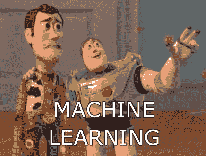
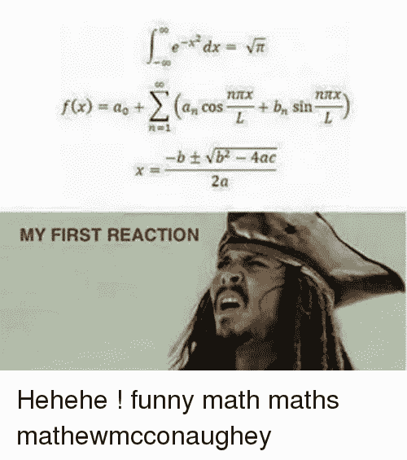
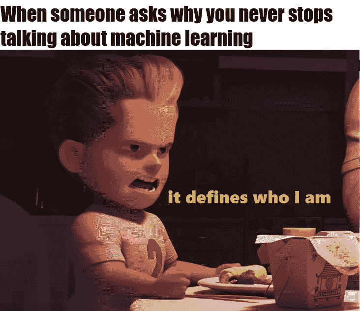

# 关于机器学习的思考。

> 原文：<https://medium.datadriveninvestor.com/a-thought-of-machine-learning-4ce3ea590b22?source=collection_archive---------11----------------------->

有没有想过机器学习？

这一切都始于我的文凭时代，我从我的一个同事那里听到了一个词“机器学习”。那是我拿到文凭的第二年，我听到了“机器学习”这个词，所以我的脑海中出现了大量的问题。什么是机器学习？这个术语是从哪里来的？它能解决什么样的问题？机器会自我学习吗？如果会，那是如何学习的？机器学习是。机器学习从哪里入手？等等。而且这么多。

**Me & My friend :)**

我打开谷歌，开始搜索脑海中出现的问题，但当时我并没有更多地了解机器学习，因为机器学习、人工智能、深度学习这些术语对我来说是新的，令人困惑。所以我没有深究这些话题，因为这些话题超出了我的教学大纲，在我的大学里，没有人真正知道它是什么。我班上大约 80%的学生不知道这些术语，大约 20%的学生只是听说过这些词，但没有人真正知道它到底是什么。所以我停止了搜索，继续我的文凭课程。但是我有“机器学习的想法”。

作为一名文凭学生，我刚刚开始学习我的第一门编程语言 C，并有兴趣探索其他编程语言，如 C++和 python。在我的第三次 sem 结束时，我尝试使用 python，因为它的语法比我所知道的任何其他语言都要简单得多。Python 不在我的文凭大纲中，但我喜欢用 python 编程，因为它更容易，更易读，而且很可能是自动化枯燥东西的最佳语言。随着时间的推移，我有了“关于机器学习的想法”,我的第四次 sem 开始了，我想更深入地研究 python，我听说 python 也因机器学习而闻名，我的脑海中再次出现了问题 python 用于机器学习？现在我对了解曼梯·里更感兴趣，也更兴奋了。我在 YouTube，Google 等上搜索了一些课程。我终于找到了一个家伙 Siraj Raval(一个 YouTuber)谁张贴关于 ML，AI，DS 的日常视频。感谢 Siraj 先生，因为他我知道了什么是 ML 以及如何开始。我开始了解 ML 的类别，ML 的分类，它可以解决什么样的问题，如何开始机器学习，一些 ML 算法，以及更多，但我所知道的只是理论。我真的很想做些实际的事情。Siraj Sir 为 ML 制定了一个课程"[在 3 个月内学会 ML](https://youtu.be/Cr6VqTRO1v0)"，我开始遵循他的课程，但我机器学习之旅的障碍是数学。是啊！数学。

在我的文凭时代，我有一个数学基础(M1)的 KT，我不喜欢数学的原因是它更令人困惑，它的符号，导数，部分分数，矩阵，积分，三角函数，等等。但是在知道了这么多之后想更深入的研究机器学习。我试着学习数学，我从线性代数开始，在知道了大部分的东西如矩阵，向量，标量，范数之后。接下来，我从微积分开始。一步一步地，我学到了很多。到目前为止，我学到了很多。我知道 ML 的一些算法，我可以用 ML 解决一个问题。我仍然记得我处理的第一个 ML 问题是将电子邮件分类为垃圾邮件或非垃圾邮件，我应用我的 ML 技能来预测房价。我已经完成了我的文凭，现在我正在深入 ML 领域。

这就是我的旅程，它始于一个想法，一个关于机器学习的想法。我写这篇文章的主要动机是，机器学习和人工智能在未来，除了许多公司雇佣 ML 工程师之外，机器学习正在帮助每个领域的人们，从金融到医疗保健，从生物学到数字营销(通过提供见解)，电子商务，从检测癌症到检测欺诈，等等。

从小做起，从基础做起。没有什么是不可能的。你只需要一个想法。谢谢大家！

在 [LinkedIn](http://linkedin.com/in/jiten-patel-jp) 上与我联系。