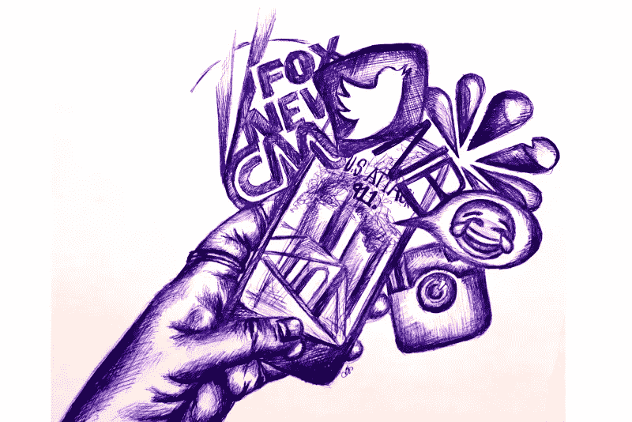
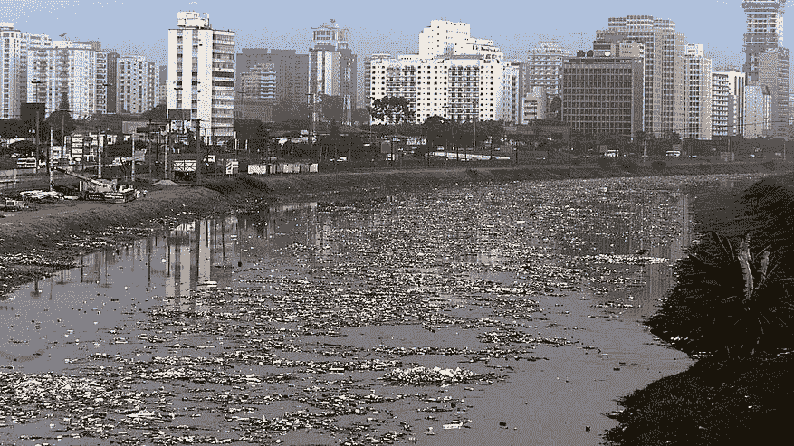
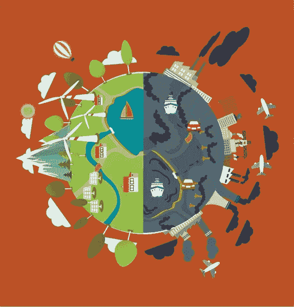
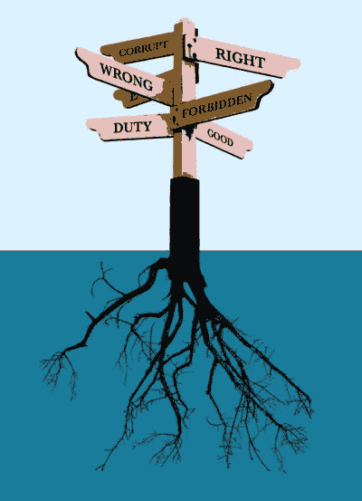
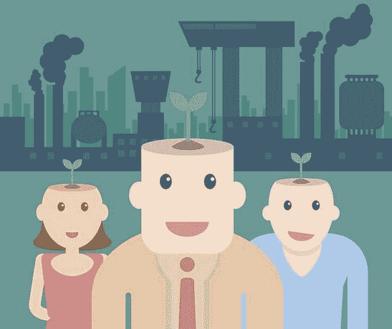

# 在敏感的车道上思想漫步，寻找复活的指标。

> 原文：<https://medium.datadriveninvestor.com/a-thought-walk-on-the-lanes-of-sensitivity-searching-the-indices-of-resurrection-8048c9b2f886?source=collection_archive---------22----------------------->

> 生活中的变化难以捉摸，昨天的繁荣是今天的祸根

## 导致麻木不仁的社会诅咒

The Gen X will never experience nature as millenialsdid, but to understand the profundity they are just too busy in own world.

我们今天都在为梦想、欲望、奢侈和舒适而赛跑。我们的生活就是围绕着这四个字。我们来到这个世界，我们渴望并梦想着它。我们为自己的欲望而工作，这些欲望通常是奢侈品和舒适的子集。这就是我们的生活。

但是有一个环节是我们都集体忽略了的“敏感”，对社会的敏感，对地球的敏感，最重要的是对我们自己心灵的敏感。问自己一个问题，上一次你因为在最后一刻你的头脑说“不，这在道德上是不正确的”而克制自己不去做某事或活动是什么时候？这个答案会提醒你，你的头脑是整个宇宙中最纯粹的真理。

对自己心灵的敏感使你成为与生俱来的那种人，它赋予你独特的能力、独特的目标和独特的个性。但是今天整个游戏都变了你不是原创，但是我们现在不得不说，原创不是那么简单！这些正是我们的所作所为，让我们沦落到如此狼狈的地步。

我们限制了自己，奴役了我们的思想，只是为了跑这场比赛。这个种族充满了错误的观念，充满了自私自利的贪婪。在赛道上，我们是如此的麻木，以至于忘记了我们的行为是有后果的。全球变暖是这种后果的最大例子。然而，我们还没有吸取任何教训。污染不是根本原因，根本原因在于我们，在于我们对自己行为的麻木。或者我们对社会责任的无知迷失在自己的世界里。

## 不假思索的发展

LEARN FROM HISTORY STOP UNTHINKING DEVELOMENT.

我们有了未来的愿景，非常努力地去实现它，成功地实现了目标，取得了丰硕的成果，做了成功的分析，得到了完美的实验结果，所以现在我们都准备好去改变现实，实现我们的愿景。但是残酷的事实发生了，设想的未来是基于初始条件的！在实现梦想的路上，我们破坏了和谐的初始条件，只是为了淡化我们的愿景。历史上的每一个事件都发生了同样的事情。

例句:天然气和内燃机的发现旨在为社会的工业发展提供燃料，以获得一个完美幸福的未来。但接下来发生的是干渴的现实不断打着嗝。

## 喜事

The left or the right the ball is in your court .

学习历史是为了避免错误，但历史教导的力量却被贪婪的执念大大打败了。如果用环境敏感性的观点来研究 IC 点火的发现，我们将在合成栖息地的规模上远远落后，但在环境幸福的规模上远远领先。

让我们来看看我们的进化，首先，我们都是人类，然后我们被分为种族，然后是国家公民，然后是宗教，然后是种姓，如果这种趋势继续下去，人类就处于危险之中。在前面提到的四个词后面，我们已经失去了真正的团结精神。我们都应该有梦想，我们应该渴望成为某个人，但不要失去敏感的头脑。

更重要的是，现在我们有大量的由内战、宗教信仰、政治意识形态引起的人类冲突，我们在某些地方失去了我们的移情特征。有人说我们已经变成了公司机器，这是真的，但不同的是，机器可以被逆转，公司机器甚至不能被自己控制。

例句:送货员被“30 分钟或免费”的恐惧所机械化，首席执行官脑子里只有收入和生产力，员工被困在调整日常目标中，没有机会说话和分享想法。

强迫劳动、恶劣工作条件、工作场所骚扰和独裁垄断的情况越来越多。

我们怎么能相信这样的公司结构能设计未来呢？

## 法律

Just waiting for the law to step in is an act of ignominy.

关于道德与法律的争论越来越激烈。道德与真正的自我意识形态有关，伦理与社会创造的意识形态有关，法律是由政府权力根据民选代表所相信的意识形态而创造的。我们确实相信法律是基于社会的道德原则，但是社会具有如此多样化和对立的特征，以至于基于社会道德的法律是虚构的作品。很多时候，我们自己都被困在道德、法律和伦理的选择中。因此，敏感政府的理念还有很长的路要走。

## 那么新的希望在哪里？

Such a shameful period of time, humainzing humans is need of hour.

## 正念敏感性

自然不是孤立的；这是我们社会的一部分。让我们考虑一些社会原因可以催化复活的例子

1.  拥有一辆车仅仅象征着地位，真的是发展吗？
2.  每年换手机是必须的吗？
3.  对于广大合作者来说，有必要创造伪需求吗？
4.  如果一个人引起了一些关注，是否有必要通过给这个人贴上反科技或反国家的标签来显示他的极客身份？
5.  有必要有文化鸿沟吗？

这份清单是个人印象，下一件大事是与自然甚至与人类的关系。因为自然是我们的一部分，我们需要对他产生同理心，但残酷的现实是我们也失去了对人类同胞的同理心。制造了大量的社会污染。在资源分配、空间分配、教育方面存在差异，就像在许多大都市看到的雾霾一样。仇恨和愤怒也像森林大火一样迅速蔓延，所以在我们将自己人性化之前，将自然人性化是没有用的，因为人性化的社会将导致仇恨、贪婪和愤怒的减少，这反映了一个积极的社会，也将抑制减少污染，因为价值观变得丰富了。

## 自然是可逆的，它可以自愈！但是需要保持准微分区间。

大自然本身是一个强大的新陈代谢者，它最终会找到方法从我们对它的轰炸中重建自己，大自然有科学仍然无法解释的愈合机制，尽管随着科技的进步我们可以找到答案。从永恒之初，大自然就逆转了所有的天启。这次不同了，我们是自己房子的敌人，因为大自然无法应付我们为了满足贪婪而破坏它的速度，贪婪导致了反乌托邦。

生态是复杂而微妙的，环境修复可以是自然的，但我们需要催化它。深层生态学原理指出，自然界是复杂相互关系的微妙平衡，其中生物的存在依赖于生态系统中其他生物的存在。

> 有争议的“盖亚假说”指出
> 
> “生物体参与碳循环，作为维持适合生命条件的复杂过程之一。”

催化我们复兴的行动并不像看起来那么困难，只是对每一个行为都有一个内在的意识就能取得惊人的结果。只有你能定义你的行为，但请记住蝴蝶效应。

> 对初始条件的敏感依赖，在这种情况下，一个确定性非线性系统的一个状态的微小变化会导致后面状态的巨大差异。

这项任务并不难，只要我们对社会的一点点帮助，就能取得超出战略分析预测的结果。

因为

> 种在陌生土地上的树苗永远不会开花，但果园里的树苗却会成群结对地开花。

这篇文章受到了《印度教徒报》的一篇文章的启发。