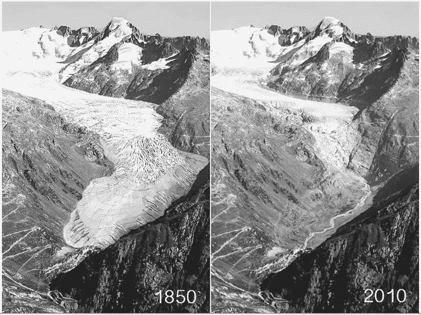
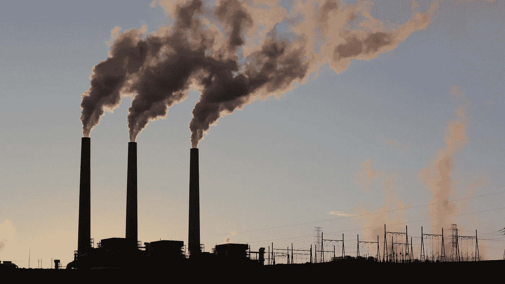
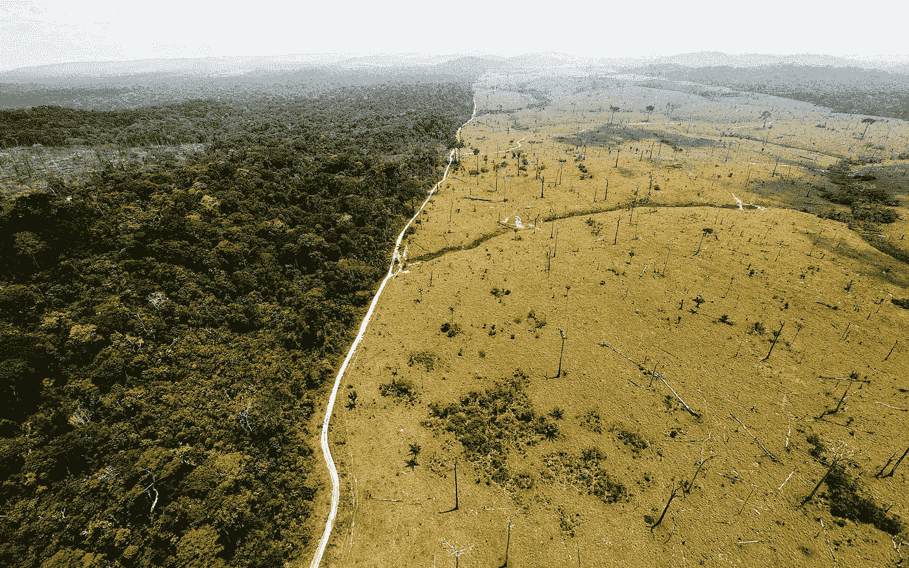

# 定时炸弹:为什么气候变化解决方案不能再等了，我们能做些什么来帮助

> 原文：<https://medium.datadriveninvestor.com/a-ticking-time-bomb-why-climate-change-solutions-can-no-longer-wait-and-what-we-can-do-to-help-4a3122b741dc?source=collection_archive---------12----------------------->

几十年来，气候变化这一敏感话题经常被推到一边，搁置一旁，大多被遗忘，没有得到应有的重视。这是一个可以一直等待的问题，一个永远不需要紧急解决的问题，因为其他人可以接管。由于非信徒的影响和巨大的政府权力，警告从来没有被重视，而在很长一段时间内很少或没有取得进展，以扭转其对世界的影响。现在，作为一个物种，我们已经走到了历史的十字路口，我们关于气候变化的决定要么让我们更好地生存，要么让我们最终灭绝。

在这段时间里，我们甚至没有意识到是我们的*星球*一直被搁置，变得如此温暖，以至于许多已经发生的变化都不可逆转。科学家们有机会修复它们的希望现在已经破灭了，这使我们除了适应即将到来的变化之外，别无选择，只能适应现在的变化。事实上，即使世界永久停止**所有的**碳排放，地球的温度仍然会上升，许多栖息地的破坏，包括许多极地冰盖，也不会完全停止。考虑到这些令人痛心的事实，专家们认为未来 11 年是我们历史上最关键的 11 年。

目标是到 2030 年将全球碳排放量减少三分之二，希望将全球气温上升控制在 1.5 摄氏度以内。如果我们成功做到这一点，那么随着人类采用更多的清洁能源来防止进一步的问题，世界气候变化的影响可以得到更好的管理。如果我们不这样做，目前 95%的人认为这种可能性会发生，地球将进入一个积极的强化循环，一个无法控制的全球气温将超过平均 4.5 摄氏度或更高的循环。在这种情况下，人类几乎无法阻止气候变化，因此，现在比以往任何时候都更需要人们停止将气候变化问题搁置一边。我们需要接受现实，这不再是一个问题…这是一个**危机**！

The Rhone Glacier, one of the most popular among tourists, has been shrinking because of climate change despite measures being taken to protect it. **Source**: www.researchgate.net

随着特朗普政府不断撤销关键的环境立法，危及我们以及子孙后代的安全，这场战斗对我们来说将是漫长而令人恼火的。这是彻头彻尾的可耻，甚至他的政府试图给他看最近的严重报告，只是让他回应说，“我不相信。”由于他的议程，我们现在在反击的进程中落后于其他国家，甚至是中国，世界上最著名的污染者之一。光是这一点就绝对令人尴尬，并表明我们已经堕落到什么程度，这是向所有美国公民发出的信号，即我们必须尽一切可能抵制他的计划。

在最近一期的《山脉》杂志中，小说家金·斯坦利·罗宾逊在她的文章《没有 B 星球》中描述了我们是如何进入所谓的人类世或“人类时代”的气候科学家创造了这个术语，以回应人类如何以如此前所未有的速度快速改变环境，我们唯一能做的就是确定我们是将它变成一个好的人类世还是一个坏的人类世。一个好的方案将允许我们调整我们的生活方式以适应不断变化的世界，但这些调整将足够稳定，以便我们可以停止进一步的碳排放，拯救地球免受进一步的破坏。金在文章中强调，“如果我们继续燃烧古老的碳，开采土壤，夷平森林，我们可能会走向地球历史上第六次大灭绝事件。如果我们忽视人为变化的后果，那么饥荒、战争和流行病可能会因破坏地球的生命支持系统而产生。一个糟糕的人类世会有多糟糕，这一点怎么强调都不为过。”

然而，她也暗示了从大气中去除碳的潜在方法，并有助于弥补我们的环境愚蠢行为。她建议，“值得研究机械地从空气中过滤二氧化碳，然后掩埋它的潜力，或者直接将碳结合到岩石上，尽管在全球范围内这样做可能会有相关的问题。”话说回来，植树、恢复森林面积、关闭煤炭工厂、改用混合动力汽车只是我们可以开始减少碳排放的众多方式中的几个，但前提是每个国家都尽自己的一份力量。总的来说，她提醒人们，“让大气中的二氧化碳含量回到百万分之 350 左右，将是创造一个美好的人类世不可或缺的一部分。”

她接着提到了一个非常独特的想法，也许没人想到这么多:将海水抽到覆盖南极洲东部的冰帽上。这可能有助于弯曲并可能逆转冰川融化，因为水在冰川上结冰，根据波茨坦气候影响研究所的研究结果，这一努力在经济上有可能实现。输送足够量的水需要全世界总发电量的 7%,因此，尽管这是可能的，但像美国这样的政府可能会发现，考虑到它们的财政日程，这在经济上是不利的。因此，我们需要拆除阻碍达成真正解决方案的破坏性政治和经济壁垒，正是这些壁垒助长了肮脏的煤炭和其他化石燃料资源。

A diagram that illustrates the sources of carbon emissions. **Source**: [https://www.wri.org/blog/2006/10/greenhouse-gases-and-where-they-come](https://www.wri.org/blog/2006/10/greenhouse-gases-and-where-they-come)

金补充说,“为了适应气候混乱和人类世的混乱，我们能做的最重要的事情就是重新思考假设，修改企业资本主义的规则。毕竟，当前的经济秩序虽然庞大，但不是永久的或不可改变的。大多数人通过亲身经历知道资本主义有多糟糕，因为利润被放在其他人的福祉之上，也许美国需要一个像民主社会主义这样的新制度。为了战胜气候变化，我们将需要开始一个重大的政治转变，以便满足每个人的需求，并且像社会主义这样的制度倾向于满足每个人的需求，而不仅仅是精英阶层的需求。

令人欣慰的是，美国已经出现了急需的变化，其中之一就是逐步淘汰煤炭行业。在 CNN 的马特·伊根最近发表的一篇文章中，太阳能和风能开始在美国蓬勃发展，而煤炭正在成为不合适的能源。具体来说，公用事业规模的太阳能发电预计今年将增长 10%，2020 年增长 17%，而风能将从 12%增长到 14%，首次超过水力发电。从曾经非常昂贵的资源中，这两种资源现在已经准备好在未来几年中引领潮流，因为价格会继续下跌，这给了我们进一步对抗煤炭所需的推动力。

**Source**: [https://www.nbcnews.com/video/coal-fueled-plant-closes-a-crisis-for-native-american-workers-1117675075784](https://www.nbcnews.com/video/coal-fueled-plant-closes-a-crisis-for-native-american-workers-1117675075784)

此外，2018 年，燃煤电厂的电力份额降至 28%，与 2010 年的 45%形成鲜明对比。预计 2020 年将降至 24%，2018 年美国煤炭消费量下降 4%，至 1979 年以来的最低水平。随着对气候变化的担忧越来越大，许多家庭和企业计划安装太阳能电池板来生产更清洁的能源，对更清洁能源的竞争正在将大型煤炭推向灭亡。这与绿色和平组织和塞拉俱乐部(Sierra Club)等组织相结合，这些组织正在不知疲倦地努力让更多的燃煤电厂退役，希望特朗普推广这种肮脏资源的目标将受到阻碍。

至于管理气候变化影响的技巧，Vox 的 Eliza Barclay 和 Umair Irfan 的一篇文章强调了正在发生的一些有趣的变化，以及个人和整个国家如何能够发挥作用。其中之一是给碳排放定价，这样人们就有动力转向更清洁的能源，甚至像埃克森美孚这样的公司也希望实施碳税。Barclay 和 Irfan 解释说，到目前为止，[大约有 40 个国家已经在为这些排放定价，限额交易计划也在进行中，除了中国拥有最大的碳交易市场之外，还包括欧盟的排放交易系统。](https://www.vox.com/2018/10/10/17952334/climate-change-global-warming-un-ipcc-report-solutions-carbon-tax-electric-vehicles)中国再一次超越美国，为更美好的未来铺平了道路。

此外，有人说要用电力和生物燃料汽车取代所有使用化石燃料的汽车。2017 年，[中国、印度和一些欧洲国家宣布，他们将最终停止销售所有的天然气和柴油汽车，中国甚至向电动汽车和公共汽车制造商提供激励措施，向购买电动汽车的客户提供平均每辆至少 10，000 美元的补贴。](https://www.vox.com/2018/10/10/17952334/climate-change-global-warming-un-ipcc-report-solutions-carbon-tax-electric-vehicles)这些发展充其量只能说是惊人的，所以也许我们可以开始指望像刚才提到的两个国家这样的主要污染国开始彻底改变我们解决环境问题的方式。美国需要恢复其先前的领导力和影响力，特别是在巴黎气候协议方面，以便让世界其他国家也参与进来。我们在主席任期内的行动非常不利于其他人设定的目标。

零毁林供应链也开始形成。当然，很难从世界的另一边关注森林活动，因此与当地社区密切合作对于防止更多的森林被破坏至关重要。挪威是目前反对砍伐森林的主要国家之一，确保产品，包括那些需要棕榈油的产品，不会来自可怕的过程。伟大的事情是，如果森林砍伐可以大大减少，同时也补种失去的补丁，[每年可以从大气中消除 70 亿公吨，这相当于摆脱 15 亿辆汽车！](https://www.vox.com/2018/10/10/17952334/climate-change-global-warming-un-ipcc-report-solutions-carbon-tax-electric-vehicles)

Deforestation is another major source of climate change throughout the world. **Source**: [https://www.wired.com/2015/04/using-smart-satellites-to-monitor-deforestation-from-space/](https://www.wired.com/2015/04/using-smart-satellites-to-monitor-deforestation-from-space/)

除了植树、循环利用、在家里使用更清洁的能源以及其他简单的补救措施之外，将你的饮食改为植物性饮食也是一个很好的方式。从牲畜中生产牛肉和奶制品实际上造成了 26%的碳排放，这足以说服社会对每个公民的饮食计划进行重大改革。不幸的是，这是我们生活中最难调整的方面之一，因为如此多的人习惯于随心所欲地吃东西，所以主张限制和强制消费牛肉/乳制品将是一个巨大的风险。再一次，[像中国这样的国家已经将减少肉类消费的目标纳入他们的饮食指南](https://www.vox.com/2018/10/10/17952334/climate-change-global-warming-un-ipcc-report-solutions-carbon-tax-electric-vehicles)，所以我们有责任加快步伐，为这个星球上的每个人的利益尽我们的一份力量。

作为一个物种，无论我们决定做什么来弥补我们的错误，我们必须现在就做，否则就太晚了。窗口正在迅速关闭，所以这意味着每个人都需要努力，至少努力让自己的生活和子孙后代的生活发生真正的变化。的确，这些新的发展和创新给了我对未来的希望，但这并不意味着我们应该把它们留给别人独自承担。请记住，我们都让自己陷入了这个困境，所以我们需要共同承担责任来摆脱困境。如果我们能够齐心协力，抛开文化、经济、政治和宗教差异，那么我毫不怀疑我们将拯救世界。