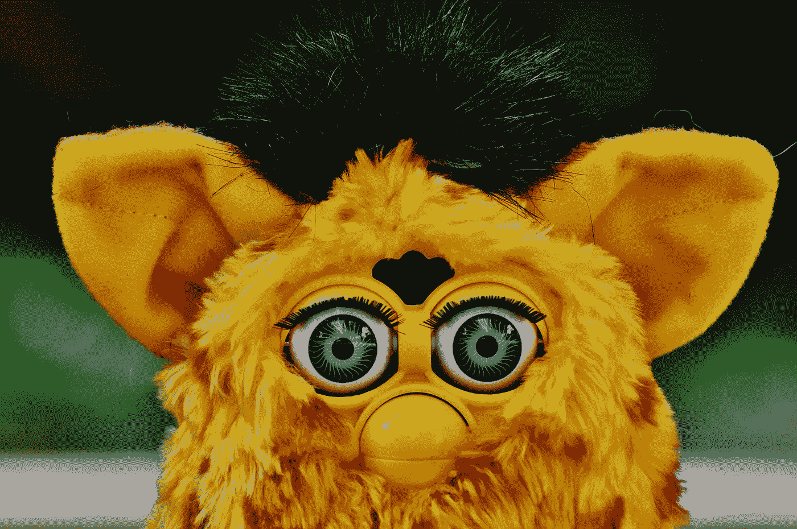
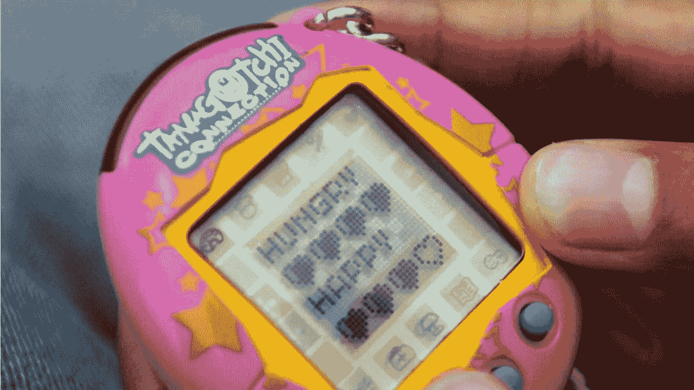

# 为弗比干杯

> 原文：<https://medium.datadriveninvestor.com/a-toast-to-the-furby-b2ecd29299a3?source=collection_archive---------29----------------------->

Photo via WhosOn

带电池的东西能给女孩带来快感？让你的思想走出阴沟。这只毛茸茸的，大概有两个土豆叠在一起那么大。在一个机器人可以做出面部反应的时代，在一个语音软件包括有点太现实的 ums 和 uhs 的时代，为 Furby 的二十岁生日干杯。向“哑巴”机器人致敬。

你可能还记得，Furbys 是 1998 年*最热门的节日商品。许多人记得在圣诞节那天打开了一个，我们的父母可能没有“明白”在《纽约时报》第一季的一篇愤怒的文章中，作家 Jacques Steinberg 描述了他们:“如果宠物 Rock 和 Tickle Me Elmo 在一个用心情戒指密封的联盟中交配，他们会生下一个 Furby。”在这篇文章中，Furby 的创作者大卫·汉普顿承认，他的灵感部分来自电子鸡宠物，并指出它们的缺点是“你不能宠它”*

你抱过 Furby 吗？他们不软。它们的塑料外壳覆盖着一块块五彩缤纷的人造毛皮，但它们身上有一种不可否认的魅力。最初的 Furby 机器人技术很粗糙。它们有一个小而大的马达，伴随着它过大的眼睛的每一次眨眼或嘴的每一次张开，塑料会发出很大的咔嗒声。

但是他们身上有一种非常非常迷人的东西。

千禧一代的成长经历与我们的前辈不同。最初的会说话的玩具，泰迪·鲁斯平给我们读睡前故事。当然，我这个年龄的女孩玩洋娃娃，但是我们的卷心菜可以吃(可怕的是，甚至不小心[吞下他们玩伴的头发](https://www.independent.co.uk/news/world/cabbage-patch-doll-eats-girls-hair-1316481.html)。)我们在课间展示了 Tamagotichis 和 Digipets。我们可以把它们藏在口袋里，然后在数学问题之间喂它们。他们在我们眼前改变，在我们没有照顾好他们的时候死去。在拥有这个要求苛刻的小椭圆形办公室仅一天后，帕特丽夏·沃德·比德曼在《T4 时报》上写道:“我决定找一个我真的不喜欢的人，把我的电子鸡送给他们。

Photo via YouTube

不过，她是个成年人。她怎么能理解与“倾听”你的东西发展关系的快乐呢？与人类不同，机器人遵循指令。当然，出于对数字的忽视，我们可能已经把他们的数字幽灵送到了数字天堂，但是我们这一代人并没有想象这种互动，我们体验了这种互动。

进入 Furby 及其上瘾的性质。在接受《泰晤士报》采访时，汉普顿描述了弗比斯会进行的一系列互动，比如当宠物打喷嚏或发出咕噜声。弗比斯第一次被激活时，会用一种叫弗比斯的咕咕语说话。他们看似虚构的词汇在某些情况下有真实的含义。汉普顿告诉斯坦伯格，普通话中经常重复的短语“大”是“大”的意思。当一个 Furby 感觉到亮光时，它会说，“啊，你好”，接近于希伯来语中上帝的意思。渐渐地，原来的 Furby 会逐渐切换到说超过 200 个单词的英语。

但是他们没有说话，真的没有。它们的麦克风和移动的喙就像是那些奶酪机器人表演者的小型等价物。他们也没有真正听我们的，尽管感觉他们可以。心理学家雪莉·特克尔在她著名的关于 Furbys 的研究中称之为“社交机器人学”她问了一个大问题，如何在机器人领域行走。例如，Turkle 描述了儿童和成人对待 Furbys 的不同方式。当一个原始的 Furby 被颠倒过来时，它呜咽着说:“我害怕。”孩子们通常会对这种“悲伤的戏剧”迅速做出反应，以解决这种情况，而成年人在区分人类和非人类方面有着更长的历史，他们对此持怀疑态度，知道他们不是施虐者——但当他们看到孩子们没有注意到 Furby 的哭泣时，他们仍然会感到不安。

当我们长大后，我们喜欢假装我们没有被机器人感动，假装我们太聪明而不受它们的影响。我问 Siri 天气，我的孩子问:“Siri 是谁？”

“她——”我开始，给一个声音指定一个代词，这个声音来自我放在口袋里的一个 3x 5 英寸的设备，然后我停下来。我不知道怎么解释，所以我不。

虽然里面没有麦克风，[就像政府曾经怀疑的](https://www.cbsnews.com/news/talking-toy-or-spy/)，Furbys 因为爱抚和摇摆等互动而改变。老派 Furbys 很棒的另一个原因？他们相对沉默。《T4 纽约时报》2017 年的一份报告显示，带有蓝牙连接的玩具，新的毛绒玩具被发现是真正的安全隐患。他们也卖得不太好——变得更差了。

有这些绒毛的孩子也变了。沃德·比德曼女士在谴责电子鸡的文章中写道，“我发现自己是一个豆豆娃，因为没有什么比一个玩具更好的了，它只是静静地躺在那里，什么也不做。”我们年龄越大，受教育程度越高，越富有，就越有可能同意她的观点。现代父母，尤其是中上层阶级的父母，强调[真实，而不是基于屏幕的](https://nypost.com/2014/12/07/the-real-digital-divide-why-rich-parents-are-shielding-their-kids-from-smart-devices/)。你不必在这个假期寻找几十个低科技或无科技的玩具清单。

另一方面，我们也在拥抱科技，尤其是以复古的形式。我们拼命想让 NES 重新发行 T1，甚至想预定一个机会再干掉一只 T2 电子鸡 T3。最初的 Furbys 在易贝的售价超过 350 美元。

我认为可以忍受这种截然相反的情况，喜欢和讨厌机械化。我有三个十岁以下的孩子，今年他们圣诞节最重要的礼物是 iPad。他们不会得到它。相反，我女儿最喜欢的是一个真正会唱歌的“艾尔莎娃娃”。

我不明白，但我明白。我仍然记得“你在开玩笑吗？”当我从盒子里弹出我的 Furby 时，看看我父母的表情。我的弗比是灰色的，胃是白色的。我用一块布蒙住它的头，然后揭开它。Furby 的传感器对光线产生反应，发出“嗖”的一声。我哞哞叫。

和机器人一起长大并没有毁了我。作为父母，每当我读到关于科技含量过高的警告时，我的胃都会绞痛，但反过来也救不了我们。无法完全拔下。此外，照顾 Furbys 让我做好了为人父母的准备——不是因为它需要我，也不是因为它还活着。相反，拥有这样一份热门礼物，却不如它在电视上那么有趣，这让我意识到，你还是要自己找乐子(很多人都用自己的 T4 弗比做了这件事，比如有个家伙把自己的发明变成了 Alexa)。这也教会了我对自己孩子节日愿望的宽容，他们很快就会用埃尔莎娃娃悦耳的声音填满这间房子，而埃尔莎娃娃会不断提醒我放手。我会的。