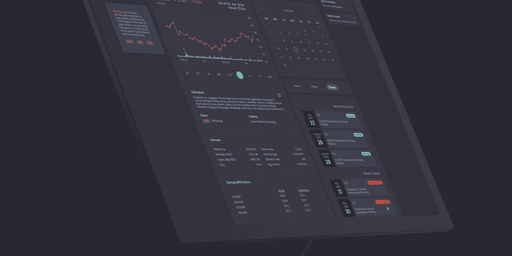
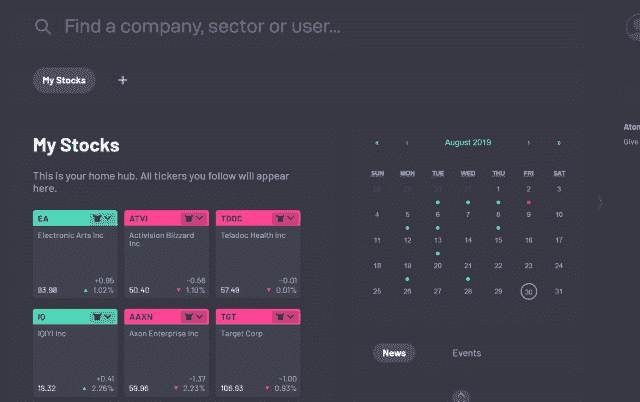
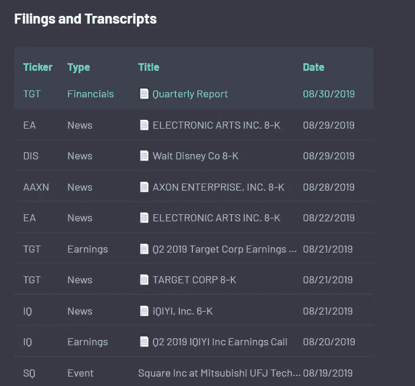
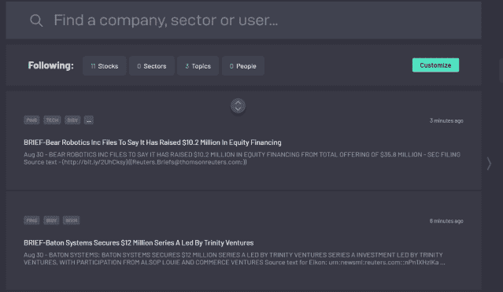
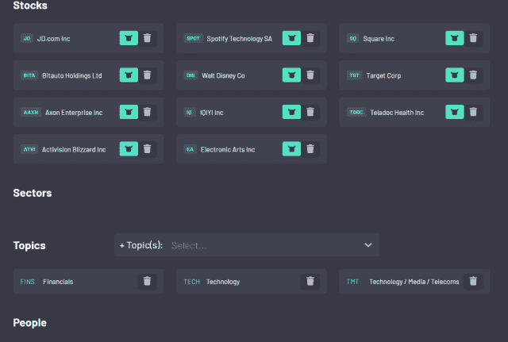
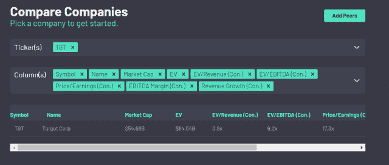
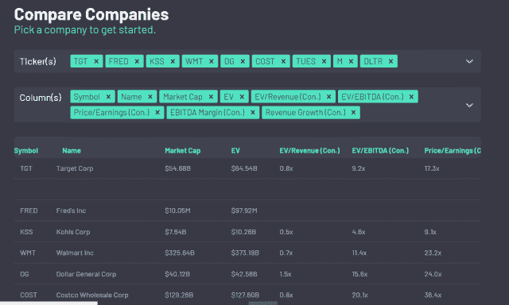
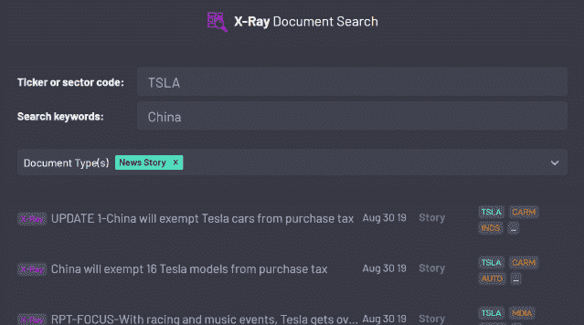

# 每个散户都应该使用的工具

> 原文：<https://medium.datadriveninvestor.com/a-tool-every-retail-investor-should-use-32c14dd8a491?source=collection_archive---------6----------------------->

*   *本文原载于* [*市场兄弟传媒*](https://marketbrothersmedia.com/a-tool-every-retail-investor-should-use/) *。*
*   这不是付费推荐(尽管我有点希望是)。我只是觉得 atom.finance 很有用，认为人们应该了解它。

个人很难研究和跟踪他们的投资。彭博、Ycharts 和路透社通常太贵而不值得，而广告支持的网站(看看你雅虎财经)和经纪整合总是低于标准。进入[原子金融。](https://atom.finance/)

Atom Finance 是一项新服务，自称是“现代金融知识平台”(查看他们的 Twitter feed [这里](https://twitter.com/atom_finance))。用了几天后，我想他们可能会有所发现。

以下是我对该网站的总结:**一个无广告的中心，汇集所有重要新闻、SEC 文件和你喜爱的股票的价格走势**。该网站是免费的，因为他们仍处于测试阶段(希望它推出时每月只需 10 美元)，但仍优于任何类似的产品。

我认为，对于个人投资者来说，Atom Finance 可以成为一个非常棒的低成本研究工具。下面我将介绍网站上一些最好的工具，但是如果你想自己学习，你可以[在这里](https://atom.finance/)注册(使用邀请代码:betavip)。

# 你的股票中心

Atom Finance 有五个选项卡，为用户提供不同的功能。第一个是一个标准的“今日市场”订阅源，任何人都可以关注。第二个标签名为“我的枢纽”，基本上是一个功能更好的股票观察列表。

“中枢”选项卡有三个主要功能。第一个是你跟踪的所有股票的表格(你也可以制作子观察列表)。第二个是一份清单，上面列有所有 SEC 备案的观察名单，这是我喜欢的东西。最后，它有一个带有新闻和事件标签的日历，这样你就可以随时了解你所有的资产。

以下是集线器功能的一些其他截图:

# 新闻提要

“我的 Feed”选项卡是下一个功能。提要是你想关注的股票和/或板块的可定制的新闻列表。它也是可搜索的，如果你只是做一次性的事情，这是很棒的。

如果你点击“定制”按钮，你可以改变什么股票，部门，最终，你想出现在饲料的人。

# 比较公司

股票筛选工具不是一个革命性的想法。但就像观察列表和新闻工具一样，Atom Finance 让它比我见过的任何东西都要好。

最酷的工具是右上角的“添加伙伴”按钮。下面是在搜索栏中用 Target ticker 符号点击它后发生的事情，与上面的截图一模一样:

这简直太棒了。像这样的工具是散户投资者需要的，但他们甚至不知道自己想要什么。

# 强力搜索

最后一个标签，可能是 Atom Finance 最独特的标签，是“X 射线能量搜索”

正如你在上面的截图中看到的，这个搜索工具可以让你很容易地找到专门适用于你感兴趣的股票的文件和新闻故事。以上面的例子为例。如果你把钱押在特斯拉股票上，你可能会对任何关于中国的新闻感兴趣。通过 X 射线搜索，你可以很容易地找到投资者想要阅读的相关新闻。SEC 的文件也是可以搜索的。

我相信 Atom Finance 可以成为散户投资者的彭博。在推出付费版本之前，他们必须做出改进并推出更多功能，但如果现有的工具是一个迹象，我认为他们会成功的。如果他们这样做，个人投资者的境况会更好。