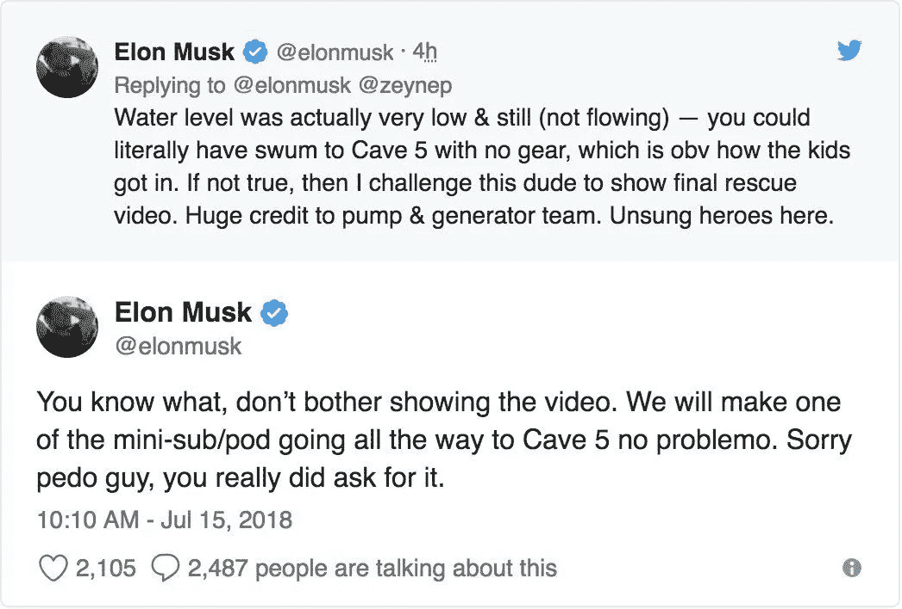

# 这是对 CEO 们不被视为名人的时代的致敬——他们只是专注于自己的工作。

> 原文：<https://medium.datadriveninvestor.com/a-tribute-to-a-time-when-ceos-werent-treated-like-celebrities-they-just-focused-on-doing-their-2a49fa507363?source=collection_archive---------10----------------------->

“people sitting on chairs” by [Samuel Zeller](https://unsplash.com/@samuelzeller?utm_source=medium&utm_medium=referral) on [Unsplash](https://unsplash.com?utm_source=medium&utm_medium=referral)

还记得首席执行官和企业主不是穿着高领毛衣和牛仔裤、与著名女演员约会或出现在八卦杂志头版的时代吗？

因为他们在幕后工作，做一些真正有所作为的事情；他们的工作反映了他们是谁。

我们现在已经到了这样一个时代，伊隆·马斯克的阴茎尺寸比他在 T2、特斯拉、T4、太空探索技术公司的成就更有意义，马克·扎克伯格最大的成就将被认为是杰西·艾森伯格在社交网络中扮演的那个家伙，他宣称“我是首席执行官，婊子”，Snapchat 的那个家伙会因为嗯而出名..我猜是在和那个著名的性感女演员约会吧？

曾几何时，CEO 的唯一目的就是为正义而战；他们的工作非常英勇。

提到真正英雄的首席执行官时，如果不提到(在我看来)他们那个时代最杰出、最勇敢的两位首席执行官，这份名单就不完整了:

**凯瑟琳·格雷厄姆**和**詹姆斯 e 伯克**。

凯瑟琳·格雷厄姆不仅仅因为是第一位女性出版商而出名；她是一个偶像，因为她是揭露最可耻的政治阴谋的最杰出的领导和勇气的例子之一；**水门**。

她领导了《华盛顿邮报》和《T21 》,而当时大多数报纸都不敢报道指控总统共谋犯罪的新闻。

现在，通过古怪的喜剧和平庸的新闻来取笑总统似乎已经成为一种常态。

在凯瑟琳·格雷厄姆的领导下，鲍勃·伍德沃德和卡尔·伯恩斯坦能够追求并出版的不仅仅是新闻合法性的作品，它证明了首席执行官不仅仅是公司的公众形象；他们确实是企业诚信和成功的支柱。

虽然我们可能会将史蒂夫·乔布斯誉为英雄，但很少有人会承认史蒂夫·沃兹尼亚克和约翰·拉塞特的作品才是真正的传奇。

这个人充满了矛盾，过度膨胀的自我，以及对他的员工贬低的观点。

那时候，首席执行官们不会在 Twitter 上咆哮，也不会认为拿自己的股价开“420”玩笑很酷——是的，埃隆·马斯克先生，我说的就是你。

首席执行官不被认为是“酷”，他们不是名人。

他们的希望和梦想并不依赖于被评为“年度最性感 CEO”。

正是这种名人身份导致了领导力的下降和更多的公众崩溃。

因为我们崇拜首席执行官，就像他们是一场运动；好像他们真的在改变世界。

真正改变世界并不意味着取笑和诋毁同性恋。

改变世界不是在情景喜剧和电影中客串。

这不是 18 小时的例行工作或 5 步成功计划。

它只是尽最大努力保持一个强有力的领导。

这就是首席执行官应该做的。

当我们开始崇拜首席执行官，就像崇拜摇滚乐队一样，把他们的公司看得像伍德斯托克音乐节一样，毫无疑问，这些疯子会在压力下融化。

在动荡时期，首席执行官们没有对批评者发起攻击，而是专注于解决问题。

詹姆斯·e·伯克没有在电视上谈论他如何与格兰姆斯约会，以及吸食大麻是多么酷，伙计；他接着讨论了一个真正重要和必要的公共服务信息，并灌输了一种希望，即他的公司制造的产品对公众来说是真正安全的。

初创企业文化，尽管可能很酷很时髦，却让首席执行官成为了企业的中心。

> **想象一下，凯瑟琳·格雷厄姆在推特上痛斥水门事件，或者詹姆斯·e·伯克指责媒体夸大了泰诺中毒事件。**
> 
> **我相信今天他们的遗产会有很大不同。**

一家真正伟大的企业必须能够忍受有或没有首席执行官——通过他们留下的遗产和职业道德，并向企业灌输它应该坚持的价值观。