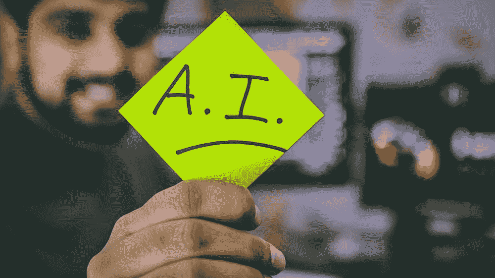
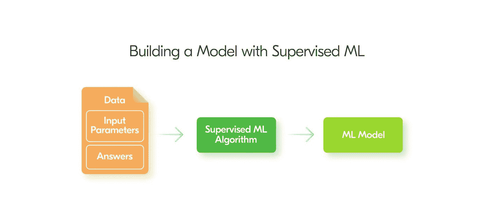
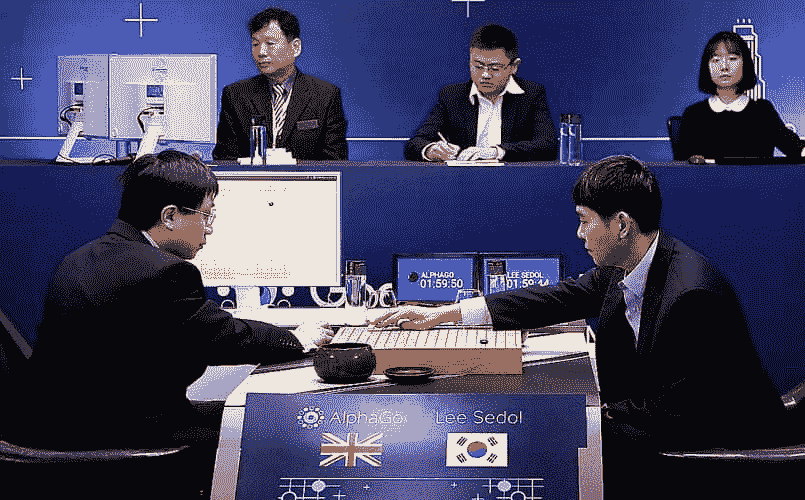

# 人工智能世界之旅

> 原文：<https://medium.datadriveninvestor.com/a-trip-into-the-world-of-artificial-intelligence-27d118bb6bf4?source=collection_archive---------7----------------------->

未来——一个机器可以检测癌症、理解人类语言、回应我们、下棋、预测股票价格、比我们更快更好地完成工作的世界！

你猜怎么着！计算机已经可以做到所有这些:有比人类医生更好的自动检测癌症的系统，Siri 可以理解你说的话，工厂自动化的发展速度比以往任何时候都快。这看起来像是魔术，但这一切都是由人工智能(AI)实现的。

 [## 人工智能与创意:作为创意引擎的 BigGAN |数据驱动的投资者

### 的确，2018 年可以被视为人工智能创造的创造力全盛时期的开始。当然可以…

www.datadriveninvestor.com](https://www.datadriveninvestor.com/2019/02/13/ai-creativity-biggan-as-a-creative-engine/) 

**人工智能将影响每一个行业，从医疗保健到金融到教育等等。**

A Robot Learning Just Like A Young Child — From Youtube Uploaded by BBC Studios

# 什么是人工智能(AI)？

AI 的定义就在名字里。它是由机器或软件展示的人类智能的人工版本。

人工智能听起来很酷，但它将如何设法影响每一个行业？人工智能比我们人类更快更好地学习更多的知识，同时能够理解和储存更多的知识！我们人类有如此多的数据，而人脑不知道如何理解所有这些数据。相反，人工智能系统旨在理解这些大量数据。

现在你可能已经知道，与人类相比，人工智能可以走在游戏的前面，这就是为什么埃隆·马斯克创办了一家名为 [Neuralink](https://www.google.ca/amp/s/techcrunch.com/2019/07/16/elon-musks-neuralink-looks-to-begin-outfitting-human-brains-with-faster-input-and-output-starting-next-year/amp/) 的公司来帮助解决这个问题，但这是另一个故事了。

你一定想知道人工智能究竟是怎么做到的？ AI 使用一种叫做**机器学习的东西。机器学习**是人工智能的一个子集，为它提供了从经验中学习和改进的能力。现在让我们深入了解一下机器学习的细节吧！

# 机器学习的类型

我们将讨论三种机器学习模型:

**监督学习、非监督学习和强化学习。**

机器学习使用这三个模型来学习。这些模型都使用自己独特的算法。

# 监督学习

在监督学习模型中，我们被给予一个**标记的数据集**(训练数据)，具有**已知/正确的结果**，并且正在寻找输入变量和输出变量之间的关系。**监督学习**本质上是在已知的给定输入变量和输出变量之间建立联系。该模型继续绘制输入和输出变量之间的联系，直到达到可接受的训练性能水平。

Diagram of How Supervised Learning Works

我们可以用一个学生和老师的例子来帮助我们理解。这个学生知道正确的答案，但是他不知道他们是如何得出正确答案的。这使得学生预测他们是如何得到答案的。然后学生去找老师，老师批改学生的作业。这种与老师核对的过程会持续下去，直到我们对获得正确答案的最佳方法感到满意为止。

**那么，为什么人类不能采用这种“猜测和检查”的方法呢？**事实是，使用这种监督学习模型的机器可以比我们人类更快地完成这种“猜测和检查”方法。非常非常快。

以一个机器人为例，这个机器人的任务是根据金属，玻璃和塑料将垃圾分类到三个垃圾箱中。每件垃圾都有识别标签。每天，人类会过来向机器人提供反馈，让它知道哪些垃圾分类不正确。机器人执行了这个建议，继续对垃圾进行分类。重复该过程，直到机器人具有可接受的错误率。

这是监督学习的一个例子，因为机器人采用“猜测和检查”的方法，直到达到可接受的训练水平。

监督学习面临的一个问题是过度训练。**这意味着模型将会如此完美，以至于当你给它新的数据而这些数据还没有被用来训练时，它将会崩溃。**

监督学习是**机器学习**中最精确的模型，因为给出了所有的标记数据。

# 无监督学习

现在无监督学习模型是监督学习模型的**完全相反的**。无监督学习模型有给定的数据，但是没有标记。

即使没有标记数据，我们仍然能够训练模型。实际上，机器会在输入的未标记数据中**找到模式和关系**。一旦找到模式，它就用它们来训练模型。如我们所知，模型得到训练，直到它达到可接受的训练性能水平。

Example of Unsupervised Learning

让我们以机器人为例，它将垃圾按照金属、玻璃和塑料分类放入三个垃圾箱。这个机器人负责垃圾分类，但是它没有贴上识别标签。因此，它所做的是寻找可以帮助它判断垃圾类型的模式和特征。

机器人继续寻找特征来帮助它将垃圾分类成三类，并且这样做，直到模型达到可接受的训练性能水平。那个机器人只是为了把垃圾分成三类而使用了无监督学习！

无监督学习的一个问题是，你需要告诉程序把数据分成多少组。但是，有时使用模型的目标是找到数据可以正确分类到的组的数量，这意味着在这种情况下无法使用无监督学习。

无监督学习**可能没有监督学习**准确，但是，当你只有未标记的数据时，它非常有用！

# 强化学习

机器学习的最后一种类型是**强化学习。强化学习**是一个自学系统，在试错的基础上学习。然后，机器会根据提供的反馈改进其操作。强化学习的目标是达到最佳结果。

我们可以将强化学习比作**幼儿学习，**因为这与强化学习的工作方式非常相似。一个小孩正在学习如何走路，开始时，步子迈得太大，被告知要迈得小一点。然后孩子迈的步子太小了，他被告知要迈得稍微大一点。利用给定的反馈，孩子继续努力放置他的脚步，直到它正确为止。

世界上强化学习的一个超级令人印象深刻的应用是 [**AlphaGo**](https://deepmind.com/research/case-studies/alphago-the-story-so-far) ，一个由 DeepMind 制作的计算机程序。AlphaGo 是一个计算机程序，用来玩古老的棋盘游戏围棋。AlphaGo 打败了围棋世界冠军**Lee Sedol**不是一次而是**四次**这证明了 AlphaGo 的胜利不仅仅是运气。那么，一个计算机程序究竟是如何四次击败全球冠军的呢？！AlphaGo 学习了如何下围棋，使用的是强化学习。AlphaGo 与自己进行了多次对弈，这使它能够识别所有可能的组合，以及在每种不同的组合中该做什么。对于 AlphaGo 来说，使用强化学习来学习如何玩围棋是一个很好的选择，因为它允许计算机化的程序击败世界冠军！

Alpha Go vs Lee Sedol

# 关键要点:

*   人工智能在学习方面比人类更快更有效
*   人工智能将会影响每一个行业
*   机器学习是人工智能的子集
*   机器学习使用四种主要类型的模型，以便在没有明确指示的情况下进行学习

***如果你喜欢这篇文章:***

*   ***分享给你的网络***
*   ***关注我的***[***LinkedIn***](https://www.linkedin.com/in/krish-chandarana-25a197177/)*[***Twitter***](http://twitter.com/krishchandarana)***，以及***[***Medium***](http://medium.com/@krishchandarana)***随时更新我的 AI 进度！****