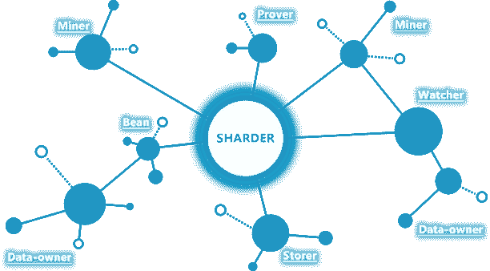
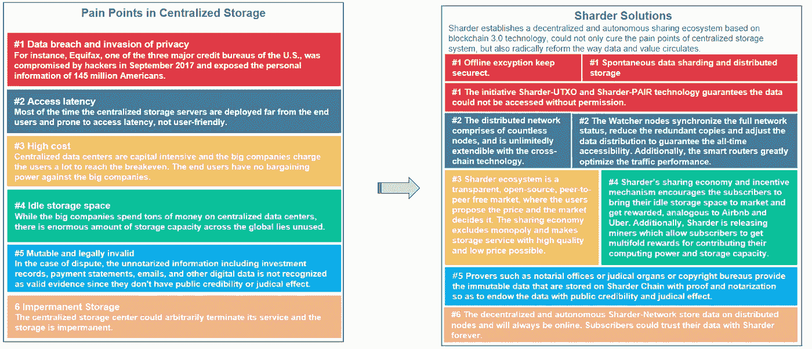
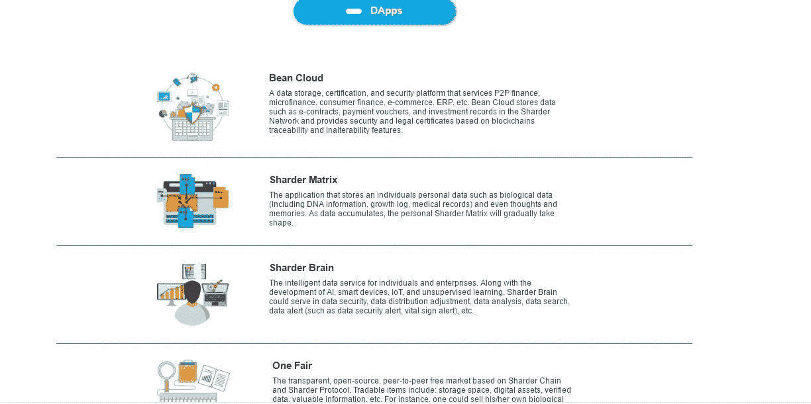

# 统一战线:分权与集权的融合:豆云

> 原文：<https://medium.datadriveninvestor.com/a-unified-front-the-amalgamation-of-decentralization-and-centralization-bean-cloud-71d8c33fd954?source=collection_archive---------11----------------------->

**The Sharder Protocol Has Unified The Notions Of Centralization And Decentralization And Leverages Their Advantages Simultaneously!**

**分散与集中的独特结合:在加密货币中共存**

**As Cryptocurrency and Blockchain Embark On Their Journey Towards Centralized Validity, It Is Important To Realize That Decentralized Technologies Can Rectify The Down Falls Of Centralized Entities And Vise Versa**

加密货币自诩为去中心化经济的先驱:一种在全球范围内体现自由放任原则和包容性的经济。对等网络使个人能够在全球范围内相互连接，而不需要中央服务器或中央实体。同时，区块链技术被认为是一种不变的解决方案和不可篡改的技术创新，可用于各种用例:托管、数据记录、土地注册、身份验证、投资记录、医疗记录、所有权证明、物流和供应记录、消费者隐私等等！然而，加密货币已经进入了一个新的时代:一个将分散化的好处与集中实体的有效性、信任和合作相结合的时代。2018 年，关于即将进入市场的集中式实体的讨论，如 CBOE、Ameritrade、Fidelity Investments、高盛和 Bakkt(一家与微软和星巴克合作大规模采用加密货币的洲际交易所)已经在加密货币领域迎来了一个新的无处不在的风气和问题:我们如何利用去中心化和集中化的好处？虽然这似乎是一个悖论，但集中的实体可以带来繁荣和分散技术在许多方面的全球验证和接受，如公证、网络观察、国家眼中的技术验证、网络认证、法律证据、所有权证明、知识产权保护和基于区块链技术不变和可追溯特性的司法有效性。加密货币中的许多项目都接受了这种集中权力和分散技术之间繁荣的概念；其中一个项目是 Sharder 协议及其革命性的 Bean Cloud D'app！由于最近几个月建立和巩固了许多合作伙伴关系，Bean Cloud 已经获得了巨大的关注，其中一个是令人难以置信的壮举。

**比恩云:比恩的学说**

**Bean Cloud Is The First D’app Constructed Within The Sharder Ecosystem!**

Bean Cloud 是在 Sharder 生态系统中构建的第一个应用程序。豆子云是服务于 P2P 金融、小贷、消费金融、电子商务、ERP 系统等的数据存储、认证、安全平台。Bean Cloud 在链上存储电子合同、支付文档和投资记录等数据，并基于区块链的可追踪和不可变特性为数据提供安全证书和法律证据。Sharder 生态系统是一个分散的全球数据存储解决方案，融合了分散和集中的优势。Bean Cloud 是数据保存的存储库，因为它的服务包括安全可信的数据保护、电子签名(表示所有权和公平的合同签名)以及基于区块链系统的云存储。Bean Cloud 正在以指数速度增长，在不到两周前的 11 月 5 日，成功存储了 72，153 份认证数据，238 名用户正在使用 Bean Cloud 的技术！现在，在 11 月 16 日，超过 122，774 份认证数据已经存储在 Bean Cloud 上，现在，有 240 名用户正在使用 Bean Cloud 的技术！在不到 270 小时的时间里，Bean Cloud 的认证数据副本几乎翻了一番！在 Bean Cloud 上运行的完整节点是稳定的，并且运行成功！同样，根据 Sharder 链的性能测试，普通支付交易可以达到 1000tps+,但存储交易较少。目前，以太坊只能处理大约 15-20 TPS，以太坊阻塞时间大约为 20 秒，而比特币的平均 TPS 大约为 5 TPS，比特币的阻塞时间大约为 10 分钟:这意味着 Sharder 链及其生态系统在此时此刻每秒可以处理比比特币多 200 倍的交易！TPS 将不断改进，并将根据需求加速。这类似于公共链基础架构，我们也在做同样的事情。因此，目前的 TPS 不会是我们希望达到的最终目标。我们将永远不会停止加强该系统和促进租置计划。微信上的 OTO 平台虎牛(Huniu)现在已连接到 Bean Cloud，并将利用其数据存储和安全服务。微信于 2011 年首次发布，到 2018 年，它已是全球月活跃用户最多的独立移动应用之一，月活跃用户超过 10 亿(日活跃用户 9.02 亿)。Sharder 一直在努力为全球应用和通用工具开发 Bean Cloud！

**Bean Cloud: One Of Four D’apps That Exist Within Sharder’s Ecosystem!**

Sharder 的业务部门最近几周一直在进一步研究物流和汽车租赁行业，并联系了该领域的 20 多家企业。其中四家企业表示愿意为 Bean Cloud 的签约和公证服务付费。Sharder 协议理解中小型企业在我们这个永远合作的世界中面临的许多困难；Bean Cloud 的早期目标是了解中小型企业的需求和痛点，并为他们提供基于区块链即服务的法律服务，这将反过来简化他们的合同签署流程:同时，这将为他们的数据提供法律验证。数据安全性、完整性和保存是在线数据存储的重要组成部分。Bean Cloud 的数据安全性位于区块链，是与博恩软件集团合作开发的。Bean Cloud 为照片、文档、合同等提供在线存储。Bean Cloud 在存储重要文档、原创作品、合同、专利等时，为企业和个人实体提供数据安全性。所有存储的数据都用基于区块链的技术加密，建立了安全的用户体验。如果出现侵权行为，将颁发认证，以同时保护用户及其数据的权利。Bean Cloud 本身就是专利和知识产权的守护者，因为它存储了验证个人知识产权的经过认证和公证的合同:没有人能够侵犯您的许可知识！经公证的数字合同签名；数字合同是电子签名、加密的，并且这些数字合同被颁发一个永远不能被篡改的区块链证书。合同还经过公证，因此消除了任何侵权、篡改或违约的风险。

**豆子云:融合集权与分权的豆子:中国杭州互联网法院**

**Bean Cloud Has Consolidated A Partnership With The Hangzhou Internet Court Of China: A Centralized Institution That Will Utilize Bean Cloud As A Judicial/Evidence Storage Node**

杭州是中国浙江省的省会，有着 1400 多年的历史。这座伟大城市的独特之处在于，它是两个实体的首都，一个是中国的省份，另一个是中国的电子商务；杭州被认为是“中国电子商务之都”，是中国最大的电子商务城市。Bean Cloud 的技术专注于各种公用事业，其中包括电子商务金融，这使 Bean Cloud 在参与城市内各种电子商务企业的立法和司法案件的中央实体中处于突出地位。杭州互联网法院于 2017 年 8 月 18 日开始审理案件，自其构想以来，杭州互联网法院已判决超过 10，000 起案件！据法院介绍，中国首家专门审理互联网相关案件的法院自一年前成立以来，已经审理了 11000 多起案件据法院称，该法院已审结 9600 多起案件，平均审理时间为 38 天，比传统法院缩短了约 50%来源:[http://www . China daily . com . cn/a/201808/18/ws 5b 77 c 8 f 4a 310 add 14 f 386801 . html](http://www.chinadaily.com.cn/a/201808/18/WS5b77c8f4a310add14f386801.html)21 世纪效率的概念和执行是集中式实体和技术必须体现或延续的焦点必需品之一；在一个不断快速前进的社会中，效率在社会和人类创造力的每个方面都是必要的。杭州互联网法院还计划为与互联网相关的案件建立一个数据中心！Sharder 的生态系统主要关注大数据；最近的事态发展使 Sharder 处于一个独特的位置，从长远来看，Sharder 协议作为一个分散的生态系统，可以通过利用 Bean Cloud 来帮助存储杭州互联网法院的大数据，这将为 Sharder 协议带来巨大的机遇！中华人民共和国还计划在包括北京和广州在内的中国城市设立互联网法院，这给 Bean Cloud 和 Sharder 作为一个整体提供了一个非常乐观的机会，有可能扩大其在这些特定城市的影响范围(超过四千万人居住在这些城市)和受众，以满足其电子商务和数据验证需求！豆云已经是中国杭州互联网法院的官方司法节点/证据存储平台；这使得 Bean Cloud 处于整个中国的中央司法政府机构之间的交叉火力和机会的最前沿，同时强调了 Sharder 在中国的分散架构和生态系统！由于豆云已经是杭州互联网法院的证据存储/司法节点，当北京和广州建设互联网法院时，豆云将处于一个独特的位置，可能利用其在杭州互联网法院的地位，扩展到北京和广州的其他互联网法院！

**结论:Bean Cloud 及其融合分散和集中的独特地位**

**The Airbnb of Blockchain Is Here!**

通过这种分散和集中的融合，Bean Cloud 处于分散的生态系统和集中的司法机构的最前沿。Sharder 协议和 Bean Cloud 作为一个整体可以利用司法集中验证和合法性以及分散匿名和个人自治的优势。Bean Cloud 已经收集了超过 120，000 份认证数据，而仅在 10 天前，这一数字约为 72，000 份；这是最近几天来前所未有的增长，因为该协议获得了更广泛的关注。集中化和分散化可以共存，并在加密货币和区块链中共同培育一个有益于整个地球的生态系统:Sharder 协议理解这一令人难以置信的悖论，并在他们自己的协议中利用了它！

*有兴趣了解加密货币和区块链技术吗？报名参加我在 Udemy 上的课程吧！*[*https://www . udemy . com/cryptocurrency-investment-a-初学者-指南/学习/v4/*](https://www.udemy.com/cryptocurrency-investment-a-beginners-guide/learn/v4/)

*免责声明:加密货币投资需要大量的风险，不要投资超过你能承受的损失！我不是金融顾问，也不对你的任何交易负责。我是 Sharder Token 的投资者，本文中的信息代表我自己的想法和观点。在* [*投资任何东西之前，你总是要做好自己的调研，这是义不容辞的！*](http://wegobusiness.com/trading-a-unified-front-the-amalgamation-of-decentralization-and-centralization-bean-cloud/)

来源:[http://www . China daily . com . cn/a/201808/18/ws 5b 77 c8 f4a 310 add 14 f 386801 . html](http://www.chinadaily.com.cn/a/201808/18/WS5b77c8f4a310add14f386801.html)

