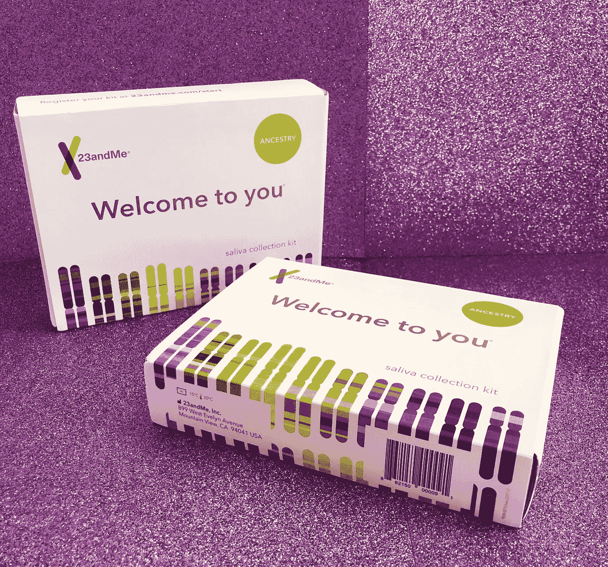

# 一个风投对 23andme 的看法

> 原文：<https://medium.datadriveninvestor.com/a-vcs-take-on-23andme-137805a3a21?source=collection_archive---------22----------------------->

**这个故事最初发布在我的**[**insta gram**](https://www.instagram.com/digitallyyours_/)**(digitally yours _)账户上，在这个账户上，我用风险投资的视角讨论了当今数字原生的、风险投资支持的产品(DNVBs)的最早期阶段及以后。**

*   电梯推销:民主化基因测试
*   如今:这家基因检测公司已经筹集了 7.861 亿美元的巨额资金，其最早的支持者包括谷歌(该公司创始人安妮·沃西基是谷歌的谢尔盖·布林的前妻)、Genetech 和 NEA。
*   机会:人们对自己的祖先和个性化健康需求越来越好奇。然而，直到最近，公司才有兴趣向个人提供信息，让他们能够控制自己的健康[护理]。鉴于其(到 2024 年)220 亿美元的市场规模，这并不奇怪。
*   经验:毫无疑问，23andme 是 DNA 测试的先驱，并证明它不仅仅是一个 DNA 测试。正如安妮所说，“我们不仅仅希望获得风险资本的回报。我们和这家公司一起着手改革医疗保健。”然而，安妮的故事不是线性的，而是真正的韧性和适应性的故事。她从领导一家利用“未经批准的医疗设备”赚钱的公司，到被《快公司》称为美国最大胆的 CEO。此外，23andme 让“了解你的基因”变得很酷，并通过提供可操作的健康信息鼓励客户进一步调查。
*   从逻辑上讲，收集唾液的过程非常简单。在我意识到之前，我正把我的工具箱运回他们的实验室。从投资者的角度来看，我确实会问自己，当所有的兴奋和期待随着结果开始慢慢进入我们的收件箱而消退时，公司打算如何保持对客户的“优先考虑”。然而，我乐观地认为，随着该公司继续推出社交功能(你可以选择加入一个允许你与其他人分享你的基因数据的数据库，反之亦然)，该公司只会继续获得相关性。
*   虽然我还没有收到我的结果(我将在另一篇文章中跟进)，但我已经被该公司古怪而有效的营销策略所打动。例如，去年，23andme 巧妙地发布了一个卑鄙的我的商业广告，带我们经历了 Gru 自己的基因之旅。他们让普通人对遗传学的理解变得极其简单，足以吸引他/她购买一套工具。